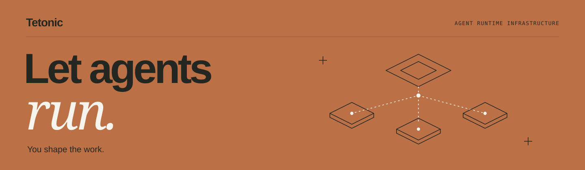
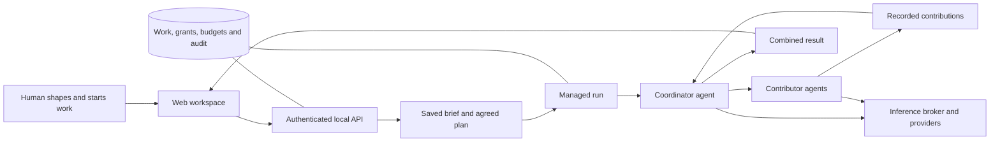

<p align="center">
  
</p>

<p align="center">
  <strong>Infrastructure for autonomous teams of agents, under your direction.</strong>
</p>

<p align="center">
  <a href="#try-the-local-preview">Get started</a> ·
  <a href="#what-works-today">Current capabilities</a> ·
  <a href="#inside-the-engine">Architecture</a> ·
  <a href="#where-were-going">Roadmap</a> ·
  <a href="CONTRIBUTING.md">Contribute</a>
</p>

<p align="center">
  <a href="https://github.com/tetonic-labs/tetonic/actions/workflows/engine-ci.yml"></a>
  
  <a href="LICENSE"></a>
</p>

## More work. Less wrangling.

Delegating to an agent should give you time back. Delegating to ten should not create ten conversations to supervise, ten sets of context to maintain, and ten results to reconcile.

**Tetonic Engine is an agent runtime platform being built to make that possible.** The goal is to give people a place to shape work, put agents on it, and understand what is happening on their behalf—while the engine handles execution, coordination, access, and limits.

A small question might need one agent. A larger undertaking might need a team, dependencies, a review, and a decision from you. An ongoing responsibility might need agents that return to the work over time. The engine is intended to support those different shapes of work across domains, from research and operations to software and business tasks.

Platform teams provide the infrastructure. People use the workspace to direct the work.

> [!NOTE]
> **Tetonic is a developer preview working toward v5, its first product release.** The current web experience runs locally for one owner. Registered agents, bounded parallel team execution, hosted models and granted tools/MCP connections are integrated. Ongoing autonomous responsibilities, native vendor harness management and shared distributed deployment remain future work. See [what works today](#what-works-today) before choosing a trial.

## The experience we're building

- **Shape the outcome.** Start with a question, an intention, or a brief. Understand the problem and decide what matters before committing effort.
- **See the work.** A zoomable map brings projects, assignments, agents, and dependencies together. Open a contribution, inspect the recorded conversation, or check usage without losing the larger picture.
- **Keep control.** Work has explicit ownership, bounded execution, scoped access, and recorded results. Agents can ask for human input; operators can inspect and stop managed work.

The map is a view into engine records. The connected workspace does not substitute simulated activity when the engine is unavailable.

## What works today

The repository contains both the emerging team workspace and the underlying Rust runtime. Capabilities differ by execution path.

| Capability           | Current local preview                                                                                                                                                    |
| -------------------- | ------------------------------------------------------------------------------------------------------------------------------------------------------------------------ |
| Agent setup          | Create and edit persistent agents with model selection, supported capabilities and bounded run limits. Discover local or account-visible models for configured Ollama, OpenAI, Anthropic and Google providers. |
| Shaping and planning | Discuss with the Guide, save a versioned brief, generate and revise assignments, agree on direction, then explicitly start the plan.                                     |
| Team execution       | A coordinator dispatches agreed assignments to registered agents using their saved configuration and grants. Independent assignments can run in parallel, subject to dependencies and limits. |
| Human involvement    | Workers can raise questions during a bounded run. The owner can answer, inspect results, amend upcoming assignments, and cancel work.                                    |
| Visibility           | Work map, conversation history, individual contributions, and provider-reported token usage with held and remaining allowances.                                          |
| Tools and connections | Select supported local tools, manage MCP connections, create/import workspace skills and grant them to agents. Registered team contributors reuse the governed tool path with their configured provider. Host, grant and approval restrictions still apply. |

**Start with a bounded trial:** compare two proposals, ask for an independent critique, or synthesize a brief and review its assumptions. Then add the specific tools or connections your next task needs and verify their access before delegating it.

**Current boundaries:** asking for work in the shaping chat does not automatically create a team or start execution. Review and explicitly start an agreed plan. Tool availability depends on saved grants, host configuration and current authority; selecting a provider does not grant access. Continuous monitoring and general multi-user deployment are not implemented. A completed run records that execution finished, not that its answer is independently correct. Usage controls track reported tokens, not guaranteed dollar spend or a monthly organization budget.

See the [local UI contract](docs/implementation/contracts/local-ui-v1.md) for behavior and the [current architecture](docs/architecture/README.md) for implementation boundaries. The [October 5 team trial](docs/epics/v5-reconciliation/sprints/october-1-coherent-workspace/completion-reliability-evidence-2026-10-05.md) is dated evidence, not a complete account of later capabilities.

## Try the local preview

Build from source to try the current team workspace. You will need:

- A current stable **Rust** toolchain and native build tools for your platform.
- **Node.js 22** and npm for the web workspace.
- For the local-model setup below, **Ollama** running with a model already installed. Tetonic does not download models for you. Choose a model that fits your hardware and meets the engine's placement checks. Hosted models can instead be configured in agent setup; configure the Guide and participating agents before asking them to work.

### 1. Get the repository

```sh
git clone https://github.com/tetonic-labs/tetonic.git
cd tetonic
```

### 2. Start the workspace

In one terminal, from the repository root:

```sh
cd web
npm ci
npm run dev -- --host 127.0.0.1 --strictPort
```

### 3. Start the engine

In a second terminal, from the repository root:

```sh
ollama list
cd engine
cargo run -p tetonic-cli -- ui --database ../.lokai/ui/workspace.db --model YOUR_INSTALLED_MODEL
```

Replace `YOUR_INSTALLED_MODEL` with the exact model name from `ollama list`. The default engine port is **3000**; the workspace is at **127.0.0.1:5173**.

**Open the connection URL printed by the engine.** It connects the browser to your local workspace. Treat that link as a credential; restarting the engine creates a new one. Keep both processes running.

### 4. Put a small team to work

1. Open **Agents** to inspect the available agents or create one with a clear purpose.
2. Choose **Shape work together** and provide the material you want the team to consider.
3. Save the working brief, then propose, review, and agree on assignments in the shaping view.
4. Start the agreed plan. Follow its contributions on the map, answer questions when needed, and inspect the combined result and usage.

The brief is the input published into planning; the private shaping conversation is not automatically passed to contributors.

<details>
<summary><strong>Optional file access and connection settings</strong></summary>

Add `--workspace-root "/absolute/path/to/workspace"` to the engine command to make supported workspace tools available under that host root. Grant the needed tools in the agent editor. Registered team contributors use their saved capabilities; host availability alone does not grant tools. Hosted model use and consequential effects remain subject to disclosure and approval rules.

If port 5173 is occupied, choose another Vite port and pass the matching `--ui-origin` to the engine. Changing the engine port also requires updating the `/api` proxy target in [`web/vite.config.ts`](web/vite.config.ts).

The local adapter binds to loopback and uses a dedicated SQLite database. Run one execution owner per database. This preview is not a shared organization endpoint.

</details>

## Inside the engine

The web workspace calls the authenticated local API. Application services use the existing agent registry, work records, managed runtime, inference broker, and durable store.

This is the current bounded team-execution path:



Tetonic separates decisions made by a model from authority granted by the runtime. The repository includes capability enforcement, controlled egress, process isolation, transactional file operations, scoped context, and execution accounting. Their availability and guarantees depend on the host and execution path; this is not a claim that arbitrary model actions are safe.

For the current execution path, subsystem owners and source references, start
with the [architecture map](docs/architecture/README.md) and
[contributor ownership guide](docs/architecture/ownership.md).

| Location                             | Responsibility                                                                         |
| ------------------------------------ | -------------------------------------------------------------------------------------- |
| [`web/`](web/)                       | React/TypeScript workspace, map, planning, inspection, and usage UI.                   |
| [`engine/litho/`](engine/litho/)     | Application services, CLI, local API adapter, tools, and retained LSP integration.     |
| [`engine/mantle/`](engine/mantle/)   | Managed runs, delegation, compute brokering, capacity, and inference worker machinery. |
| [`engine/core/`](engine/core/)       | Agent loop, runtime assembly, domain contracts, policy, sandboxing, and transactions.  |
| [`engine/strata/`](engine/strata/)   | Durable records, scoped context, artifacts, and indexing.                              |
| [`engine/atmos/`](engine/atmos/)     | Inference adapters, network egress, and transport boundaries.                          |
| [`engine/tooling/`](engine/tooling/) | Architecture checks and retained benchmarking support.                                 |
| [`docs/`](docs/)                     | Contracts, design history, sprint plans, and validation evidence.                      |

## Where we're going

The next milestone is a complete path from a person's intent to useful, verifiable work in real systems.

- **A work director:** turn shaping decisions into plans, suitable agents, and dispatch through the existing engine services.
- **Broader capability integration:** improve connection setup and missing-access recovery, and integrate native vendor harnesses with the existing permission and execution boundaries.
- **Continuing responsibilities:** park, resume, and wake work from events or schedules, with meaningful budgets and stop controls.
- **Shared infrastructure:** bring organizations, teams, execution nodes, and operator configuration into one coherent deployment experience.

The engine is intended to remain general purpose. Calendar operations, research, repository maintenance, and business tasks should use the same execution and control foundations—not separate hard-coded orchestration systems.

Follow the [v5 sprint plan](docs/epics/v5-reconciliation/sprints/README.md) for implementation progress. Roadmap items above describe direction, not shipped functionality.

## Build with us

Useful contributions include reproducible failures, clearer first-run experiences, integration tests across engine boundaries, and improvements to execution reliability. When reporting an issue, include the operating system, commit, relevant command, and sanitized logs. Keep credentials and private work out of public reports.

From `web/`:

```sh
npm test
npm run build
```

From `engine/`:

```sh
cargo test -p tetonic-app --lib
cargo run -p tetonic-arch-gate -- verify package
```

These commands cover different scopes; a passing package gate does not run all behavior tests. See the [contribution guide](CONTRIBUTING.md) for test selection and the [architecture tidy-up evidence](docs/epics/v5-reconciliation/sprints/architecture-baseline/README.md) for its recorded checks.

[Contribution guide](CONTRIBUTING.md) · [Report a bug](https://github.com/tetonic-labs/tetonic/issues/new?template=bug_report.md) · [Request a feature](https://github.com/tetonic-labs/tetonic/issues/new?template=feature_request.md) · [Report a security issue privately](.github/SECURITY.md)

## License

Tetonic is developed by **Tetonic Labs LLC** and distributed under a community and commercial license. Free use is available for qualifying individuals and organizations; other uses require a commercial agreement. See [LICENSE](LICENSE) for the full terms, eligibility, restrictions, and release conversion provisions.

Commercial inquiries: **enterprise@tetonic.ai**.
