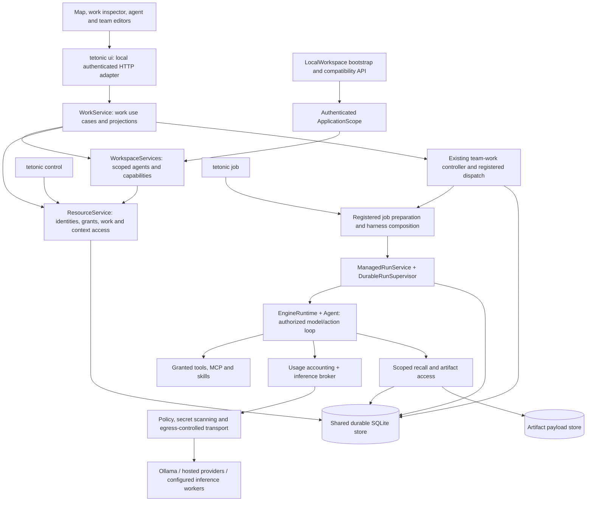

# Tetonic architecture

Tetonic currently runs a local team workspace on a durable agent execution engine.
People shape work in the map interface; application services turn accepted work
into authorized agent jobs; managed execution owns their attempts and outcomes.
Inference can use local or hosted models, with additional fabric machinery for
inference workers. Distributed inference is not the same as distributed agent
execution.

This is the current architecture entry point, updated with the October 8, 2026
[frontend boundaries and contributor checks](frontend-boundaries.md),
[durable-state and contract organization](durable-state-and-contracts.md),
[execution-boundary refactor](execution-boundaries.md),
[scoped work-service extraction](work-services.md) and
[host composition refactor](host-configuration.md). The [ownership map](ownership.md) identifies where
changes belong, the [terminology](terminology.md) distinguishes the records, and
the [package inventory](ownership.md#package-inventory) covers all 28 workspace
crates. These describe the integrated implementation, not the future deployment
architecture.

## Current execution path

Arrows show responsibility and calls, not a promise of separate deployable
services or the order in which objects are constructed. The application composes
the harness; managed execution admits and owns its execution; the runtime checks
actions; tools implement effects. Only the managed lifecycle can establish the
execution outcome. The map renders authorized projections of these records.

The current [CLI](../../engine/litho/tetonic-cli/src/main.rs) exposes `ui`, `job`,
`control`, and `estate`. `estate` manages worker enrollment and capacity outside
the product-work path shown above. The web entry point is
[`LocalEngineProvider` → `TeamWorkspace`](../../web/src/App.tsx).

## Boundaries that matter

- A saved agent has stable identity and versioned configuration. Configuration
  expresses preferences and requested capabilities; activation still checks
  current grants, scope, host limits and the pinned revision.
- A work item describes intended work. A managed task and attempt describe its
  execution. A model's plan, a chat message, or a UI status cannot grant execution
  authority or prove completion.
- Security teams govern participation. Reusable work teams select agents.
  Joining a roster does not grant tools or expose private context.
- Application scope binds a verified principal, organization, security team and
  participation context. It is an identifier bundle, not a cached permission;
  resource operations still check current authority.
- Team coordination chooses eligible assignments and collects contributions.
  Managed execution owns admission, leases, cancellation and finalization.
  The inference broker places model requests; it does not plan the project.
- Storage owns transactional records and integrity checks. Application and
  runtime services own the operations that change them. Read projections and
  telemetry must not become a second execution journal.

## Current limits

The [local adapter](../../engine/litho/tetonic-cli/src/local_ui.rs) uses loopback,
token, host and origin checks. Its
[bootstrap](../../engine/litho/tetonic-app/src/local_workspace/bootstrap.rs)
creates a local owner, organization, security team and default agents. It is not
yet a general multi-user organization server or an empty first-run experience.

The [worker ingress](../../engine/mantle/tetonic-node/src/inference_ingress.rs) accepts
`JobKind::Infer`. Worker enrollment, placement records and configuration enums
must not be advertised as an end-to-end distributed agent executor, replicated
control store, or Keeper service. The local UI/job hosts now share
[storage and diagnostics configuration](host-configuration.md); external telemetry
exporters and distributed storage/host operation remain separate future work.

Interrupted execution and supported durable human-wait continuation are different
contracts. Startup can identify recovery-required attempts; arbitrary interrupted
effects are not automatically safe to replay. See the
[integrated baseline and recovery limits](../epics/v5-reconciliation/sprints/architecture-baseline/BASE-001.md).

## Navigation and historical material

- [Ownership, dependency boundaries and change routing](ownership.md)
- [Domain terminology and identifier relationships](terminology.md)
- [Application host and operator configuration](host-configuration.md)
- [Scoped workspace services and work lifecycle](work-services.md)
- [Execution, harness and inference boundaries](execution-boundaries.md)
- [Durable state, budgets and public contracts](durable-state-and-contracts.md)
- [Frontend integration and state ownership](frontend-boundaries.md)
- [Contribution workflow](../../CONTRIBUTING.md)
- [Seven-step architecture tidy-up delivery record](../epics/v5-reconciliation/sprints/architecture-baseline/README.md)
- [Local HTTP contract](../implementation/contracts/local-ui-v1.md)
- [Retirement record](../epics/v5-reconciliation/retirement.md)
- [September 24 audit](audits/2026-09-24/README.md) — dated findings and proposals

Older documents in this directory, including the Village specifications and
`live-agent-architecture.md`, preserve earlier designs. They are not the current
ownership contract. The Earth-themed folders remain useful locations, but they
are not a strictly descending dependency stack; use the ownership map and Cargo
manifests when placing a change.
