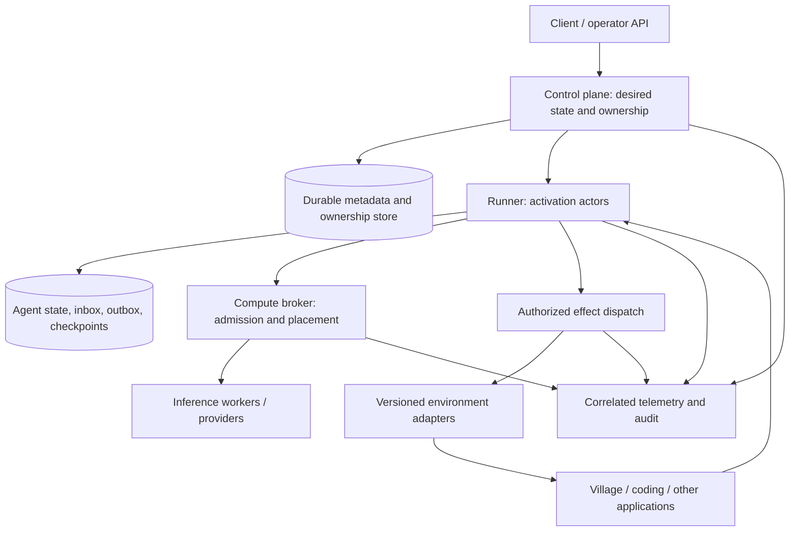

# Target architecture: a distributed agent orchestration engine

This is a proposed model, not a description of functionality already shipped. It preserves the strongest existing components and gives the standing-agent path a coherent execution contract.

## Product definition

Tetonic hosts configurable agents, maintains their identity and state, admits their computation, mediates their effects, and moves execution between eligible machines without losing ownership or lying about outcomes. Applications provide observations, tools/actions, and authoritative effect results. Inference providers supply proposals. Neither an LLM response nor a successful network send is proof that an effect occurred.

The Village remains an independent consumer. Its physics, objects, visibility, inventory, dialogue mechanics, and rendering belong in its repo. Tetonic should support the same reliable execution semantics for Village and another non-coding adapter without knowing what a tree or dock is.

## Logical planes



These are ownership boundaries, not a requirement for six processes or immediate creation of six new crates. Standalone hosts the same services in one process with local storage. Deployment roles decide where they run.

## Canonical entities

| Entity | Meaning | Authoritative owner |
|---|---|---|
| Tenant / organization | Administrative scope, policy, quotas, authorization | Control plane |
| AgentDefinition | Versioned charter, cognition configuration, allowed capabilities, memory policy | Definition registry |
| AgentIdentity | Stable identity across restarts and placement changes | Control plane |
| AgentDesiredState | Requested running/paused/stopped configuration revision | Control plane |
| AgentActivation | One ownership generation of an agent on a runner | Durable ownership service |
| RunnerSession | Authenticated runner incarnation and liveness | Control plane |
| Decision | One bounded reasoning operation over known evidence/state revision | Activation actor |
| Task / attempt | Finite work with lease, deadlines, retries, and terminal outcome | Existing run supervisor |
| Effect | Stable logical external operation, distinct from transport retries | Durable effect service / adapter |
| Observation | Replaceable, source-scoped local state with freshness | Environment adapter |
| Event | Individually identified input requiring defined delivery semantics | Adapter inbox / message service |
| Checkpoint | Versioned durable state plus event/effect cursors | State store |
| PolicyVersion | Effective machine-enforced permissions and limits | Policy authority |

An agent is not a perpetual `Run`. Keep its identity and memory durable across many activations and finite decisions/tasks. An activation is not a runner: one runner may host many activations, and a new incarnation of the same runner is a different ownership subject. An inference attempt is not a world action.

## Authority and invariants

1. At most one current activation may authorize effects for a given agent. Stale processes may continue computing during a partition, but their effect authorization is fenced.
2. Ownership generation never regresses or repeats after coordinator restart. Heartbeat renewal does not manufacture a new generation.
3. A runner proves its authenticated identity and current activation lease; client-provided identity strings are not authority.
4. A durable input acknowledgement means the agent-state transaction committed, not that the agent believes or obeys its content.
5. Every effect has a stable ID before first transmission. Retries of the same logical effect use the same ID.
6. `accepted`, `running`, `completed`, `rejected`, `canceled`, and `unknown` are distinct outcomes.
7. Cancellation closes admission; quiescence means outstanding work has actually stopped or been fenced. An API must expose the difference.
8. Parent stop/policy restrictions cannot be cleared by a child resume/configuration operation.
9. Tenant and agent boundaries apply to memory retrieval, event subscriptions, artifacts, state, control operations, and effects.
10. State transition, input consumption, and effect intent are committed atomically, or the implementation exposes a recoverable intermediate state.
11. Old state/protocol versions are either explicitly migrated/negotiated or rejected before execution.
12. Overload is bounded and observable. Control-plane stop/lease events cannot wait indefinitely behind ordinary observations.

These belong in conformance tests and typed API constraints. Prompt instructions cannot enforce them.

## One decision/effect transaction

1. Receive local observations into per-adapter latest-value slots. Persist relevant discrete events in a bounded durable inbox, deduplicated by source/session/event ID.
2. Wake the activation actor due to a timer, retained event, control change, or effect completion. Admit computation through the shared broker and record the selected state/evidence revision.
3. Assemble context from current local senses and authorized agent-owned memory. Record provenance, omissions, token accounting method, model/config version, and policy version.
4. Run inference as a cancellable child attempt. World updates and control messages continue to be ingested while the model runs. A provider failure does not become a fabricated agent action.
5. Validate the proposed decision against the negotiated action schemas, current ownership, current policy, relevant observation freshness, and effective stop state. Reject or replan stale decisions; record why.
6. Atomically commit the decision, updated working state, consumed event IDs, and effect outbox entries under expected agent-state revision and activation generation.
7. Acknowledge durable input incorporation. Independently dispatch outbox effects with their stable IDs and adapter-specific idempotency/fencing proofs.
8. Persist authoritative receipts and later terminal outcomes. Feed them back as attributed evidence. On timeout, mark `unknown` and reconcile; never silently convert uncertainty into failure or success.

The transaction does not include a remote inference call or remote world mutation. An outbox bridges local commit and remote delivery. If the adapter cannot deduplicate or reconcile, classify its effects accordingly and require a more conservative recovery policy.

## Lifecycle and scheduling

Desired state and observed state are separate. A useful observed lifecycle is:

```text
pending -> assigned -> starting -> running -> draining -> stopped
                         |          |            |
                         +------> failed <--------+
                                    |
                              recovery_required
```

Stop reasons are orthogonal restrictions rather than arbitrary overwrites of lifecycle. A partition can leave `desired=stopped`, `observed=unknown`, `effects=fenced`, and `quiescence=unconfirmed`; that is an honest state.

Use one state-owning actor per activation or an equivalent serialized command processor. Avoid independent mutex-protected maps for the same aggregate. Maintain separate handling classes for control, reliable events, replaceable observations, and background work. Use fair admission across agents and tenants. Waiting is a valid decision; do not force an activity just to make the demo appear autonomous.

Long-running environment actions return handles and later events rather than holding the entire agent loop open. Multiple effect concurrency requires an explicit policy—e.g. one movement operation plus one conversation—not accidental concurrency from independently spawned tasks.

## Distribution and fencing

Start with one durable coordinator and two runner processes. Prove restart and reassignment before adding coordinator high availability.

An ownership record should bind tenant, agent, activation ID, runner session ID, generation, expiry, and coordinator term/revision. Admission must be conditional on expected current revision. Worker liveness is a signal for reassignment, not authority to bypass fencing.

Two effect-boundary options are viable:

- A central/partitioned effect gateway validates ownership and authorizes dispatch; adapters still need idempotent effect IDs and a rule for effects already admitted before transfer.
- A directly connected adapter validates a fencing token against a trusted authority/current generation and rejects stale activations. A signed token alone is insufficient if the adapter accepts it after its ownership expires or is superseded.

For arbitrary third-party systems that cannot enforce a generation, route through a controlled dispatcher and document the remaining in-flight ambiguity. Do not promise universal exactly-once side effects. Fence first, then reconcile outstanding effects before declaring migration complete.

Coordinator HA is a separate milestone. Choose an established transactional coordination backend or a replicated metadata implementation based on tested consistency needs. A “keeper” process should coordinate metadata/leases; it should not contain the game engine, raw model streams, and every agent memory entry. Avoid inventing consensus as part of the first distribution sprint.

## State and memory

Separate operational state from cognitive evidence:

- Operational state: ownership, desired configuration, inbox cursors, pending effects, revisions, stop reasons, retries, and checkpoint head. Strong consistency where transitions depend on it.
- Cognitive evidence: observations, attributed claims, self-authored intentions, outcomes, learned associations, and retrieval indexes. Private by default, versioned, with explicit provenance and retention.
- Audit/telemetry: correlated operational history and optional raw provider output. Different retention/access policy from memory.

SQLite is an appropriate standalone implementation. Specify interfaces around actual atomic operations rather than generic CRUD: `commit_decision(expected_revision, activation_proof, consumed_events, state_delta, effects)` and `claim_activation(expected_generation, runner_session)` are examples of the semantic boundary. Concrete names are provisional.

Checkpoints contain schema version, exact identity, activation generation, durable revision, source cursors, pending effect references, configuration/definition references, and complete integrity coverage. Content blobs can live in an artifact/object store; ownership and checkpoint heads belong in transactional metadata. Validate exact identities and revisions on restore. Corrupt-all is distinguishable from never-created.

Memory retrieval must remain bounded and local to the agent's permissions. The engine cannot reconstruct an agent's beliefs by querying the entire Village database. Shared organization memory is an explicit capability, not an omniscient default. Memory summaries are derived claims with source references, not replacements for authoritative effect receipts.

## Compute and placement

Keep two decisions distinct:

| Placement | Optimize for | Never lose |
|---|---|---|
| Agent activation | Adapter locality, state locality, isolation, CPU/RAM, availability | Ownership, identity, state revision, permissions |
| Inference attempt | Model capability, trust/data class, queue delay, GPU/RAM, latency, cost | Deadline, input binding, usage accounting, cancellation |

Reuse ComputeBroker for inference admission/reservation/settlement. Standing-agent timers must not bypass global budgets. Apply tenant/agent quotas, concurrency caps, fair queues, backoff, and dead-letter/recovery states to repeated faults. Start with simple measured placement; speculative scheduling is secondary to accurate usage, cancellation, and effect ownership.

## API and configuration

The user-facing distribution can be `tetonic-server`, a client, and an optional keeper/coordinator role. Binary count is a packaging choice, not the architecture itself. Do not split three binaries before their shared service boundaries are sound.

The API should expose definition management, desired state, status/conditions, event input, permitted interventions, effect status, trace subscriptions, and checkpoint/recovery inspection. Mutating commands carry request IDs and expected versions. Responses distinguish accepted command from achieved state.

One versioned configuration schema covers service roles, state backend, inference providers, policies, adapter bindings, resource ceilings, and telemetry. Validation rejects unsupported modes. Show effective configuration and reload status without disclosing secrets. Separate administrative steering from in-world observations: an operator's authoritative config change and a thought planted as optional content are different events.

## Repository shape

Preserve the five physical layers during convergence; enforce dependency/authority rules mechanically. Logical responsibilities should become:

| Existing area | Direction |
|---|---|
| domain | IDs, versioned envelopes, state machines/contracts; keep I/O out. Gradually separate generic execution contracts from coding capability contracts. |
| core | State-owning activation execution, cancellation, proposal/effect lifecycle; no product storage/network composition. |
| runtime | Shared production assembly, capability/action middleware, brain strategies, adapter client implementations. |
| run | Durable finite attempts/tasks and finalization; integrate activation decisions without making agent identity task-shaped. |
| orchestrator | Desired-state reconciliation, placement and group coordination; no second in-memory authority for lifecycle truth. |
| broker / inference / fabric | Shared compute admission and authenticated compute transport. |
| memory / artifact / context | State transactions, checkpoint implementation, evidence retrieval and durable content. |
| app / tools / index / lsp | Coding consumer and reusable capability adapters; extract neutral compute/host bootstrap from app. |
| server / client | Thin composition and administration surfaces using shared services. |
| tooling | Conformance, invariants, fault injection, performance and behavioral evaluation. |

Do not create a crate for every noun or move all files at once. Extract only where an actual dependency/authority seam is demonstrated. Keep compatibility facades until both existing coding workflows and standing-agent tests use the new path.

## Performance and verification model

Measure before claiming scale: idle memory per agent, active memory per decision, event ingestion/ack lag, queue age, stop/fence latency, inference utilization, checkpoint write/restore time, state-store contention, and recovery time after runner loss. Report percentiles and test conditions. Set targets after a measured baseline; a 1,000-node enum is not a capacity result.

Use deterministic fake inference for fault semantics and a separate model evaluation suite for behavior. Infrastructure tests should prove no duplicate unauthorized effects, correct replay, isolation, and convergence after failure. Model evaluations should measure grounded action validity, learning from rejection, relevant recall, and continuity without prescribing whether an agent must farm, explore, talk, or wait.
