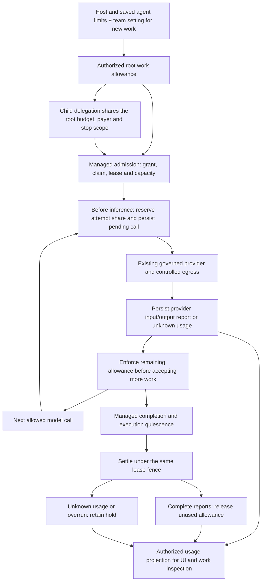

# Durable state, budgets and public contracts

As built, October 8, 2026. Tetonic uses the existing SQLite store and managed
execution journal. The directories below organize ownership inside that store;
they are not independent databases, services or replicated partitions.

## Find the authoritative record

| Question | Durable owner | Who acts on it? |
|---|---|---|
| Who can do this? | [`control/`](../../engine/strata/tetonic-memory/src/control/mod.rs): memberships, registered identities/revisions, execution grants, delegation lineage, approvals and stops | `ResourceService` authenticates and authorizes operations; managed admission and runtime policy enforce execution/action authority. A roster or saved tool name is not a grant. |
| What should the team do? | `control/`: work items, briefs, huddle revisions, accepted-plan pins and work-team versions | `WorkService` and the existing team-work controller shape and coordinate work. These records cannot prove that execution finished. |
| What actually ran? | [`execution/`](../../engine/strata/tetonic-memory/src/execution/mod.rs): run events/projections, attempts, leases and execution claims | `ManagedRunService` and `DurableRunSupervisor`. The exact task and attempt matter; a sibling's success does not complete this work. |
| What may this reader know? | [`context/`](../../engine/strata/tetonic-memory/src/context/mod.rs): context ownership, access, scoped transcript reads, publication and recall | `ContextService` and its bound adapters. Identifiers alone do not authorize reads or publication. |
| How much is available or still uncertain? | [`usage/`](../../engine/strata/tetonic-memory/src/usage/mod.rs): allocations, reservations, provider reports, settlement and execution capacity | Authorized resource operations, the metered provider wrapper and managed completion. Telemetry and model-generated estimates are not the ledger. |
| Which result may I open? | [`artifacts/`](../../engine/strata/tetonic-memory/src/artifacts/mod.rs): immutable context bindings and disposition records; accepted result references remain in the run journal | Scoped artifact adapters and managed finalization. Payload bytes live in `tetonic-artifact`, outside SQLite. A payload claiming completion is not an accepted result. |

[`Store` and `SharedStore`](../../engine/strata/tetonic-memory/src/lib.rs) retain
their public API and root type reexports. Session/message/tool audit records,
checkpoints, schema orchestration, backups and common storage utilities remain
at the crate root. This step does not split the large base store implementation
or rename the crate again.

`SharedStore` has a dedicated queued writer and pooled readers. SQLite WAL and
`synchronous=FULL` remain the durability policy. Individual operations establish
their own transaction boundaries; invoking several `.write` calls is not one
transaction. Resource authorization happens before storage, and relevant store
operations recheck membership, scope and revision inside their transaction.
This is not a blanket promise of instantaneous revocation of an admitted effect.

## Transactions that must stay together

Moving a helper to another directory must not split any of these operations.
Cross-area helpers deliberately use the caller's connection and transaction.

| Operation | Atomic unit and why it matters |
|---|---|
| [`commit_run_command`](../../engine/strata/tetonic-memory/src/execution/run_store.rs) | Event append, digest validation, run projection, command/idempotency receipts, root/child capacity checks and updates, and any authorized resume accounting transfer. A failed capacity check or invalid usage fence rolls the entire command back. |
| [`resume_work_usage_in_tx`](../../engine/strata/tetonic-memory/src/usage/work_usage_resume.rs) | Part of that same run-command transaction. Transfer the existing reservation's lease fence only for a validated `ResumeAttempt`; retain allowance, reports and unknown spend. Projection-only recovery cannot move money. |
| [`authorize_work_budget` / `reserve_work_budget`](../../engine/strata/tetonic-memory/src/usage/work_budgets.rs) | Current manager authority, work lineage/stops, available balance, exact retry binding and insertion. Two writers cannot spend the same remaining allocation. |
| [`create_work_delegation`](../../engine/strata/tetonic-memory/src/control/team_work.rs) | Validate parent authority, existing allocation and stop scope; create the child work/delegation and its inherited share together. Caller-supplied budget numbers do not create funding. |
| [`derive_execution_grant`](../../engine/strata/tetonic-memory/src/control/delegated_grants.rs) | Validate the live parent attempt/lease, registered revision, allocation and grant chain; insert the child grant and immutable lineage together. Allocating money and granting execution are separate operations. |
| [`begin_work_inference_with_limit`](../../engine/strata/tetonic-memory/src/usage/work_usage.rs) | Validate scope, current claim, activation, lease and open allocation; bind the attempt reservation and record the pending provider call before any inference request leaves the process. |
| [`finish_work_inference` / `settle_work_inference`](../../engine/strata/tetonic-memory/src/usage/work_usage.rs) | Each is its own transaction. Recording a report is separate from releasing unused allowance. Settlement requires the original fence and durable terminal quiescence; unresolved reports or overruns retain the hold. |
| [`set_team_budget_setting`](../../engine/strata/tetonic-memory/src/usage/work_usage.rs) | Manager authority, expected revision, exact request/actor/value retry check, setting and receipt. A stale write must not replace a newer setting. |
| [`edit_organization_agent`](../../engine/strata/tetonic-memory/src/control/organization_agent_edits.rs) | Current authority, expected revision, immutable revision creation, current registration and edit receipt. Agent edits do not rewrite an already pinned execution. |
| [`begin_huddle_execution`](../../engine/strata/tetonic-memory/src/control/huddle_execution.rs) | Current agreed plan/brief, agent revision pins and one execution receipt. Plan validation cannot be separated from the durable decision to start that revision. |
| [`accept_huddle_dispatch` / `complete_huddle_dispatch`](../../engine/strata/tetonic-memory/src/control/huddle_execution/dispatch.rs) | Current scoped coordinator binding, lease fence, stop generation, exact call/selection and saved response. Child execution is separate and uses existing managed admission; receipts cannot start or resume it. |
| [`bind_huddle_dispatch_checkpoint`](../../engine/strata/tetonic-memory/src/control/huddle_execution/dispatch.rs) | Current owner, request and stop binding plus an immutable sealed checkpoint reference. The managed artifact owner verifies the private payload before this transaction. Child admission waits for both; the artifact write is not atomic with SQLite and an unbound artifact confers no execution authority. |
| [`request_control_stop_with_runs`](../../engine/strata/tetonic-memory/src/control/human_controls.rs) | Stop record, scope and captured affected runs. Runtime cancellation follows outside the transaction; committing a stop is not evidence that every effect has stopped. |
| [`bind_new_context_artifact`](../../engine/strata/tetonic-memory/src/artifacts/context_artifacts.rs) | Current context access and immutable ownership binding. This does not make the external payload write atomic with SQLite or authorize rebinding an existing foreign artifact. |

The [migration orchestrator](../../engine/strata/tetonic-memory/src/schema.rs)
upgrades through schema 72 with its existing backup/ownership machinery. Version
71 adds coordinator dispatch receipts. Version 72 protects their immutable
checkpoint references from older writers that would discard those JSON fields;
legacy completed receipts remain readable but cannot acquire guessed checkpoints.
The ownership refactor itself added no migration. External filesystem changes, artifact
publication and provider effects are not part of a SQLite transaction. Their
existing managed finalization and recovery rules remain necessary.

## Trace one token allowance



1. The team setting narrows the allowance for **new requests** under the host
   ceiling. It is not a monthly/shared team spending balance. Existing funded
   work retains its allocation. Saved agent limits constrain the configured
   execution; they are not a perpetual personal spending account.
2. [`work_budgets`](../../engine/strata/tetonic-memory/src/usage/work_budgets.rs)
   owns root funding, reservations and the available balance. Delegated child
   shares inherit root, payer and stop scope. Parent effort and sibling shares
   compete for the same available funds; exact retries do not charge twice.
3. [`WorkUsageProvider`](../../engine/litho/tetonic-app/src/resources/work_usage.rs)
   wraps the existing governed provider. It requires managed run/task/attempt
   correlation and durably records the pending call before invoking the provider.
   The first funded call reserves the smaller of the available work share and
   the supplied execution limit. Later calls reuse that attempt reservation.
4. The wrapper reduces generated-output `max_tokens` to the remaining share.
   Complete provider reports count input and output. Partial/missing reports are
   unknown. On bounded work, missing usage or a reported overrun stops the run
   before its returned tool calls execute. A known overrun blocks further calls
   across the allocated work tree, without discarding reports already in flight.
5. [`registered` completion](../../engine/litho/tetonic-app/src/resources/registered/mod.rs)
   invokes settlement after managed completion. The store independently checks
   terminal state, quiescence and the original execution fence. If accounting
   cannot confirm release, it keeps the hold and emits a sanitized diagnostic.

### Cancellation, delegation and resumption

- Dropping an in-flight provider future leaves the pending record. After its
  owner stops/expires, the usage projection shows it as unconfirmed; it is never
  converted to zero cost or automatically refunded.
- A stop prevents new admissions/calls in its scope and propagates cancellation
  through the existing managed path. A stop request is not quiescence. Neither
  reserved tokens nor execution slots are freed merely because cancellation was
  requested. An external effect that already completed cannot be undone by this
  accounting machinery.
- Child allocation does not supply a child execution grant. Both the budget
  lineage and the live managed delegation proof are required. A child cannot
  invent a new payer or detach from its inherited stop scope to fund itself.
- Supported human-wait resumption transfers the accounting fence inside the run
  command, preserving spend and uncertainty. It is not a new free allowance.
- Execution capacity (`run_capacity`, `child_capacity`, `execution_limits`) counts
  admitted non-quiescent execution. Compute reservations and placement decisions
  belong to the inference capacity machinery. Human/team effort entries are
  separate records. These are different resources, not aliases for token spend.

### Honest limits

This is a provider-reported token guardrail, not a hard billing cap. Prompt tokens
may exceed a remaining share during the current call; provider-internal retries
are not separately metered here. Dollars, pricing, rolling organization/team
periods, GPU accounting and distributed ledger reconciliation are not implemented.
Unknown usage and a crash between reporting and settlement conservatively retain
funds. Automatic reconciliation/manual release is still future work. Moving files
does not turn SQLite into a replicated coordination service.

## Public contracts and projections

[`PublicFailureV1`](../../engine/litho/tetonic-app/src/errors/public.rs) defines
stable failure codes, safe display text and recovery guidance. The
[HTTP adapter](../../engine/litho/tetonic-cli/src/local_ui/contract.rs) maps
categories to statuses. Resource conflicts become 409, denials 403, occupied
capacity 429, unavailable inference/workspace 503 and storage/internal failures
500. Malformed inputs remain 400. The existing `error` field stays available.

```json
{
  "schema_version": 1,
  "error": "This team changed, or this save belongs to another edit. Reload the team before saving again.",
  "code": "state_conflict",
  "recovery": "refresh",
  "recovery_hint": "Refresh the current item and review it before applying changes."
}
```

The local adapter returns `X-Tetonic-Api-Version: 1` and accepts an absent request
version for existing clients. An explicitly unsupported or duplicate version
header is rejected after authentication and before any mutation. The
[web client](../../web/src/engine/client.ts) sends v1, retains typed error
metadata and handles legacy/error bodies defensively. Recovery guidance is not
permission to automatically repeat a mutation with an unknown outcome. Raw
storage, tool and internal failure bodies never enter this public envelope.

`BudgetSettingsRequest` requires all three fields: `request_id`,
`expected_revision`, and `token_limit`. A number sets the limit, explicit `null`
resets it, and omission is invalid. Unknown authority/usage fields are rejected.

The [candidate artifact v1 contract](../../engine/core/tetonic-domain/src/candidate_artifact.rs)
is shared by both existing encoders and the authorized work-result reader. It
keeps historical JSON bytes/digests and rejects missing/unsupported versions,
unknown outcome tags, duplicate fields and unexpected fields. The reader still
requires managed acceptance, current context access, matching content digest and
a bounded read before presenting an answer. Deserializing `completed` does not
accept work.

[`WorkService::project_task`](../../engine/litho/tetonic-app/src/work/inspection.rs)
owns the operator-facing execution projection. The work list reuses its summary
path for bound executions, excluding transcript/artifact payload reads. Manual
status/lead metadata remains presentation data and cannot replace actual execution
state or agent assignment. Unexecuted work may still carry its manual status.
Plans and transcripts do not substitute for run state. The browser renders these
projections; it should not infer completion from prose or recompute budget balances.

These are explicit boundaries, not a claim that every historical JSON payload
or string-valued projection has been converted to a new schema. Existing typed
commands, agent definitions and managed journal contracts retain their formats.

## Evidence and safe change routing

- [Usage cases](../../engine/strata/tetonic-memory/src/usage/work_usage_tests.rs):
  concurrent calls, unknown reports, overrun behavior, lease fences, settlement
  and capacity races.
- [Allocation cases](../../engine/strata/tetonic-memory/src/usage/work_budgets_tests.rs):
  shared balances, nested delegation, retry binding, stops and competing writers.
- [Resumption case](../../engine/strata/tetonic-memory/src/usage/work_usage_resume_tests.rs):
  atomic journal/accounting fence transfer without resetting money or uncertainty.
- [Migration tests](../../engine/strata/tetonic-memory/src/migration_tests.rs) and
  [concurrency tests](../../engine/strata/tetonic-memory/tests/h2_2_store_concurrency.rs):
  rollback, process loss, WAL reopen and reader/writer isolation.
- [Scoped application case](../../engine/litho/tetonic-app/src/work/scope_tests.rs):
  a presentation edit cannot replace a completed execution's state or agent.
- Public error tests live beside the application and HTTP contracts; the
  [client tests](../../web/tests/engine-client.test.tsx) cover compatibility,
  conflict metadata, malformed bodies and no automatic mutation replay.

Add SQL/transaction invariants to the relevant persistence area. Add permission
and work-use-case rules to the existing resource/work service. Change lifecycle
transitions in `tetonic-run`. Add public projections at the application boundary,
then map them in the existing client. Do not add a second ledger, frontend status
authority or cross-area database to solve a navigation problem.
