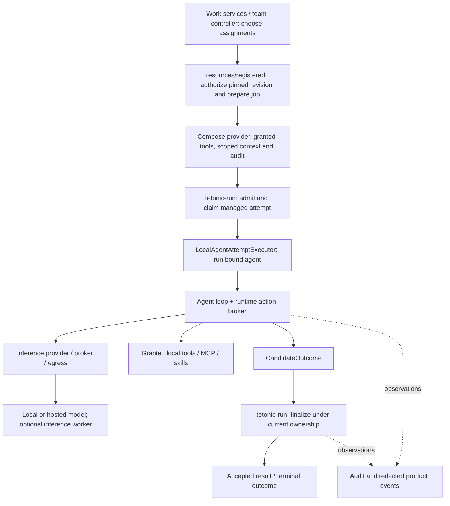

# Execution, harnesses and inference

Current implementation after the October 8, 2026 execution-boundary refactor.
This describes the registered-agent path used by the product. Remote agent
execution and vendor-native harnesses are not implemented by this refactor.

## One execution authority

Objects are assembled before execution is claimed. Assembly is not permission
to start a second loop. The managed service owns admission, durable attempt
identity, leases, cancellation, finalization and acceptance. A model response or
`CandidateOutcome` is not an accepted result. Product events are observations,
not an independent execution journal.

## Trace through the code

1. **Select a revision and authorize an assignment.**
   [`registered/harness.rs`](../../engine/litho/tetonic-app/src/resources/registered/harness.rs)
   prepares general-agent revisions and validates limits.
   [`authority.rs`](../../engine/litho/tetonic-app/src/resources/registered/authority.rs)
   and [`admission.rs`](../../engine/litho/tetonic-app/src/resources/registered/admission.rs)
   bind current credentials, grants, organization/team scope, the exact revision
   and job. Saved configuration and team membership alone are not execution grants.
2. **Prepare and assemble the existing harness.**
   [`preparation.rs`](../../engine/litho/tetonic-app/src/resources/registered/preparation.rs)
   resolves the job, capability/context/provider bindings, host limits, usage
   controls and supported restoration inputs.
   [`assembly.rs`](../../engine/litho/tetonic-app/src/resources/registered/assembly.rs)
   connects the tool host, scoped audit, provider, approval hooks and runtime.
   Local and hosted models use this same governed tool path. A workspace root
   is optional for noncoding work; selecting a model does not grant file access.
3. **Admit and execute through the manager.**
   [`registered/mod.rs`](../../engine/litho/tetonic-app/src/resources/registered/mod.rs)
   submits the prepared job to the existing `ManagedRunService`.
   [`managed/execution.rs`](../../engine/mantle/tetonic-run/src/managed/execution.rs)
   checks durable job/identity/authorization bindings, claims execution,
   installs cancellation/deadline/authority/lease checks and calls the
   [`local executor`](../../engine/core/tetonic-runtime/src/executor.rs).
   The executor refuses an agent bound to a different attempt and returns a
   candidate outcome. Model and tool boundaries remain governed during the loop.
4. **Finalize under the same lifecycle owner.**
   [`managed/finalization.rs`](../../engine/mantle/tetonic-run/src/managed/finalization.rs)
   owns finalization and result acceptance. The application supplies a
   [`FinalizationEffectDriver`](../../engine/litho/tetonic-app/src/execution/finalization.rs)
   for configured verification and staged workspace commit effects. That driver
   does not claim attempts or decide which candidate wins. Cancellation and
   quiescence remain managed responsibilities; external effects are not generally
   reversible, and interrupted work is not automatically safe to replay.
5. **Project observations for the product.**
   [`execution/observer.rs`](../../engine/litho/tetonic-app/src/execution/observer.rs)
   adapts managed hooks into application events;
   [`events/agent_steps.rs`](../../engine/litho/tetonic-app/src/events/agent_steps.rs)
   redacts and translates loop observations. Scoped transcript writes use the
   existing audit writer and context authorization. These projections cannot
   establish success independently of the managed records.

## Physical ownership

| Location | Responsibility |
|---|---|
| `tetonic-app/resources/registered/` | Revision preparation, current authority, admission bindings, harness composition and supported reconstruction |
| `tetonic-app/execution/` | Application run-service adapter, event hooks, audit interface, tool finalization effects and workspace hooks |
| `tetonic-app/events/` | Product event vocabulary and redacted agent-step projection |
| `tetonic-run/managed/` | Admission, attempt lifetime, leases, cancellation, finalization and recovery rules |
| `tetonic-runtime` | Agent assembly, policy/action broker and local attempt executor |
| `tetonic-core` | Model/action loop and conversation mechanics |
| `tetonic-inference`, `tetonic-broker`, `tetonic-egress` | Provider transport, compute placement/accounting and controlled outbound requests |
| `tetonic-node/inference_ingress.rs` | Inference-job delivery to a worker |

Public `turn_execution` and `turn_attestation` modules remain as Rust API
compatibility reexports. Internal callers use the new owners. The application
attestation helper is a retained artifact utility; managed production sealing and
acceptance remain in `tetonic-run`. No second result authority was introduced.

## Where extensions belong

| Extension | Integration point and required boundary |
|---|---|
| Model provider | Provider adapters in `tetonic-inference`, discovery/settings in application workspace providers, and registered assembly. Preserve brokered/authorized transport, credential binding, disclosure, streaming and usage behavior. Tool grants apply regardless of provider. |
| Tool, MCP or skill | Existing workspace capability inventory and agent revision/grant services, then registered assembly and the runtime action broker. Installation, advertisement and authority are separate concerns. |
| Harness | Registered revision validation/preparation and assembly. Bind inputs, capabilities, scoped context, audit, approvals, usage and recovery semantics to managed attempts. Selecting a vendor model does not install its native harness. |
| Execution backend | The domain `AgentAttemptExecutor` contract and the managed dispatch owner. Today the manager constructs `LocalAgentAttemptExecutor` directly; there is no backend factory or remote executor registration API. A new backend requires deliberate manager wiring, fenced ownership, cancellation/quiescence and result-binding tests. |
| Inference worker | Fabric transport, broker placement and node inference ingress. These move model computation, not the agent's tools, workspace or lifecycle. |

The [executor contract](../../engine/core/tetonic-domain/src/identity.rs) carries
attempt identity and returns `CandidateOutcome`. The ID is not proof of authority.
Cancellation and live ownership checks currently reach the local executor through
the manager-bound agent. A future remote protocol must explicitly preserve those
guarantees; implementing the trait alone is insufficient.

## Coding strategies versus product coordination

[`WorkService`](../../engine/litho/tetonic-app/src/work/mod.rs) and the
[`team-work controller`](../../engine/litho/tetonic-app/src/team_work_controller.rs)
coordinate current product work, dependencies and assignments. The retained
[`tetonic-orchestrator`](../../engine/mantle/tetonic-orchestrator/README.md) library
contains coding/session routing, specialist, critic and spawn strategies. The
application's [`coding_pack`](../../engine/litho/tetonic-app/src/coding_pack.rs)
integrates retained coding behavior. Neither replaces current team coordination
or the managed lifecycle.

## Distributed limits and evidence

Worker ingress accepts only `JobKind::Infer`; all other job kinds are rejected.
Enrollment, delivery receipts and placement metadata do not implement remote
agent execution, replicated control storage or Keeper. Native vendor harnesses
and a pluggable executor registry are also unfinished. This refactor gives those
changes identifiable owners without advertising them as available features.

Boundary evidence includes registered authorization/reconstruction/human-wait
tests, provider tool parity and shell approval tests, managed service and execution
claim tests, local executor binding tests, worker unsupported-job tests, and the
architecture gate. The gate checks the moved adapter files and fails if an
expected file disappears; mutation tests exercise lifecycle and sandbox checks.
These static checks are guardrails, not a proof of every possible bypass.

See [ownership](ownership.md), [work services](work-services.md), and the
[step 5 delivery record](../epics/v5-reconciliation/sprints/architecture-baseline/BASE-005.md).
