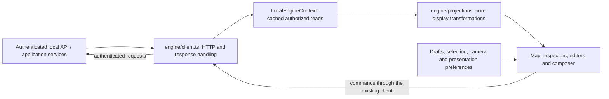

# Frontend boundaries and state ownership

Current implementation: October 8, 2026. The production entry is
[`main.tsx`](../../web/src/main.tsx) → [`App.tsx`](../../web/src/App.tsx) →
[`LocalEngineProvider`](../../web/src/context/LocalEngineContext.tsx) →
[`TeamWorkspace`](../../web/src/components/team-work/TeamWorkspace.tsx).
There is one connected map workspace. The compatibility URL `/dev/team-work/`
uses this same entry, not a second product.

## Data and action flow

Editors also fetch detail records through the same client. Context is a shared
read cache, not a mandatory command bus. This diagram describes browser
responsibility; authoritative agents, grants, plans, attempts and outcomes remain
in the engine's application services and durable store.

## Source owners

| Owner | Responsibility | Keep out |
|---|---|---|
| [`engine/contracts.ts`](../../web/src/engine/contracts.ts) | Local API request/response type declarations | Network, storage, React and business rules |
| [`engine/client.ts`](../../web/src/engine/client.ts) | Authenticated HTTP, version headers, request serialization, response/failure handling | UI state, fixture fallback and orchestration |
| [`engine/failure.ts`](../../web/src/engine/failure.ts) | Safe typed/legacy failure parsing and `EngineRequestError` | Browser state and effectful recovery |
| [`engine/connection.ts`](../../web/src/engine/connection.ts) | Connection-link credential removal, tab session storage and draft-scope identifier | Execution state and persisted permissions |
| [`engine/projections/agents.ts`](../../web/src/engine/projections/agents.ts) | Registered agent records to presentation models | Creation or permission decisions |
| [`engine/projections/records.ts`](../../web/src/engine/projections/records.ts) | Merge/revision helpers, transcript and work grouping | Browser navigation and network reads |
| [`engine/projections/taskState.ts`](../../web/src/engine/projections/taskState.ts) | Shared predicates over reported task states | A second lifecycle state machine |
| [`engine/projections/workspace.ts`](../../web/src/engine/projections/workspace.ts) | Engine records to map work, dependencies and activity | Invented collaboration or simulated status |
| [`LocalEngineContext`](../../web/src/context/LocalEngineContext.tsx) | Polling, cached reads, freshness/errors and command wrappers | Durable execution authority |
| [`lib/workSelection.ts`](../../web/src/lib/workSelection.ts) | Existing hash selection/navigation helpers | Server state |
| `components`, presentation `lib` helpers and `types.ts` | Interaction, layout, draft state and view models | Direct provider calls and private engine policy |

The wire declarations are hand-maintained TypeScript, not a generated schema or
runtime validator. Keep them aligned with [local UI v1](../implementation/contracts/local-ui-v1.md)
and the Rust request/response owners. HTTP version/failure guards do not validate
every successful response field. Contract tests must cover changed payloads.

## Which state is authoritative?

**Engine records:** identity and configuration revisions, capability grants,
briefs, plans, tasks/attempts, approvals, artifacts and usage. A browser command
requests a change; a display label or optimistic interaction cannot establish
that an attempt completed or an approval was accepted.

**Cached reads:** context polls independent endpoints, rejects responses from an
older poll/connection and merges workspace records using existing helpers.
Individual failed reads retain prior values and expose `readErrors`; loss of the
main snapshot marks the connection unavailable while retaining last-seen records.
Changing the connection clears its cached records. Cached content is not fresh
merely because it remains visible. Command-specific handling must preserve
unknown-outcome/retry IDs instead of blindly replaying effects.

**Local interaction:** drafts, selection, open inspector, camera and portrait
preferences help the user navigate. Existing draft scoping belongs with the
connection and workspace draft helpers. These values must not become durable
grants, attempt states or a second project database.

## Enforcement and its limits

[`architecture.mjs`](../../web/architecture.mjs) walks TypeScript import,
reexport and literal dynamic-import edges from the production entry and named
owners. It resolves relative and `@/` imports and distinguishes type-only edges
from runtime dependencies. Missing owners/imports fail visibly.

- `WEB-TRANSPORT`: known network primitives and alternate provider/HTTP clients
  belong at the existing client boundary.
- `WEB-PROJECTION`: projections and their runtime helpers cannot acquire browser
  state/timers, transport, connection state or presentation dependencies.
- `WEB-DIRECTION` / `WEB-CONTRACT`: infrastructure dependencies remain inward;
  contracts contain declarations only.
- `WEB-PREVIEW`: the production graph cannot reach dev/test/sample stores.

These checks run in `npm test` and Vite production builds, alongside the existing
bundle exclusion check. Negative fixtures cover helper/reexport bypasses,
network aliases, preview imports, missing paths and legitimate type-only imports.

This is an import/syntax check, not a sandbox or proof of accurate projections.
Unrecognized APIs, indirect runtime behavior, naming, accessibility and the
meaning of displayed statuses still need review and behavior tests. Pure helpers
may remain in `lib` when shared with presentation; following their runtime imports
keeps them subject to the projection checks without duplicating implementations.

No map styling, motion, component interaction or server contract changed in this
organization step. See [BASE-007](../epics/v5-reconciliation/sprints/architecture-baseline/BASE-007.md)
for verification evidence.
