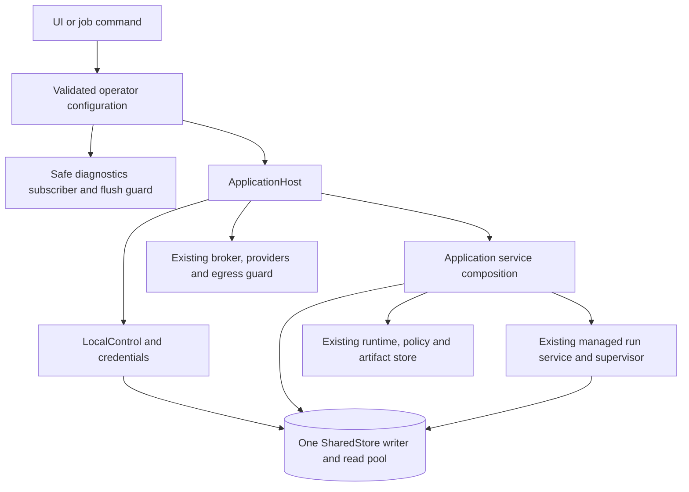

# Application host and configuration

`tetonic ui` and `tetonic job` compose execution dependencies through
[`ApplicationHost`](../../engine/litho/tetonic-app/src/host/mod.rs). It connects
existing services without introducing another agent manager or execution authority.

## Construction and lifetime



The workspace opens control state for its existing owner bootstrap, then passes
that same control object into host construction. Registered job launches open
control state through the host. Both reuse one writer/read pool for credentials,
resources, runtime capabilities, managed execution and compute accounting.

[`composition.rs`](../../engine/litho/tetonic-app/src/host/composition.rs) contains
the single application service-wiring function. Existing bootstrap and injected
test constructors delegate to it. Runtime/artifact initialization lives in
[`initialization.rs`](../../engine/litho/tetonic-app/src/host/initialization.rs).
Failure to acquire a configured policy-store reader returns an error at this
boundary instead of substituting a default policy. The existing runtime policy
loader's defaults for individual settings are unchanged.

[`HostServices`](../../engine/litho/tetonic-app/src/host/bindings.rs) replaces
`TurnBind`/`product_submit.rs`; its field is `app.host`. Runtime, policy, provider,
broker and egress handles keep their existing roles. The broker remains attached
to the same supervisor. Production UI/job runtime bootstrap runs on a blocking
task. Dropping a host wrapper does not cancel work held by another application
reference; managed execution still owns cancellation.

## Operator configuration

Existing CLI invocations remain supported. The UI accepts an optional JSON file:

```sh
tetonic ui --database /var/lib/tetonic/workspace.db --model <installed-model> --host-config /etc/tetonic/host.json
```

```json
{
  "storage": {
    "read_connections": 2,
    "artifact_directory": "./artifacts"
  },
  "logging": {
    "level": "info",
    "stderr": true,
    "directory": "./logs"
  },
  "telemetry": {
    "sample_rate": 1.0,
    "byte_budget": 52428800
  }
}
```

`tetonic job` accepts this same object under an optional `host` key in its
existing `--host-settings` JSON. Its model, endpoint, allowed tools, workspace
and execution limits remain separate. Employee job bodies cannot configure hosts.

The new storage/logging directory fields resolve relative to the configuration
file, not the command working directory. Database location remains `--database`.
`--workspace-root` remains an explicit tool-folder grant. Selecting an artifact
or log directory does not grant agents access to that directory. Existing job
settings outside the new `host` object keep their previous interpretation.

| Setting | Default | Behavior |
|---|---|---|
| `storage.read_connections` | `2` | Initial SQLite reader pool, from 1 through 16, sharing one writer. |
| `storage.artifact_directory` | Omitted | Preserve `<runtime workspace>/.lokai/artifacts`. Without a granted folder, the runtime workspace is the database parent (or the temporary directory for a bare filename), matching previous behavior. |
| `logging.level` | `warn` | `error`, `warn`, `info`, `debug` or `trace`, applied to diagnostics sinks. |
| `logging.stderr` | `true` | Sanitized JSON-lines diagnostics on stderr; command results/connection instructions keep stdout. |
| `logging.directory` | Omitted | Optional daily `tetonic.*.jsonl` files, retaining at most seven files. The command holds the writer's flush guard. |
| `telemetry.sample_rate` | `1.0` | Sampling probability from 0 through 1 through the existing trace gate. |
| `telemetry.byte_budget` | `524288000` | Process-lifetime emitted-byte budget. Existing always-retained security outcomes can exceed it; this is not a hard disk quota. |

Both sinks use the existing safe trace formatter, secret redaction and payload
suppression. Raw payload logging is not an option here. Diagnostics are best
effort; durable run events and approvals remain in their existing store.
Sampling/byte accounting resets with the process; log-file retention is separate.

Unknown options, unsupported backends/sinks, invalid levels, empty paths, invalid
pool sizes and out-of-range sampling fail explicitly. An unusable configured log
destination fails startup. Settings are read at startup, with no live reload.
Changing the artifact directory does not migrate existing payloads; preserve or
copy required artifacts before changing an existing deployment's location.

## Scope and remaining work

This config supports the local UI/job hosts. Distributed storage, OTLP export,
HA coordination and remote agent execution are not implemented by it. The older
`tetonic-domain::EngineConfig` schema is not consumed by these commands. Offline
`control`/`estate` adapters keep their current bootstrap/defaults.

Embedding applications own their logging subscriber. Library host construction
does not install global diagnostics; command adapters install them once and keep
the flush guard alive. Host configuration never replaces membership, grants,
agent revisions or managed admission.

The next boundary is explicit application scope and work-service extraction,
following the [ownership map](ownership.md). The UI and work orchestration have
not been redesigned by this refactor.
