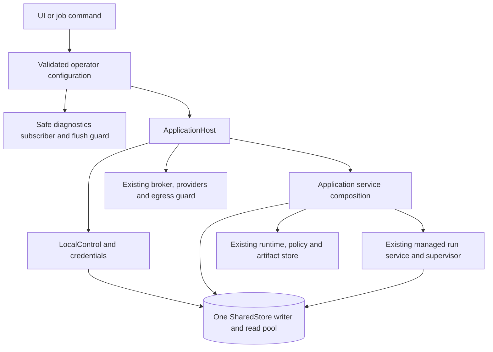

# Application host and configuration

`tetonic ui` and `tetonic job` compose execution dependencies through
[`ApplicationHost`](../../engine/litho/tetonic-app/src/host/mod.rs). It connects
existing services without introducing another agent manager or execution authority.

## Construction and lifetime



The workspace opens control state for its existing owner bootstrap, then passes
that same control object into host construction. Registered job launches open
control state through the host. Both reuse one writer/read pool for credentials,
resources, runtime capabilities, managed execution and compute accounting.

[`composition.rs`](../../engine/litho/tetonic-app/src/host/composition.rs) contains
the single application service-wiring function. Existing bootstrap and injected
test constructors delegate to it. Runtime/artifact initialization lives in
[`initialization.rs`](../../engine/litho/tetonic-app/src/host/initialization.rs).
Failure to acquire a configured policy-store reader returns an error at this
boundary instead of substituting a default policy. The existing runtime policy
loader's defaults for individual settings are unchanged.

[`HostServices`](../../engine/litho/tetonic-app/src/host/bindings.rs) replaces
`TurnBind`/`product_submit.rs`; its field is `app.host`. Runtime, policy, provider,
broker and egress handles keep their existing roles. The broker remains attached
to the same supervisor. Production UI/job runtime bootstrap runs on a blocking
task. Dropping a host wrapper does not cancel work held by another application
reference; managed execution still owns cancellation.

## Operator configuration

Existing CLI invocations remain supported. The UI accepts an optional JSON file:

```sh
tetonic ui --database /var/lib/tetonic/workspace.db --model <installed-model> --host-config /etc/tetonic/host.json
```

```json
{
  "storage": {
    "read_connections": 2,
    "artifact_directory": "./artifacts"
  },
  "logging": {
    "level": "info",
    "stderr": true,
    "directory": "./logs"
  },
  "telemetry": {
    "sample_rate": 1.0,
    "byte_budget": 52428800
  }
}
```

`tetonic job` accepts this same object under an optional `host` key in its
existing `--host-settings` JSON. Its model, endpoint, allowed tools, workspace
and execution limits remain separate. Employee job bodies cannot configure hosts.

The new storage/logging directory fields resolve relative to the configuration
file, not the command working directory. Database location remains `--database`.
`--workspace-root` remains an explicit tool-folder grant. Selecting an artifact
or log directory does not grant agents access to that directory. Existing job
settings outside the new `host` object keep their previous interpretation.

| Setting | Default | Behavior |
|---|---|---|
| `storage.read_connections` | `2` | Initial SQLite reader pool, from 1 through 16, sharing one writer. |
| `storage.artifact_directory` | Omitted | Preserve `<runtime workspace>/.lokai/artifacts`. Without a granted folder, the runtime workspace is the database parent (or the temporary directory for a bare filename), matching previous behavior. |
| `logging.level` | `warn` | `error`, `warn`, `info`, `debug` or `trace`, applied to diagnostics sinks. |
| `logging.stderr` | `true` | Sanitized JSON-lines diagnostics on stderr; command results/connection instructions keep stdout. |
| `logging.directory` | Omitted | Optional daily `tetonic.*.jsonl` files, retaining at most seven files. The command holds the writer's flush guard. |
| `telemetry.sample_rate` | `1.0` | Sampling probability from 0 through 1 through the existing trace gate. |
| `telemetry.byte_budget` | `524288000` | Process-lifetime emitted-byte budget. Existing always-retained security outcomes can exceed it; this is not a hard disk quota. |
| `workspace_execution.max_steps` | Omitted | Worker step ceiling, 1–512. Omitted/null uses 32 steps. |
| `workspace_execution.max_seconds` | `600` | Worker elapsed-time ceiling, 10–86400 seconds. |
| `workspace_execution.max_tokens` | `12288` | Worker reported input-plus-output token ceiling, 256–1000000 per run. |
| `workspace_execution.coordination_max_steps` | `16` | Managed plan coordinator step ceiling, 1–512. |
| `workspace_execution.coordination_max_tokens` | `4096` | Coordination allowance ceiling, 256–1000000, additionally capped by `max_tokens`. Included inside the plan's total allocation. |

Both sinks use the existing safe trace formatter, secret redaction and payload
suppression. Raw payload logging is not an option here. Diagnostics are best
effort; durable run events and approvals remain in their existing store.
Sampling/byte accounting resets with the process; log-file retention is separate.

Unknown options, unsupported backends/sinks, invalid levels, empty paths, invalid
pool sizes and out-of-range sampling fail explicitly. An unusable configured log
destination fails startup. Settings are read at startup, with no live reload.
Changing the artifact directory does not migrate existing payloads; preserve or
copy required artifacts before changing an existing deployment's location.

### Selecting an agent working folder

`agent_folders` is an optional list of up to 32 additional operator-approved local
directories. Paths resolve relative to the host configuration file. With a local
file-tool profile (`--workspace-root`), the connected agent editor offers the base
folder plus usable additional folders. For example:

```json
{
  "agent_folders": ["D:/work/research", "D:/work/website"],
  "storage": {"artifact_directory": "D:/tetonic-state/artifacts"}
}
```

An agent's selection is saved in its existing immutable definition revision.
Editing requires the current revision; future runs validate the selected canonical
path against current host configuration. A removed, unavailable or repointed root
is rejected rather than replaced with another folder. Existing prepared executions
keep their captured scope; this setting does not rebind running work. Legacy
agents without a saved selection continue inheriting the original base folder.

New additional folders cannot contain the control database, overlap configured
artifact/log storage, be whole-drive roots, or be inside recognized credential and
engine-control directories. The explicitly supplied legacy base folder retains
its existing startup behavior. Ordinary file tools exclude `.lokai` and `.tetonic`
control directories, alongside existing credential exclusions. This is not an
OS-wide sandbox or protection against arbitrary shell commands; process broker
controls and tool approvals continue to apply.

For hosted models, selecting a folder and consenting to disclose its contents are
separate decisions. Changing the selected folder clears the disclosure checkbox;
the engine validates the exact consented folder before hosted tool execution.
Adding another entry to `agent_folders` currently requires changing the host config
and restarting. There is no browser path field that grants arbitrary filesystem
access and no in-app host-folder manager yet.

### Configuring longer workspace work

The [workspace execution example](examples/workspace-execution.json) allows agents
to be configured for up to 32 steps, 15 minutes and 32000 reported tokens per run;
coordination can use up to 24 steps and 10000 tokens within the agreed plan total.
Pass its path to `tetonic ui --host-config` along with your usual launch arguments.
These are explicit operator ceilings, not recommended budgets for every task.
Omitting this section uses the defaults listed above. New agents in the connected editor start at 16 steps and 300 seconds, capped by the host ceilings. These are finite initial allowances, not a guarantee that a particular model or machine will complete useful work.

The connected agent editor reads these ceilings from its existing catalog.
Created/edited agents retain their own saved limits; increasing the host ceilings
does not rewrite them. Decreasing ceilings blocks future admission of agents that
exceed them until their settings or the host configuration are adjusted. Legacy
bootstrap agents with no stored preferences continue inheriting host defaults.
The Guide's engine observation and brief-to-plan generation both report the
current coordination allowance instead of teaching a fixed 4096-token limit.
Continuation proposals retain coordination allocations up to the current ceiling.

The coordinator's elapsed deadline still covers the worker ceiling multiplied by
assignment count plus one, capped at 24 hours. The accepted plan pins its execution
settings. These settings do not add permissions, raise workspace allowances,
change model context windows, guarantee model completion or enable durable team
waiting. Provider/broker capacity and existing grants still apply. Human waiting
in team work currently consumes the live attempt's deadline; safe team restoration
after restart remains unfinished. See [the readiness slice](../epics/v5-reconciliation/sprints/october-2-coordinated-work/execution-limits-2026-10-08.md).

`workspace_execution` applies to the local workspace host (`tetonic ui`). It does
not override explicit per-job execution settings in `tetonic job --host-settings`.

## Scope and remaining work

This config supports the local UI/job hosts. Distributed storage, OTLP export,
HA coordination and remote agent execution are not implemented by it. The older
`tetonic-domain::EngineConfig` schema is not consumed by these commands. Offline
`control`/`estate` adapters keep their current bootstrap/defaults.

Embedding applications own their logging subscriber. Library host construction
does not install global diagnostics; command adapters install them once and keep
the flush guard alive. Host configuration never replaces membership, grants,
agent revisions or managed admission.

The local bootstrap now binds an authenticated `ApplicationScope` and constructs
`WorkspaceServices`, which supplies agent/provider/capability operations to
`WorkService`. See [scoped workspace services and work lifecycle](work-services.md).
They retain this host and its resource/managed execution services; the UI and
work-orchestration policy have not been redesigned.
