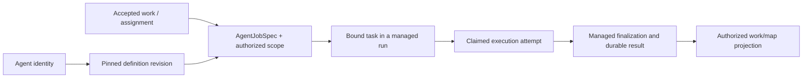

# Domain terminology

Use these meanings when discussing changes to Tetonic. They describe the current
types and boundaries, updated through the scope extraction on October 8, 2026; they do not rename
existing APIs. See [system ownership](ownership.md) for the services that may
change each record.

## People, agents and scope

| Term | Meaning in the current system | Important distinction |
|---|---|---|
| Principal | An authenticated actor evaluated by resource/context authorization. | Device identity, agent identity and a caller-supplied string are not interchangeable credentials. |
| Organization | The durable ownership and administration boundary for teams, registered agents and grants. | The local product bootstraps one organization; org records do not establish a shared enterprise server. |
| Security team | A `TeamRow` with organization, membership/participation and access rules. | This is the permission scope, not an agent roster. |
| Work team | A versioned `WorkTeam` roster of agent keys, created inside a security team. Accepted work can pin a roster revision. | Roster membership neither grants capabilities nor shares an agent's private history. |
| Agent | A continuing registered identity with versioned definition/harness configuration. | The in-memory `tetonic_core::Agent` is one assembled executor, not the persistent agent entity. |
| Agent revision | An exact definition digest and immutable configuration version. | Editing the latest definition does not rewrite the version already bound to accepted work. |
| Harness | The instructions, loop/tool interfaces and execution integration used to operate an agent. | Using a vendor's model API is not the same as running that vendor's native harness. |
| Capability | A named action/tool requested by configuration and resolved against current grants, installation/bindings and host limits. | Selection in the editor is not sufficient execution authority. A skill provides instructions, not additional privileges. |
| Product workspace | The user-facing collection of work, agents, rosters, connections and settings. The local bootstrap selects the default scope; `WorkService` and `WorkspaceServices` implement its operations. | A filesystem path is not this security/product boundary. |
| Application scope | Verified principal, organization, security team and participation-context identifiers bound by `LocalControl::application_scope`. | It is not a cached grant. Operations must still check current authorization. |
| Filesystem workspace | An explicitly supplied/canonicalized root for file and process tools on an execution host. | A folder grants neither organization access nor authority to read every information context. The control database also has separate protection requirements. |
| Information context | A durable information boundary to which history, publication, recall and artifact access are bound. | It is not the entire model context window, a filesystem directory, or an implicit union of all team members' memories. |

Sources: [resource authority](../../engine/litho/tetonic-app/src/resources.rs),
[identity types](../../engine/core/tetonic-domain/src/identity.rs),
[agent revisions](../../engine/strata/tetonic-memory/src/organization_agent_revisions.rs),
[security teams](../../engine/strata/tetonic-memory/src/team_store.rs),
[work rosters](../../engine/strata/tetonic-memory/src/work_teams.rs),
[context access](../../engine/strata/tetonic-memory/src/context_access.rs),
[local product bootstrap](../../engine/litho/tetonic-app/src/local_workspace/bootstrap.rs).

## Work and execution

| Term | Meaning in the current system | Important distinction |
|---|---|---|
| Work / work item | A durable `TeamWorkItem` describing intended work, ownership, purpose, authored status and execution linkage. | A work item's editable status is not sufficient evidence of a managed execution outcome. |
| Goal | A `TeamGoal` grouping related work in a team. | It is not an attempt or an independent executor. |
| Project / lane | Product grouping of related work, currently projected from team/plan relationships. | Do not assume each map grouping has a separate engine aggregate or grants its own authority. |
| Brief | Durable shaping context describing intent and constraints for work. | Updating a brief is not silently changing an already accepted execution. |
| Plan / huddle | A versioned proposal for assignments, agents and dependencies, plus accepted execution provenance when started. | `HuddleExecution` records pins/start information; managed run/task/attempt state owns actual execution progress. |
| Assignment | A named unit in a plan, associated with an agent revision and work item when accepted. | It may be queued or blocked before any live executor exists. |
| Job specification | `AgentJobSpec`: identity, definition/input digests, capability/artifact bindings and recovery identifier. | It pins what is requested; it does not itself authorize or start execution. |
| Run | A managed lifecycle aggregate, identified by `RunId`, containing tasks, attempts and durable events/projection. | A run is not the persistent agent and not a UI chat thread. |
| Task | A runtime `TaskRecord`: a unit in a managed run with input/execution bindings and active/winning attempt links. The run retains the attempt records. | The local API's `LocalTask` is a product projection including messages and plan details; it is not this runtime record. |
| Attempt | An `AttemptRecord` for one execution try, with ownership/lease and lifecycle state. | Retry, resumption and duplicate submission are different operations; a request retry cannot grant a fresh executor. |
| Invocation | The prepared instructions, input and loop configuration passed to an attempt executor. | Invocation data is not a durable grant, job acceptance or completion receipt. |
| Session / conversation | A history/audit correlation or in-memory model conversation, depending on the type. | Retained session records and `AssemblyMode::Session` do not restore the retired terminal-chat/session supervisor. |
| Human request | A pending question or approval associated with work and its execution context. | A durable human wait has a specific checkpoint/restore contract; ordinary crash recovery is not the same operation. |

Sources: [work types](../../engine/strata/tetonic-memory/src/team_work.rs),
[accepted plan pins](../../engine/strata/tetonic-memory/src/huddle_execution.rs),
[runtime lifecycle types](../../engine/core/tetonic-domain/src/run.rs),
[identity/job contracts](../../engine/core/tetonic-domain/src/identity.rs),
[local API projection](../../engine/litho/tetonic-app/src/work/types.rs).

This is the registered execution relationship, not a declaration that every
object is one-to-one. Delegated assignments can become child tasks under an
existing run. A work ID, task ID, attempt ID, request ID and definition digest
answer different questions and must not be substituted for one another.

## Hosts, inference and accounting

| Term | Meaning in the current system | Important distinction |
|---|---|---|
| Execution host | The trusted process/environment that assembles and owns managed agent execution and the local effects it is allowed to perform. | Current local product execution is not moved to a remote node just by choosing remote inference. |
| Inference target | A local service, hosted provider or enrolled worker that serves model requests. | It need not have the agent's workspace, tools or execution authority. |
| Compute broker | Admission and scheduling for supported compute requests, including inference and process adapters. | It is not the model that shapes plans or the team-work controller. |
| Worker | An enrolled node with worker services. Current fabric job ingress implements inference. | Placement/enrollment records are not proof of a generic remote agent executor. |
| Work budget | An authorized bound/reservation for work and delegated effort. | Distinct from concurrency, measured tokens, compute capacity and monetary billing. |
| Usage | Attributable observations, including provider-reported tokens and unconfirmed calls/holds. | Missing reports are unknown usage, not zero cost. |
| Projection | A view derived from authoritative records for inspection or UI presentation. | A cached read can be stale; it must not become another lifecycle authority. |
| Telemetry | Traces/logs/metrics explaining observed activity. | It helps diagnose work but does not replace the durable journal, grants or budget ledger. |

Sources: [host composition](../../engine/litho/tetonic-app/src/job_launch.rs),
[compute plane](../../engine/litho/tetonic-app/src/compute_plane.rs),
[worker ingress](../../engine/mantle/tetonic-node/src/job_ingress.rs),
[work reservations](../../engine/strata/tetonic-memory/src/work_budgets.rs),
[usage accounting](../../engine/strata/tetonic-memory/src/work_usage.rs).
