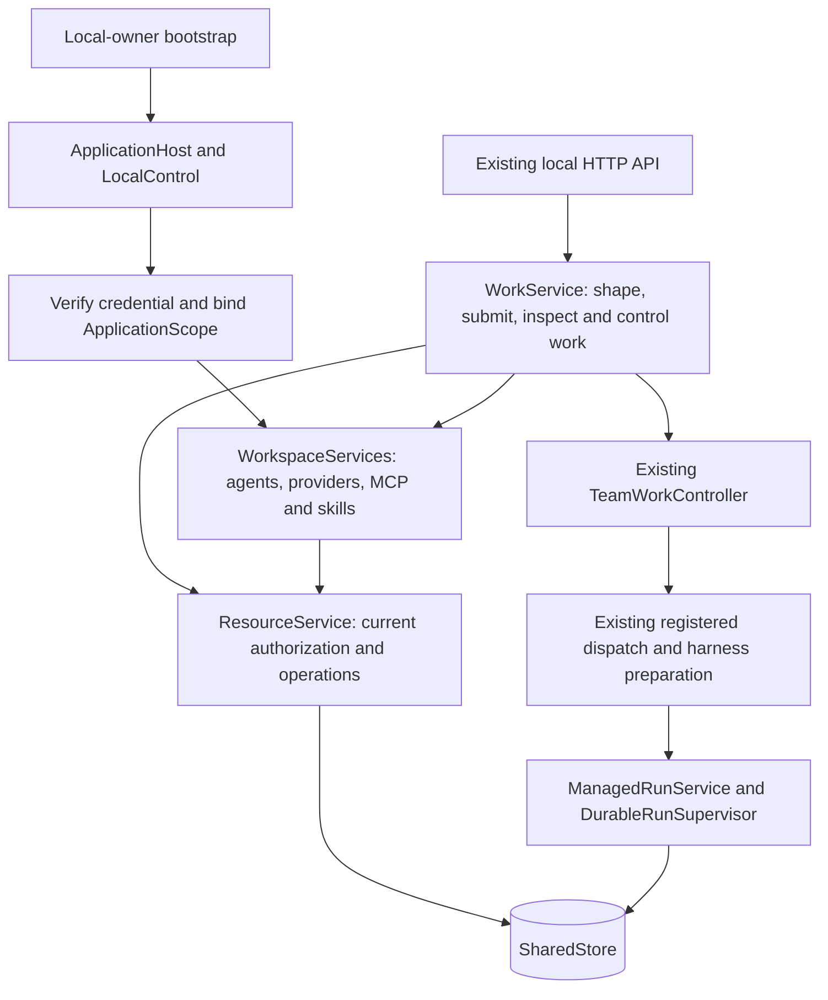

# Scoped workspace services and work lifecycle

The product application separates local-owner startup, workspace capabilities
and work orchestration. This extraction retains the existing resource services,
team-work controller, registered admission and managed execution.

These are ownership boundaries inside the application, not new network services.
Runtime tool mediation, provider transport, inference brokering, egress and
finalization follow the [existing execution path](README.md#current-execution-path).

## Where a change belongs

| Concern | Owner |
|---|---|
| Local default owner/team, default agent setup and startup | [`local_workspace/bootstrap.rs`](../../engine/litho/tetonic-app/src/local_workspace/bootstrap.rs) |
| Credential-bound principal/org/team/context identifiers | [`resources/application_scope.rs`](../../engine/litho/tetonic-app/src/resources/application_scope.rs) |
| Scoped agent configuration, providers and capability libraries | [`workspace/`](../../engine/litho/tetonic-app/src/workspace/mod.rs) |
| Work submission and cancellation | [`work/submission.rs`](../../engine/litho/tetonic-app/src/work/submission.rs) |
| Shaping, plans, continuation and human work questions | [`work/`](../../engine/litho/tetonic-app/src/work/mod.rs) |
| Product snapshots and task projections | [`work/inspection.rs`](../../engine/litho/tetonic-app/src/work/inspection.rs) |
| Eligibility and parallel dispatch loop | [`team_work_controller.rs`](../../engine/litho/tetonic-app/src/team_work_controller.rs), using [`WorkService`'s host implementation](../../engine/litho/tetonic-app/src/work/plan_execution/controller.rs) |
| Presentation notes, lead and roster metadata persistence | [`work_metadata.rs`](../../engine/strata/tetonic-memory/src/work_metadata.rs), through resource authorization |
| Actual run/task/attempt lifecycle and outcome | Existing [managed execution owner](ownership.md#managed-execution-and-recovery) |

`local_workspace::LocalWorkspace` remains a public alias for `WorkService`.
Existing Rust imports, HTTP payloads and UI callers remain compatible. Explicit
forwarders in [`work/capabilities.rs`](../../engine/litho/tetonic-app/src/work/capabilities.rs)
preserve the old capability-management API while delegating to its scoped owner.
They do not duplicate configuration or create another manager.

## Scope and authorization

`LocalControl::application_scope` verifies the caller's credential, checks team
access, and resolves the existing authorized participation context. Its returned
`ApplicationScope` has private fields, read-only accessors and no deserialization
or public unchecked constructor.

`WorkspaceServices::bind` validates the credential against that scope and installs
scope-bound skill and MCP services onto the prepared host. Work and capability
methods use these identifiers rather than embedded local owner/org/team strings.
`authorized_scope` rechecks the credential, current team access and principal
binding. Resource calls still authorize their specific action; storage retains
its membership and transaction checks. A scope value grants no authority by itself.

Existing synchronous capability views and background execution retain their
existing registry/store and execution-lease authorization contracts. This change
does not make every in-memory view a fresh credential check, or promise immediate
revocation of an effect that was already admitted.

Plan assignments continue to carry their accepted context, agent revision and
execution bindings. Work admission uses the existing managed path. Independent
assignments still run concurrently subject to dependencies, budget and capacity;
the shared application mutex covers admission/configuration changes, not model
execution. The existing controller owns scheduling, and managed execution owns
leases, cancellation and results.

## Metadata migration

Previously, `local_work_notes` keyed notes/status/lead/roster data by work ID alone.
Work items themselves are keyed by organization, security team and work ID.
Schema **70** gives the presentation metadata that same composite key and a
foreign key to its owning work item. Reads require team participation and an
existing scoped work item; writes additionally require team management authority.
Updates patch supplied fields atomically and preserve omitted fields.

The upgrade migrates both the old notes-only table and the later full-field table.
A legacy record is copied only when its work ID has exactly one existing
organization/team binding. Duplicate IDs and orphaned metadata remain in the
legacy table for explicit recovery, without guessing which team should see them.
Existing legacy rows are retained. The migration runs once under the store's
existing upgrade/backup machinery. Older schema writers must not open the upgraded
database; rollback requires the preserved pre-upgrade database/backup.

Product reads and writes use the scoped table. Missing metadata on an existing
work item means empty/default presentation fields. Storage/authorization errors
are propagated rather than reported as empty notes or a successful save. Legacy
unscoped store methods remain available for compatibility/migration, but are no
longer on this product path. Presentation status still cannot establish a managed
execution outcome.

## Evidence and limits

- [Application scope tests](../../engine/litho/tetonic-app/src/work/scope_tests.rs)
  cover non-default principals/teams, identical work IDs in separate teams,
  foreign access, credential mismatch/revocation, membership removal and reopen,
  plus managed execution with scoped grants and idempotent retry.
- [Metadata tests](../../engine/strata/tetonic-memory/src/work_metadata.rs)
  cover both legacy layouts, ambiguity preservation, patch behavior and isolation.
- [Source boundary checks](../../engine/litho/tetonic-app/tests/scope04_boundaries.rs)
  prevent local identifiers or lifecycle behavior from returning to the wrong module.
- Existing behavior tests moved with their owners, preserving parallel execution,
  provider/tool/MCP, human-wait, cancellation and process-recovery coverage.

The product still bootstraps a local owner, one organization/team and default
agents. Provider keys and default model preferences remain host/database-wide;
this is not tenant-isolated provider-account management. The default Guide and
coordinator names remain product conventions. This is groundwork for explicit
scope, not a general multi-user server, distributed work service or new public
scope-switching interface. Local-owner compatibility methods are not a complete
remote permission model. There are no UI changes in this step.
