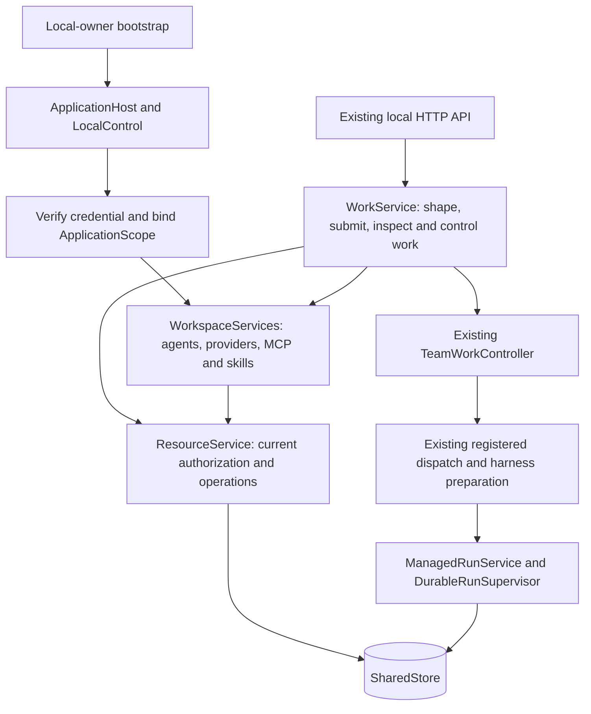

# Scoped workspace services and work lifecycle

The product application separates local-owner startup, workspace capabilities
and work orchestration. This extraction retains the existing resource services,
team-work controller, registered admission and managed execution.

These are ownership boundaries inside the application, not new network services.
Runtime tool mediation, provider transport, inference brokering, egress and
finalization follow the [existing execution path](README.md#current-execution-path).

Assigned-agent collaboration uses the same managed host calls, stable identities,
pinned plan roster, current capability policies and `SharedStore`. Blackboard
topics are deliberate messages, not copies of execution transcripts or implicit
task dependencies. See [the Blackboard boundary and validation record](../epics/v5-reconciliation/sprints/october-2-coordinated-work/blackboard-collaboration-2026-10-09.md).

## Where a change belongs

| Concern | Owner |
|---|---|
| Local default owner/team, default agent setup and startup | [`local_workspace/bootstrap.rs`](../../engine/litho/tetonic-app/src/local_workspace/bootstrap.rs) |
| Credential-bound principal/org/team/context identifiers | [`resources/application_scope.rs`](../../engine/litho/tetonic-app/src/resources/application_scope.rs) |
| Scoped agent configuration, providers and capability libraries | [`workspace/`](../../engine/litho/tetonic-app/src/workspace/mod.rs) |
| Work submission and cancellation | [`work/submission.rs`](../../engine/litho/tetonic-app/src/work/submission.rs) |
| Shaping, plans, continuation and human work questions | [`work/`](../../engine/litho/tetonic-app/src/work/mod.rs) |
| Product snapshots and task projections | [`work/inspection.rs`](../../engine/litho/tetonic-app/src/work/inspection.rs) |
| Eligibility and parallel dispatch loop | [`team_work_controller.rs`](../../engine/litho/tetonic-app/src/team_work_controller.rs), using [`WorkService`'s host implementation](../../engine/litho/tetonic-app/src/work/plan_execution/controller.rs) |
| Presentation notes, lead and roster metadata persistence | [`work_metadata.rs`](../../engine/strata/tetonic-memory/src/control/work_metadata.rs), through resource authorization |
| Actual run/task/attempt lifecycle and outcome | Existing [managed execution owner](ownership.md#managed-execution-and-recovery) |

`local_workspace::LocalWorkspace` remains a public alias for `WorkService`.
Existing Rust imports, HTTP payloads and UI callers remain compatible. Explicit
forwarders in [`work/capabilities.rs`](../../engine/litho/tetonic-app/src/work/capabilities.rs)
preserve the old capability-management API while delegating to its scoped owner.
They do not duplicate configuration or create another manager.

## Scope and authorization

`LocalControl::application_scope` verifies the caller's credential, checks team
access, and resolves the existing authorized participation context. Its returned
`ApplicationScope` has private fields, read-only accessors and no deserialization
or public unchecked constructor.

`WorkspaceServices::bind` validates the credential against that scope and installs
scope-bound skill and MCP services onto the prepared host. Work and capability
methods use these identifiers rather than embedded local owner/org/team strings.
`authorized_scope` rechecks the credential, current team access and principal
binding. Resource calls still authorize their specific action; storage retains
its membership and transaction checks. A scope value grants no authority by itself.

Existing synchronous capability views and background execution retain their
existing registry/store and execution-lease authorization contracts. This change
does not make every in-memory view a fresh credential check, or promise immediate
revocation of an effect that was already admitted.

Plan assignments continue to carry their accepted context, agent revision and
execution bindings. Work admission uses the existing managed path. Independent
assignments still run concurrently subject to dependencies, budget and capacity;
the shared application mutex covers admission/configuration changes, not model
execution. The existing controller owns scheduling, and managed execution owns
leases, cancellation and results.

## Proposal allowance checks

The application validates proposals before saving a Guide proposal, capturing a
structured planning reply, saving an edited revision, or accepting a new agreement.
[`work/plan_validation.rs`](../../engine/litho/tetonic-app/src/work/plan_validation.rs)
shares the coordination, workspace-total and per-agent allowance checks with
execution readiness. Coordination is the existing plan total minus its worker
allocations; it must stay within the configured coordination range. No additional
budget field, reservation, automatic allocation rewrite or execution path is added.

The Guide's proposal schema and name resolution use the discussion's saved roster.
Invalid allocation or roster choices are rejected before the Guide writes its
shared brief. The existing managed tool result returns the problem within the
current reply's budget. Saved proposal receipts expose total, worker and
coordination tokens and explicitly say they are not reserved. Missing access and
provider setup remain separate readiness issues in the existing review flow.

Exact retries preserve the saved revision/agreement and the storage request
fingerprint checks after limits change. Current readiness and Start still check
the current limits, including for proposals saved before these checks existed.
This is validation, not the separately planned, durable one-attempt planner repair
policy; it does not guarantee a model will correct an invalid proposal.

## Durable coordinator dispatch

The controller records a dispatch tool call before admitting its assignments and
records the exact response before returning it to the model. Its
[`receipts.rs`](../../engine/litho/tetonic-app/src/team_work_controller/receipts.rs)
adapter uses the existing store's
[`huddle_execution/dispatch.rs`](../../engine/strata/tetonic-memory/src/control/huddle_execution/dispatch.rs).
Receipts bind the approved execution, coordinator attempt, tool-call ID, ordered
assignment selection, current executor lease and stop generation. Changed retries
conflict; completed retries replay their saved response without worker admission
or rereading a newer contribution.

The managed parent handle rechecks original credential and execution authority;
the store checks the current journal fence in the receipt transaction. A serialized
receipt never authorizes execution or restoration. The live finish guard advances
only after the response is saved and only for contributions contained in it.
Failed writes keep that guard intact; a retry reconciles existing child state.

Schema **71** adds scoped dispatch receipts through the existing upgrade/backup
path. Schema **72** protects an immutable checkpoint reference in each new receipt.
Before child admission, the controller saves the exact pending call and general
harness state in the existing protected artifact store, through
[`managed/checkpoint.rs`](../../engine/mantle/tetonic-run/src/managed/checkpoint.rs).
Checkpoint version two records received host-call IDs, arguments and response
digests separately from compactable model messages. The controller reconstructs
its delivery guard by matching those records against scoped durable responses.
Completed work alone cannot count as received; historical responses absent from
the checkpoint cannot silently advance the guard. Changed state, a missing artifact
or a failed reference write denies dispatch before worker admission.

Pending requests, checkpoints and completed responses survive storage reopen. This
does not yet restore a team after process loss: child quiescence, subtree ownership,
bounded human response horizons and resume accounting still need integration.
Existing guards against unsupported subtree restoration remain in place. See
[the receipt evidence](../epics/v5-reconciliation/sprints/october-2-coordinated-work/durable-dispatch-2026-10-08.md)
and [checkpoint follow-on](../epics/v5-reconciliation/sprints/october-2-coordinated-work/coordinator-checkpoints-2026-10-08.md).

## Metadata migration

Previously, `local_work_notes` keyed notes/status/lead/roster data by work ID alone.
Work items themselves are keyed by organization, security team and work ID.
Schema **70** gives the presentation metadata that same composite key and a
foreign key to its owning work item. Reads require team participation and an
existing scoped work item; writes additionally require team management authority.
Updates patch supplied fields atomically and preserve omitted fields.

The upgrade migrates both the old notes-only table and the later full-field table.
A legacy record is copied only when its work ID has exactly one existing
organization/team binding. Duplicate IDs and orphaned metadata remain in the
legacy table for explicit recovery, without guessing which team should see them.
Existing legacy rows are retained. The migration runs once under the store's
existing upgrade/backup machinery. Older schema writers must not open the upgraded
database; rollback requires the preserved pre-upgrade database/backup.

Product reads and writes use the scoped table. Missing metadata on an existing
work item means empty/default presentation fields. Storage/authorization errors
are propagated rather than reported as empty notes or a successful save. Legacy
unscoped store methods remain available for compatibility/migration, but are no
longer on this product path. Presentation status still cannot establish a managed
execution outcome.

## Evidence and limits

- [Application scope tests](../../engine/litho/tetonic-app/src/work/scope_tests.rs)
  cover non-default principals/teams, identical work IDs in separate teams,
  foreign access, credential mismatch/revocation, membership removal and reopen,
  plus managed execution with scoped grants and idempotent retry.
- [Metadata tests](../../engine/strata/tetonic-memory/src/control/work_metadata.rs)
  cover both legacy layouts, ambiguity preservation, patch behavior and isolation.
- [Source boundary checks](../../engine/litho/tetonic-app/tests/scope04_boundaries.rs)
  prevent local identifiers or lifecycle behavior from returning to the wrong module.
- Existing behavior tests moved with their owners, preserving parallel execution,
  provider/tool/MCP, human-wait, cancellation and process-recovery coverage.

The product still bootstraps a local owner, one organization/team and default
agents. Provider keys and default model preferences remain host/database-wide;
this is not tenant-isolated provider-account management. The default Guide and
coordinator names remain product conventions. This is groundwork for explicit
scope, not a general multi-user server, distributed work service or new public
scope-switching interface. Local-owner compatibility methods are not a complete
remote permission model. There are no UI changes in this step.

## Guide proposal correction (October 9, 2026)

Guide proposal writes now compose the existing brief and huddle stores in one
transaction. Schema 75 retains at most one correction after an invalid allocation
per Guide turn, with exact retries and unchanged scope/total enforced in storage.
The same managed Guide reply performs the correction; it does not start another
inference run or dispatch work. See [proposal correction](../epics/v5-reconciliation/sprints/october-first-use-repair/guide-proposal-correction-2026-10-09.md).

## Capability permissions (October 9, 2026)

The local workspace now exposes additional permission ceilings in workspace
settings and the saved agent/team editors. They use the existing authenticated
resource service, registered harness, action broker, and human approval records.
There is no alternate tool executor or model-only permission check.

`GET/POST /api/local/capability-policies` reads or versions workspace, work-team,
and stable agent-identity policies within the current application scope. Only
the security team's owner can save them. Saves require a request UUID and the
previous revision; exact retries return the original receipt and stale edits
conflict. Schema 73 stores immutable revisions in `capability_policy_versions`.
Removing a local override creates a null-policy revision rather than deleting
history. Existing databases start with no additional restrictions.

Presets are Automatic, Ask before changes, and Read files only. File reading,
file changes, command execution, and MCP connection calls can each override the
preset with automatic/ask/blocked. Each explicit level is a ceiling: the most
restrictive applicable decision wins. These are **not** unlocked defaults that
a child can override. Resource access continues to come from existing working
folder, selected tool, connection, disclosure, and host grants. An Automatic
choice never widens those grants or overrides mandatory shell approval.

`WorkCapabilityPolicy` resolves the workspace and stable agent identity from the
host-authorized execution, and the work team from persisted roster bindings.
Dispatched plan work resolves its source conversation's roster. Joining a team
does not rewrite an agent's settings, share private context, or grant tools.
The policy is read for each brokered action; lookup failures deny execution.
Limits tightened during an approval wait are checked again before issuing a
one-use action capability. This is not cancellation of already-running effects.

The existing exact shell-approval record now also carries file and connection
proposals. Its optional `tool` field preserves old shell receipt digests when
absent. Human review includes the exact tool arguments, working folder or pinned
MCP endpoint, and action identity; approval remains bound to a live work attempt
and is consumed once. Canonical parameters also carry an optional tool name in
the digest. MCP's existing endpoint/manifest binding remains enforced, alongside
the explicit tool identity. File and MCP requests appear in the existing decision
UI with action wording; shell confinement disclosures remain unchanged.

This slice does not add arbitrary per-path/domain grants, full-machine access,
approval-based widening of working folders, or an organization-wide policy
administration service. Agent policies here are scoped to the local application
workspace. New agents and teams inherit workspace limits; their individual
overrides are available after creation. The four capability groups cover the
brokered external file, command and MCP actions; they are not a policy language
for inference, budgets, scoped recall, planning or every internal engine service.

Behavioral coverage lives in the capability-policy tests in `tetonic-policy`,
`tetonic-runtime`, `tetonic-memory`, and the application's provider tests, plus
`web/tests/capability-policy.test.tsx` and the decision experience tests.
