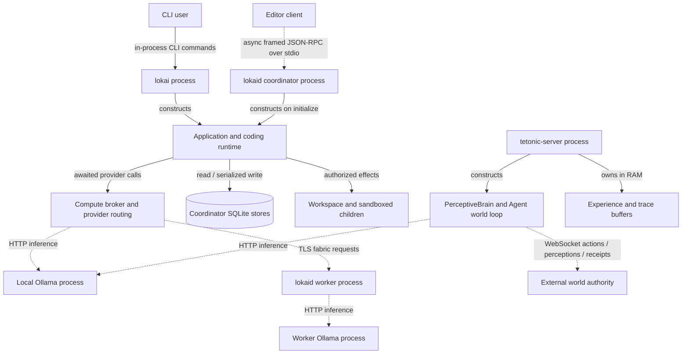

# Tetonic Engine: as-built architecture

**Source snapshot:** `0f722054c691ee90f57391fe8e9fafbe9a99a108`, branch `feature/domain-pack-decoupling`, repository `C:/Users/Mark Miller/Desktop/repos/lokai`. Analysis date: 2026-09-25. Tracked implementation files were clean at capture. Pre-existing untracked `docs/design/` and the sprint-6 Village integration directory are outside this snapshot and were not used as evidence. This package is a documentation-only addition.

## Read this first

Tetonic is a Rust workspace with **32 packages and several distinct execution paths**. The CLI and editor daemon assemble a coding-oriented application around sessions, agent turns, a durable run supervisor, policy-controlled tools, context retrieval, and inference that can reach enrolled remote workers. A separate `tetonic-server` executable runs one configured agent against a WebSocket world. That executable uses the shared agent/brain/adapter contracts but does **not** construct the application's durable run, compute-broker, session, or fleet machinery. Library implementations for organizations, squads, fleet supervision, keeper registration, and agent checkpoints exist; their presence does not establish a deployed distributed standing-agent service. These are implementation boundaries, not a proposed architecture. Evidence: [lib.rs — `pub struct Application`](../../../engine/litho/tetonic-app/src/lib.rs#L124), [compute_plane.rs — `pub struct ComputePlane`](../../../engine/litho/tetonic-app/src/compute_plane.rs#L29), [main.rs — `async fn main`](../../../engine/mantle/tetonic-server/src/main.rs#L75), [fleet_api.rs — `pub struct FleetManager`](../../../engine/litho/tetonic-app/src/fleet_api.rs#L102).

The most important ownership distinction is between **durable job execution**, **live conversational execution**, and **world interaction**. A run projection is not a live agent; a session's conversation is not a durable run journal; a world receipt is not a transaction in Tetonic's SQLite database. Each has its own failure and recovery boundary. [service.rs — `pub struct DurableRunSupervisor`](../../../engine/mantle/tetonic-run/src/service.rs#L51), [session_live.rs — `pub struct LiveSession`](../../../engine/litho/tetonic-app/src/session_live.rs#L29), [websocket_adapter.rs — `struct Request`](../../../engine/core/tetonic-runtime/src/websocket_adapter.rs#L17).

## Navigation

1. [Entrypoints and composition](entrypoints.md): every Cargo binary, startup branches, scripts, shutdown.
2. [Execution paths](execution.md): finite agent turns, local/remote inference, tools, world decisions and receipts.
3. [State and persistence](state.md): ownership, transitions, leases, replay, restart and memory.
   [Supporting subsystem details](subsystems.md): context, tools, indexing, artifacts, transactions, capacity, security and telemetry.
4. [Interfaces and operations](operations.md): protocols, configuration, security, queues, cancellation and observability.
5. [Disconnected implementations and limits](limits.md): code that exists without corresponding production wiring; unresolved guarantees.
6. [Package and module atlas](atlas.md): all packages, direct manifest edges, source modules and declarations.
7. [Coverage and verification](verification.md): scope, methodology, checks and unresolved work.
8. [Evidence index](evidence.md), [file ledger](coverage.csv), [storage declarations](storage-tables.json), [machine-readable source atlas](source-atlas.json).

## System context — level 0

Solid arrows describe local calls, construction, or ownership as labeled; dashed arrows describe asynchronous process transports, not a delivery guarantee. Cylinder denotes durable storage; the RAM node is volatile. The shared Application node represents a common composition pattern, **not** a singleton shared across CLI and daemon processes. The world, its physics, and its rendering client are external to this repository's authority. Evidence: [main.rs — `async fn main`](../../../engine/litho/lokai-cli/src/main.rs#L34), [main.rs — `async fn serve`](../../../engine/litho/lokaid/src/main.rs#L88), [node_worker.rs — `pub async fn run_node_serve`](../../../engine/litho/tetonic-app/src/node_worker.rs#L135), [main.rs — `let brain`](../../../engine/mantle/tetonic-server/src/main.rs#L157), [websocket_adapter.rs — `pub fn connect`](../../../engine/core/tetonic-runtime/src/websocket_adapter.rs#L38).

## Implementation layers — level 1

| Workspace area | Implementation responsibility | Important distinction |
|---|---|---|
| `core` | Domain contracts; finite/world agent loops; policy, secrets, telemetry; runtime assembly; sandbox and workspace transactions | Shared contracts do not force every executable through the same composition root. |
| `strata` | SQLite stores, content-addressed artifacts, code index and context compilation | Durable stores and volatile prompt memory are separate. |
| `mantle` | Compute brokerage, durable runs, orchestration, capacity, enrollment, node ingress, standalone world server | Worker inference is wired; keeper/fleet standing-agent distribution is not equivalently wired. |
| `atmos` | Inference and egress, fabric client/protocol, editor RPC | Network protocols and local stdio are different trust boundaries. |
| `litho` | Application assembly, coding tools, LSP, CLI and daemon | Much of the operational product remains coding-workspace oriented. |
| `tooling` | Architecture checks, evaluations and benchmarks | These executables verify or measure selected behavior; they are not services. |

This table groups actual package locations; [the atlas](atlas.md) is the complete manifest-derived dependency view. Directory layering alone is not proof of an enforced runtime boundary.

## Accuracy boundary

Every one of the **959 baseline tracked files** has an explicit ledger disposition and hash. All applicable text artifacts were scanned in full for declarations and control/storage markers. Selected implementation paths were then read and traced substantively. **A lexical scan is not semantic review of every statement.** This package does not claim complete formal verification, a resolved whole-program call graph, cross-platform sandbox certification, or a live distributed/Village end-to-end test. Remaining uncertainties are recorded rather than filled in from design documents. See [verification](verification.md).
