# Package and module atlas

[Overview](README.md) · [Coverage](coverage.csv) · [Evidence](evidence.md)

Generated from Cargo metadata and whole-file lexical extraction. Dependency arrows mean **declared local package dependencies**, not runtime calls or network traffic. `dev` and optional dependencies are labeled. Source declarations include test/cfg code and are not proof of production reachability. Ownership, failure handling and operational wiring are described in the narrative; unresolved leaf behavior remains mechanical coverage.

## tetonic-core

Manifest: [engine/core/tetonic-core/Cargo.toml](../../../engine/core/tetonic-core/Cargo.toml).

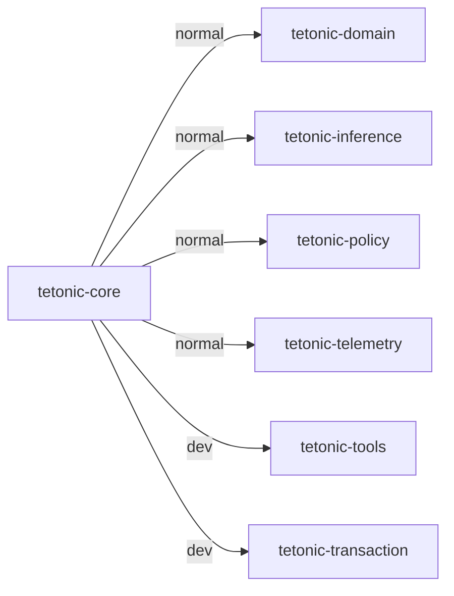

This package-level graph is entirely local build configuration; it has no persistence or process semantics. Evidence is the linked manifest and [packages.json](packages.json).

| Target | Kind | Entry source |
|---|---|---|
| tetonic_core | lib | [engine/core/tetonic-core/src/lib.rs](../../../engine/core/tetonic-core/src/lib.rs) |
| aud01_characterization | test | [engine/core/tetonic-core/tests/aud01_characterization.rs](../../../engine/core/tetonic-core/tests/aud01_characterization.rs) |
| sub04_loop | test | [engine/core/tetonic-core/tests/sub04_loop.rs](../../../engine/core/tetonic-core/tests/sub04_loop.rs) |

| Source file | Declarations (lexical) | Control/storage markers |
|---|---:|---:|
| [src/agent.rs](../../../engine/core/tetonic-core/src/agent.rs) | 150 | 95 |
| [src/blocking_work_tests.rs](../../../engine/core/tetonic-core/src/blocking_work_tests.rs) | 11 | 23 |
| [src/checkpoint.rs](../../../engine/core/tetonic-core/src/checkpoint.rs) | 13 | 1 |
| [src/config.rs](../../../engine/core/tetonic-core/src/config.rs) | 5 | 0 |
| [src/context.rs](../../../engine/core/tetonic-core/src/context.rs) | 2 | 0 |
| [src/conversation.rs](../../../engine/core/tetonic-core/src/conversation.rs) | 13 | 0 |
| [src/demuxer.rs](../../../engine/core/tetonic-core/src/demuxer.rs) | 13 | 1 |
| [src/error.rs](../../../engine/core/tetonic-core/src/error.rs) | 2 | 0 |
| [src/filter.rs](../../../engine/core/tetonic-core/src/filter.rs) | 8 | 1 |
| [src/hooks.rs](../../../engine/core/tetonic-core/src/hooks.rs) | 17 | 0 |
| [src/inference_binding.rs](../../../engine/core/tetonic-core/src/inference_binding.rs) | 2 | 0 |
| [src/lib.rs](../../../engine/core/tetonic-core/src/lib.rs) | 14 | 0 |
| [src/monitor.rs](../../../engine/core/tetonic-core/src/monitor.rs) | 18 | 1 |
| [src/step.rs](../../../engine/core/tetonic-core/src/step.rs) | 2 | 0 |
| [src/tokenizer.rs](../../../engine/core/tetonic-core/src/tokenizer.rs) | 9 | 0 |
| [src/turn.rs](../../../engine/core/tetonic-core/src/turn.rs) | 10 | 1 |
| [tests/aud01_characterization.rs](../../../engine/core/tetonic-core/tests/aud01_characterization.rs) | 8 | 0 |
| [tests/sub04_loop.rs](../../../engine/core/tetonic-core/tests/sub04_loop.rs) | 6 | 5 |

## tetonic-domain

Manifest: [engine/core/tetonic-domain/Cargo.toml](../../../engine/core/tetonic-domain/Cargo.toml).

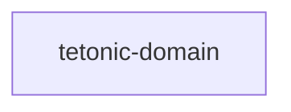

This package-level graph is entirely local build configuration; it has no persistence or process semantics. Evidence is the linked manifest and [packages.json](packages.json).

| Target | Kind | Entry source |
|---|---|---|
| tetonic_domain | lib | [engine/core/tetonic-domain/src/lib.rs](../../../engine/core/tetonic-domain/src/lib.rs) |

| Source file | Declarations (lexical) | Control/storage markers |
|---|---:|---:|
| [src/artifact.rs](../../../engine/core/tetonic-domain/src/artifact.rs) | 25 | 0 |
| [src/brain.rs](../../../engine/core/tetonic-domain/src/brain.rs) | 16 | 0 |
| [src/canonical.rs](../../../engine/core/tetonic-domain/src/canonical.rs) | 14 | 1 |
| [src/charter.rs](../../../engine/core/tetonic-domain/src/charter.rs) | 18 | 1 |
| [src/checkpoint.rs](../../../engine/core/tetonic-domain/src/checkpoint.rs) | 8 | 1 |
| [src/classify.rs](../../../engine/core/tetonic-domain/src/classify.rs) | 20 | 1 |
| [src/code_index.rs](../../../engine/core/tetonic-domain/src/code_index.rs) | 15 | 0 |
| [src/context_compiler.rs](../../../engine/core/tetonic-domain/src/context_compiler.rs) | 8 | 0 |
| [src/dispatch.rs](../../../engine/core/tetonic-domain/src/dispatch.rs) | 10 | 0 |
| [src/engine_config.rs](../../../engine/core/tetonic-domain/src/engine_config.rs) | 42 | 22 |
| [src/execution.rs](../../../engine/core/tetonic-domain/src/execution.rs) | 26 | 1 |
| [src/failure.rs](../../../engine/core/tetonic-domain/src/failure.rs) | 20 | 0 |
| [src/idempotency.rs](../../../engine/core/tetonic-domain/src/idempotency.rs) | 8 | 1 |
| [src/identity.rs](../../../engine/core/tetonic-domain/src/identity.rs) | 7 | 1 |
| [src/ids.rs](../../../engine/core/tetonic-domain/src/ids.rs) | 4 | 1 |
| [src/invocation.rs](../../../engine/core/tetonic-domain/src/invocation.rs) | 15 | 1 |
| [src/key_storage.rs](../../../engine/core/tetonic-domain/src/key_storage.rs) | 10 | 0 |
| [src/lib.rs](../../../engine/core/tetonic-domain/src/lib.rs) | 30 | 0 |
| [src/lsp_session.rs](../../../engine/core/tetonic-domain/src/lsp_session.rs) | 7 | 0 |
| [src/perception.rs](../../../engine/core/tetonic-domain/src/perception.rs) | 18 | 1 |
| [src/placement.rs](../../../engine/core/tetonic-domain/src/placement.rs) | 16 | 0 |
| [src/policy.rs](../../../engine/core/tetonic-domain/src/policy.rs) | 3 | 0 |
| [src/result_integrity.rs](../../../engine/core/tetonic-domain/src/result_integrity.rs) | 11 | 0 |
| [src/run.rs](../../../engine/core/tetonic-domain/src/run.rs) | 50 | 0 |
| [src/secrets.rs](../../../engine/core/tetonic-domain/src/secrets.rs) | 9 | 1 |
| [src/sinks.rs](../../../engine/core/tetonic-domain/src/sinks.rs) | 21 | 0 |
| [src/tool_host.rs](../../../engine/core/tetonic-domain/src/tool_host.rs) | 31 | 1 |
| [src/trust.rs](../../../engine/core/tetonic-domain/src/trust.rs) | 3 | 0 |
| [src/work_scope.rs](../../../engine/core/tetonic-domain/src/work_scope.rs) | 14 | 3 |
| [src/workspace.rs](../../../engine/core/tetonic-domain/src/workspace.rs) | 29 | 0 |
| [src/world_adapter.rs](../../../engine/core/tetonic-domain/src/world_adapter.rs) | 29 | 8 |

## tetonic-inference

Manifest: [engine/atmos/tetonic-inference/Cargo.toml](../../../engine/atmos/tetonic-inference/Cargo.toml).

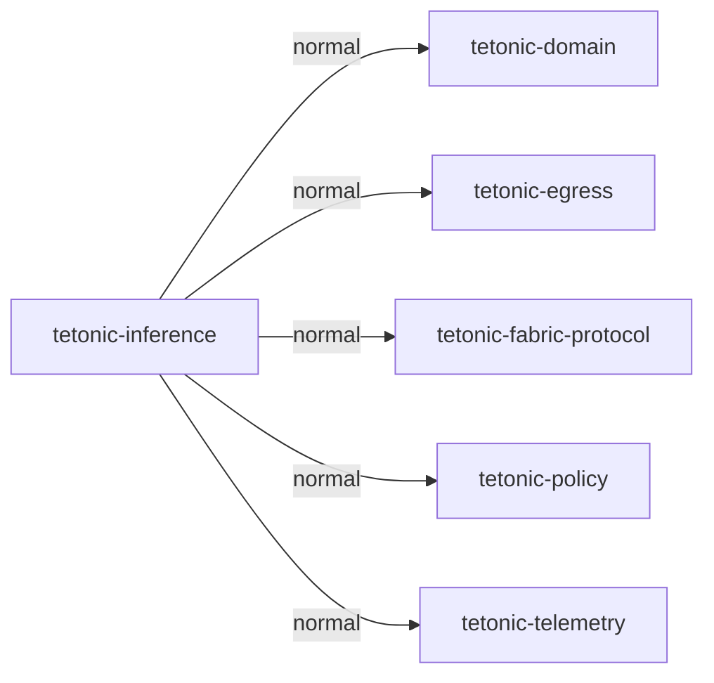

This package-level graph is entirely local build configuration; it has no persistence or process semantics. Evidence is the linked manifest and [packages.json](packages.json).

| Target | Kind | Entry source |
|---|---|---|
| tetonic_inference | lib | [engine/atmos/tetonic-inference/src/lib.rs](../../../engine/atmos/tetonic-inference/src/lib.rs) |

| Source file | Declarations (lexical) | Control/storage markers |
|---|---:|---:|
| [src/attempt.rs](../../../engine/atmos/tetonic-inference/src/attempt.rs) | 39 | 3 |
| [src/compute_registry.rs](../../../engine/atmos/tetonic-inference/src/compute_registry.rs) | 22 | 6 |
| [src/decoupled.rs](../../../engine/atmos/tetonic-inference/src/decoupled.rs) | 28 | 49 |
| [src/dispatch.rs](../../../engine/atmos/tetonic-inference/src/dispatch.rs) | 33 | 1 |
| [src/fabric.rs](../../../engine/atmos/tetonic-inference/src/fabric.rs) | 22 | 1 |
| [src/fabric_node_provider.rs](../../../engine/atmos/tetonic-inference/src/fabric_node_provider.rs) | 11 | 0 |
| [src/hosted.rs](../../../engine/atmos/tetonic-inference/src/hosted.rs) | 30 | 8 |
| [src/hosted/anthropic.rs](../../../engine/atmos/tetonic-inference/src/hosted/anthropic.rs) | 10 | 1 |
| [src/hosted/openai.rs](../../../engine/atmos/tetonic-inference/src/hosted/openai.rs) | 4 | 0 |
| [src/hosted/registry.rs](../../../engine/atmos/tetonic-inference/src/hosted/registry.rs) | 12 | 4 |
| [src/hosted/tests.rs](../../../engine/atmos/tetonic-inference/src/hosted/tests.rs) | 22 | 10 |
| [src/hosted/wire.rs](../../../engine/atmos/tetonic-inference/src/hosted/wire.rs) | 2 | 0 |
| [src/lib.rs](../../../engine/atmos/tetonic-inference/src/lib.rs) | 116 | 77 |
| [src/performance_tests.rs](../../../engine/atmos/tetonic-inference/src/performance_tests.rs) | 9 | 26 |
| [src/placement.rs](../../../engine/atmos/tetonic-inference/src/placement.rs) | 4 | 0 |
| [src/placement_engine.rs](../../../engine/atmos/tetonic-inference/src/placement_engine.rs) | 27 | 1 |
| [src/pooled.rs](../../../engine/atmos/tetonic-inference/src/pooled.rs) | 164 | 52 |
| [src/residency.rs](../../../engine/atmos/tetonic-inference/src/residency.rs) | 5 | 11 |
| [src/snapshot_tests.rs](../../../engine/atmos/tetonic-inference/src/snapshot_tests.rs) | 17 | 24 |
| [src/warmup_tests.rs](../../../engine/atmos/tetonic-inference/src/warmup_tests.rs) | 11 | 33 |
| [src/worker_eligibility.rs](../../../engine/atmos/tetonic-inference/src/worker_eligibility.rs) | 13 | 1 |

## tetonic-egress

Manifest: [engine/atmos/tetonic-egress/Cargo.toml](../../../engine/atmos/tetonic-egress/Cargo.toml).


This package-level graph is entirely local build configuration; it has no persistence or process semantics. Evidence is the linked manifest and [packages.json](packages.json).

| Target | Kind | Entry source |
|---|---|---|
| tetonic_egress | lib | [engine/atmos/tetonic-egress/src/lib.rs](../../../engine/atmos/tetonic-egress/src/lib.rs) |

| Source file | Declarations (lexical) | Control/storage markers |
|---|---:|---:|
| [src/hosted.rs](../../../engine/atmos/tetonic-egress/src/hosted.rs) | 26 | 14 |
| [src/lib.rs](../../../engine/atmos/tetonic-egress/src/lib.rs) | 51 | 58 |
| [src/ndjson.rs](../../../engine/atmos/tetonic-egress/src/ndjson.rs) | 9 | 1 |
| [src/pinned_tls.rs](../../../engine/atmos/tetonic-egress/src/pinned_tls.rs) | 9 | 0 |

## tetonic-fabric-protocol

Manifest: [engine/atmos/tetonic-fabric-protocol/Cargo.toml](../../../engine/atmos/tetonic-fabric-protocol/Cargo.toml).

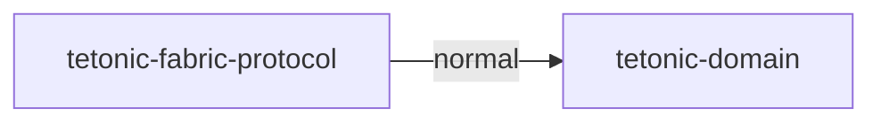

This package-level graph is entirely local build configuration; it has no persistence or process semantics. Evidence is the linked manifest and [packages.json](packages.json).

| Target | Kind | Entry source |
|---|---|---|
| tetonic_fabric_protocol | lib | [engine/atmos/tetonic-fabric-protocol/src/lib.rs](../../../engine/atmos/tetonic-fabric-protocol/src/lib.rs) |
| capability_conformance | test | [engine/atmos/tetonic-fabric-protocol/tests/capability_conformance.rs](../../../engine/atmos/tetonic-fabric-protocol/tests/capability_conformance.rs) |
| conformance | test | [engine/atmos/tetonic-fabric-protocol/tests/conformance.rs](../../../engine/atmos/tetonic-fabric-protocol/tests/conformance.rs) |
| fuzz_decode | test | [engine/atmos/tetonic-fabric-protocol/tests/fuzz_decode.rs](../../../engine/atmos/tetonic-fabric-protocol/tests/fuzz_decode.rs) |
| result_integrity | test | [engine/atmos/tetonic-fabric-protocol/tests/result_integrity.rs](../../../engine/atmos/tetonic-fabric-protocol/tests/result_integrity.rs) |

| Source file | Declarations (lexical) | Control/storage markers |
|---|---:|---:|
| [src/bounds.rs](../../../engine/atmos/tetonic-fabric-protocol/src/bounds.rs) | 5 | 0 |
| [src/cancellation.rs](../../../engine/atmos/tetonic-fabric-protocol/src/cancellation.rs) | 8 | 0 |
| [src/canonical.rs](../../../engine/atmos/tetonic-fabric-protocol/src/canonical.rs) | 13 | 0 |
| [src/capabilities.rs](../../../engine/atmos/tetonic-fabric-protocol/src/capabilities.rs) | 3 | 0 |
| [src/capability_document.rs](../../../engine/atmos/tetonic-fabric-protocol/src/capability_document.rs) | 23 | 0 |
| [src/capability_metrics.rs](../../../engine/atmos/tetonic-fabric-protocol/src/capability_metrics.rs) | 2 | 0 |
| [src/capability_model_match.rs](../../../engine/atmos/tetonic-fabric-protocol/src/capability_model_match.rs) | 10 | 1 |
| [src/capability_probes.rs](../../../engine/atmos/tetonic-fabric-protocol/src/capability_probes.rs) | 25 | 0 |
| [src/capability_registry.rs](../../../engine/atmos/tetonic-fabric-protocol/src/capability_registry.rs) | 40 | 1 |
| [src/capability_summary.rs](../../../engine/atmos/tetonic-fabric-protocol/src/capability_summary.rs) | 3 | 0 |
| [src/capability_validate.rs](../../../engine/atmos/tetonic-fabric-protocol/src/capability_validate.rs) | 6 | 0 |
| [src/decode.rs](../../../engine/atmos/tetonic-fabric-protocol/src/decode.rs) | 2 | 0 |
| [src/envelope.rs](../../../engine/atmos/tetonic-fabric-protocol/src/envelope.rs) | 6 | 0 |
| [src/error.rs](../../../engine/atmos/tetonic-fabric-protocol/src/error.rs) | 3 | 0 |
| [src/ingress.rs](../../../engine/atmos/tetonic-fabric-protocol/src/ingress.rs) | 13 | 0 |
| [src/job.rs](../../../engine/atmos/tetonic-fabric-protocol/src/job.rs) | 11 | 0 |
| [src/lease.rs](../../../engine/atmos/tetonic-fabric-protocol/src/lease.rs) | 2 | 0 |
| [src/lib.rs](../../../engine/atmos/tetonic-fabric-protocol/src/lib.rs) | 25 | 0 |
| [src/lifecycle.rs](../../../engine/atmos/tetonic-fabric-protocol/src/lifecycle.rs) | 16 | 0 |
| [src/negotiation.rs](../../../engine/atmos/tetonic-fabric-protocol/src/negotiation.rs) | 3 | 0 |
| [src/result.rs](../../../engine/atmos/tetonic-fabric-protocol/src/result.rs) | 10 | 0 |
| [src/result_crypto.rs](../../../engine/atmos/tetonic-fabric-protocol/src/result_crypto.rs) | 7 | 0 |
| [src/result_disposition.rs](../../../engine/atmos/tetonic-fabric-protocol/src/result_disposition.rs) | 6 | 0 |
| [src/result_keys.rs](../../../engine/atmos/tetonic-fabric-protocol/src/result_keys.rs) | 8 | 0 |
| [src/result_validate.rs](../../../engine/atmos/tetonic-fabric-protocol/src/result_validate.rs) | 5 | 0 |
| [src/validate.rs](../../../engine/atmos/tetonic-fabric-protocol/src/validate.rs) | 19 | 0 |
| [tests/capability_conformance.rs](../../../engine/atmos/tetonic-fabric-protocol/tests/capability_conformance.rs) | 26 | 0 |
| [tests/conformance.rs](../../../engine/atmos/tetonic-fabric-protocol/tests/conformance.rs) | 28 | 0 |
| [tests/fuzz_decode.rs](../../../engine/atmos/tetonic-fabric-protocol/tests/fuzz_decode.rs) | 2 | 0 |
| [tests/result_integrity.rs](../../../engine/atmos/tetonic-fabric-protocol/tests/result_integrity.rs) | 20 | 0 |

## tetonic-policy

Manifest: [engine/core/tetonic-policy/Cargo.toml](../../../engine/core/tetonic-policy/Cargo.toml).

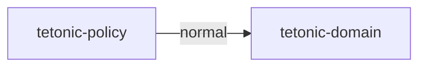

This package-level graph is entirely local build configuration; it has no persistence or process semantics. Evidence is the linked manifest and [packages.json](packages.json).

| Target | Kind | Entry source |
|---|---|---|
| tetonic_policy | lib | [engine/core/tetonic-policy/src/lib.rs](../../../engine/core/tetonic-policy/src/lib.rs) |

| Source file | Declarations (lexical) | Control/storage markers |
|---|---:|---:|
| [src/classify.rs](../../../engine/core/tetonic-policy/src/classify.rs) | 29 | 1 |
| [src/dispatch.rs](../../../engine/core/tetonic-policy/src/dispatch.rs) | 20 | 1 |
| [src/engine.rs](../../../engine/core/tetonic-policy/src/engine.rs) | 37 | 10 |
| [src/fabric.rs](../../../engine/core/tetonic-policy/src/fabric.rs) | 3 | 0 |
| [src/hosted.rs](../../../engine/core/tetonic-policy/src/hosted.rs) | 5 | 1 |
| [src/lib.rs](../../../engine/core/tetonic-policy/src/lib.rs) | 11 | 1 |
| [src/mode.rs](../../../engine/core/tetonic-policy/src/mode.rs) | 3 | 0 |
| [src/placement.rs](../../../engine/core/tetonic-policy/src/placement.rs) | 14 | 1 |
| [src/shell.rs](../../../engine/core/tetonic-policy/src/shell.rs) | 5 | 1 |

## tetonic-telemetry

Manifest: [engine/core/tetonic-telemetry/Cargo.toml](../../../engine/core/tetonic-telemetry/Cargo.toml).

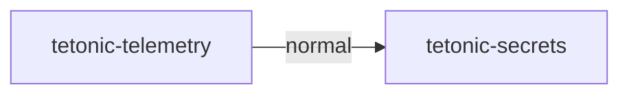

This package-level graph is entirely local build configuration; it has no persistence or process semantics. Evidence is the linked manifest and [packages.json](packages.json).

| Target | Kind | Entry source |
|---|---|---|
| tetonic_telemetry | lib | [engine/core/tetonic-telemetry/src/lib.rs](../../../engine/core/tetonic-telemetry/src/lib.rs) |
| integration_tests | test | [engine/core/tetonic-telemetry/tests/integration_tests.rs](../../../engine/core/tetonic-telemetry/tests/integration_tests.rs) |
| m6_3_timing_matrix | test | [engine/core/tetonic-telemetry/tests/m6_3_timing_matrix.rs](../../../engine/core/tetonic-telemetry/tests/m6_3_timing_matrix.rs) |

| Source file | Declarations (lexical) | Control/storage markers |
|---|---:|---:|
| [src/context.rs](../../../engine/core/tetonic-telemetry/src/context.rs) | 10 | 1 |
| [src/event.rs](../../../engine/core/tetonic-telemetry/src/event.rs) | 2 | 0 |
| [src/fault.rs](../../../engine/core/tetonic-telemetry/src/fault.rs) | 1 | 1 |
| [src/lib.rs](../../../engine/core/tetonic-telemetry/src/lib.rs) | 10 | 0 |
| [src/performance.rs](../../../engine/core/tetonic-telemetry/src/performance.rs) | 7 | 0 |
| [src/propagation.rs](../../../engine/core/tetonic-telemetry/src/propagation.rs) | 10 | 4 |
| [src/sampling.rs](../../../engine/core/tetonic-telemetry/src/sampling.rs) | 8 | 1 |
| [src/sanitization.rs](../../../engine/core/tetonic-telemetry/src/sanitization.rs) | 12 | 0 |
| [src/spans.rs](../../../engine/core/tetonic-telemetry/src/spans.rs) | 7 | 0 |
| [src/storage.rs](../../../engine/core/tetonic-telemetry/src/storage.rs) | 19 | 6 |
| [src/timing.rs](../../../engine/core/tetonic-telemetry/src/timing.rs) | 22 | 1 |
| [tests/integration_tests.rs](../../../engine/core/tetonic-telemetry/tests/integration_tests.rs) | 9 | 3 |
| [tests/m6_3_timing_matrix.rs](../../../engine/core/tetonic-telemetry/tests/m6_3_timing_matrix.rs) | 12 | 0 |

## tetonic-secrets

Manifest: [engine/core/tetonic-secrets/Cargo.toml](../../../engine/core/tetonic-secrets/Cargo.toml).

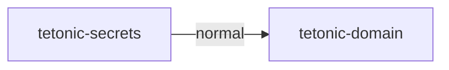

This package-level graph is entirely local build configuration; it has no persistence or process semantics. Evidence is the linked manifest and [packages.json](packages.json).

| Target | Kind | Entry source |
|---|---|---|
| tetonic_secrets | lib | [engine/core/tetonic-secrets/src/lib.rs](../../../engine/core/tetonic-secrets/src/lib.rs) |

| Source file | Declarations (lexical) | Control/storage markers |
|---|---:|---:|
| [src/detectors.rs](../../../engine/core/tetonic-secrets/src/detectors.rs) | 15 | 1 |
| [src/eval.rs](../../../engine/core/tetonic-secrets/src/eval.rs) | 4 | 2 |
| [src/key_storage.rs](../../../engine/core/tetonic-secrets/src/key_storage.rs) | 14 | 9 |
| [src/key_storage/linux.rs](../../../engine/core/tetonic-secrets/src/key_storage/linux.rs) | 6 | 1 |
| [src/lib.rs](../../../engine/core/tetonic-secrets/src/lib.rs) | 14 | 1 |
| [src/override_scope.rs](../../../engine/core/tetonic-secrets/src/override_scope.rs) | 5 | 0 |
| [src/private_file.rs](../../../engine/core/tetonic-secrets/src/private_file.rs) | 6 | 7 |
| [src/scanner.rs](../../../engine/core/tetonic-secrets/src/scanner.rs) | 17 | 13 |
| [src/tests.rs](../../../engine/core/tetonic-secrets/src/tests.rs) | 32 | 40 |
| [src/types.rs](../../../engine/core/tetonic-secrets/src/types.rs) | 14 | 0 |

## tetonic-tools

Manifest: [engine/litho/tetonic-tools/Cargo.toml](../../../engine/litho/tetonic-tools/Cargo.toml).

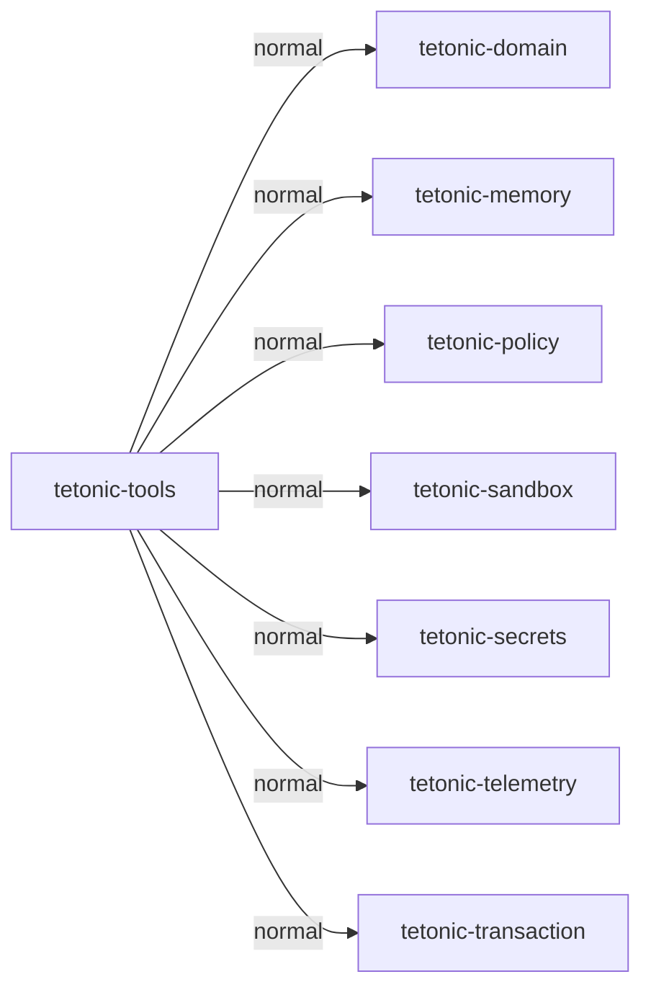

This package-level graph is entirely local build configuration; it has no persistence or process semantics. Evidence is the linked manifest and [packages.json](packages.json).

| Target | Kind | Entry source |
|---|---|---|
| tetonic_tools | lib | [engine/litho/tetonic-tools/src/lib.rs](../../../engine/litho/tetonic-tools/src/lib.rs) |
| exec_tests | test | [engine/litho/tetonic-tools/tests/exec_tests.rs](../../../engine/litho/tetonic-tools/tests/exec_tests.rs) |
| process_executor_tests | test | [engine/litho/tetonic-tools/tests/process_executor_tests.rs](../../../engine/litho/tetonic-tools/tests/process_executor_tests.rs) |

| Source file | Declarations (lexical) | Control/storage markers |
|---|---:|---:|
| [src/cancellation_tests.rs](../../../engine/litho/tetonic-tools/src/cancellation_tests.rs) | 8 | 6 |
| [src/catalog.rs](../../../engine/litho/tetonic-tools/src/catalog.rs) | 6 | 0 |
| [src/exec.rs](../../../engine/litho/tetonic-tools/src/exec.rs) | 0 | 0 |
| [src/host.rs](../../../engine/litho/tetonic-tools/src/host.rs) | 9 | 0 |
| [src/integration_tests.rs](../../../engine/litho/tetonic-tools/src/integration_tests.rs) | 20 | 17 |
| [src/lib.rs](../../../engine/litho/tetonic-tools/src/lib.rs) | 74 | 6 |
| [src/lsp.rs](../../../engine/litho/tetonic-tools/src/lsp.rs) | 17 | 3 |
| [src/lsp_ownership_tests.rs](../../../engine/litho/tetonic-tools/src/lsp_ownership_tests.rs) | 19 | 1 |
| [src/mutation.rs](../../../engine/litho/tetonic-tools/src/mutation.rs) | 32 | 5 |
| [src/orchestration.rs](../../../engine/litho/tetonic-tools/src/orchestration.rs) | 3 | 0 |
| [src/process_broker_m2_tests.rs](../../../engine/litho/tetonic-tools/src/process_broker_m2_tests.rs) | 8 | 14 |
| [src/process_executor.rs](../../../engine/litho/tetonic-tools/src/process_executor.rs) | 7 | 0 |
| [src/retrieval.rs](../../../engine/litho/tetonic-tools/src/retrieval.rs) | 5 | 0 |
| [src/sandbox_bridge.rs](../../../engine/litho/tetonic-tools/src/sandbox_bridge.rs) | 0 | 0 |
| [src/sink.rs](../../../engine/litho/tetonic-tools/src/sink.rs) | 2 | 0 |
| [src/types.rs](../../../engine/litho/tetonic-tools/src/types.rs) | 22 | 0 |
| [src/verify.rs](../../../engine/litho/tetonic-tools/src/verify.rs) | 30 | 3 |
| [src/workspace.rs](../../../engine/litho/tetonic-tools/src/workspace.rs) | 15 | 1 |
| [src/worktree.rs](../../../engine/litho/tetonic-tools/src/worktree.rs) | 8 | 9 |
| [tests/exec_tests.rs](../../../engine/litho/tetonic-tools/tests/exec_tests.rs) | 3 | 6 |
| [tests/process_executor_tests.rs](../../../engine/litho/tetonic-tools/tests/process_executor_tests.rs) | 4 | 3 |

## tetonic-memory

Manifest: [engine/strata/tetonic-memory/Cargo.toml](../../../engine/strata/tetonic-memory/Cargo.toml).

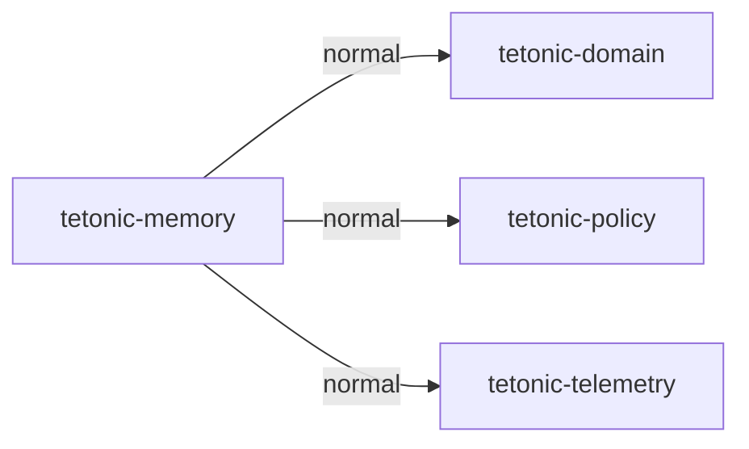

This package-level graph is entirely local build configuration; it has no persistence or process semantics. Evidence is the linked manifest and [packages.json](packages.json).

| Target | Kind | Entry source |
|---|---|---|
| tetonic_memory | lib | [engine/strata/tetonic-memory/src/lib.rs](../../../engine/strata/tetonic-memory/src/lib.rs) |
| h2_2_store_concurrency | test | [engine/strata/tetonic-memory/tests/h2_2_store_concurrency.rs](../../../engine/strata/tetonic-memory/tests/h2_2_store_concurrency.rs) |

| Source file | Declarations (lexical) | Control/storage markers |
|---|---:|---:|
| [src/backup.rs](../../../engine/strata/tetonic-memory/src/backup.rs) | 10 | 2 |
| [src/blob.rs](../../../engine/strata/tetonic-memory/src/blob.rs) | 8 | 1 |
| [src/capability.rs](../../../engine/strata/tetonic-memory/src/capability.rs) | 8 | 8 |
| [src/capacity.rs](../../../engine/strata/tetonic-memory/src/capacity.rs) | 14 | 7 |
| [src/capacity_tables.rs](../../../engine/strata/tetonic-memory/src/capacity_tables.rs) | 0 | 5 |
| [src/compute_reservation.rs](../../../engine/strata/tetonic-memory/src/compute_reservation.rs) | 7 | 5 |
| [src/durability_tests.rs](../../../engine/strata/tetonic-memory/src/durability_tests.rs) | 3 | 4 |
| [src/estate.rs](../../../engine/strata/tetonic-memory/src/estate.rs) | 20 | 13 |
| [src/identity_store.rs](../../../engine/strata/tetonic-memory/src/identity_store.rs) | 5 | 3 |
| [src/lib.rs](../../../engine/strata/tetonic-memory/src/lib.rs) | 100 | 39 |
| [src/migration_tests.rs](../../../engine/strata/tetonic-memory/src/migration_tests.rs) | 15 | 10 |
| [src/payload_digest.rs](../../../engine/strata/tetonic-memory/src/payload_digest.rs) | 6 | 1 |
| [src/policy.rs](../../../engine/strata/tetonic-memory/src/policy.rs) | 26 | 8 |
| [src/projects.rs](../../../engine/strata/tetonic-memory/src/projects.rs) | 19 | 11 |
| [src/recall.rs](../../../engine/strata/tetonic-memory/src/recall.rs) | 17 | 6 |
| [src/result_disposition.rs](../../../engine/strata/tetonic-memory/src/result_disposition.rs) | 10 | 6 |
| [src/run_store.rs](../../../engine/strata/tetonic-memory/src/run_store.rs) | 25 | 7 |
| [src/scheduler_decision.rs](../../../engine/strata/tetonic-memory/src/scheduler_decision.rs) | 8 | 5 |
| [src/schema.rs](../../../engine/strata/tetonic-memory/src/schema.rs) | 19 | 46 |
| [src/secret_overrides.rs](../../../engine/strata/tetonic-memory/src/secret_overrides.rs) | 16 | 10 |
| [src/sync_lock.rs](../../../engine/strata/tetonic-memory/src/sync_lock.rs) | 7 | 13 |
| [src/trust.rs](../../../engine/strata/tetonic-memory/src/trust.rs) | 16 | 10 |
| [src/util.rs](../../../engine/strata/tetonic-memory/src/util.rs) | 8 | 2 |
| [src/worker_store.rs](../../../engine/strata/tetonic-memory/src/worker_store.rs) | 27 | 29 |
| [src/worker_tls.rs](../../../engine/strata/tetonic-memory/src/worker_tls.rs) | 10 | 9 |
| [tests/h2_2_store_concurrency.rs](../../../engine/strata/tetonic-memory/tests/h2_2_store_concurrency.rs) | 4 | 11 |

## tetonic-sandbox

Manifest: [engine/core/tetonic-sandbox/Cargo.toml](../../../engine/core/tetonic-sandbox/Cargo.toml).

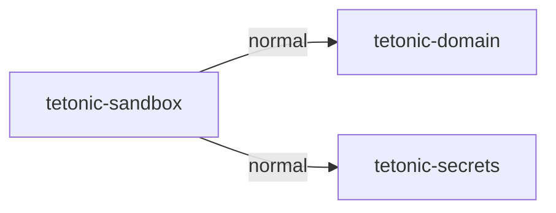

This package-level graph is entirely local build configuration; it has no persistence or process semantics. Evidence is the linked manifest and [packages.json](packages.json).

| Target | Kind | Entry source |
|---|---|---|
| tetonic_sandbox | lib | [engine/core/tetonic-sandbox/src/lib.rs](../../../engine/core/tetonic-sandbox/src/lib.rs) |
| tetonic-sandbox-adv | bin | [engine/core/tetonic-sandbox/bins/adversarial_runner.rs](../../../engine/core/tetonic-sandbox/bins/adversarial_runner.rs) |
| adversarial | test | [engine/core/tetonic-sandbox/tests/adversarial.rs](../../../engine/core/tetonic-sandbox/tests/adversarial.rs) |
| audit_20260919 | test | [engine/core/tetonic-sandbox/tests/audit_20260919.rs](../../../engine/core/tetonic-sandbox/tests/audit_20260919.rs) |
| h1_3_os_confinement | test | [engine/core/tetonic-sandbox/tests/h1_3_os_confinement.rs](../../../engine/core/tetonic-sandbox/tests/h1_3_os_confinement.rs) |
| process_executor_tests | test | [engine/core/tetonic-sandbox/tests/process_executor_tests.rs](../../../engine/core/tetonic-sandbox/tests/process_executor_tests.rs) |
| unix_lifecycle | test | [engine/core/tetonic-sandbox/tests/unix_lifecycle.rs](../../../engine/core/tetonic-sandbox/tests/unix_lifecycle.rs) |

| Source file | Declarations (lexical) | Control/storage markers |
|---|---:|---:|
| [bins/adversarial_runner.rs](../../../engine/core/tetonic-sandbox/bins/adversarial_runner.rs) | 14 | 15 |
| [src/backend/linux.rs](../../../engine/core/tetonic-sandbox/src/backend/linux.rs) | 11 | 4 |
| [src/backend/linux_fs.rs](../../../engine/core/tetonic-sandbox/src/backend/linux_fs.rs) | 4 | 25 |
| [src/backend/linux_net.rs](../../../engine/core/tetonic-sandbox/src/backend/linux_net.rs) | 3 | 0 |
| [src/backend/macos.rs](../../../engine/core/tetonic-sandbox/src/backend/macos.rs) | 18 | 6 |
| [src/backend/mod.rs](../../../engine/core/tetonic-sandbox/src/backend/mod.rs) | 23 | 15 |
| [src/backend/unix_common.rs](../../../engine/core/tetonic-sandbox/src/backend/unix_common.rs) | 17 | 23 |
| [src/backend/windows.rs](../../../engine/core/tetonic-sandbox/src/backend/windows.rs) | 44 | 15 |
| [src/backend/windows_cancel.rs](../../../engine/core/tetonic-sandbox/src/backend/windows_cancel.rs) | 2 | 0 |
| [src/backend/windows_net.rs](../../../engine/core/tetonic-sandbox/src/backend/windows_net.rs) | 9 | 1 |
| [src/backend/windows_net_tests.rs](../../../engine/core/tetonic-sandbox/src/backend/windows_net_tests.rs) | 3 | 0 |
| [src/backend/windows_tests.rs](../../../engine/core/tetonic-sandbox/src/backend/windows_tests.rs) | 4 | 15 |
| [src/exec.rs](../../../engine/core/tetonic-sandbox/src/exec.rs) | 11 | 2 |
| [src/lib.rs](../../../engine/core/tetonic-sandbox/src/lib.rs) | 14 | 4 |
| [src/output.rs](../../../engine/core/tetonic-sandbox/src/output.rs) | 10 | 7 |
| [src/process_executor.rs](../../../engine/core/tetonic-sandbox/src/process_executor.rs) | 48 | 15 |
| [src/process_service.rs](../../../engine/core/tetonic-sandbox/src/process_service.rs) | 4 | 5 |
| [src/profiles.rs](../../../engine/core/tetonic-sandbox/src/profiles.rs) | 9 | 5 |
| [src/sandbox_bridge.rs](../../../engine/core/tetonic-sandbox/src/sandbox_bridge.rs) | 11 | 3 |
| [src/sync_service.rs](../../../engine/core/tetonic-sandbox/src/sync_service.rs) | 22 | 27 |
| [src/types.rs](../../../engine/core/tetonic-sandbox/src/types.rs) | 35 | 20 |
| [tests/adversarial.rs](../../../engine/core/tetonic-sandbox/tests/adversarial.rs) | 20 | 38 |
| [tests/audit_20260919.rs](../../../engine/core/tetonic-sandbox/tests/audit_20260919.rs) | 5 | 6 |
| [tests/h1_3_os_confinement.rs](../../../engine/core/tetonic-sandbox/tests/h1_3_os_confinement.rs) | 10 | 19 |
| [tests/process_executor_tests.rs](../../../engine/core/tetonic-sandbox/tests/process_executor_tests.rs) | 21 | 21 |
| [tests/support/pipe_holder.rs](../../../engine/core/tetonic-sandbox/tests/support/pipe_holder.rs) | 1 | 2 |
| [tests/support/process_cancellation.rs](../../../engine/core/tetonic-sandbox/tests/support/process_cancellation.rs) | 10 | 24 |
| [tests/unix_lifecycle.rs](../../../engine/core/tetonic-sandbox/tests/unix_lifecycle.rs) | 16 | 33 |

## tetonic-transaction

Manifest: [engine/core/tetonic-transaction/Cargo.toml](../../../engine/core/tetonic-transaction/Cargo.toml).

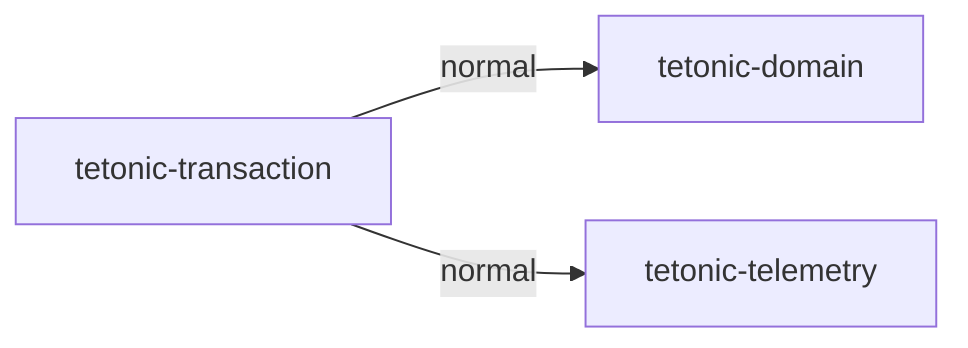

This package-level graph is entirely local build configuration; it has no persistence or process semantics. Evidence is the linked manifest and [packages.json](packages.json).

| Target | Kind | Entry source |
|---|---|---|
| tetonic_transaction | lib | [engine/core/tetonic-transaction/src/lib.rs](../../../engine/core/tetonic-transaction/src/lib.rs) |
| audit_20260919 | test | [engine/core/tetonic-transaction/tests/audit_20260919.rs](../../../engine/core/tetonic-transaction/tests/audit_20260919.rs) |
| matrix | test | [engine/core/tetonic-transaction/tests/matrix.rs](../../../engine/core/tetonic-transaction/tests/matrix.rs) |
| readiness_paths | test | [engine/core/tetonic-transaction/tests/readiness_paths.rs](../../../engine/core/tetonic-transaction/tests/readiness_paths.rs) |

| Source file | Declarations (lexical) | Control/storage markers |
|---|---:|---:|
| [src/commit.rs](../../../engine/core/tetonic-transaction/src/commit.rs) | 10 | 0 |
| [src/diff.rs](../../../engine/core/tetonic-transaction/src/diff.rs) | 2 | 0 |
| [src/error.rs](../../../engine/core/tetonic-transaction/src/error.rs) | 1 | 0 |
| [src/fs_ops.rs](../../../engine/core/tetonic-transaction/src/fs_ops.rs) | 15 | 10 |
| [src/fuzzy_patch.rs](../../../engine/core/tetonic-transaction/src/fuzzy_patch.rs) | 17 | 1 |
| [src/journal.rs](../../../engine/core/tetonic-transaction/src/journal.rs) | 10 | 0 |
| [src/lib.rs](../../../engine/core/tetonic-transaction/src/lib.rs) | 15 | 0 |
| [src/lock.rs](../../../engine/core/tetonic-transaction/src/lock.rs) | 7 | 2 |
| [src/publication.rs](../../../engine/core/tetonic-transaction/src/publication.rs) | 19 | 11 |
| [src/recovery.rs](../../../engine/core/tetonic-transaction/src/recovery.rs) | 6 | 0 |
| [src/security.rs](../../../engine/core/tetonic-transaction/src/security.rs) | 5 | 1 |
| [src/service.rs](../../../engine/core/tetonic-transaction/src/service.rs) | 39 | 3 |
| [src/staging.rs](../../../engine/core/tetonic-transaction/src/staging.rs) | 16 | 0 |
| [src/txn_meta.rs](../../../engine/core/tetonic-transaction/src/txn_meta.rs) | 6 | 0 |
| [src/verify_view.rs](../../../engine/core/tetonic-transaction/src/verify_view.rs) | 2 | 0 |
| [src/version.rs](../../../engine/core/tetonic-transaction/src/version.rs) | 13 | 0 |
| [tests/audit_20260919.rs](../../../engine/core/tetonic-transaction/tests/audit_20260919.rs) | 5 | 1 |
| [tests/matrix.rs](../../../engine/core/tetonic-transaction/tests/matrix.rs) | 43 | 13 |
| [tests/readiness_paths.rs](../../../engine/core/tetonic-transaction/tests/readiness_paths.rs) | 3 | 1 |

## tetonic-runtime

Manifest: [engine/core/tetonic-runtime/Cargo.toml](../../../engine/core/tetonic-runtime/Cargo.toml).

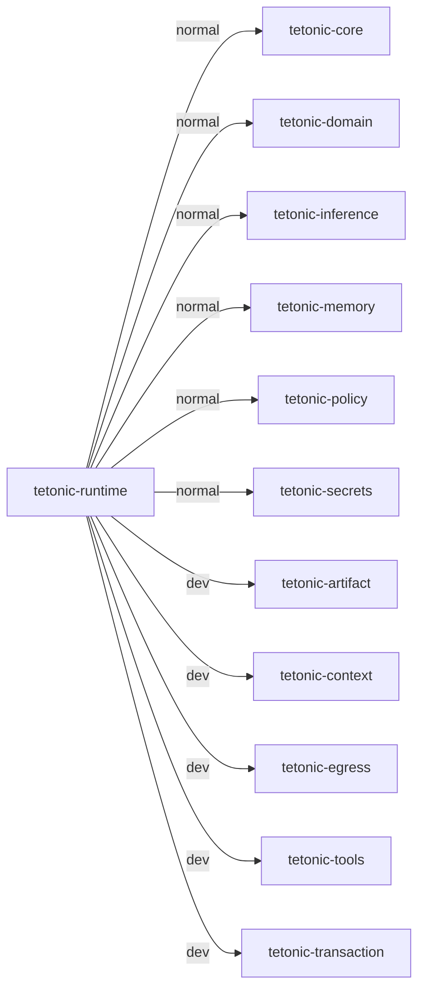

This package-level graph is entirely local build configuration; it has no persistence or process semantics. Evidence is the linked manifest and [packages.json](packages.json).

| Target | Kind | Entry source |
|---|---|---|
| tetonic_runtime | lib | [engine/core/tetonic-runtime/src/lib.rs](../../../engine/core/tetonic-runtime/src/lib.rs) |
| metadata_graph | test | [engine/core/tetonic-runtime/tests/metadata_graph.rs](../../../engine/core/tetonic-runtime/tests/metadata_graph.rs) |
| twp_sanity_soak | test | [engine/core/tetonic-runtime/tests/twp_sanity_soak.rs](../../../engine/core/tetonic-runtime/tests/twp_sanity_soak.rs) |

| Source file | Declarations (lexical) | Control/storage markers |
|---|---:|---:|
| [src/action_broker.rs](../../../engine/core/tetonic-runtime/src/action_broker.rs) | 8 | 3 |
| [src/approval.rs](../../../engine/core/tetonic-runtime/src/approval.rs) | 8 | 0 |
| [src/assembly.rs](../../../engine/core/tetonic-runtime/src/assembly.rs) | 15 | 1 |
| [src/assembly_tests.rs](../../../engine/core/tetonic-runtime/src/assembly_tests.rs) | 18 | 7 |
| [src/audit.rs](../../../engine/core/tetonic-runtime/src/audit.rs) | 6 | 0 |
| [src/brain.rs](../../../engine/core/tetonic-runtime/src/brain.rs) | 28 | 16 |
| [src/build.rs](../../../engine/core/tetonic-runtime/src/build.rs) | 6 | 2 |
| [src/capability_store.rs](../../../engine/core/tetonic-runtime/src/capability_store.rs) | 16 | 7 |
| [src/composite_adapter.rs](../../../engine/core/tetonic-runtime/src/composite_adapter.rs) | 26 | 23 |
| [src/executor.rs](../../../engine/core/tetonic-runtime/src/executor.rs) | 16 | 4 |
| [src/lib.rs](../../../engine/core/tetonic-runtime/src/lib.rs) | 12 | 0 |
| [src/policy.rs](../../../engine/core/tetonic-runtime/src/policy.rs) | 4 | 1 |
| [src/stream_adapter.rs](../../../engine/core/tetonic-runtime/src/stream_adapter.rs) | 21 | 47 |
| [src/websocket_adapter.rs](../../../engine/core/tetonic-runtime/src/websocket_adapter.rs) | 16 | 48 |
| [tests/metadata_graph.rs](../../../engine/core/tetonic-runtime/tests/metadata_graph.rs) | 3 | 0 |
| [tests/twp_sanity_soak.rs](../../../engine/core/tetonic-runtime/tests/twp_sanity_soak.rs) | 8 | 7 |

## tetonic-artifact

Manifest: [engine/strata/tetonic-artifact/Cargo.toml](../../../engine/strata/tetonic-artifact/Cargo.toml).

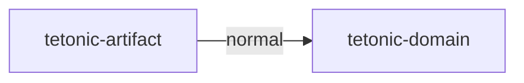

This package-level graph is entirely local build configuration; it has no persistence or process semantics. Evidence is the linked manifest and [packages.json](packages.json).

| Target | Kind | Entry source |
|---|---|---|
| tetonic_artifact | lib | [engine/strata/tetonic-artifact/src/lib.rs](../../../engine/strata/tetonic-artifact/src/lib.rs) |

| Source file | Declarations (lexical) | Control/storage markers |
|---|---:|---:|
| [src/gc.rs](../../../engine/strata/tetonic-artifact/src/gc.rs) | 13 | 2 |
| [src/lib.rs](../../../engine/strata/tetonic-artifact/src/lib.rs) | 5 | 0 |
| [src/publication.rs](../../../engine/strata/tetonic-artifact/src/publication.rs) | 9 | 4 |
| [src/quarantine.rs](../../../engine/strata/tetonic-artifact/src/quarantine.rs) | 20 | 1 |
| [src/store.rs](../../../engine/strata/tetonic-artifact/src/store.rs) | 42 | 23 |
| [src/store_tests.rs](../../../engine/strata/tetonic-artifact/src/store_tests.rs) | 36 | 159 |
| [src/verify.rs](../../../engine/strata/tetonic-artifact/src/verify.rs) | 5 | 12 |

## tetonic-context

Manifest: [engine/strata/tetonic-context/Cargo.toml](../../../engine/strata/tetonic-context/Cargo.toml).

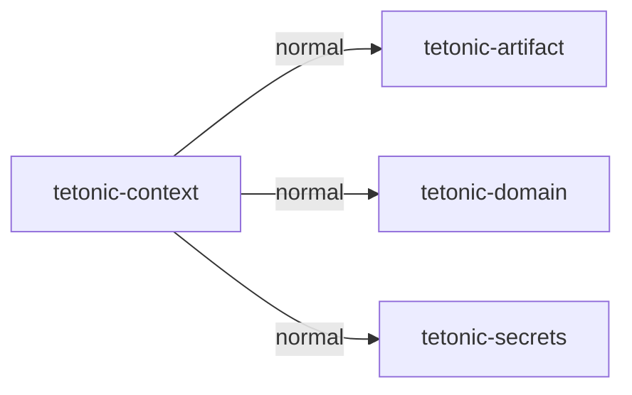

This package-level graph is entirely local build configuration; it has no persistence or process semantics. Evidence is the linked manifest and [packages.json](packages.json).

| Target | Kind | Entry source |
|---|---|---|
| tetonic_context | lib | [engine/strata/tetonic-context/src/lib.rs](../../../engine/strata/tetonic-context/src/lib.rs) |

| Source file | Declarations (lexical) | Control/storage markers |
|---|---:|---:|
| [src/cache.rs](../../../engine/strata/tetonic-context/src/cache.rs) | 13 | 6 |
| [src/interfaces.rs](../../../engine/strata/tetonic-context/src/interfaces.rs) | 14 | 0 |
| [src/lib.rs](../../../engine/strata/tetonic-context/src/lib.rs) | 6 | 1 |
| [src/ownership_tests.rs](../../../engine/strata/tetonic-context/src/ownership_tests.rs) | 15 | 38 |
| [src/pipeline/admission.rs](../../../engine/strata/tetonic-context/src/pipeline/admission.rs) | 5 | 2 |
| [src/pipeline/mod.rs](../../../engine/strata/tetonic-context/src/pipeline/mod.rs) | 27 | 17 |
| [src/pipeline/stage1_normalize.rs](../../../engine/strata/tetonic-context/src/pipeline/stage1_normalize.rs) | 2 | 0 |
| [src/pipeline/stage2_retrieve.rs](../../../engine/strata/tetonic-context/src/pipeline/stage2_retrieve.rs) | 2 | 13 |
| [src/pipeline/stage3_filter.rs](../../../engine/strata/tetonic-context/src/pipeline/stage3_filter.rs) | 6 | 0 |
| [src/pipeline/stage4_rank.rs](../../../engine/strata/tetonic-context/src/pipeline/stage4_rank.rs) | 1 | 0 |
| [src/pipeline/stage5_dedupe.rs](../../../engine/strata/tetonic-context/src/pipeline/stage5_dedupe.rs) | 1 | 0 |
| [src/pipeline/stage6_budget.rs](../../../engine/strata/tetonic-context/src/pipeline/stage6_budget.rs) | 2 | 0 |
| [src/pipeline/stage7_seal.rs](../../../engine/strata/tetonic-context/src/pipeline/stage7_seal.rs) | 2 | 4 |
| [src/restriction_tests.rs](../../../engine/strata/tetonic-context/src/restriction_tests.rs) | 7 | 8 |
| [src/tests.rs](../../../engine/strata/tetonic-context/src/tests.rs) | 88 | 38 |
| [src/types.rs](../../../engine/strata/tetonic-context/src/types.rs) | 25 | 0 |
| [src/workspace.rs](../../../engine/strata/tetonic-context/src/workspace.rs) | 42 | 22 |

## tetonic-broker

Manifest: [engine/mantle/tetonic-broker/Cargo.toml](../../../engine/mantle/tetonic-broker/Cargo.toml).

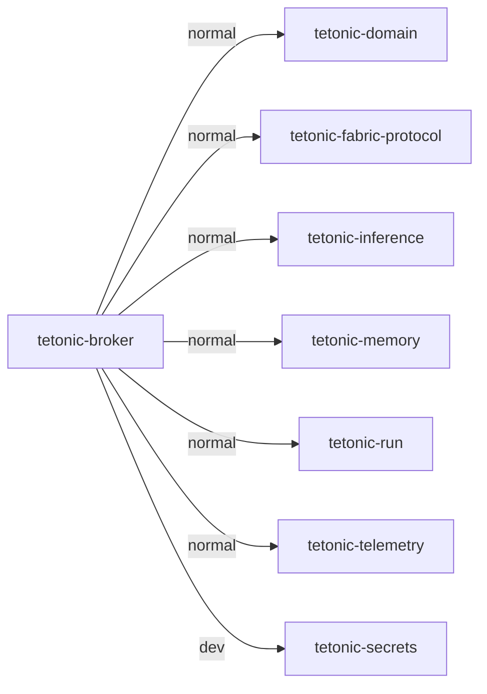

This package-level graph is entirely local build configuration; it has no persistence or process semantics. Evidence is the linked manifest and [packages.json](packages.json).

| Target | Kind | Entry source |
|---|---|---|
| tetonic_broker | lib | [engine/mantle/tetonic-broker/src/lib.rs](../../../engine/mantle/tetonic-broker/src/lib.rs) |
| admission_matrix | test | [engine/mantle/tetonic-broker/tests/admission_matrix.rs](../../../engine/mantle/tetonic-broker/tests/admission_matrix.rs) |
| no_v4_dispatch | test | [engine/mantle/tetonic-broker/tests/no_v4_dispatch.rs](../../../engine/mantle/tetonic-broker/tests/no_v4_dispatch.rs) |
| scheduler_bench | test | [engine/mantle/tetonic-broker/tests/scheduler_bench.rs](../../../engine/mantle/tetonic-broker/tests/scheduler_bench.rs) |
| scheduler_matrix | test | [engine/mantle/tetonic-broker/tests/scheduler_matrix.rs](../../../engine/mantle/tetonic-broker/tests/scheduler_matrix.rs) |

| Source file | Declarations (lexical) | Control/storage markers |
|---|---:|---:|
| [src/adapters/gated_process.rs](../../../engine/mantle/tetonic-broker/src/adapters/gated_process.rs) | 4 | 2 |
| [src/adapters/inference.rs](../../../engine/mantle/tetonic-broker/src/adapters/inference.rs) | 33 | 29 |
| [src/adapters/mod.rs](../../../engine/mantle/tetonic-broker/src/adapters/mod.rs) | 3 | 0 |
| [src/adapters/process.rs](../../../engine/mantle/tetonic-broker/src/adapters/process.rs) | 6 | 2 |
| [src/admission.rs](../../../engine/mantle/tetonic-broker/src/admission.rs) | 18 | 0 |
| [src/broker.rs](../../../engine/mantle/tetonic-broker/src/broker.rs) | 47 | 29 |
| [src/budget.rs](../../../engine/mantle/tetonic-broker/src/budget.rs) | 36 | 3 |
| [src/chat_request.rs](../../../engine/mantle/tetonic-broker/src/chat_request.rs) | 1 | 0 |
| [src/dispatch.rs](../../../engine/mantle/tetonic-broker/src/dispatch.rs) | 13 | 1 |
| [src/job_profile.rs](../../../engine/mantle/tetonic-broker/src/job_profile.rs) | 2 | 0 |
| [src/lib.rs](../../../engine/mantle/tetonic-broker/src/lib.rs) | 13 | 0 |
| [src/metrics.rs](../../../engine/mantle/tetonic-broker/src/metrics.rs) | 21 | 1 |
| [src/persist.rs](../../../engine/mantle/tetonic-broker/src/persist.rs) | 32 | 3 |
| [src/priority.rs](../../../engine/mantle/tetonic-broker/src/priority.rs) | 5 | 0 |
| [src/queue.rs](../../../engine/mantle/tetonic-broker/src/queue.rs) | 13 | 3 |
| [src/scheduler/attempt_lease.rs](../../../engine/mantle/tetonic-broker/src/scheduler/attempt_lease.rs) | 23 | 48 |
| [src/scheduler/calibration.rs](../../../engine/mantle/tetonic-broker/src/scheduler/calibration.rs) | 10 | 3 |
| [src/scheduler/circuit.rs](../../../engine/mantle/tetonic-broker/src/scheduler/circuit.rs) | 9 | 3 |
| [src/scheduler/estimate.rs](../../../engine/mantle/tetonic-broker/src/scheduler/estimate.rs) | 6 | 0 |
| [src/scheduler/failover.rs](../../../engine/mantle/tetonic-broker/src/scheduler/failover.rs) | 9 | 18 |
| [src/scheduler/fallback.rs](../../../engine/mantle/tetonic-broker/src/scheduler/fallback.rs) | 7 | 0 |
| [src/scheduler/hop_placement.rs](../../../engine/mantle/tetonic-broker/src/scheduler/hop_placement.rs) | 10 | 1 |
| [src/scheduler/infer_schedule.rs](../../../engine/mantle/tetonic-broker/src/scheduler/infer_schedule.rs) | 2 | 0 |
| [src/scheduler/mod.rs](../../../engine/mantle/tetonic-broker/src/scheduler/mod.rs) | 13 | 0 |
| [src/scheduler/persist.rs](../../../engine/mantle/tetonic-broker/src/scheduler/persist.rs) | 25 | 5 |
| [src/scheduler/score.rs](../../../engine/mantle/tetonic-broker/src/scheduler/score.rs) | 7 | 1 |
| [src/scheduler/speculate.rs](../../../engine/mantle/tetonic-broker/src/scheduler/speculate.rs) | 5 | 0 |
| [src/scheduler/stamp.rs](../../../engine/mantle/tetonic-broker/src/scheduler/stamp.rs) | 9 | 1 |
| [src/scheduler/types.rs](../../../engine/mantle/tetonic-broker/src/scheduler/types.rs) | 7 | 0 |
| [src/types.rs](../../../engine/mantle/tetonic-broker/src/types.rs) | 11 | 0 |
| [tests/admission_matrix.rs](../../../engine/mantle/tetonic-broker/tests/admission_matrix.rs) | 25 | 20 |
| [tests/no_v4_dispatch.rs](../../../engine/mantle/tetonic-broker/tests/no_v4_dispatch.rs) | 12 | 6 |
| [tests/scheduler_bench.rs](../../../engine/mantle/tetonic-broker/tests/scheduler_bench.rs) | 6 | 0 |
| [tests/scheduler_matrix.rs](../../../engine/mantle/tetonic-broker/tests/scheduler_matrix.rs) | 33 | 3 |

## tetonic-run

Manifest: [engine/mantle/tetonic-run/Cargo.toml](../../../engine/mantle/tetonic-run/Cargo.toml).

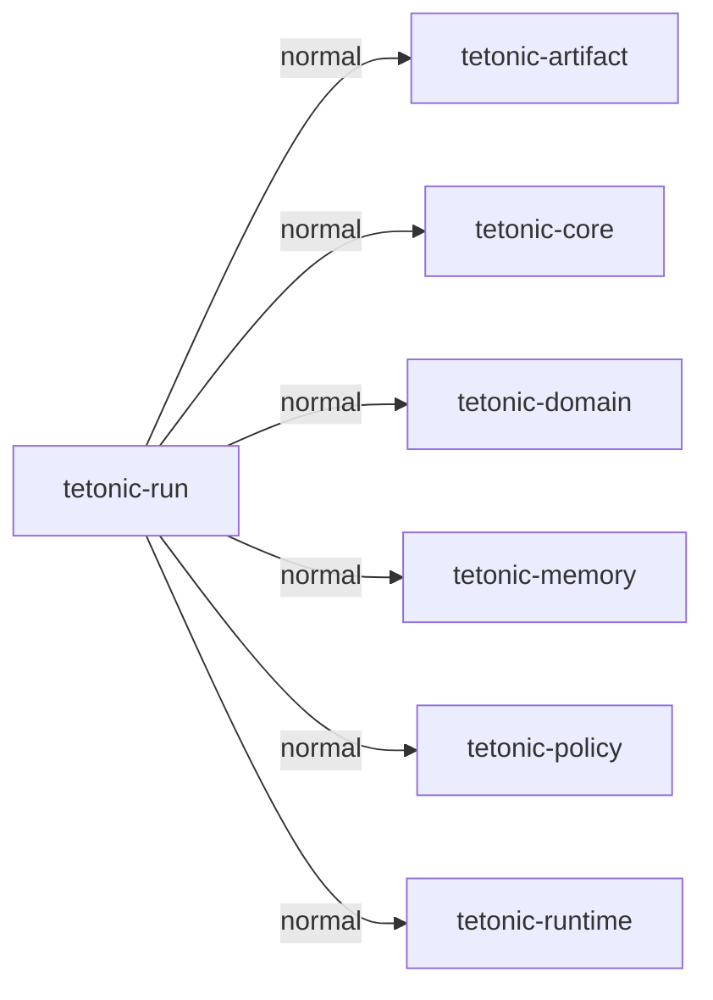

This package-level graph is entirely local build configuration; it has no persistence or process semantics. Evidence is the linked manifest and [packages.json](packages.json).

| Target | Kind | Entry source |
|---|---|---|
| tetonic_run | lib | [engine/mantle/tetonic-run/src/lib.rs](../../../engine/mantle/tetonic-run/src/lib.rs) |
| cmp02_hop | test | [engine/mantle/tetonic-run/tests/cmp02_hop.rs](../../../engine/mantle/tetonic-run/tests/cmp02_hop.rs) |
| execution_claim | test | [engine/mantle/tetonic-run/tests/execution_claim.rs](../../../engine/mantle/tetonic-run/tests/execution_claim.rs) |
| fault_matrix | test | [engine/mantle/tetonic-run/tests/fault_matrix.rs](../../../engine/mantle/tetonic-run/tests/fault_matrix.rs) |
| harness | test | [engine/mantle/tetonic-run/tests/harness.rs](../../../engine/mantle/tetonic-run/tests/harness.rs) |
| legacy_event_replay | test | [engine/mantle/tetonic-run/tests/legacy_event_replay.rs](../../../engine/mantle/tetonic-run/tests/legacy_event_replay.rs) |
| m3_4_tests | test | [engine/mantle/tetonic-run/tests/m3_4_tests.rs](../../../engine/mantle/tetonic-run/tests/m3_4_tests.rs) |
| m6_durable_integrity | test | [engine/mantle/tetonic-run/tests/m6_durable_integrity.rs](../../../engine/mantle/tetonic-run/tests/m6_durable_integrity.rs) |
| managed_service_tests | test | [engine/mantle/tetonic-run/tests/managed_service_tests.rs](../../../engine/mantle/tetonic-run/tests/managed_service_tests.rs) |
| matrix | test | [engine/mantle/tetonic-run/tests/matrix.rs](../../../engine/mantle/tetonic-run/tests/matrix.rs) |
| workfin01_claim | test | [engine/mantle/tetonic-run/tests/workfin01_claim.rs](../../../engine/mantle/tetonic-run/tests/workfin01_claim.rs) |

| Source file | Declarations (lexical) | Control/storage markers |
|---|---:|---:|
| [src/acceptance.rs](../../../engine/mantle/tetonic-run/src/acceptance.rs) | 3 | 0 |
| [src/dag.rs](../../../engine/mantle/tetonic-run/src/dag.rs) | 12 | 1 |
| [src/idempotency.rs](../../../engine/mantle/tetonic-run/src/idempotency.rs) | 7 | 0 |
| [src/identity.rs](../../../engine/mantle/tetonic-run/src/identity.rs) | 5 | 1 |
| [src/infer_admission.rs](../../../engine/mantle/tetonic-run/src/infer_admission.rs) | 12 | 16 |
| [src/lease.rs](../../../engine/mantle/tetonic-run/src/lease.rs) | 6 | 0 |
| [src/lib.rs](../../../engine/mantle/tetonic-run/src/lib.rs) | 17 | 0 |
| [src/managed/admission.rs](../../../engine/mantle/tetonic-run/src/managed/admission.rs) | 5 | 25 |
| [src/managed/attestation.rs](../../../engine/mantle/tetonic-run/src/managed/attestation.rs) | 7 | 5 |
| [src/managed/contracts.rs](../../../engine/mantle/tetonic-run/src/managed/contracts.rs) | 23 | 0 |
| [src/managed/execution.rs](../../../engine/mantle/tetonic-run/src/managed/execution.rs) | 4 | 17 |
| [src/managed/finalization.rs](../../../engine/mantle/tetonic-run/src/managed/finalization.rs) | 3 | 29 |
| [src/managed/lifetime.rs](../../../engine/mantle/tetonic-run/src/managed/lifetime.rs) | 15 | 4 |
| [src/managed/mod.rs](../../../engine/mantle/tetonic-run/src/managed/mod.rs) | 7 | 0 |
| [src/managed/service.rs](../../../engine/mantle/tetonic-run/src/managed/service.rs) | 17 | 35 |
| [src/metrics.rs](../../../engine/mantle/tetonic-run/src/metrics.rs) | 3 | 0 |
| [src/migration.rs](../../../engine/mantle/tetonic-run/src/migration.rs) | 8 | 3 |
| [src/payload_digest.rs](../../../engine/mantle/tetonic-run/src/payload_digest.rs) | 5 | 1 |
| [src/quotas.rs](../../../engine/mantle/tetonic-run/src/quotas.rs) | 6 | 4 |
| [src/recovery.rs](../../../engine/mantle/tetonic-run/src/recovery.rs) | 2 | 0 |
| [src/replay.rs](../../../engine/mantle/tetonic-run/src/replay.rs) | 2 | 0 |
| [src/retry.rs](../../../engine/mantle/tetonic-run/src/retry.rs) | 4 | 1 |
| [src/service.rs](../../../engine/mantle/tetonic-run/src/service.rs) | 37 | 29 |
| [src/side_effect.rs](../../../engine/mantle/tetonic-run/src/side_effect.rs) | 2 | 0 |
| [src/transition.rs](../../../engine/mantle/tetonic-run/src/transition.rs) | 26 | 1 |
| [tests/cmp02_hop.rs](../../../engine/mantle/tetonic-run/tests/cmp02_hop.rs) | 8 | 28 |
| [tests/execution_claim.rs](../../../engine/mantle/tetonic-run/tests/execution_claim.rs) | 2 | 7 |
| [tests/fault_matrix.rs](../../../engine/mantle/tetonic-run/tests/fault_matrix.rs) | 18 | 133 |
| [tests/harness.rs](../../../engine/mantle/tetonic-run/tests/harness.rs) | 17 | 28 |
| [tests/legacy_event_replay.rs](../../../engine/mantle/tetonic-run/tests/legacy_event_replay.rs) | 4 | 3 |
| [tests/m3_4_tests.rs](../../../engine/mantle/tetonic-run/tests/m3_4_tests.rs) | 6 | 15 |
| [tests/m6_durable_integrity.rs](../../../engine/mantle/tetonic-run/tests/m6_durable_integrity.rs) | 10 | 2 |
| [tests/managed_service_tests.rs](../../../engine/mantle/tetonic-run/tests/managed_service_tests.rs) | 33 | 69 |
| [tests/matrix.rs](../../../engine/mantle/tetonic-run/tests/matrix.rs) | 21 | 128 |
| [tests/workfin01_claim.rs](../../../engine/mantle/tetonic-run/tests/workfin01_claim.rs) | 8 | 27 |

## tetonic-capacity

Manifest: [engine/mantle/tetonic-capacity/Cargo.toml](../../../engine/mantle/tetonic-capacity/Cargo.toml).

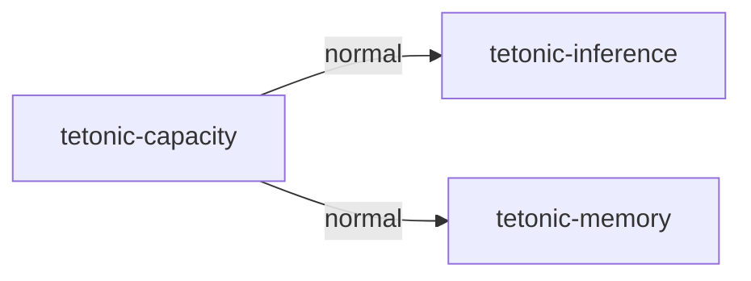

This package-level graph is entirely local build configuration; it has no persistence or process semantics. Evidence is the linked manifest and [packages.json](packages.json).

| Target | Kind | Entry source |
|---|---|---|
| tetonic_capacity | lib | [engine/mantle/tetonic-capacity/src/lib.rs](../../../engine/mantle/tetonic-capacity/src/lib.rs) |

| Source file | Declarations (lexical) | Control/storage markers |
|---|---:|---:|
| [src/applier.rs](../../../engine/mantle/tetonic-capacity/src/applier.rs) | 12 | 4 |
| [src/bench.rs](../../../engine/mantle/tetonic-capacity/src/bench.rs) | 4 | 0 |
| [src/client.rs](../../../engine/mantle/tetonic-capacity/src/client.rs) | 26 | 10 |
| [src/defaults.rs](../../../engine/mantle/tetonic-capacity/src/defaults.rs) | 4 | 3 |
| [src/detect.rs](../../../engine/mantle/tetonic-capacity/src/detect.rs) | 7 | 2 |
| [src/doctor.rs](../../../engine/mantle/tetonic-capacity/src/doctor.rs) | 6 | 1 |
| [src/gates.rs](../../../engine/mantle/tetonic-capacity/src/gates.rs) | 12 | 1 |
| [src/job.rs](../../../engine/mantle/tetonic-capacity/src/job.rs) | 6 | 0 |
| [src/lib.rs](../../../engine/mantle/tetonic-capacity/src/lib.rs) | 19 | 0 |
| [src/microbench.rs](../../../engine/mantle/tetonic-capacity/src/microbench.rs) | 5 | 3 |
| [src/model_fit.rs](../../../engine/mantle/tetonic-capacity/src/model_fit.rs) | 6 | 1 |
| [src/optimizer.rs](../../../engine/mantle/tetonic-capacity/src/optimizer.rs) | 22 | 25 |
| [src/optimizer_residency_tests.rs](../../../engine/mantle/tetonic-capacity/src/optimizer_residency_tests.rs) | 17 | 6 |
| [src/paths.rs](../../../engine/mantle/tetonic-capacity/src/paths.rs) | 3 | 0 |
| [src/probe.rs](../../../engine/mantle/tetonic-capacity/src/probe.rs) | 8 | 1 |
| [src/profile.rs](../../../engine/mantle/tetonic-capacity/src/profile.rs) | 16 | 1 |
| [src/report.rs](../../../engine/mantle/tetonic-capacity/src/report.rs) | 3 | 1 |
| [src/service.rs](../../../engine/mantle/tetonic-capacity/src/service.rs) | 9 | 3 |
| [src/status.rs](../../../engine/mantle/tetonic-capacity/src/status.rs) | 6 | 0 |
| [src/store.rs](../../../engine/mantle/tetonic-capacity/src/store.rs) | 18 | 1 |
| [src/worker.rs](../../../engine/mantle/tetonic-capacity/src/worker.rs) | 16 | 6 |

## tetonic-enroll

Manifest: [engine/mantle/tetonic-enroll/Cargo.toml](../../../engine/mantle/tetonic-enroll/Cargo.toml).

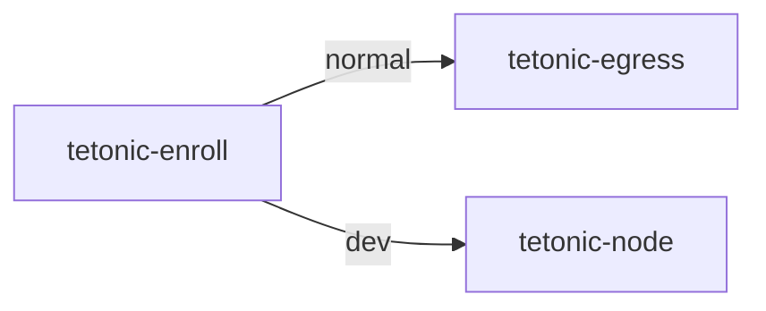

This package-level graph is entirely local build configuration; it has no persistence or process semantics. Evidence is the linked manifest and [packages.json](packages.json).

| Target | Kind | Entry source |
|---|---|---|
| tetonic_enroll | lib | [engine/mantle/tetonic-enroll/src/lib.rs](../../../engine/mantle/tetonic-enroll/src/lib.rs) |

| Source file | Declarations (lexical) | Control/storage markers |
|---|---:|---:|
| [src/bind_policy.rs](../../../engine/mantle/tetonic-enroll/src/bind_policy.rs) | 6 | 2 |
| [src/code.rs](../../../engine/mantle/tetonic-enroll/src/code.rs) | 18 | 2 |
| [src/crypto.rs](../../../engine/mantle/tetonic-enroll/src/crypto.rs) | 15 | 1 |
| [src/egress.rs](../../../engine/mantle/tetonic-enroll/src/egress.rs) | 1 | 0 |
| [src/handshake.rs](../../../engine/mantle/tetonic-enroll/src/handshake.rs) | 20 | 9 |
| [src/http.rs](../../../engine/mantle/tetonic-enroll/src/http.rs) | 10 | 4 |
| [src/lib.rs](../../../engine/mantle/tetonic-enroll/src/lib.rs) | 9 | 0 |
| [src/resolve.rs](../../../engine/mantle/tetonic-enroll/src/resolve.rs) | 5 | 4 |
| [src/server.rs](../../../engine/mantle/tetonic-enroll/src/server.rs) | 17 | 56 |
| [src/tls.rs](../../../engine/mantle/tetonic-enroll/src/tls.rs) | 2 | 0 |

## tetonic-node

Manifest: [engine/mantle/tetonic-node/Cargo.toml](../../../engine/mantle/tetonic-node/Cargo.toml).

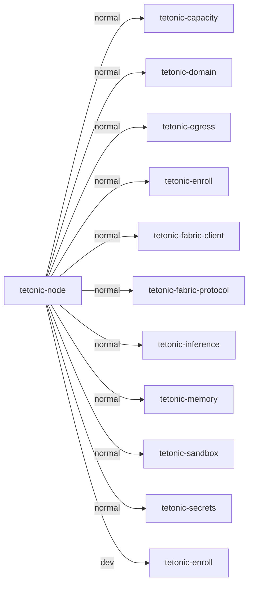

This package-level graph is entirely local build configuration; it has no persistence or process semantics. Evidence is the linked manifest and [packages.json](packages.json).

| Target | Kind | Entry source |
|---|---|---|
| tetonic_node | lib | [engine/mantle/tetonic-node/src/lib.rs](../../../engine/mantle/tetonic-node/src/lib.rs) |
| aud01_characterization | test | [engine/mantle/tetonic-node/tests/aud01_characterization.rs](../../../engine/mantle/tetonic-node/tests/aud01_characterization.rs) |

| Source file | Declarations (lexical) | Control/storage markers |
|---|---:|---:|
| [src/bind.rs](../../../engine/mantle/tetonic-node/src/bind.rs) | 1 | 2 |
| [src/conn.rs](../../../engine/mantle/tetonic-node/src/conn.rs) | 1 | 3 |
| [src/event.rs](../../../engine/mantle/tetonic-node/src/event.rs) | 12 | 6 |
| [src/fabric.rs](../../../engine/mantle/tetonic-node/src/fabric.rs) | 35 | 45 |
| [src/fabric_chat.rs](../../../engine/mantle/tetonic-node/src/fabric_chat.rs) | 25 | 80 |
| [src/ingress_deadline_tests.rs](../../../engine/mantle/tetonic-node/src/ingress_deadline_tests.rs) | 8 | 48 |
| [src/job_ingress.rs](../../../engine/mantle/tetonic-node/src/job_ingress.rs) | 12 | 25 |
| [src/lease_table.rs](../../../engine/mantle/tetonic-node/src/lease_table.rs) | 12 | 3 |
| [src/lib.rs](../../../engine/mantle/tetonic-node/src/lib.rs) | 15 | 0 |
| [src/limits.rs](../../../engine/mantle/tetonic-node/src/limits.rs) | 0 | 0 |
| [src/revoke.rs](../../../engine/mantle/tetonic-node/src/revoke.rs) | 4 | 1 |
| [src/role.rs](../../../engine/mantle/tetonic-node/src/role.rs) | 33 | 1 |
| [src/scheduler.rs](../../../engine/mantle/tetonic-node/src/scheduler.rs) | 39 | 48 |
| [src/server.rs](../../../engine/mantle/tetonic-node/src/server.rs) | 21 | 55 |
| [src/tls.rs](../../../engine/mantle/tetonic-node/src/tls.rs) | 22 | 1 |
| [src/tls_identity.rs](../../../engine/mantle/tetonic-node/src/tls_identity.rs) | 8 | 2 |
| [src/tls_identity/tests.rs](../../../engine/mantle/tetonic-node/src/tls_identity/tests.rs) | 17 | 6 |
| [src/trust.rs](../../../engine/mantle/tetonic-node/src/trust.rs) | 11 | 8 |
| [tests/aud01_characterization.rs](../../../engine/mantle/tetonic-node/tests/aud01_characterization.rs) | 1 | 0 |

## tetonic-fabric-client

Manifest: [engine/atmos/tetonic-fabric-client/Cargo.toml](../../../engine/atmos/tetonic-fabric-client/Cargo.toml).

```mermaid
flowchart LR
  root["tetonic-fabric-client"]
  root -->|normal| d0["tetonic-artifact"]
  root -->|normal| d1["tetonic-domain"]
  root -->|normal| d2["tetonic-egress"]
  root -->|normal| d3["tetonic-enroll"]
  root -->|normal| d4["tetonic-fabric-protocol"]
  root -->|normal| d5["tetonic-inference"]
  root -->|normal| d6["tetonic-memory"]
  root -->|normal| d7["tetonic-telemetry"]
  root -->|normal| d8["tetonic-transaction"]
  root -->|dev| d9["tetonic-run"]
```

This package-level graph is entirely local build configuration; it has no persistence or process semantics. Evidence is the linked manifest and [packages.json](packages.json).

| Target | Kind | Entry source |
|---|---|---|
| tetonic_fabric_client | lib | [engine/atmos/tetonic-fabric-client/src/lib.rs](../../../engine/atmos/tetonic-fabric-client/src/lib.rs) |
| aud01_characterization | test | [engine/atmos/tetonic-fabric-client/tests/aud01_characterization.rs](../../../engine/atmos/tetonic-fabric-client/tests/aud01_characterization.rs) |
| audit_20260919 | test | [engine/atmos/tetonic-fabric-client/tests/audit_20260919.rs](../../../engine/atmos/tetonic-fabric-client/tests/audit_20260919.rs) |
| result_accept_adversarial | test | [engine/atmos/tetonic-fabric-client/tests/result_accept_adversarial.rs](../../../engine/atmos/tetonic-fabric-client/tests/result_accept_adversarial.rs) |

| Source file | Declarations (lexical) | Control/storage markers |
|---|---:|---:|
| [src/capability_registry.rs](../../../engine/atmos/tetonic-fabric-client/src/capability_registry.rs) | 0 | 0 |
| [src/client.rs](../../../engine/atmos/tetonic-fabric-client/src/client.rs) | 26 | 19 |
| [src/disposition_persist.rs](../../../engine/atmos/tetonic-fabric-client/src/disposition_persist.rs) | 11 | 0 |
| [src/legacy.rs](../../../engine/atmos/tetonic-fabric-client/src/legacy.rs) | 54 | 48 |
| [src/legacy_adapter.rs](../../../engine/atmos/tetonic-fabric-client/src/legacy_adapter.rs) | 11 | 1 |
| [src/legacy_result.rs](../../../engine/atmos/tetonic-fabric-client/src/legacy_result.rs) | 46 | 16 |
| [src/legacy_tests.rs](../../../engine/atmos/tetonic-fabric-client/src/legacy_tests.rs) | 17 | 10 |
| [src/lib.rs](../../../engine/atmos/tetonic-fabric-client/src/lib.rs) | 15 | 0 |
| [src/lifecycle_client.rs](../../../engine/atmos/tetonic-fabric-client/src/lifecycle_client.rs) | 8 | 1 |
| [src/memory_persist.rs](../../../engine/atmos/tetonic-fabric-client/src/memory_persist.rs) | 12 | 3 |
| [src/owner_activity.rs](../../../engine/atmos/tetonic-fabric-client/src/owner_activity.rs) | 4 | 2 |
| [src/protocol.rs](../../../engine/atmos/tetonic-fabric-client/src/protocol.rs) | 13 | 1 |
| [src/result_accept.rs](../../../engine/atmos/tetonic-fabric-client/src/result_accept.rs) | 9 | 0 |
| [src/result_sign.rs](../../../engine/atmos/tetonic-fabric-client/src/result_sign.rs) | 3 | 0 |
| [src/run_bridge.rs](../../../engine/atmos/tetonic-fabric-client/src/run_bridge.rs) | 3 | 0 |
| [src/tls_handshake.rs](../../../engine/atmos/tetonic-fabric-client/src/tls_handshake.rs) | 10 | 1 |
| [src/verification.rs](../../../engine/atmos/tetonic-fabric-client/src/verification.rs) | 12 | 0 |
| [tests/aud01_characterization.rs](../../../engine/atmos/tetonic-fabric-client/tests/aud01_characterization.rs) | 5 | 1 |
| [tests/audit_20260919.rs](../../../engine/atmos/tetonic-fabric-client/tests/audit_20260919.rs) | 6 | 0 |
| [tests/common/patch_pipeline.rs](../../../engine/atmos/tetonic-fabric-client/tests/common/patch_pipeline.rs) | 3 | 0 |
| [tests/result_accept_adversarial.rs](../../../engine/atmos/tetonic-fabric-client/tests/result_accept_adversarial.rs) | 25 | 0 |

## tetonic-orchestrator

Manifest: [engine/mantle/tetonic-orchestrator/Cargo.toml](../../../engine/mantle/tetonic-orchestrator/Cargo.toml).

```mermaid
flowchart LR
  root["tetonic-orchestrator"]
  root -->|normal| d0["tetonic-context"]
  root -->|normal| d1["tetonic-core"]
  root -->|normal| d2["tetonic-domain"]
  root -->|normal| d3["tetonic-inference"]
  root -->|normal| d4["tetonic-memory"]
  root -->|normal| d5["tetonic-policy"]
  root -->|dev| d6["tetonic-index"]
  root -->|dev| d7["tetonic-runtime"]
  root -->|dev| d8["tetonic-tools"]
  root -->|dev| d9["tetonic-transaction"]
```

This package-level graph is entirely local build configuration; it has no persistence or process semantics. Evidence is the linked manifest and [packages.json](packages.json).

| Target | Kind | Entry source |
|---|---|---|
| tetonic_orchestrator | lib | [engine/mantle/tetonic-orchestrator/src/lib.rs](../../../engine/mantle/tetonic-orchestrator/src/lib.rs) |
| aud01_characterization | test | [engine/mantle/tetonic-orchestrator/tests/aud01_characterization.rs](../../../engine/mantle/tetonic-orchestrator/tests/aud01_characterization.rs) |

| Source file | Declarations (lexical) | Control/storage markers |
|---|---:|---:|
| [src/briefing.rs](../../../engine/mantle/tetonic-orchestrator/src/briefing.rs) | 14 | 1 |
| [src/critic.rs](../../../engine/mantle/tetonic-orchestrator/src/critic.rs) | 19 | 1 |
| [src/domain_pack.rs](../../../engine/mantle/tetonic-orchestrator/src/domain_pack.rs) | 7 | 0 |
| [src/fleet.rs](../../../engine/mantle/tetonic-orchestrator/src/fleet.rs) | 28 | 9 |
| [src/fleet_supervisor.rs](../../../engine/mantle/tetonic-orchestrator/src/fleet_supervisor.rs) | 35 | 21 |
| [src/handoff.rs](../../../engine/mantle/tetonic-orchestrator/src/handoff.rs) | 10 | 1 |
| [src/host.rs](../../../engine/mantle/tetonic-orchestrator/src/host.rs) | 16 | 0 |
| [src/lib.rs](../../../engine/mantle/tetonic-orchestrator/src/lib.rs) | 18 | 2 |
| [src/router.rs](../../../engine/mantle/tetonic-orchestrator/src/router.rs) | 31 | 2 |
| [src/router_llm.rs](../../../engine/mantle/tetonic-orchestrator/src/router_llm.rs) | 7 | 2 |
| [src/run.rs](../../../engine/mantle/tetonic-orchestrator/src/run.rs) | 24 | 4 |
| [src/security_fixture_tests.rs](../../../engine/mantle/tetonic-orchestrator/src/security_fixture_tests.rs) | 6 | 3 |
| [src/spawn.rs](../../../engine/mantle/tetonic-orchestrator/src/spawn.rs) | 5 | 1 |
| [src/spawn_budget.rs](../../../engine/mantle/tetonic-orchestrator/src/spawn_budget.rs) | 14 | 1 |
| [src/spawn_host.rs](../../../engine/mantle/tetonic-orchestrator/src/spawn_host.rs) | 5 | 5 |
| [src/spawn_session.rs](../../../engine/mantle/tetonic-orchestrator/src/spawn_session.rs) | 9 | 9 |
| [src/specialist.rs](../../../engine/mantle/tetonic-orchestrator/src/specialist.rs) | 42 | 8 |
| [src/turn.rs](../../../engine/mantle/tetonic-orchestrator/src/turn.rs) | 16 | 13 |
| [src/turn_tests.rs](../../../engine/mantle/tetonic-orchestrator/src/turn_tests.rs) | 32 | 21 |
| [tests/aud01_characterization.rs](../../../engine/mantle/tetonic-orchestrator/tests/aud01_characterization.rs) | 24 | 0 |

## tetonic-index

Manifest: [engine/strata/tetonic-index/Cargo.toml](../../../engine/strata/tetonic-index/Cargo.toml).

```mermaid
flowchart LR
  root["tetonic-index"]
  root -->|normal| d0["tetonic-domain"]
```

This package-level graph is entirely local build configuration; it has no persistence or process semantics. Evidence is the linked manifest and [packages.json](packages.json).

| Target | Kind | Entry source |
|---|---|---|
| tetonic_index | lib | [engine/strata/tetonic-index/src/lib.rs](../../../engine/strata/tetonic-index/src/lib.rs) |

| Source file | Declarations (lexical) | Control/storage markers |
|---|---:|---:|
| [src/host.rs](../../../engine/strata/tetonic-index/src/host.rs) | 11 | 0 |
| [src/lib.rs](../../../engine/strata/tetonic-index/src/lib.rs) | 28 | 36 |
| [src/parse.rs](../../../engine/strata/tetonic-index/src/parse.rs) | 9 | 0 |
| [src/query.rs](../../../engine/strata/tetonic-index/src/query.rs) | 12 | 0 |
| [src/schema.rs](../../../engine/strata/tetonic-index/src/schema.rs) | 25 | 31 |
| [src/semantic.rs](../../../engine/strata/tetonic-index/src/semantic.rs) | 22 | 3 |
| [src/skeleton.rs](../../../engine/strata/tetonic-index/src/skeleton.rs) | 13 | 1 |
| [src/types.rs](../../../engine/strata/tetonic-index/src/types.rs) | 11 | 0 |
| [src/update_perf_tests.rs](../../../engine/strata/tetonic-index/src/update_perf_tests.rs) | 4 | 4 |
| [src/util.rs](../../../engine/strata/tetonic-index/src/util.rs) | 3 | 0 |
| [src/watcher.rs](../../../engine/strata/tetonic-index/src/watcher.rs) | 18 | 12 |
| [src/watcher_tests.rs](../../../engine/strata/tetonic-index/src/watcher_tests.rs) | 11 | 2 |

## tetonic-server

Manifest: [engine/mantle/tetonic-server/Cargo.toml](../../../engine/mantle/tetonic-server/Cargo.toml).

```mermaid
flowchart LR
  root["tetonic-server"]
  root -->|normal| d0["tetonic-core"]
  root -->|normal| d1["tetonic-domain"]
  root -->|normal| d2["tetonic-egress"]
  root -->|normal| d3["tetonic-inference"]
  root -->|normal| d4["tetonic-runtime"]
```

This package-level graph is entirely local build configuration; it has no persistence or process semantics. Evidence is the linked manifest and [packages.json](packages.json).

| Target | Kind | Entry source |
|---|---|---|
| tetonic-server | bin | [engine/mantle/tetonic-server/src/main.rs](../../../engine/mantle/tetonic-server/src/main.rs) |

| Source file | Declarations (lexical) | Control/storage markers |
|---|---:|---:|
| [src/context_budget.rs](../../../engine/mantle/tetonic-server/src/context_budget.rs) | 8 | 1 |
| [src/experience.rs](../../../engine/mantle/tetonic-server/src/experience.rs) | 9 | 1 |
| [src/main.rs](../../../engine/mantle/tetonic-server/src/main.rs) | 14 | 7 |
| [src/observability.rs](../../../engine/mantle/tetonic-server/src/observability.rs) | 6 | 4 |
| [src/perceptive_brain.rs](../../../engine/mantle/tetonic-server/src/perceptive_brain.rs) | 26 | 28 |

## lokai-cli

Manifest: [engine/litho/tetonic-cli/Cargo.toml](../../../engine/litho/tetonic-cli/Cargo.toml).

```mermaid
flowchart LR
  root["lokai-cli"]
  root -->|normal| d0["tetonic-app"]
```

This package-level graph is entirely local build configuration; it has no persistence or process semantics. Evidence is the linked manifest and [packages.json](packages.json).

| Target | Kind | Entry source |
|---|---|---|
| lokai | bin | [engine/litho/tetonic-cli/src/main.rs](../../../engine/litho/tetonic-cli/src/main.rs) |

| Source file | Declarations (lexical) | Control/storage markers |
|---|---:|---:|
| [src/app_kernel.rs](../../../engine/litho/tetonic-cli/src/app_kernel.rs) | 14 | 14 |
| [src/args.rs](../../../engine/litho/tetonic-cli/src/args.rs) | 1 | 0 |
| [src/banner.rs](../../../engine/litho/tetonic-cli/src/banner.rs) | 1 | 0 |
| [src/capacity.rs](../../../engine/litho/tetonic-cli/src/capacity.rs) | 14 | 21 |
| [src/chat.rs](../../../engine/litho/tetonic-cli/src/chat.rs) | 9 | 20 |
| [src/estate.rs](../../../engine/litho/tetonic-cli/src/estate.rs) | 15 | 18 |
| [src/event_queue.rs](../../../engine/litho/tetonic-cli/src/event_queue.rs) | 18 | 5 |
| [src/help.rs](../../../engine/litho/tetonic-cli/src/help.rs) | 3 | 0 |
| [src/main.rs](../../../engine/litho/tetonic-cli/src/main.rs) | 16 | 18 |
| [src/offline.rs](../../../engine/litho/tetonic-cli/src/offline.rs) | 6 | 7 |
| [src/printer.rs](../../../engine/litho/tetonic-cli/src/printer.rs) | 8 | 0 |
| [src/session.rs](../../../engine/litho/tetonic-cli/src/session.rs) | 2 | 0 |
| [src/signal.rs](../../../engine/litho/tetonic-cli/src/signal.rs) | 3 | 3 |
| [src/terminal_task.rs](../../../engine/litho/tetonic-cli/src/terminal_task.rs) | 12 | 17 |
| [src/tests/mod.rs](../../../engine/litho/tetonic-cli/src/tests/mod.rs) | 8 | 0 |
| [src/tui/approval.rs](../../../engine/litho/tetonic-cli/src/tui/approval.rs) | 10 | 1 |
| [src/tui/clipboard.rs](../../../engine/litho/tetonic-cli/src/tui/clipboard.rs) | 8 | 2 |
| [src/tui/composer.rs](../../../engine/litho/tetonic-cli/src/tui/composer.rs) | 3 | 0 |
| [src/tui/events.rs](../../../engine/litho/tetonic-cli/src/tui/events.rs) | 14 | 1 |
| [src/tui/failure.rs](../../../engine/litho/tetonic-cli/src/tui/failure.rs) | 12 | 1 |
| [src/tui/input.rs](../../../engine/litho/tetonic-cli/src/tui/input.rs) | 17 | 1 |
| [src/tui/input_tests.rs](../../../engine/litho/tetonic-cli/src/tui/input_tests.rs) | 8 | 0 |
| [src/tui/interaction.rs](../../../engine/litho/tetonic-cli/src/tui/interaction.rs) | 9 | 0 |
| [src/tui/markdown.rs](../../../engine/litho/tetonic-cli/src/tui/markdown.rs) | 11 | 1 |
| [src/tui/mod.rs](../../../engine/litho/tetonic-cli/src/tui/mod.rs) | 39 | 18 |
| [src/tui/models.rs](../../../engine/litho/tetonic-cli/src/tui/models.rs) | 18 | 5 |
| [src/tui/overlays.rs](../../../engine/litho/tetonic-cli/src/tui/overlays.rs) | 2 | 0 |
| [src/tui/preferences.rs](../../../engine/litho/tetonic-cli/src/tui/preferences.rs) | 5 | 1 |
| [src/tui/response_theme.rs](../../../engine/litho/tetonic-cli/src/tui/response_theme.rs) | 0 | 0 |
| [src/tui/retention.rs](../../../engine/litho/tetonic-cli/src/tui/retention.rs) | 7 | 1 |
| [src/tui/scheduling.rs](../../../engine/litho/tetonic-cli/src/tui/scheduling.rs) | 12 | 4 |
| [src/tui/slash.rs](../../../engine/litho/tetonic-cli/src/tui/slash.rs) | 12 | 1 |
| [src/tui/status.rs](../../../engine/litho/tetonic-cli/src/tui/status.rs) | 15 | 1 |
| [src/tui/submission_tests.rs](../../../engine/litho/tetonic-cli/src/tui/submission_tests.rs) | 3 | 3 |
| [src/tui/terminal_lifecycle.rs](../../../engine/litho/tetonic-cli/src/tui/terminal_lifecycle.rs) | 27 | 7 |
| [src/tui/transcript.rs](../../../engine/litho/tetonic-cli/src/tui/transcript.rs) | 31 | 1 |
| [src/tui/ui.rs](../../../engine/litho/tetonic-cli/src/tui/ui.rs) | 21 | 2 |
| [src/tui/ui_tests.rs](../../../engine/litho/tetonic-cli/src/tui/ui_tests.rs) | 14 | 1 |
| [src/tui/ux_tests.rs](../../../engine/litho/tetonic-cli/src/tui/ux_tests.rs) | 18 | 1 |

## tetonic-app

Manifest: [engine/litho/tetonic-app/Cargo.toml](../../../engine/litho/tetonic-app/Cargo.toml).

```mermaid
flowchart LR
  root["tetonic-app"]
  root -->|normal| d0["tetonic-artifact"]
  root -->|normal| d1["tetonic-broker"]
  root -->|normal| d2["tetonic-capacity"]
  root -->|normal| d3["tetonic-context"]
  root -->|normal| d4["tetonic-core"]
  root -->|normal| d5["tetonic-domain"]
  root -->|normal| d6["tetonic-egress"]
  root -->|normal| d7["tetonic-enroll"]
  root -->|normal| d8["tetonic-fabric-client"]
  root -->|normal| d9["tetonic-fabric-protocol"]
  root -->|normal| d10["tetonic-index"]
  root -->|normal| d11["tetonic-inference"]
  root -->|normal| d12["tetonic-lsp"]
  root -->|normal| d13["tetonic-memory"]
  root -->|normal| d14["tetonic-node"]
  root -->|normal| d15["tetonic-orchestrator"]
  root -->|normal| d16["tetonic-policy"]
  root -->|normal| d17["tetonic-run"]
  root -->|normal| d18["tetonic-runtime"]
  root -->|normal| d19["tetonic-sandbox"]
  root -->|normal| d20["tetonic-secrets"]
  root -->|normal| d21["tetonic-telemetry"]
  root -->|normal| d22["tetonic-tools"]
  root -->|normal| d23["tetonic-transaction"]
  root -->|dev| d24["tetonic-eval"]
```

This package-level graph is entirely local build configuration; it has no persistence or process semantics. Evidence is the linked manifest and [packages.json](packages.json).

| Target | Kind | Entry source |
|---|---|---|
| tetonic_app | lib | [engine/litho/tetonic-app/src/lib.rs](../../../engine/litho/tetonic-app/src/lib.rs) |
| approval_binding_regressions | test | [engine/litho/tetonic-app/tests/approval_binding_regressions.rs](../../../engine/litho/tetonic-app/tests/approval_binding_regressions.rs) |
| aud01_characterization | test | [engine/litho/tetonic-app/tests/aud01_characterization.rs](../../../engine/litho/tetonic-app/tests/aud01_characterization.rs) |
| cap01_capabilities | test | [engine/litho/tetonic-app/tests/cap01_capabilities.rs](../../../engine/litho/tetonic-app/tests/cap01_capabilities.rs) |
| cli_assembly_parity | test | [engine/litho/tetonic-app/tests/cli_assembly_parity.rs](../../../engine/litho/tetonic-app/tests/cli_assembly_parity.rs) |
| code01_definition | test | [engine/litho/tetonic-app/tests/code01_definition.rs](../../../engine/litho/tetonic-app/tests/code01_definition.rs) |
| code02_pins | test | [engine/litho/tetonic-app/tests/code02_pins.rs](../../../engine/litho/tetonic-app/tests/code02_pins.rs) |
| code03_pins | test | [engine/litho/tetonic-app/tests/code03_pins.rs](../../../engine/litho/tetonic-app/tests/code03_pins.rs) |
| comp01_pins | test | [engine/litho/tetonic-app/tests/comp01_pins.rs](../../../engine/litho/tetonic-app/tests/comp01_pins.rs) |
| fin03_contracts | test | [engine/litho/tetonic-app/tests/fin03_contracts.rs](../../../engine/litho/tetonic-app/tests/fin03_contracts.rs) |
| gate01_pins | test | [engine/litho/tetonic-app/tests/gate01_pins.rs](../../../engine/litho/tetonic-app/tests/gate01_pins.rs) |
| h2_3_spawn_budget | test | [engine/litho/tetonic-app/tests/h2_3_spawn_budget.rs](../../../engine/litho/tetonic-app/tests/h2_3_spawn_budget.rs) |
| iface02_approval | test | [engine/litho/tetonic-app/tests/iface02_approval.rs](../../../engine/litho/tetonic-app/tests/iface02_approval.rs) |
| obs02_envelope | test | [engine/litho/tetonic-app/tests/obs02_envelope.rs](../../../engine/litho/tetonic-app/tests/obs02_envelope.rs) |
| obs02_finalization | test | [engine/litho/tetonic-app/tests/obs02_finalization.rs](../../../engine/litho/tetonic-app/tests/obs02_finalization.rs) |
| portal01_pins | test | [engine/litho/tetonic-app/tests/portal01_pins.rs](../../../engine/litho/tetonic-app/tests/portal01_pins.rs) |
| sub01_loop | test | [engine/litho/tetonic-app/tests/sub01_loop.rs](../../../engine/litho/tetonic-app/tests/sub01_loop.rs) |
| sub02_host | test | [engine/litho/tetonic-app/tests/sub02_host.rs](../../../engine/litho/tetonic-app/tests/sub02_host.rs) |
| sub03_isolation | test | [engine/litho/tetonic-app/tests/sub03_isolation.rs](../../../engine/litho/tetonic-app/tests/sub03_isolation.rs) |
| sub04_compile | test | [engine/litho/tetonic-app/tests/sub04_compile.rs](../../../engine/litho/tetonic-app/tests/sub04_compile.rs) |
| v4_audit_corrections | test | [engine/litho/tetonic-app/tests/v4_audit_corrections.rs](../../../engine/litho/tetonic-app/tests/v4_audit_corrections.rs) |
| v4_proof_09 | test | [engine/litho/tetonic-app/tests/v4_proof_09.rs](../../../engine/litho/tetonic-app/tests/v4_proof_09.rs) |
| work01_identity | test | [engine/litho/tetonic-app/tests/work01_identity.rs](../../../engine/litho/tetonic-app/tests/work01_identity.rs) |
| work02_execution | test | [engine/litho/tetonic-app/tests/work02_execution.rs](../../../engine/litho/tetonic-app/tests/work02_execution.rs) |
| work03_door | test | [engine/litho/tetonic-app/tests/work03_door.rs](../../../engine/litho/tetonic-app/tests/work03_door.rs) |
| work04_lifetime | test | [engine/litho/tetonic-app/tests/work04_lifetime.rs](../../../engine/litho/tetonic-app/tests/work04_lifetime.rs) |
| work05_binding | test | [engine/litho/tetonic-app/tests/work05_binding.rs](../../../engine/litho/tetonic-app/tests/work05_binding.rs) |
| work06_session | test | [engine/litho/tetonic-app/tests/work06_session.rs](../../../engine/litho/tetonic-app/tests/work06_session.rs) |
| workfin01_finalization | test | [engine/litho/tetonic-app/tests/workfin01_finalization.rs](../../../engine/litho/tetonic-app/tests/workfin01_finalization.rs) |
| workfin02_terminal | test | [engine/litho/tetonic-app/tests/workfin02_terminal.rs](../../../engine/litho/tetonic-app/tests/workfin02_terminal.rs) |

| Source file | Declarations (lexical) | Control/storage markers |
|---|---:|---:|
| [src/approval.rs](../../../engine/litho/tetonic-app/src/approval.rs) | 27 | 7 |
| [src/attempt_completion.rs](../../../engine/litho/tetonic-app/src/attempt_completion.rs) | 3 | 3 |
| [src/aud01_characterization_tests.rs](../../../engine/litho/tetonic-app/src/aud01_characterization_tests.rs) | 28 | 14 |
| [src/capacity_service.rs](../../../engine/litho/tetonic-app/src/capacity_service.rs) | 27 | 5 |
| [src/cli_bootstrap.rs](../../../engine/litho/tetonic-app/src/cli_bootstrap.rs) | 17 | 22 |
| [src/cli_estate.rs](../../../engine/litho/tetonic-app/src/cli_estate.rs) | 21 | 12 |
| [src/cli_facade.rs](../../../engine/litho/tetonic-app/src/cli_facade.rs) | 26 | 1 |
| [src/cli_index.rs](../../../engine/litho/tetonic-app/src/cli_index.rs) | 19 | 2 |
| [src/code01_build_agent_tests.rs](../../../engine/litho/tetonic-app/src/code01_build_agent_tests.rs) | 11 | 3 |
| [src/coding_pack.rs](../../../engine/litho/tetonic-app/src/coding_pack.rs) | 19 | 0 |
| [src/commands.rs](../../../engine/litho/tetonic-app/src/commands.rs) | 55 | 0 |
| [src/compute_plane.rs](../../../engine/litho/tetonic-app/src/compute_plane.rs) | 10 | 9 |
| [src/daemon_bootstrap.rs](../../../engine/litho/tetonic-app/src/daemon_bootstrap.rs) | 6 | 12 |
| [src/definition.rs](../../../engine/litho/tetonic-app/src/definition.rs) | 38 | 0 |
| [src/errors.rs](../../../engine/litho/tetonic-app/src/errors.rs) | 2 | 0 |
| [src/estate_enrollment.rs](../../../engine/litho/tetonic-app/src/estate_enrollment.rs) | 5 | 8 |
| [src/events.rs](../../../engine/litho/tetonic-app/src/events.rs) | 28 | 3 |
| [src/execution_regression_tests.rs](../../../engine/litho/tetonic-app/src/execution_regression_tests.rs) | 13 | 22 |
| [src/fabric_run_bridge.rs](../../../engine/litho/tetonic-app/src/fabric_run_bridge.rs) | 7 | 11 |
| [src/fleet_api.rs](../../../engine/litho/tetonic-app/src/fleet_api.rs) | 21 | 50 |
| [src/identity_job.rs](../../../engine/litho/tetonic-app/src/identity_job.rs) | 10 | 11 |
| [src/inference_selection.rs](../../../engine/litho/tetonic-app/src/inference_selection.rs) | 24 | 10 |
| [src/inspect_api_tests.rs](../../../engine/litho/tetonic-app/src/inspect_api_tests.rs) | 6 | 12 |
| [src/lib.rs](../../../engine/litho/tetonic-app/src/lib.rs) | 60 | 11 |
| [src/lib_tests.rs](../../../engine/litho/tetonic-app/src/lib_tests.rs) | 14 | 18 |
| [src/lsp_launcher.rs](../../../engine/litho/tetonic-app/src/lsp_launcher.rs) | 9 | 8 |
| [src/lsp_session.rs](../../../engine/litho/tetonic-app/src/lsp_session.rs) | 11 | 1 |
| [src/node_worker.rs](../../../engine/litho/tetonic-app/src/node_worker.rs) | 6 | 12 |
| [src/operator_control.rs](../../../engine/litho/tetonic-app/src/operator_control.rs) | 22 | 39 |
| [src/product_submit.rs](../../../engine/litho/tetonic-app/src/product_submit.rs) | 43 | 25 |
| [src/r12_secret_override_tests.rs](../../../engine/litho/tetonic-app/src/r12_secret_override_tests.rs) | 1 | 2 |
| [src/r4_3_scanner_tests.rs](../../../engine/litho/tetonic-app/src/r4_3_scanner_tests.rs) | 4 | 0 |
| [src/recovery_api.rs](../../../engine/litho/tetonic-app/src/recovery_api.rs) | 6 | 17 |
| [src/recovery_contract_tests.rs](../../../engine/litho/tetonic-app/src/recovery_contract_tests.rs) | 11 | 13 |
| [src/redaction_audit.rs](../../../engine/litho/tetonic-app/src/redaction_audit.rs) | 10 | 3 |
| [src/resume.rs](../../../engine/litho/tetonic-app/src/resume.rs) | 10 | 1 |
| [src/run_service.rs](../../../engine/litho/tetonic-app/src/run_service.rs) | 69 | 31 |
| [src/run_service_hooks.rs](../../../engine/litho/tetonic-app/src/run_service_hooks.rs) | 6 | 5 |
| [src/secret_scanner_factory.rs](../../../engine/litho/tetonic-app/src/secret_scanner_factory.rs) | 6 | 0 |
| [src/semantic_effect.rs](../../../engine/litho/tetonic-app/src/semantic_effect.rs) | 7 | 3 |
| [src/services.rs](../../../engine/litho/tetonic-app/src/services.rs) | 50 | 14 |
| [src/session_authority_tests.rs](../../../engine/litho/tetonic-app/src/session_authority_tests.rs) | 16 | 57 |
| [src/session_control.rs](../../../engine/litho/tetonic-app/src/session_control.rs) | 2 | 5 |
| [src/session_live.rs](../../../engine/litho/tetonic-app/src/session_live.rs) | 58 | 18 |
| [src/spawn_budget.rs](../../../engine/litho/tetonic-app/src/spawn_budget.rs) | 8 | 0 |
| [src/store_audit.rs](../../../engine/litho/tetonic-app/src/store_audit.rs) | 12 | 0 |
| [src/test_harness.rs](../../../engine/litho/tetonic-app/src/test_harness.rs) | 8 | 0 |
| [src/thought_stream.rs](../../../engine/litho/tetonic-app/src/thought_stream.rs) | 14 | 17 |
| [src/tui_mvp_tests.rs](../../../engine/litho/tetonic-app/src/tui_mvp_tests.rs) | 10 | 48 |
| [src/turn_attestation.rs](../../../engine/litho/tetonic-app/src/turn_attestation.rs) | 8 | 6 |
| [src/turn_attestation_tests.rs](../../../engine/litho/tetonic-app/src/turn_attestation_tests.rs) | 11 | 42 |
| [src/turn_delivery.rs](../../../engine/litho/tetonic-app/src/turn_delivery.rs) | 9 | 5 |
| [src/turn_execution.rs](../../../engine/litho/tetonic-app/src/turn_execution.rs) | 42 | 23 |
| [src/turn_finalization.rs](../../../engine/litho/tetonic-app/src/turn_finalization.rs) | 1 | 1 |
| [tests/approval_binding_regressions.rs](../../../engine/litho/tetonic-app/tests/approval_binding_regressions.rs) | 9 | 8 |
| [tests/aud01_characterization.rs](../../../engine/litho/tetonic-app/tests/aud01_characterization.rs) | 14 | 10 |
| [tests/cap01_capabilities.rs](../../../engine/litho/tetonic-app/tests/cap01_capabilities.rs) | 14 | 8 |
| [tests/cli_assembly_parity.rs](../../../engine/litho/tetonic-app/tests/cli_assembly_parity.rs) | 3 | 3 |
| [tests/code01_definition.rs](../../../engine/litho/tetonic-app/tests/code01_definition.rs) | 8 | 0 |
| [tests/code02_pins.rs](../../../engine/litho/tetonic-app/tests/code02_pins.rs) | 19 | 1 |
| [tests/code03_pins.rs](../../../engine/litho/tetonic-app/tests/code03_pins.rs) | 42 | 2 |
| [tests/comp01_pins.rs](../../../engine/litho/tetonic-app/tests/comp01_pins.rs) | 35 | 1 |
| [tests/fin03_contracts.rs](../../../engine/litho/tetonic-app/tests/fin03_contracts.rs) | 31 | 67 |
| [tests/gate01_pins.rs](../../../engine/litho/tetonic-app/tests/gate01_pins.rs) | 25 | 0 |
| [tests/h2_3_spawn_budget.rs](../../../engine/litho/tetonic-app/tests/h2_3_spawn_budget.rs) | 18 | 10 |
| [tests/iface02_approval.rs](../../../engine/litho/tetonic-app/tests/iface02_approval.rs) | 15 | 51 |
| [tests/obs02_envelope.rs](../../../engine/litho/tetonic-app/tests/obs02_envelope.rs) | 24 | 31 |
| [tests/obs02_finalization.rs](../../../engine/litho/tetonic-app/tests/obs02_finalization.rs) | 9 | 11 |
| [tests/portal01_pins.rs](../../../engine/litho/tetonic-app/tests/portal01_pins.rs) | 59 | 14 |
| [tests/sub01_loop.rs](../../../engine/litho/tetonic-app/tests/sub01_loop.rs) | 27 | 8 |
| [tests/sub02_host.rs](../../../engine/litho/tetonic-app/tests/sub02_host.rs) | 16 | 3 |
| [tests/sub03_isolation.rs](../../../engine/litho/tetonic-app/tests/sub03_isolation.rs) | 8 | 1 |
| [tests/sub04_compile.rs](../../../engine/litho/tetonic-app/tests/sub04_compile.rs) | 8 | 4 |
| [tests/support/lifecycle_contract.rs](../../../engine/litho/tetonic-app/tests/support/lifecycle_contract.rs) | 6 | 6 |
| [tests/support/managed_failover.rs](../../../engine/litho/tetonic-app/tests/support/managed_failover.rs) | 10 | 9 |
| [tests/v4_audit_corrections.rs](../../../engine/litho/tetonic-app/tests/v4_audit_corrections.rs) | 31 | 61 |
| [tests/v4_proof_09.rs](../../../engine/litho/tetonic-app/tests/v4_proof_09.rs) | 7 | 31 |
| [tests/work01_identity.rs](../../../engine/litho/tetonic-app/tests/work01_identity.rs) | 30 | 24 |
| [tests/work02_execution.rs](../../../engine/litho/tetonic-app/tests/work02_execution.rs) | 23 | 17 |
| [tests/work03_door.rs](../../../engine/litho/tetonic-app/tests/work03_door.rs) | 50 | 13 |
| [tests/work04_lifetime.rs](../../../engine/litho/tetonic-app/tests/work04_lifetime.rs) | 27 | 63 |
| [tests/work05_binding.rs](../../../engine/litho/tetonic-app/tests/work05_binding.rs) | 49 | 82 |
| [tests/work06_session.rs](../../../engine/litho/tetonic-app/tests/work06_session.rs) | 15 | 38 |
| [tests/workfin01_finalization.rs](../../../engine/litho/tetonic-app/tests/workfin01_finalization.rs) | 32 | 2 |
| [tests/workfin02_terminal.rs](../../../engine/litho/tetonic-app/tests/workfin02_terminal.rs) | 42 | 1 |

## tetonic-lsp

Manifest: [engine/litho/tetonic-lsp/Cargo.toml](../../../engine/litho/tetonic-lsp/Cargo.toml).

```mermaid
flowchart LR
  root["tetonic-lsp"]
```

This package-level graph is entirely local build configuration; it has no persistence or process semantics. Evidence is the linked manifest and [packages.json](packages.json).

| Target | Kind | Entry source |
|---|---|---|
| tetonic_lsp | lib | [engine/litho/tetonic-lsp/src/lib.rs](../../../engine/litho/tetonic-lsp/src/lib.rs) |
| lsp-mock-server | bin | [engine/litho/tetonic-lsp/tests/support/mock_server.rs](../../../engine/litho/tetonic-lsp/tests/support/mock_server.rs) |
| integration | test | [engine/litho/tetonic-lsp/tests/integration.rs](../../../engine/litho/tetonic-lsp/tests/integration.rs) |

| Source file | Declarations (lexical) | Control/storage markers |
|---|---:|---:|
| [src/client.rs](../../../engine/litho/tetonic-lsp/src/client.rs) | 36 | 4 |
| [src/detect.rs](../../../engine/litho/tetonic-lsp/src/detect.rs) | 16 | 9 |
| [src/framing.rs](../../../engine/litho/tetonic-lsp/src/framing.rs) | 9 | 1 |
| [src/inbox.rs](../../../engine/litho/tetonic-lsp/src/inbox.rs) | 11 | 16 |
| [src/launcher.rs](../../../engine/litho/tetonic-lsp/src/launcher.rs) | 13 | 2 |
| [src/lib.rs](../../../engine/litho/tetonic-lsp/src/lib.rs) | 9 | 0 |
| [src/pool.rs](../../../engine/litho/tetonic-lsp/src/pool.rs) | 13 | 8 |
| [src/state.rs](../../../engine/litho/tetonic-lsp/src/state.rs) | 7 | 1 |
| [src/util.rs](../../../engine/litho/tetonic-lsp/src/util.rs) | 6 | 1 |
| [src/writer.rs](../../../engine/litho/tetonic-lsp/src/writer.rs) | 18 | 14 |
| [tests/integration.rs](../../../engine/litho/tetonic-lsp/tests/integration.rs) | 16 | 5 |
| [tests/support/command_launcher.rs](../../../engine/litho/tetonic-lsp/tests/support/command_launcher.rs) | 7 | 1 |
| [tests/support/mock_server.rs](../../../engine/litho/tetonic-lsp/tests/support/mock_server.rs) | 2 | 1 |

## tetonic-eval

Manifest: [engine/tooling/tetonic-eval/Cargo.toml](../../../engine/tooling/tetonic-eval/Cargo.toml).

```mermaid
flowchart LR
  root["tetonic-eval"]
  root -->|normal| d0["tetonic-app"]
  root -->|normal| d1["tetonic-artifact"]
  root -->|normal| d2["tetonic-broker"]
  root -->|normal| d3["tetonic-core"]
  root -->|normal| d4["tetonic-domain"]
  root -->|normal| d5["tetonic-inference"]
  root -->|normal| d6["tetonic-memory"]
  root -->|normal| d7["tetonic-orchestrator"]
  root -->|normal| d8["tetonic-policy"]
  root -->|normal| d9["tetonic-runtime"]
  root -->|normal| d10["tetonic-sandbox"]
  root -->|normal| d11["tetonic-secrets"]
  root -->|normal| d12["tetonic-telemetry"]
  root -->|dev| d13["tetonic-artifact"]
```

This package-level graph is entirely local build configuration; it has no persistence or process semantics. Evidence is the linked manifest and [packages.json](packages.json).

| Target | Kind | Entry source |
|---|---|---|
| tetonic_eval | lib | [engine/tooling/tetonic-eval/src/lib.rs](../../../engine/tooling/tetonic-eval/src/lib.rs) |
| tetonic-eval | bin | [engine/tooling/tetonic-eval/src/main.rs](../../../engine/tooling/tetonic-eval/src/main.rs) |

| Source file | Declarations (lexical) | Control/storage markers |
|---|---:|---:|
| [src/compare.rs](../../../engine/tooling/tetonic-eval/src/compare.rs) | 7 | 1 |
| [src/corpus.rs](../../../engine/tooling/tetonic-eval/src/corpus.rs) | 17 | 5 |
| [src/deterministic.rs](../../../engine/tooling/tetonic-eval/src/deterministic.rs) | 1 | 6 |
| [src/gate.rs](../../../engine/tooling/tetonic-eval/src/gate.rs) | 1 | 0 |
| [src/graders.rs](../../../engine/tooling/tetonic-eval/src/graders.rs) | 9 | 4 |
| [src/graders/command.rs](../../../engine/tooling/tetonic-eval/src/graders/command.rs) | 12 | 6 |
| [src/graders/mutation.rs](../../../engine/tooling/tetonic-eval/src/graders/mutation.rs) | 5 | 3 |
| [src/graders/paths.rs](../../../engine/tooling/tetonic-eval/src/graders/paths.rs) | 9 | 4 |
| [src/graders/protected.rs](../../../engine/tooling/tetonic-eval/src/graders/protected.rs) | 12 | 7 |
| [src/honesty.rs](../../../engine/tooling/tetonic-eval/src/honesty.rs) | 6 | 1 |
| [src/kernel.rs](../../../engine/tooling/tetonic-eval/src/kernel.rs) | 34 | 56 |
| [src/lib.rs](../../../engine/tooling/tetonic-eval/src/lib.rs) | 15 | 0 |
| [src/main.rs](../../../engine/tooling/tetonic-eval/src/main.rs) | 7 | 5 |
| [src/manifest.rs](../../../engine/tooling/tetonic-eval/src/manifest.rs) | 8 | 0 |
| [src/parity.rs](../../../engine/tooling/tetonic-eval/src/parity.rs) | 12 | 7 |
| [src/providers.rs](../../../engine/tooling/tetonic-eval/src/providers.rs) | 16 | 8 |
| [src/recovery.rs](../../../engine/tooling/tetonic-eval/src/recovery.rs) | 9 | 10 |
| [src/result.rs](../../../engine/tooling/tetonic-eval/src/result.rs) | 5 | 0 |
| [src/statistical.rs](../../../engine/tooling/tetonic-eval/src/statistical.rs) | 2 | 2 |
| [src/statistical/tests.rs](../../../engine/tooling/tetonic-eval/src/statistical/tests.rs) | 14 | 7 |
| [src/suite.rs](../../../engine/tooling/tetonic-eval/src/suite.rs) | 3 | 2 |
| [src/traits.rs](../../../engine/tooling/tetonic-eval/src/traits.rs) | 8 | 0 |

## lokaid

Manifest: [engine/litho/tetonicd/Cargo.toml](../../../engine/litho/tetonicd/Cargo.toml).

```mermaid
flowchart LR
  root["lokaid"]
  root -->|normal| d0["tetonic-app"]
  root -->|normal| d1["tetonic-rpc"]
```

This package-level graph is entirely local build configuration; it has no persistence or process semantics. Evidence is the linked manifest and [packages.json](packages.json).

| Target | Kind | Entry source |
|---|---|---|
| lokaid | bin | [engine/litho/tetonicd/src/main.rs](../../../engine/litho/tetonicd/src/main.rs) |

| Source file | Declarations (lexical) | Control/storage markers |
|---|---:|---:|
| [src/daemon.rs](../../../engine/litho/tetonicd/src/daemon.rs) | 14 | 23 |
| [src/daemon/config.rs](../../../engine/litho/tetonicd/src/daemon/config.rs) | 5 | 4 |
| [src/daemon/events.rs](../../../engine/litho/tetonicd/src/daemon/events.rs) | 3 | 0 |
| [src/daemon/handlers/agent.rs](../../../engine/litho/tetonicd/src/daemon/handlers/agent.rs) | 1 | 0 |
| [src/daemon/handlers/capacity.rs](../../../engine/litho/tetonicd/src/daemon/handlers/capacity.rs) | 11 | 6 |
| [src/daemon/handlers/chat.rs](../../../engine/litho/tetonicd/src/daemon/handlers/chat.rs) | 1 | 0 |
| [src/daemon/handlers/fabric.rs](../../../engine/litho/tetonicd/src/daemon/handlers/fabric.rs) | 3 | 2 |
| [src/daemon/handlers/initialize.rs](../../../engine/litho/tetonicd/src/daemon/handlers/initialize.rs) | 1 | 1 |
| [src/daemon/handlers/internal.rs](../../../engine/litho/tetonicd/src/daemon/handlers/internal.rs) | 2 | 0 |
| [src/daemon/handlers/misc.rs](../../../engine/litho/tetonicd/src/daemon/handlers/misc.rs) | 4 | 1 |
| [src/daemon/handlers/mod.rs](../../../engine/litho/tetonicd/src/daemon/handlers/mod.rs) | 12 | 0 |
| [src/daemon/handlers/policy.rs](../../../engine/litho/tetonicd/src/daemon/handlers/policy.rs) | 7 | 3 |
| [src/daemon/handlers/prelude.rs](../../../engine/litho/tetonicd/src/daemon/handlers/prelude.rs) | 0 | 0 |
| [src/daemon/handlers/run.rs](../../../engine/litho/tetonicd/src/daemon/handlers/run.rs) | 3 | 3 |
| [src/daemon/handlers/secrets.rs](../../../engine/litho/tetonicd/src/daemon/handlers/secrets.rs) | 4 | 2 |
| [src/daemon/handlers/session.rs](../../../engine/litho/tetonicd/src/daemon/handlers/session.rs) | 6 | 2 |
| [src/daemon/helpers.rs](../../../engine/litho/tetonicd/src/daemon/helpers.rs) | 5 | 0 |
| [src/daemon/placement.rs](../../../engine/litho/tetonicd/src/daemon/placement.rs) | 3 | 0 |
| [src/daemon/rpc/egress.rs](../../../engine/litho/tetonicd/src/daemon/rpc/egress.rs) | 0 | 0 |
| [src/daemon/rpc/map.rs](../../../engine/litho/tetonicd/src/daemon/rpc/map.rs) | 1 | 0 |
| [src/daemon/rpc/mod.rs](../../../engine/litho/tetonicd/src/daemon/rpc/mod.rs) | 2 | 0 |
| [src/daemon/tests/cases.rs](../../../engine/litho/tetonicd/src/daemon/tests/cases.rs) | 35 | 76 |
| [src/daemon/tests/harness.rs](../../../engine/litho/tetonicd/src/daemon/tests/harness.rs) | 10 | 12 |
| [src/daemon/tests/inference.rs](../../../engine/litho/tetonicd/src/daemon/tests/inference.rs) | 1 | 1 |
| [src/daemon/tests/mod.rs](../../../engine/litho/tetonicd/src/daemon/tests/mod.rs) | 5 | 0 |
| [src/daemon/tests/parity.rs](../../../engine/litho/tetonicd/src/daemon/tests/parity.rs) | 6 | 10 |
| [src/daemon/tests/protocol_golden.rs](../../../engine/litho/tetonicd/src/daemon/tests/protocol_golden.rs) | 10 | 0 |
| [src/daemon/types.rs](../../../engine/litho/tetonicd/src/daemon/types.rs) | 3 | 5 |
| [src/main.rs](../../../engine/litho/tetonicd/src/main.rs) | 5 | 9 |
| [src/node.rs](../../../engine/litho/tetonicd/src/node.rs) | 2 | 2 |
| [src/supervise.rs](../../../engine/litho/tetonicd/src/supervise.rs) | 13 | 4 |

## tetonic-rpc

Manifest: [engine/atmos/tetonic-rpc/Cargo.toml](../../../engine/atmos/tetonic-rpc/Cargo.toml).

```mermaid
flowchart LR
  root["tetonic-rpc"]
  root -->|normal| d0["tetonic-telemetry"]
```

This package-level graph is entirely local build configuration; it has no persistence or process semantics. Evidence is the linked manifest and [packages.json](packages.json).

| Target | Kind | Entry source |
|---|---|---|
| tetonic_rpc | lib | [engine/atmos/tetonic-rpc/src/lib.rs](../../../engine/atmos/tetonic-rpc/src/lib.rs) |
| audit_20260919 | test | [engine/atmos/tetonic-rpc/tests/audit_20260919.rs](../../../engine/atmos/tetonic-rpc/tests/audit_20260919.rs) |

| Source file | Declarations (lexical) | Control/storage markers |
|---|---:|---:|
| [src/framing.rs](../../../engine/atmos/tetonic-rpc/src/framing.rs) | 9 | 12 |
| [src/inference.rs](../../../engine/atmos/tetonic-rpc/src/inference.rs) | 8 | 1 |
| [src/lib.rs](../../../engine/atmos/tetonic-rpc/src/lib.rs) | 9 | 1 |
| [src/outbound.rs](../../../engine/atmos/tetonic-rpc/src/outbound.rs) | 29 | 14 |
| [src/protocol.rs](../../../engine/atmos/tetonic-rpc/src/protocol.rs) | 99 | 1 |
| [src/server.rs](../../../engine/atmos/tetonic-rpc/src/server.rs) | 14 | 17 |
| [tests/audit_20260919.rs](../../../engine/atmos/tetonic-rpc/tests/audit_20260919.rs) | 4 | 3 |

## tetonic-arch-gate

Manifest: [engine/tooling/tetonic-arch-gate/Cargo.toml](../../../engine/tooling/tetonic-arch-gate/Cargo.toml).

```mermaid
flowchart LR
  root["tetonic-arch-gate"]
  root -->|normal| d0["tetonic-rpc"]
  root -->|dev| d1["tetonic-artifact"]
  root -->|dev| d2["tetonic-core"]
  root -->|dev| d3["tetonic-domain"]
  root -->|dev| d4["tetonic-egress"]
  root -->|dev| d5["tetonic-inference"]
  root -->|dev| d6["tetonic-memory"]
  root -->|dev| d7["tetonic-policy"]
  root -->|dev| d8["tetonic-runtime"]
  root -->|dev| d9["tetonic-tools"]
  root -->|dev| d10["tetonic-transaction"]
```

This package-level graph is entirely local build configuration; it has no persistence or process semantics. Evidence is the linked manifest and [packages.json](packages.json).

| Target | Kind | Entry source |
|---|---|---|
| tetonic_arch_gate | lib | [engine/tooling/tetonic-arch-gate/src/lib.rs](../../../engine/tooling/tetonic-arch-gate/src/lib.rs) |
| tetonic-arch-gate | bin | [engine/tooling/tetonic-arch-gate/src/main.rs](../../../engine/tooling/tetonic-arch-gate/src/main.rs) |

| Source file | Declarations (lexical) | Control/storage markers |
|---|---:|---:|
| [src/checks.rs](../../../engine/tooling/tetonic-arch-gate/src/checks.rs) | 19 | 6 |
| [src/freeze.rs](../../../engine/tooling/tetonic-arch-gate/src/freeze.rs) | 57 | 15 |
| [src/ids.rs](../../../engine/tooling/tetonic-arch-gate/src/ids.rs) | 3 | 1 |
| [src/lib.rs](../../../engine/tooling/tetonic-arch-gate/src/lib.rs) | 32 | 7 |
| [src/main.rs](../../../engine/tooling/tetonic-arch-gate/src/main.rs) | 5 | 0 |
| [src/p0.rs](../../../engine/tooling/tetonic-arch-gate/src/p0.rs) | 12 | 5 |
| [src/quality.rs](../../../engine/tooling/tetonic-arch-gate/src/quality.rs) | 23 | 9 |
| [src/report.rs](../../../engine/tooling/tetonic-arch-gate/src/report.rs) | 5 | 0 |
| [src/test_source.rs](../../../engine/tooling/tetonic-arch-gate/src/test_source.rs) | 10 | 3 |
| [src/tests.rs](../../../engine/tooling/tetonic-arch-gate/src/tests.rs) | 11 | 0 |
| [src/v4_corpus.rs](../../../engine/tooling/tetonic-arch-gate/src/v4_corpus.rs) | 9 | 1 |
| [src/v4_scan.rs](../../../engine/tooling/tetonic-arch-gate/src/v4_scan.rs) | 15 | 2 |
| [src/v4_scan_tests.rs](../../../engine/tooling/tetonic-arch-gate/src/v4_scan_tests.rs) | 51 | 17 |
| [src/verify.rs](../../../engine/tooling/tetonic-arch-gate/src/verify.rs) | 7 | 0 |

## tetonic-bench

Manifest: [engine/tooling/tetonic-bench/Cargo.toml](../../../engine/tooling/tetonic-bench/Cargo.toml).

```mermaid
flowchart LR
  root["tetonic-bench"]
  root -->|normal| d0["tetonic-core"]
  root -->|normal| d1["tetonic-index"]
  root -->|normal| d2["tetonic-tools"]
```

This package-level graph is entirely local build configuration; it has no persistence or process semantics. Evidence is the linked manifest and [packages.json](packages.json).

| Target | Kind | Entry source |
|---|---|---|
| tetonic-bench | bin | [engine/tooling/tetonic-bench/src/main.rs](../../../engine/tooling/tetonic-bench/src/main.rs) |

| Source file | Declarations (lexical) | Control/storage markers |
|---|---:|---:|
| [src/main.rs](../../../engine/tooling/tetonic-bench/src/main.rs) | 23 | 4 |

## Non-package entry surfaces

Script entrypoints and all remaining configuration/fixture/resource files are individually classified in the [coverage ledger](coverage.csv). See [script-entrypoints.json](script-entrypoints.json) for discovered functions/main guards. Those indexes do not establish arbitrary script behavior.
