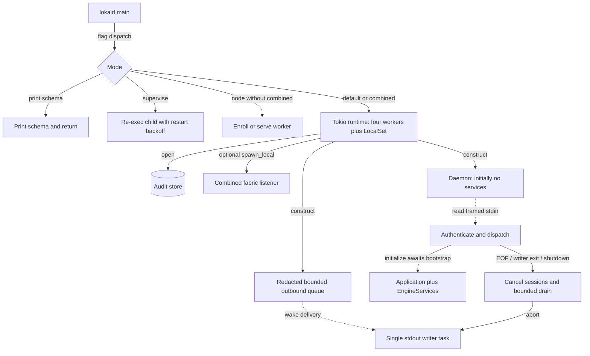
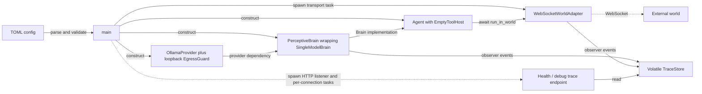

# Entrypoints and composition

[Overview](README.md) · [Execution](execution.md) · [Atlas](atlas.md)

## Complete Cargo binary inventory

Cargo metadata declares eight binary targets. Two are test helpers; they must not be mistaken for deployable engine services.

| Binary | Startup and principal branch | Lifetime / exit |
|---|---|---|
| `lokai` (`lokai-cli`) | Parse arguments; early help/estate/offline commands; otherwise bootstrap Application, choose TUI or one-shot turn | Close session after execution; record network activity and consolidation; return result. |
| `lokaid` | Schema output, supervisor parent, pure worker enrollment/serve, or coordinator stdio; `--combined` adds worker serving | Coordinator drains sessions for at most five seconds, stops combined accept loop, aborts writer. Worker listener has its own lifetime. |
| `tetonic-server` | Read required TOML `--config`; validate standalone/loopback bounds; construct direct Ollama brain, WebSocket adapter, trace and health listener | Select world loop against Ctrl+C; runtime exit drops tasks. No Application session close/recovery path. |
| `tetonic-eval` | Clap Run / Compare / Integrity; LocalSet; evaluation orchestrator and corpus selection | Write/report results; failed pass-floor or evaluation can return error/nonzero. |
| `tetonic-arch-gate` | Default/Arch, Quality, or Verify tier | Print findings; nonzero on failures. Verify can launch formatting, compilation, lint and tests. |
| `tetonic-bench` | Generate synthetic repository/index/vector inputs; run timed operations | Print measurements; clean temporary corpus. Does not benchmark real model intelligence. |
| `tetonic-sandbox-adv` | Dispatch selected adversarial scenario | Some scenarios deliberately stall, exhaust resources or attempt forbidden effects; only run under the harness. |
| `lsp-mock-server` | Read framed stdin JSON; initialize/definition/diagnostic responses; optional stall/crash modes | EOF/framing failure or requested crash/stall branch exits. Test support, not a real language server. |

Source entry anchors: [main.rs — `async fn main`](../../../engine/litho/lokai-cli/src/main.rs#L34), [main.rs — `fn main`](../../../engine/litho/lokaid/src/main.rs#L32), [main.rs — `async fn main`](../../../engine/mantle/tetonic-server/src/main.rs#L75), [main.rs — `fn main`](../../../engine/tooling/tetonic-eval/src/main.rs#L66), [main.rs — `fn main`](../../../engine/tooling/tetonic-arch-gate/src/main.rs#L45), [main.rs — `fn main`](../../../engine/tooling/tetonic-bench/src/main.rs#L22), [adversarial_runner.rs — `fn main`](../../../engine/core/tetonic-sandbox/bins/adversarial_runner.rs#L5), [mock_server.rs — `fn main`](../../../engine/litho/tetonic-lsp/tests/support/mock_server.rs#L10). Exact Cargo target declarations are in [packages.json](packages.json).

## Coordinator startup — level 2

Solid arrows are local synchronous operations or awaited calls as labeled; dashed arrows indicate asynchronous queue/pipe activity. Audit is persistent; Daemon and queue are in process. The daemon being alive does not mean initialization or agent execution has occurred. Evidence: [main.rs — `async fn serve`](../../../engine/litho/lokaid/src/main.rs#L88), [daemon.rs — `pub fn new`](../../../engine/litho/lokaid/src/daemon.rs#L51), [daemon.rs — `pub async fn handle`](../../../engine/litho/lokaid/src/daemon.rs#L100), [daemon.rs — `pub async fn shutdown`](../../../engine/litho/lokaid/src/daemon.rs#L76), [daemon_bootstrap.rs — `impl Application`](../../../engine/litho/tetonic-app/src/daemon_bootstrap.rs#L78).

The daemon authenticates `initialize` and gates other methods until authenticated unless the explicit auth-disable configuration applies. Unknown methods produce MethodNotFound; malformed JSON produces a ParseError with null request id and processing continues. Framing failure/EOF ends the input loop. Responses and notifications share one stdout writer, so there are no competing direct JSON frame writes. `chat/send` admits a turn and streams later work; its immediate RPC response is not turn completion. [daemon.rs — `methods::CHAT_SEND`](../../../engine/litho/lokaid/src/daemon.rs#L127), [main.rs — `serde_json::from_slice`](../../../engine/litho/lokaid/src/main.rs#L137), [outbound.rs — `pub struct OutboundQueue`](../../../engine/atmos/tetonic-rpc/src/outbound.rs#L55).

`--supervise` is process restart machinery: it removes the supervisor flag for the child, inherits stdio, caps abnormal restarts at eight in sixty seconds, and backs off from 200 ms to five seconds. It does not preserve a suspended inference call or shell process. [supervise.rs — `pub fn run`](../../../engine/litho/lokaid/src/supervise.rs#L65).

## CLI composition

CLI argument handling selects early command branches before normal agent bootstrap. These include estate management, time travel/checkpoints, code indexing/querying, project-memory operations and session history. Normal execution constructs Application through `bootstrap_cli`, builds session/approval/TUI delivery, and runs either interactive chat or one-shot execution inside a LocalSet. The same code closes the session with success/error after the selected UI path. Shell allowance requires the extra explicit acknowledgement flag. [main.rs — `let interactive`](../../../engine/litho/lokai-cli/src/main.rs#L46), [main.rs — `bootstrap_cli`](../../../engine/litho/lokai-cli/src/main.rs#L134), [main.rs — `app.close_session`](../../../engine/litho/lokai-cli/src/main.rs#L234), [cli_bootstrap.rs — `impl Application`](../../../engine/litho/tetonic-app/src/cli_bootstrap.rs#L56).

Application assembles initialization, live sessions, runs, run manager, supervisor, policies, approvals, estate/capacity services and turn bindings. `TurnBind` carries the provider/broker/tokenizer/runtime/store/workspace dependencies into turns. Installing the compute plane attaches supervisor bridges to remote providers and the broker. This is the connection that makes application inference participate in managed execution; the standalone server does not call it. [lib.rs — `pub struct Application`](../../../engine/litho/tetonic-app/src/lib.rs#L124), [product_submit.rs — `pub struct TurnBind`](../../../engine/litho/tetonic-app/src/product_submit.rs#L22), [product_submit.rs — `pub fn install_compute_plane`](../../../engine/litho/tetonic-app/src/product_submit.rs#L168).

## Worker composition and enrollment

`lokaid --node --enroll` generates enrollment/audit keys, opens the worker database, loads or creates TLS identity, writes a private expiring code file, validates the chosen enrollment transport/bind policy, and waits for enrollment completion. Success persists a coordinator pin; expired/failed handshakes return errors. The code-file guard removes the temporary code at scope exit. Serving is a separate subsequent invocation. [node_worker.rs — `pub async fn run_node_enroll`](../../../engine/litho/tetonic-app/src/node_worker.rs#L38).

`lokaid --node` opens `worker.db`, refuses to serve without coordinator pins, chooses bind/port/Ollama settings, obtains a capacity status, and enters `FabricServer::run`. A degraded/missing capacity profile is reported at startup; the actual request path has additional admission rules. Combined mode launches that listener as a local task and returns a shared stop flag to daemon shutdown. [node_worker.rs — `pub async fn run_node_serve`](../../../engine/litho/tetonic-app/src/node_worker.rs#L135), [node_worker.rs — `pub fn spawn_combined_fabric`](../../../engine/litho/tetonic-app/src/node_worker.rs#L201).

## Standalone world-server composition — level 2

Solid arrows show local construction/calls; dashed arrows show task creation or network traffic as labeled. No node in this view persists the agent's learned state. World authority is outside the process. Evidence: [main.rs — `async fn main`](../../../engine/mantle/tetonic-server/src/main.rs#L75), [agent.rs — `pub async fn run_in_world`](../../../engine/core/tetonic-core/src/agent.rs#L371), [observability.rs — `pub struct TraceStore`](../../../engine/mantle/tetonic-server/src/observability.rs#L6).

## Scripts, build and CI entry surfaces

The [script entrypoint index](script-entrypoints.json) and [ledger](coverage.csv) include scripts and executable fixtures. They are not silently omitted. Scripts fall into these separately callable families:

| Family | Inputs → operations → outputs; failure/lifetime boundary |
|---|---|
| `scripts/install.sh`, `install.ps1` | Platform/release inputs → fetch/install packaged binaries → local installed files. External release availability and platform tools remain environmental dependencies. |
| `scripts/release.py` and release workflow | Version/flags → repository/tag checks and optional gate → release/tag/build workflow. Publishing was not executed during analysis. |
| `engine/scripts/gen_ts_protocol.py`, `gen_fabric_protocol_doc.py` | Schema/source inputs → generated protocol artifacts. Generated declarations describe shapes, not daemon dispatch reachability. |
| `run_required_tests.py`, `test_required_tests.py` | Package/test filters → subprocess cargo tests and result-count checks; zero executed tests is treated as failure by the required-test runner. |
| `smoke_lokaid.py` | Spawn daemon, send framed requests, inspect results; a controlled client/harness, not another server composition. |
| `verify_layout_consumer.py` | Construct external consumer/build inputs and invoke build tooling; environment-sensitive compatibility probe. |
| `engine/bench/*.py` | Corpus/model/runtime parameters → benchmark-specific requests or generated workloads → timing/results. Test files verify selected harness behavior. |
| `engine/corpus/scripts/*.py` | Setup/reset/scaffold/integrity operations on evaluation corpus. Some mutate fixture workspaces; not run here. |
| `tetonic-tools/fix_cmd.py`, `fix_tests.py` | Maintenance scripts modifying source/test text. Not a runtime tool API and not executed here. |
| Test fixture executables | Inputs to sandbox/eval/index tests; their execution is harness-owned, not automatically started by the product. |

This is a role and entry-surface classification, not a claim that every script branch has been executed or semantically verified. Remaining script-level dynamic coverage is recorded in verification. Source locations and discovered entry lines are linked from the generated atlas; all script text participates in the lexical inventory.

CI's gate runs `verify package`; its test job names eleven packages rather than the entire workspace. Its cross-platform release-build matrix targets `lokai-cli` and `lokaid`. Therefore that workflow alone does not establish a tested `tetonic-server` world integration or passing tests for every broker/run/fabric crate. [engine-ci.yml — `jobs:`](../../../.github/workflows/engine-ci.yml#L14), [main.rs — `fn main`](../../../engine/tooling/tetonic-arch-gate/src/main.rs#L45).
