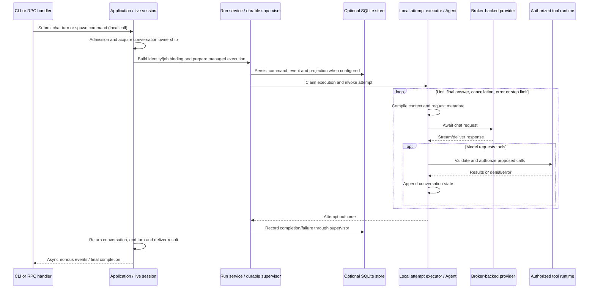
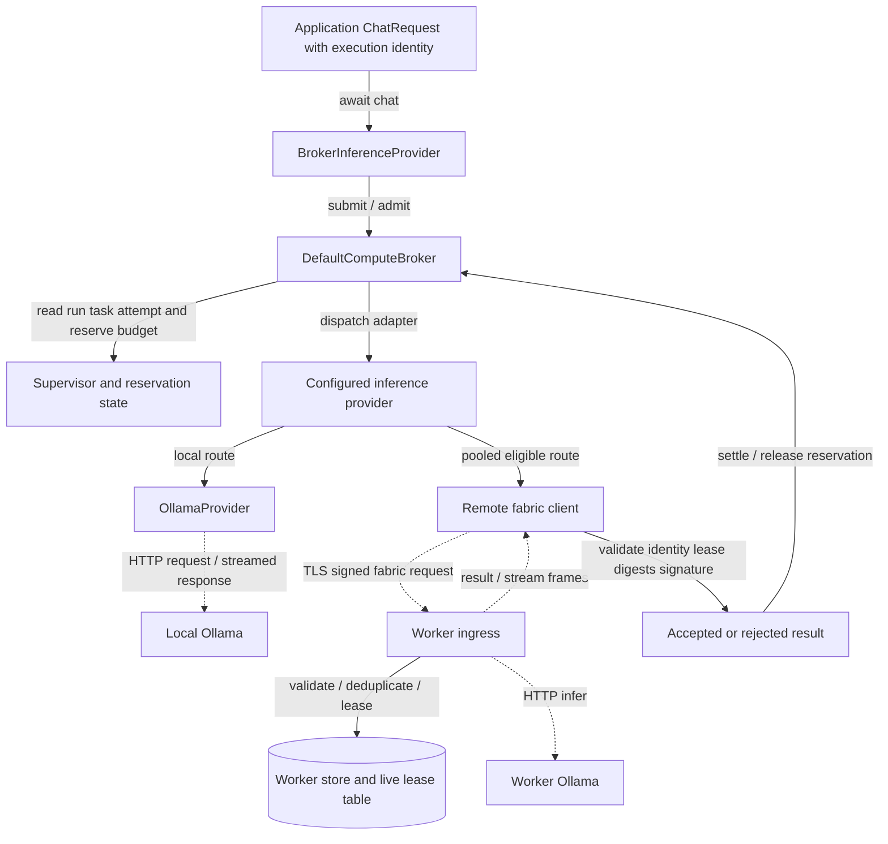
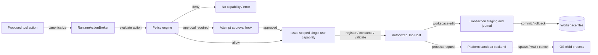
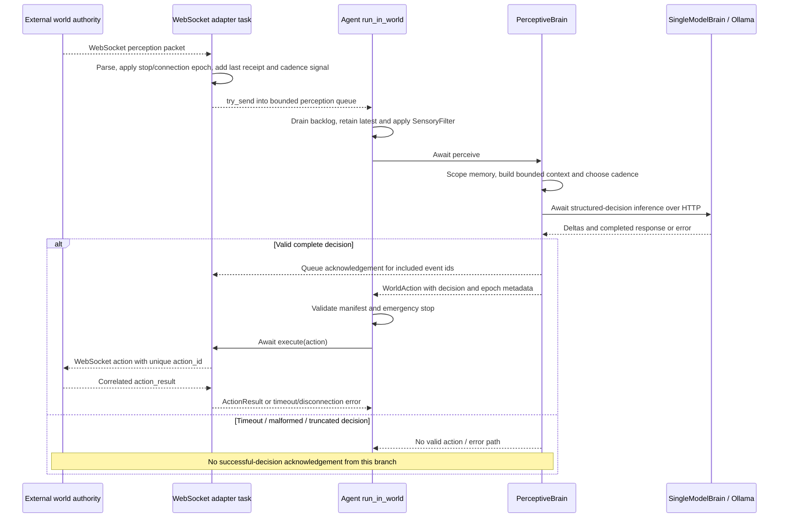

# Execution paths and operational traces

[Overview](README.md) · [State](state.md) · [Operations](operations.md)

## Finite application turn — level 3 sequence

Scope: one application turn; all arrows are local calls/returns except downstream provider/tool transports, expanded below. Solid arrows are calls (many awaited); dashed arrows are replies/events. SQLite is the persistent boundary, live session the conversation owner. This is the principal path with optional orchestration branches collapsed, not a statement that every turn runs a planner/critic. Evidence: [product_submit.rs — `pub fn submit_chat_turn`](../../../engine/litho/tetonic-app/src/product_submit.rs#L583), [turn_execution.rs — `run_orchestrated_turn`](../../../engine/litho/tetonic-app/src/turn_execution.rs#L19), [execution.rs — `ClaimExecution`](../../../engine/mantle/tetonic-run/src/managed/execution.rs#L85), [agent.rs — `pub struct Agent`](../../../engine/core/tetonic-core/src/agent.rs#L28).

Admission and ownership matter before a model call: turns can be rejected while draining, capacity work is active, another turn owns the session, or capacity gates do not allow execution. The owned-turn guard restores conversation ownership and publishes a dropped-turn outcome on unwinding/drop. Agent identity, definition/input digests, capability bindings and artifact bindings are checked against the managed task; the neutral `AgentAttemptExecutor` contract is not itself the coding implementation. [product_submit.rs — `struct OwnedTurn`](../../../engine/litho/tetonic-app/src/product_submit.rs#L105), [identity.rs — `pub struct AgentJobSpec`](../../../engine/core/tetonic-domain/src/identity.rs#L27), [execution.rs — `ClaimExecution`](../../../engine/mantle/tetonic-run/src/managed/execution.rs#L85).

The finite Agent loop checks cancellation and limits, compacts context when configured, constructs chat messages/tool schemas, supplies fabric metadata, then handles text/tool responses. The coding pack supplies workspace-oriented identity, tools and context. Routing, critic and revision paths are selected by application configuration; generic `Brain` support coexists with the provider-driven finite loop. It would be inaccurate to describe the current product as only a domain-neutral standing-agent loop. [agent.rs — `pub struct Agent`](../../../engine/core/tetonic-core/src/agent.rs#L28), [coding_pack.rs — `impl`](../../../engine/litho/tetonic-app/src/coding_pack.rs#L27), [turn_execution.rs — `run_orchestrated_turn`](../../../engine/litho/tetonic-app/src/turn_execution.rs#L19).

## Inference and remote compute — level 3

Solid arrows are local calls/state access; dashed arrows cross process boundaries asynchronously. Worker store persistence is distinct from the volatile active lease table. Route availability depends on enrollment, trust/policy and compute-plane configuration, not just a model name. Evidence: [compute_plane.rs — `pub struct ComputePlane`](../../../engine/litho/tetonic-app/src/compute_plane.rs#L29), [broker.rs — `pub struct DefaultComputeBroker`](../../../engine/mantle/tetonic-broker/src/broker.rs#L57), [job_ingress.rs — `impl JobIngressManager`](../../../engine/mantle/tetonic-node/src/job_ingress.rs#L18), [lease_table.rs — `impl LeaseTable`](../../../engine/mantle/tetonic-node/src/lease_table.rs#L39), [result_validate.rs — `pub fn`](../../../engine/atmos/tetonic-fabric-protocol/src/result_validate.rs#L47).

The broker is not simply a load balancer: it checks managed execution state, reserves budgets and revalidates before dispatch, tracks in-flight work, and settles/relinquishes reservations on result/error/cancellation paths. Its scheduler/circuit/speculation modules are part of the implementation; their existence does not mean all policies are activated in every composition. Application compute-plane assembly is the reachability evidence. [broker.rs — `pub struct DefaultComputeBroker`](../../../engine/mantle/tetonic-broker/src/broker.rs#L57), [compute_plane.rs — `pub struct ComputePlane`](../../../engine/litho/tetonic-app/src/compute_plane.rs#L29).

Remote result acceptance validates protocol/identity/revocation and execution binding, including run/task/attempt/lease/input/workspace values and signatures. Worker ingress persists accepted request deduplication and terminal cached outcomes, but active execution is not an agent-process migration. A failed request can be rejected, quarantined or retried according to the applicable layer; transport retry and durable task retry must not be conflated. [result_validate.rs — `pub fn`](../../../engine/atmos/tetonic-fabric-protocol/src/result_validate.rs#L47), [job_ingress.rs — `impl JobIngressManager`](../../../engine/mantle/tetonic-node/src/job_ingress.rs#L18), [retry.rs — `pub fn apply_failure_with_retry`](../../../engine/mantle/tetonic-run/src/retry.rs#L8).

## Tool authorization and effect execution — level 3

Solid arrows are local control/effect calls; dashed arrow is asynchronous OS process execution. Workspace journal/files are persistence boundaries. This diagram describes application runtime effects, not world-action authorization. Evidence: [action_broker.rs — `impl`](../../../engine/core/tetonic-runtime/src/action_broker.rs#L21), [capability_store.rs — `pub struct InMemoryCapabilityStore`](../../../engine/core/tetonic-runtime/src/capability_store.rs#L17), [lib.rs — `pub fn execute_authorized_cancellable`](../../../engine/litho/tetonic-tools/src/lib.rs#L358), [mod.rs — `pub fn platform_backend`](../../../engine/core/tetonic-sandbox/src/backend/mod.rs#L58), [lib.rs — `pub mod`](../../../engine/core/tetonic-transaction/src/lib.rs#L3).

Runtime capabilities bind action kind, canonical parameters, identity/execution scope, workspace/data class and policy version. The broker issues a 300-second, one-use capability; absence/failure of a required approval hook denies the action. This is a local capability boundary, not a proof that an external world validates the same token. Transactional edits and sandboxed process execution have separate cleanup/commit semantics. [action_broker.rs — `evaluate_and_issue`](../../../engine/core/tetonic-runtime/src/action_broker.rs#L62), [capability_store.rs — `impl`](../../../engine/core/tetonic-runtime/src/capability_store.rs#L23), [mod.rs — `async fn execute_cancellable`](../../../engine/core/tetonic-sandbox/src/backend/mod.rs#L46).

## World-agent decision — level 3 sequence

Scope: standalone server. Solid arrows denote local calls; dashed arrows denote network messages, queue delivery or returns as labeled. The world alone owns physical effects; Brain owns volatile experience. An event acknowledgement means inclusion in a validated decision, **not** proof that its resulting action succeeded. Evidence: [agent.rs — `pub async fn run_in_world`](../../../engine/core/tetonic-core/src/agent.rs#L371), [websocket_adapter.rs — `pub fn connect`](../../../engine/core/tetonic-runtime/src/websocket_adapter.rs#L38), [perceptive_brain.rs — `impl Brain for PerceptiveBrain`](../../../engine/mantle/tetonic-server/src/perceptive_brain.rs#L168), [brain.rs — `pub struct SingleModelBrain`](../../../engine/core/tetonic-runtime/src/brain.rs#L44).

The core loop drains queued perceptions before acting. `SensoryFilter` responds to urgency/events and changed/new signals; it is not a deep comparison of arbitrary world-state JSON. The adapter injects a changing decision-window signal so an otherwise quiet world can still lead to decisions. It also adds the last action receipt. The server's brain enforces decision cadence and a longer idle cadence, with event-driven wakeup logic. [agent.rs — `pub async fn run_in_world`](../../../engine/core/tetonic-core/src/agent.rs#L371), [websocket_adapter.rs — `decision_window`](../../../engine/core/tetonic-runtime/src/websocket_adapter.rs#L118), [perceptive_brain.rs — `with_idle_interval`](../../../engine/mantle/tetonic-server/src/perceptive_brain.rs#L88).

The accepted decision contract is structured JSON with an allowed action kind and object payload, plus bounded optional intention fields. The brain records inference/parse/action stages and preserves scoped experience and compact intention state across decisions in the same process. That does not give the agent omniscience: the input state is supplied by the external world and bounded by server context assembly. Conversely, Tetonic's generic adapter does not itself enforce the world's visibility radius or collision rules. Those guarantees must be established in the world implementation. [perceptive_brain.rs — `impl Brain for PerceptiveBrain`](../../../engine/mantle/tetonic-server/src/perceptive_brain.rs#L168), [experience.rs — `struct`](../../../engine/mantle/tetonic-server/src/experience.rs#L6), [context_budget.rs — `struct`](../../../engine/mantle/tetonic-server/src/context_budget.rs#L7), [websocket_adapter.rs — `async fn execute`](../../../engine/core/tetonic-runtime/src/websocket_adapter.rs#L178).

One action is pending at a time in the WebSocket transport. A matching `action_id` receipt completes it; an unrelated receipt does not. A successful socket write alone does not complete `execute`. Receipt/deadline handling uses a five-second deadline, and disconnect fails pending/queued actions rather than replaying them. Reconnect increments a connection epoch; stale actions are rejected. A timeout cannot prove an external effect did not happen—it proves no timely correlated completion was returned. [websocket_adapter.rs — `let mut pending`](../../../engine/core/tetonic-runtime/src/websocket_adapter.rs#L76), [websocket_adapter.rs — `async fn execute`](../../../engine/core/tetonic-runtime/src/websocket_adapter.rs#L178).

## Context assembly: two separate implementations

The coding/application context package has a staged compiler: normalization, retrieval, filtering, ranking, deduplication, budgeting and sealing. Workspace/index/history inputs belong to this path. The world server instead assembles its current perception, retained experience and intention through its own context-budget module. These are not interchangeable persistent-memory systems. [lib.rs — `pub mod`](../../../engine/strata/tetonic-context/src/lib.rs#L1), [context_budget.rs — `struct`](../../../engine/mantle/tetonic-server/src/context_budget.rs#L7), [experience.rs — `struct`](../../../engine/mantle/tetonic-server/src/experience.rs#L6). Token estimates and actual model tokenizer accounting also vary by path; budget arithmetic does not prove exact provider token usage. See the package atlas for compiler stage and tokenizer source files.
