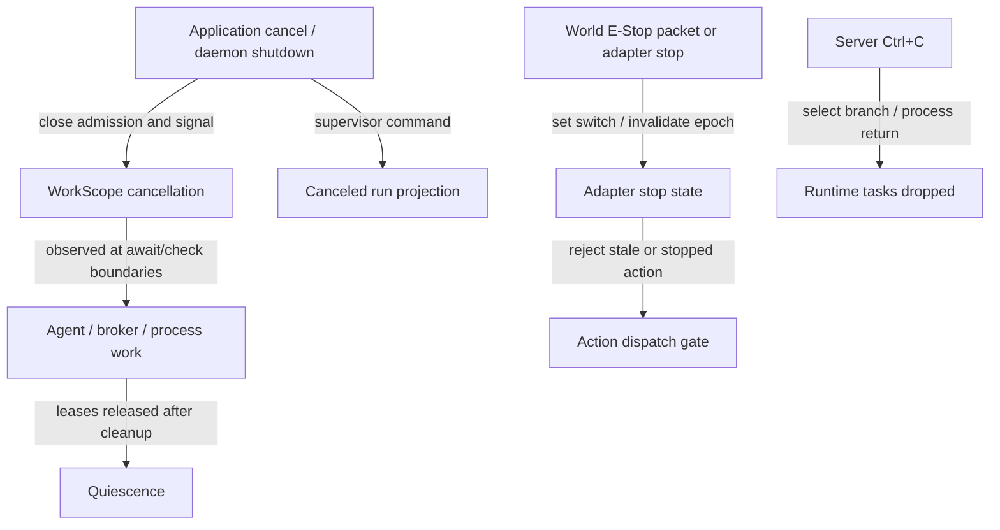
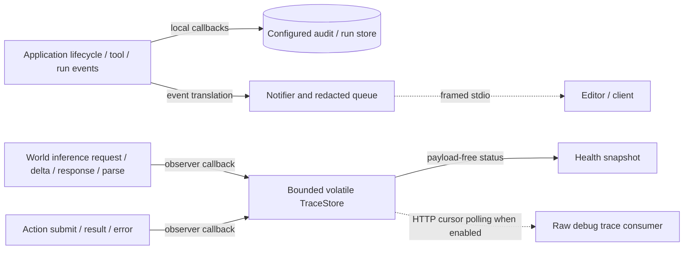

# Interfaces, security, concurrency and operations

[Overview](README.md) · [Execution](execution.md) · [Limits](limits.md)

## External interfaces

| Interface | Server/client and scope | Acceptance is not completion |
|---|---|---|
| Editor JSON-RPC | `lokaid` framed stdin/stdout; method constants/schema/types in `tetonic-rpc` | Admission response precedes streamed work for chat/spawn. |
| CLI arguments | `lokai`, tooling binaries and daemon mode flags | Command choice can bypass normal agent startup entirely. |
| Server TOML | Required `tetonic-server --config`; private deserialized structs | Generic domain EngineConfig is not automatically this executable's configuration contract. |
| Health/debug HTTP | Loopback server listener; trace retrieval by cursor | Transport connected and last observed stage do not prove agent progress or a successful world effect. |
| World WebSocket | Typed perception/action/result envelopes; event acknowledgements | Socket write, decision parsing, event ack and correlated action result are distinct events. |
| Ollama HTTP | Inference provider and worker-local model runtime | Network success does not prove a valid structured decision or successful tool/action. |
| Fabric transport | Enrolled coordinator/client and worker ingress over TLS | Request admission, lease execution and result validation are separate gates. |
| LSP stdio | Workspace-configured language server launched by app/LSP integration | Diagnostics and request results are advisory inputs to coding context/tools. |

Evidence: [daemon.rs — `pub async fn handle`](../../../engine/litho/lokaid/src/daemon.rs#L100), [protocol.rs — `pub mod methods`](../../../engine/atmos/tetonic-rpc/src/protocol.rs#L111), [main.rs — `struct Config`](../../../engine/mantle/tetonic-server/src/main.rs#L25), [main.rs — `let health_adapter`](../../../engine/mantle/tetonic-server/src/main.rs#L180), [websocket_adapter.rs — `pub fn acknowledge_events`](../../../engine/core/tetonic-runtime/src/websocket_adapter.rs#L158), [lsp_launcher.rs — `impl`](../../../engine/litho/tetonic-app/src/lsp_launcher.rs#L19).

RPC dispatch includes initialization, session lifecycle/classification/inference selection, chat, cancellation, approvals, models, egress/policy, estate capacity status/doctor/optimize/profile operations, fabric status/trust, agent spawning, project consolidation, run snapshot/resume/cancel and secret-rule/fingerprint operations. Some control-plane mutations are blocked under strict RPC settings. Dispatch, rather than the schema alone, is the current supported-method evidence. [daemon.rs — `pub async fn handle`](../../../engine/litho/lokaid/src/daemon.rs#L100).

## Configuration boundaries

The world server rejects unknown TOML fields, non-standalone mode, non-loopback health bind, non-loopback HTTP inference and non-loopback `ws` world URLs. It requires at least a 1000 ms decision interval, nonempty agent id/actions, positive timeout/completion limits, at least 1024 context tokens and room for completion plus safety margin. Defaults include 30-second idle cadence, 384 completion tokens and 512-token margin. It appends agent id/name/event protocol to the world URL. These are startup checks, not a general distributed deployment config loader. [main.rs — `struct Config`](../../../engine/mantle/tetonic-server/src/main.rs#L25), [main.rs — `fn default_idle_interval`](../../../engine/mantle/tetonic-server/src/main.rs#L70), [main.rs — `async fn main`](../../../engine/mantle/tetonic-server/src/main.rs#L75).

The application/daemon instead combines CLI/session settings, environment variables, workspace policy, stored trust/enrollment/capacity state and runtime service bindings. Node startup reads enrollment/fabric ports, bind/advertise settings and `LOKAI_OLLAMA`. A session inference selection or capacity reload does not rewrite the standalone server's TOML or reconstruct its Brain. [daemon_bootstrap.rs — `impl Application`](../../../engine/litho/tetonic-app/src/daemon_bootstrap.rs#L78), [node_worker.rs — `pub async fn run_node_serve`](../../../engine/litho/tetonic-app/src/node_worker.rs#L135), [product_submit.rs — `pub fn reload_inference_services`](../../../engine/litho/tetonic-app/src/product_submit.rs#L413).

Compatibility is enforced at several independent levels: serde/schema parsing, RPC method dispatch, fabric protocol/version/result checks and world packet parsing. There is no evidence here of one universal version-negotiation mechanism covering all these interfaces. Generated TypeScript declarations are a client shape artifact; runtime support comes from daemon dispatch and handler behavior. [result_validate.rs — `pub fn`](../../../engine/atmos/tetonic-fabric-protocol/src/result_validate.rs#L47), [websocket_adapter.rs — `serde_json::from_str`](../../../engine/core/tetonic-runtime/src/websocket_adapter.rs#L108), [daemon.rs — `pub async fn handle`](../../../engine/litho/lokaid/src/daemon.rs#L100).

## Concurrency and bounded resources

| Location | Ownership / primitive | Consequence |
|---|---|---|
| Daemon | Four-worker Tokio runtime plus LocalSet; one stdout writer | Live non-Send conversation work remains local; other Send tasks can run independently. |
| Live application turn | Owned conversation and per-session turn admission | Concurrent attempts to own the same turn are rejected rather than freely mutating the conversation. |
| Durable supervisor | Per-run async mutex | Serializes commands in this process; unrelated runs have separate locks. |
| SharedStore | Dedicated writer thread, message commands, read pool | Serializes writes; async callers receive results through completion channels. |
| RPC outbound | Bounded queue with classes, token/progress coalescing and failure status | Backpressure is not an unlimited lossless event log. |
| World adapter | Action queue 8; perception queue 32; ack queue 16; one pending action | Full perception/ack `try_send` can drop the new item; no durable local inbox. |
| World connection | Five-second connect timeout; reconnect backoff 0.5–5 seconds | Connection recovery does not replay pending actions. |
| World action | Five-second receipt deadline; expiry checked by transport timer | Missing receipt fails the local operation; does not establish external rollback. |
| Server trace | At most 2048 events / 8 MiB; payloads over 256 KiB replaced with truncation metadata | Cursor gaps and truncation are observable; trace is not complete durable history. |

Evidence: [main.rs — `worker_threads`](../../../engine/litho/lokaid/src/main.rs#L58), [product_submit.rs — `struct OwnedTurn`](../../../engine/litho/tetonic-app/src/product_submit.rs#L105), [service.rs — `fn run_lock`](../../../engine/mantle/tetonic-run/src/service.rs#L97), [lib.rs — `pub struct SharedStore`](../../../engine/strata/tetonic-memory/src/lib.rs#L198), [outbound.rs — `pub struct OutboundQueue`](../../../engine/atmos/tetonic-rpc/src/outbound.rs#L55), [websocket_adapter.rs — `let (tx, mut rx)`](../../../engine/core/tetonic-runtime/src/websocket_adapter.rs#L44), [observability.rs — `pub fn record`](../../../engine/mantle/tetonic-server/src/observability.rs#L9).

## Cancellation and stop propagation — level 3

Arrows are local calls/signals, not network delivery guarantees; the E-Stop packet itself arrives over WebSocket as described in execution. Canceled durable state, requested cancellation and actual process quiescence are separate milestones. World stop and application cancellation are different paths. Evidence: [work_scope.rs — `pub struct WorkScope`](../../../engine/core/tetonic-domain/src/work_scope.rs#L29), [daemon.rs — `pub async fn shutdown`](../../../engine/litho/lokaid/src/daemon.rs#L76), [transition.rs — `fn apply_cancel_run`](../../../engine/mantle/tetonic-run/src/transition.rs#L649), [websocket_adapter.rs — `Some("estop")`](../../../engine/core/tetonic-runtime/src/websocket_adapter.rs#L133), [main.rs — `tokio::select!`](../../../engine/mantle/tetonic-server/src/main.rs#L208).

Daemon shutdown rejects new work, cancels sessions and polls in-flight turns until zero or a five-second deadline, then main aborts the writer. Thus the code does not promise that every final notification is flushed before process exit. Sandbox cancellable execution has an explicit fail-closed default for unsupported backends. Backend cleanup behavior remains platform-specific. [daemon.rs — `pub async fn shutdown`](../../../engine/litho/lokaid/src/daemon.rs#L76), [main.rs — `writer.abort`](../../../engine/litho/lokaid/src/main.rs#L157), [mod.rs — `async fn execute_cancellable`](../../../engine/core/tetonic-sandbox/src/backend/mod.rs#L46).

## Trust and security boundaries

Application effect authorization combines policy evaluation, approvals, scoped capability issuance/consumption, workspace path checks and sandbox execution. Egress guard and secret scanning are additional boundaries around data leaving the process. These checks are not a single all-encompassing security layer: each caller must use the configured wrapper. The world server uses loopback restrictions and manifest action names but does not invoke the coding RuntimeActionBroker for world effects. [action_broker.rs — `evaluate_and_issue`](../../../engine/core/tetonic-runtime/src/action_broker.rs#L62), [mod.rs — `fn validate_working_directory`](../../../engine/core/tetonic-sandbox/src/backend/mod.rs#L120), [main.rs — `with_redactor`](../../../engine/litho/lokaid/src/main.rs#L101), [main.rs — `EmptyToolHost`](../../../engine/mantle/tetonic-server/src/main.rs#L9), [agent.rs — `pub async fn run_in_world`](../../../engine/core/tetonic-core/src/agent.rs#L371).

Sandbox selection uses compile-time platform branches for Windows, Linux and macOS. It validates working-directory scopes and builds a minimal environment, excluding secret-looking variable names when requested. Capabilities/enforced controls and missing controls determine isolation outcomes; a sandbox request alone is not proof of equivalent OS enforcement on every platform. No destructive adversarial fixtures were executed for this documentation task. [mod.rs — `pub fn platform_backend`](../../../engine/core/tetonic-sandbox/src/backend/mod.rs#L58), [mod.rs — `pub(crate) fn build_minimal_env`](../../../engine/core/tetonic-sandbox/src/backend/mod.rs#L79), [mod.rs — `pub fn evaluate_outcome`](../../../engine/core/tetonic-sandbox/src/backend/mod.rs#L160).

Worker enrollment persists coordinator pins and TLS identity. Fabric transport and result checks bind work to enrolled identity and execution scope. The separate keeper library's local proof/epoch behavior should not be treated as an equivalent authenticated distributed lease protocol. [node_worker.rs — `pub async fn run_node_enroll`](../../../engine/litho/tetonic-app/src/node_worker.rs#L38), [result_validate.rs — `pub fn`](../../../engine/atmos/tetonic-fabric-protocol/src/result_validate.rs#L47), [role.rs — `impl KeeperRegistry`](../../../engine/mantle/tetonic-node/src/role.rs#L152).

## Observability — level 3

Solid arrows are local synchronous callbacks or state access; dashed arrows are asynchronous client transports. Only the explicitly configured audit/run store is durable in this view. Server health remains available when payload capture is disabled. Evidence: [events.rs — `pub`](../../../engine/litho/tetonic-app/src/events.rs#L5), [main.rs — `with_redactor`](../../../engine/litho/lokaid/src/main.rs#L101), [brain.rs — `pub struct SingleModelBrain`](../../../engine/core/tetonic-runtime/src/brain.rs#L44), [observability.rs — `pub fn record`](../../../engine/mantle/tetonic-server/src/observability.rs#L9), [observability.rs — `pub fn since`](../../../engine/mantle/tetonic-server/src/observability.rs#L38).

Trace stages include inference request/response/deltas, parsed decisions, submitted actions/results and classified errors. Health changes to inferring, validating, action_pending, acting, waiting, rejected or failed based on observed stages; it keeps last-success/failure metadata. It is a derived observation, not a second authority over world state. Raw trace is opt-in and bounded; it is not a guarantee of access to hidden model reasoning. [observability.rs — `pub fn record`](../../../engine/mantle/tetonic-server/src/observability.rs#L9), [main.rs — `let health_adapter`](../../../engine/mantle/tetonic-server/src/main.rs#L180).
