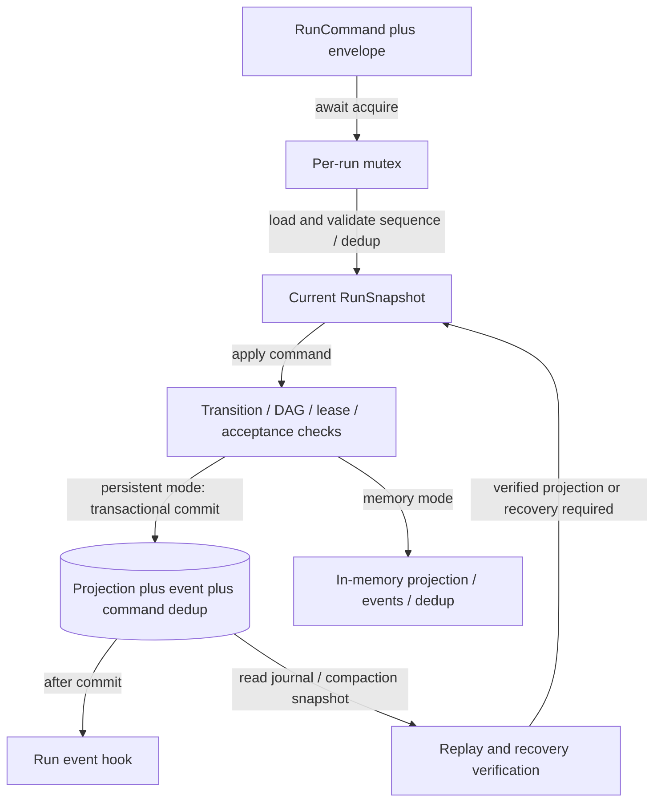
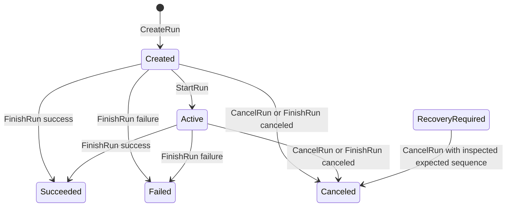
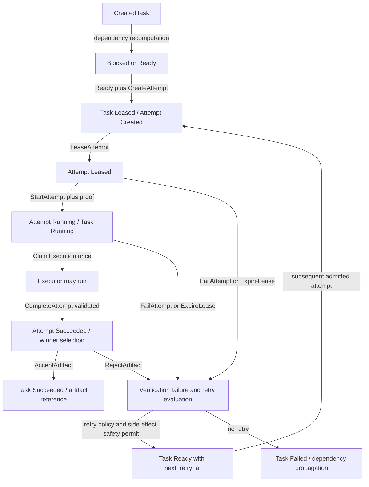
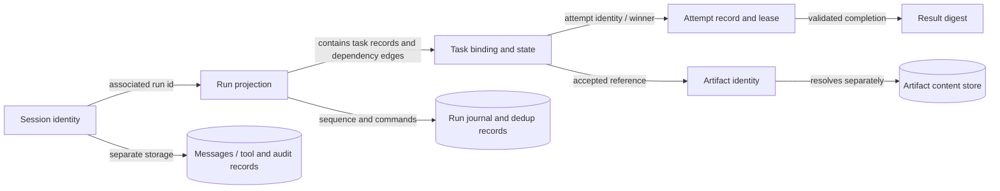

# State ownership, persistence and recovery

[Overview](README.md) · [Execution](execution.md)

## Owners and durability

| State | Authoritative owner | Persistence / restart boundary |
|---|---|---|
| Live session/conversation and turn ownership | Application `SessionLiveStore` / `LiveSession` | Live objects are in memory; stored messages/session metadata are separate rehydration inputs. |
| Run/task/attempt projection and command history | `DurableRunSupervisor` | Optional SQLite persistence; without a store it uses in-memory maps. |
| Run mutation serialization | Per-run asynchronous mutex | In-process serialization, not multi-coordinator consensus. |
| Coordinator sessions, audit, policy/trust, capacity and run tables | `Store` / `SharedStore` | SQLite; dedicated serialized writer and read connections. |
| Worker pins, ingress dedup/terminal outcome records | Worker store / ingress | Separate worker SQLite state. Active leases use process-local timing/state. |
| Artifacts and quarantined results | Artifact storage implementation | Content/file storage, separate from a run's accepted-artifact reference. |
| Workspace file edits | Transaction subsystem and filesystem | Journal/staging/commit boundary; not a distributed transaction with external tools. |
| Code symbols/chunks/embeddings | Index database | Derived repository index, distinct from authoritative workspace files. |
| World perception, experience, facts, intention, action receipt | Adapter and PerceptiveBrain | In-memory, bounded, scoped; no automatic persistence in server composition. |
| World geometry, objects and actual action effects | External world server | Not owned or persisted by this repository's standalone server. |
| Fleet/organization/squad/keeper maps | Their library instances | In-memory library state; see wiring limitations. |

Evidence: [session_live.rs — `pub struct LiveSession`](../../../engine/litho/tetonic-app/src/session_live.rs#L29), [service.rs — `pub struct DurableRunSupervisor`](../../../engine/mantle/tetonic-run/src/service.rs#L51), [lib.rs — `pub struct SharedStore`](../../../engine/strata/tetonic-memory/src/lib.rs#L198), [lease_table.rs — `impl LeaseTable`](../../../engine/mantle/tetonic-node/src/lease_table.rs#L39), [experience.rs — `struct`](../../../engine/mantle/tetonic-server/src/experience.rs#L6), [fleet_api.rs — `pub struct FleetManager`](../../../engine/litho/tetonic-app/src/fleet_api.rs#L102). The full lexical SQL table inventory is [storage-tables.json](storage-tables.json); it lists declarations, including test/migration declarations, not 69 independent production databases.

## Durable command path — level 3

Solid arrows are local synchronous/awaited operations as labeled; no network transport exists in this diagram. The database transaction is the persistence boundary. The per-run mutex is process-local. Evidence: [service.rs — `fn run_lock`](../../../engine/mantle/tetonic-run/src/service.rs#L97), [service.rs — `pub fn replay_run`](../../../engine/mantle/tetonic-run/src/service.rs#L664), [run_store.rs — `commit_run_command`](../../../engine/strata/tetonic-memory/src/run_store.rs#L20), [transition.rs — `pub fn apply_command`](../../../engine/mantle/tetonic-run/src/transition.rs#L23).

The command envelope carries command id, expected sequence, trace/actor/timestamp, workspace version and idempotency key. Transitions do not simply trust a supplied target status: dependencies, state, input/workspace digests, task versions and lease proof are checked in the relevant handlers. Completion acceptance and artifact acceptance are separate operations. [run.rs — `pub struct CommandEnvelope`](../../../engine/core/tetonic-domain/src/run.rs#L152), [acceptance.rs — `pub fn try_accept_completion`](../../../engine/mantle/tetonic-run/src/acceptance.rs#L11), [transition.rs — `fn apply_accept_artifact`](../../../engine/mantle/tetonic-run/src/transition.rs#L698).

## Run lifecycle — level 4

Arrows are local command-driven projection transitions, not network messages or execution guarantees. This is the command transition graph, not all recovery assignments. `CancelRun` assigns `Canceling` and then `Canceled` within one transition; the resulting committed projection does not pause at Canceling while processes drain. Recovery code can mark a run RecoveryRequired outside these ordinary command edges. Finishing a run is a separate command; this diagram does not imply all task completion automatically proves a successful run. Evidence: [transition.rs — `fn apply_start_run`](../../../engine/mantle/tetonic-run/src/transition.rs#L115), [transition.rs — `fn apply_cancel_run`](../../../engine/mantle/tetonic-run/src/transition.rs#L649), [transition.rs — `fn apply_finish_run`](../../../engine/mantle/tetonic-run/src/transition.rs#L792), [service.rs — `pub fn replay_run`](../../../engine/mantle/tetonic-run/src/service.rs#L664).

## Task and attempt lifecycle — level 4

Solid arrows represent synchronous state transformation inside the supervisor; Dispatch refers to separate awaited execution, not execution inside SQLite. This view omits cancellation arrows for readability: CancelTask/CancelRun mark applicable active attempts canceled; successful tasks have special rejection/preservation rules. `Starting`, `Superseded` and `Skipped` appear in domain/state handling, but the normal StartAttempt handler goes directly from Leased to Running. Do not insert a mandatory Starting phase from the enum alone. Evidence: [transition.rs — `fn apply_create_attempt`](../../../engine/mantle/tetonic-run/src/transition.rs#L222), [transition.rs — `fn apply_start_attempt`](../../../engine/mantle/tetonic-run/src/transition.rs#L397), [transition.rs — `fn apply_claim_execution`](../../../engine/mantle/tetonic-run/src/transition.rs#L369), [acceptance.rs — `pub fn apply_winner_selection`](../../../engine/mantle/tetonic-run/src/acceptance.rs#L166), [retry.rs — `pub fn apply_failure_with_retry`](../../../engine/mantle/tetonic-run/src/retry.rs#L8).

Retry state records a failure count/class/reason and next retry time. Retry depends on policy or verification remediation and side-effect safety; otherwise dependency failure propagation runs. The existence of `next_retry_at` is not enough to prove every route to CreateAttempt enforces backoff: the MarkTaskReady handler explicitly checks it while CreateAttempt has its own checks. This is an implementation detail that a simplified retry diagram would conceal. [retry.rs — `pub fn apply_failure_with_retry`](../../../engine/mantle/tetonic-run/src/retry.rs#L8), [transition.rs — `fn apply_mark_task_ready`](../../../engine/mantle/tetonic-run/src/transition.rs#L184), [transition.rs — `fn apply_create_attempt`](../../../engine/mantle/tetonic-run/src/transition.rs#L222).

## Lease and duplicate boundaries

A durable attempt lease contains holder, id, epoch, issued/expiry times and heartbeat sequence. Renewal validates proof and monotonic heartbeat sequence. ClaimExecution requires Running, an unclaimed execution and a current lease. Completion validates current lease, input/task/workspace binding and winner state; a replay of the same successful result digest is handled specially. These controls operate on supervisor snapshots. [transition.rs — `fn apply_lease_attempt`](../../../engine/mantle/tetonic-run/src/transition.rs#L328), [transition.rs — `fn apply_record_heartbeat`](../../../engine/mantle/tetonic-run/src/transition.rs#L430), [acceptance.rs — `pub fn try_accept_completion`](../../../engine/mantle/tetonic-run/src/acceptance.rs#L11).

Worker active leases and keeper registration proofs are separate mechanisms, not additional replicas of that same lease state. The worker table tracks active job/attempt/epoch expiry using process-local time; keeper code maintains its own node/assignment maps. It would be inaccurate to draw a single globally authoritative lease database across all three. [lease_table.rs — `impl LeaseTable`](../../../engine/mantle/tetonic-node/src/lease_table.rs#L39), [role.rs — `impl KeeperRegistry`](../../../engine/mantle/tetonic-node/src/role.rs#L152).

## Restart and recovery

Supervisor construction attempts recovery; failure places it in a safe mode. Replay reconstructs/validates state from events and any compaction floor snapshot. Interrupted work requires recovery handling rather than continuing arbitrary live futures after restart. Application recovery/resume APIs are explicit higher-level operations, and the process supervisor is only a restart wrapper. [service.rs — `pub fn new`](../../../engine/mantle/tetonic-run/src/service.rs#L62), [service.rs — `pub fn replay_run`](../../../engine/mantle/tetonic-run/src/service.rs#L664), [recovery_api.rs — `impl Application`](../../../engine/litho/tetonic-app/src/recovery_api.rs#L5), [resume.rs — `pub fn rehydrate_messages`](../../../engine/litho/tetonic-app/src/resume.rs#L16), [supervise.rs — `pub fn run`](../../../engine/litho/lokaid/src/supervise.rs#L65).

The world server does not open this store or call these recovery APIs. Its experience buffer, seen-event cache, facts, intention and trace cursor are recreated at startup. The standalone checkpoint library is a separate file-based facility; no claim of automatic server checkpoint loading follows from its existence. [main.rs — `async fn main`](../../../engine/mantle/tetonic-server/src/main.rs#L75), [experience.rs — `struct`](../../../engine/mantle/tetonic-server/src/experience.rs#L6), [checkpoint.rs — `impl CheckpointManager`](../../../engine/core/tetonic-core/src/checkpoint.rs#L22).

## Storage relationships — level 3 logical view

Arrows describe logical references in serialized structures and storage operations, **not** asserted SQL foreign keys. All are local persistence relationships; there is no async network edge in this view. SQLite atomicity covers its own transaction, not CAS files, workspace effects and external services together. Evidence: [run.rs — `pub struct RunSnapshot`](../../../engine/core/tetonic-domain/src/run.rs#L546), [run_store.rs — `commit_run_command`](../../../engine/strata/tetonic-memory/src/run_store.rs#L20), [lib.rs — `pub struct Store`](../../../engine/strata/tetonic-memory/src/lib.rs#L175).
