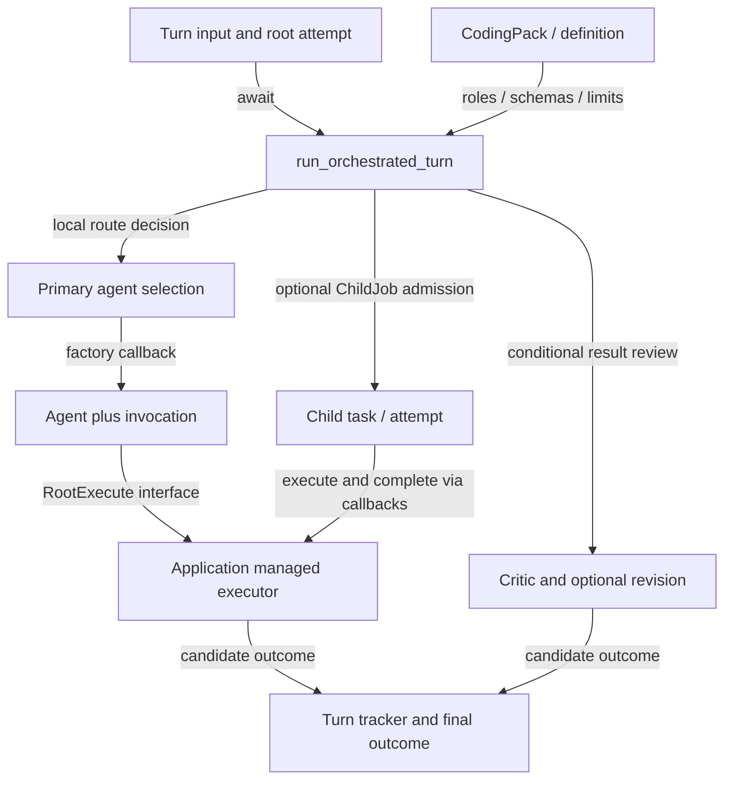
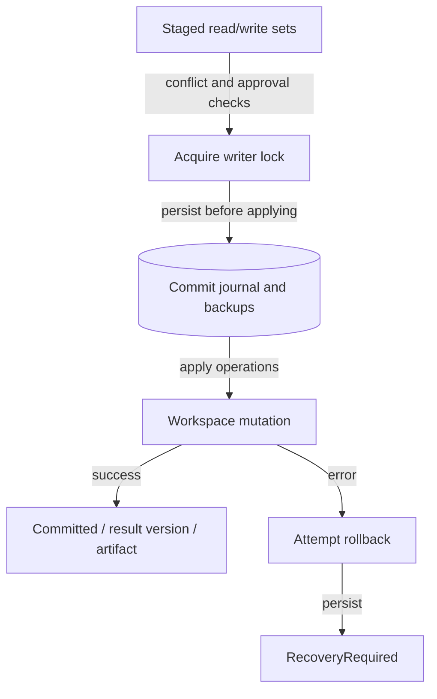
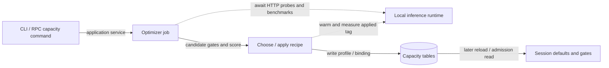

# Subsystem implementation details

[Overview](README.md) · [Execution paths](execution.md) · [Package/module atlas](atlas.md)

This view expands the supporting systems beneath the principal execution traces. The atlas supplies exact package targets, direct dependency edges and file-level navigation. The descriptions below distinguish behavior inspected in implementation from interfaces and optional integrations.

## Domain and core execution

`tetonic-domain` supplies serializable identities, invocation/job bindings, commands/projections, capabilities, artifacts, workspace versions, perception/action contracts and cancellation ownership. It is not a scheduler or a service. For example, `AgentJobSpec` binds a definition/input digest and capability/artifact requirements; executing that specification requires an executor and managed admission. `WorkScope` tracks admitted work separately from a cancellation signal: requesting cancellation closes admission, while outstanding work leases still have to be released. [identity.rs — `pub struct AgentJobSpec`](../../../engine/core/tetonic-domain/src/identity.rs#L27), [work_scope.rs — `pub struct WorkScope`](../../../engine/core/tetonic-domain/src/work_scope.rs#L29).

`tetonic-core::Agent` owns configuration and injected runtime dependencies. Its finite turn loop handles conversation, model/tool exchange and step budgets; `run_in_world` instead consumes perceptions and invokes a Brain before dispatching WorldActions. The presence of both methods on Agent does not make their state management identical. The world path checks its manifest and emergency stop directly; it does not route each world action through the finite coding tool loop. [agent.rs — `pub struct Agent`](../../../engine/core/tetonic-core/src/agent.rs#L28), [agent.rs — `pub async fn run_in_world`](../../../engine/core/tetonic-core/src/agent.rs#L371).

`tetonic-runtime` provides application assembly, runtime action authorization, capability consumption and the local attempt executor. It also exports the Brain and adapter implementations used independently by the world server. Thus it contains both assembly machinery and reusable components; importing the crate does not prove the assembly path was invoked. [lib.rs — `pub use assembly`](../../../engine/core/tetonic-runtime/src/lib.rs#L18), [action_broker.rs — `evaluate_and_issue`](../../../engine/core/tetonic-runtime/src/action_broker.rs#L62), [executor.rs — `pub struct`](../../../engine/core/tetonic-runtime/src/executor.rs#L11).

## Application, orchestration and coding tools

Application is the product composition and lifecycle owner. Session state, persistence handles, approval coordination, inference selection, capacity control and run supervision meet there. `CodingPack` delegates role parsing, tool allowlists, overlays and per-role step behavior to `CodingAgentDefinition::production()`. It injects a concrete filesystem code-index opener and verification-command resolver into the session host. That is an actual domain-specific binding behind the more neutral pack traits. [lib.rs — `pub struct Application`](../../../engine/litho/tetonic-app/src/lib.rs#L124), [coding_pack.rs — `impl SpecialistPack`](../../../engine/litho/tetonic-app/src/coding_pack.rs#L70), [coding_pack.rs — `pub fn product_session_host`](../../../engine/litho/tetonic-app/src/coding_pack.rs#L117).

Orchestration's turn function takes a pack, route inputs, spawn limits, a root-attempt id, an agent factory, event callback, root executor and child-job admission/completion interfaces. It can route to a specialist and optionally run a critic/revision. Root/child execution is delegated back through those interfaces so orchestration does not itself instantiate the durable supervisor. Spawn handling uses scoped budgets and child identity/binding, rather than equating a nested model call with an untracked independent agent. Detailed enforcement remains in application run service and managed execution. [turn.rs — `pub struct OrchestratedTurnInput`](../../../engine/mantle/tetonic-orchestrator/src/turn.rs#L41), [turn.rs — `pub async fn run_orchestrated_turn`](../../../engine/mantle/tetonic-orchestrator/src/turn.rs#L136), [spawn_budget.rs — `pub struct`](../../../engine/mantle/tetonic-orchestrator/src/spawn_budget.rs#L5), [run_service.rs — `pub struct`](../../../engine/litho/tetonic-app/src/run_service.rs#L102).

### Orchestrated turn — level 3 composition

Arrows are local calls/data flow, including awaited execution. There is no network edge in this composition view; provider network calls are inside the agent. Durable state belongs to the application supervisor beneath Managed, not to the route decision. Evidence: [turn.rs — `pub async fn run_orchestrated_turn`](../../../engine/mantle/tetonic-orchestrator/src/turn.rs#L136), [turn_execution.rs — `run_orchestrated_turn`](../../../engine/litho/tetonic-app/src/turn_execution.rs#L19).

`tetonic-tools::Tools` owns a workspace, process executor and mutation service, with optional code-index/memory/LSP dependencies, specialist allowlists, orchestration tools and capability consumer. Construction initializes a workspace transaction service and sandboxed coding executor. Thread-local caches hold index and memory connections for tool execution; those are distinct from SharedStore's cross-thread writer service. Tool visibility and executability depend on configured allowlists and injected capability support, not just the catalog schema. [lib.rs — `pub struct Tools`](../../../engine/litho/tetonic-tools/src/lib.rs#L64), [lib.rs — `pub fn new`](../../../engine/litho/tetonic-tools/src/lib.rs#L92), [host.rs — `impl`](../../../engine/litho/tetonic-tools/src/host.rs#L1).

## Context compiler and expansion authority

The compiler accepts a `ContextRequest` and provider; optional artifact/scanner dependencies are added explicitly. Compilation first checks revocation, normalizes the request, retrieves candidates asynchronously, filters by paths/data-class ceiling, ranks, deduplicates, applies budget and seals. Optional repository-summary retrieval degrades to no summary on failure; stage errors and invalid budget return structured failures. Sealing and handle registration are separate from initial retrieval. [mod.rs — `pub struct ContextCompiler`](../../../engine/strata/tetonic-context/src/pipeline/mod.rs#L93), [mod.rs — `pub async fn compile`](../../../engine/strata/tetonic-context/src/pipeline/mod.rs#L139).

### Context compilation — level 4

```mermaid
flowchart LR
  R[ContextRequest] -->|validate session| N[Normalize]
  N -->|await provider| Retrieve[Retrieve candidates]
  Retrieve -->|path / classification checks| F[Filter]
  F -->|score| Rank[Rank]
  Rank -->|remove duplicates| D[Dedupe]
  D -->|fit configured budget| B[Budget plus omission records]
  B -->|await seal| S[ContextPack / optional artifact]
  S -->|recheck revocation and limits| H[Register expansion handles in RAM]
```

Solid arrows are in-process stage calls, with asynchronous retrieval/sealing explicitly labeled. The optional artifact store is the persistent boundary; expansion-handle ownership is in-memory. Provider internals may read index/files, but this diagram asserts no network edge. Evidence: [mod.rs — `pub async fn compile`](../../../engine/strata/tetonic-context/src/pipeline/mod.rs#L139), [stage7_seal.rs — `pub async fn`](../../../engine/strata/tetonic-context/src/pipeline/stage7_seal.rs#L28).

Expansion has its own resource/authority limits: defaults are eight concurrent expansions, two per owner, 1024 live handles, 256 evidence items, 4 MiB text and 30 seconds. Handles track use counts; expired/exhausted handles are removed when registering new ones. Revocation is checked again after awaited compilation so a session closed during retrieval cannot regain handles. A shadow compile records metrics/errors without replacing live model input; the existence of shadow results must not be represented as context actually consumed by the model. [mod.rs — `impl Default for ExpansionLimits`](../../../engine/strata/tetonic-context/src/pipeline/mod.rs#L80), [mod.rs — `pub async fn compile_shadow`](../../../engine/strata/tetonic-context/src/pipeline/mod.rs#L263).

World-server context is a different implementation. It retains up to 32 last-observed facts, marks facts not present in current observations as unverified, and resets fact memory on scope changes. Recent intents reset with goal/context revision and are capped at four. Experience and agent-authored intention have separate scope and provenance handling. These facts describe supplied observations, not continuous hidden updates from the world database. [perceptive_brain.rs — `impl ObservationMemory`](../../../engine/mantle/tetonic-server/src/perceptive_brain.rs#L54), [perceptive_brain.rs — `impl DecisionHistory`](../../../engine/mantle/tetonic-server/src/perceptive_brain.rs#L36), [experience.rs — `impl`](../../../engine/mantle/tetonic-server/src/experience.rs#L13).

## Index, episodic memory and artifacts

The code index owns a SQLite connection plus an in-memory approximate-nearest-neighbor cache; it is not a globally shared concurrent database handle. A domain `CodeIndex` adapter maps concrete definition/search/outline/mention results into neutral result types. Application/CodingPack injects its opener; CLI index commands are another caller. Structural/keyword/embedding data are derived from workspace content and must not be mistaken for authoritative current files. [lib.rs — `pub struct Index`](../../../engine/strata/tetonic-index/src/lib.rs#L43), [host.rs — `impl CodeIndex for Index`](../../../engine/strata/tetonic-index/src/host.rs#L13), [coding_pack.rs — `pub fn product_session_host`](../../../engine/litho/tetonic-app/src/coding_pack.rs#L117), [cli_index.rs — `impl`](../../../engine/litho/tetonic-app/src/cli_index.rs#L69).

The memory crate holds session/message/tool/file-change history as well as policy, enrollment, capacity and durable-run records. This is a broad persistence package rather than only an agent recall engine. Session resume reconstructs messages, preserves available tool-call links and inserts an omission note when the loaded newest-N transcript is truncated. Its resume cap is 200 messages; it also repairs the initial complete-transcript user/system ordering. This is transcript rehydration, not restoration of an in-flight async stack. [lib.rs — `pub struct Store`](../../../engine/strata/tetonic-memory/src/lib.rs#L175), [resume.rs — `pub const RESUME_MESSAGE_CAP`](../../../engine/litho/tetonic-app/src/resume.rs#L9), [resume.rs — `pub fn rehydrate_messages`](../../../engine/litho/tetonic-app/src/resume.rs#L16).

SharedStore's writer queue is `std::sync::mpsc::Sender`, without the bounded-capacity argument used by a sync_channel. It should therefore not be described as providing bounded writer admission. Read operations use pooled connections; async reads offload blocking work. Storage errors and future-schema/digest-mismatch conditions have explicit error variants, but individual callers decide whether to propagate or degrade. [lib.rs — `pub struct SharedStore`](../../../engine/strata/tetonic-memory/src/lib.rs#L198), [lib.rs — `pub enum StoreError`](../../../engine/strata/tetonic-memory/src/lib.rs#L68).

The local artifact store creates `tmp`, `objects`, `meta` and `deletions` directories, requires a scan policy, and carries quota configuration. Its implementation uses a 100 MiB artifact bound and 4096-byte scan overlap. A Refuse scan policy is a deliberate failure mode when sealing without an available scanner; a finite overlap is a finite detection boundary. Quarantine validation and garbage collection are separate modules. These controls do not turn arbitrary remote results into trusted workspace writes. [store.rs — `const MAX_ARTIFACT_SIZE_BYTES`](../../../engine/strata/tetonic-artifact/src/store.rs#L15), [store.rs — `pub enum ScanPolicy`](../../../engine/strata/tetonic-artifact/src/store.rs#L36), [store.rs — `impl LocalArtifactStore`](../../../engine/strata/tetonic-artifact/src/store.rs#L52), [quarantine.rs — `pub fn`](../../../engine/strata/tetonic-artifact/src/quarantine.rs#L49), [gc.rs — `pub fn`](../../../engine/strata/tetonic-artifact/src/gc.rs#L22).

## Transactions and process execution

Workspace transactions stage read/write sets against a base workspace version. Commit detects conflicts and checks approval, acquires a writer lock, enters Committing, builds and persists a journal/backups, then applies operations. Success removes staging, captures a result version and persists a transaction artifact. Failure attempts rollback and records RecoveryRequired; ordinary abort refuses during Committing/RecoveryRequired. This is a file/journal recovery protocol, not one atomic SQL transaction covering every filesystem operation. [service.rs — `pub fn commit(`](../../../engine/core/tetonic-transaction/src/service.rs#L559), [service.rs — `pub fn abort`](../../../engine/core/tetonic-transaction/src/service.rs#L171), [recovery.rs — `pub fn`](../../../engine/core/tetonic-transaction/src/recovery.rs#L22).

### Workspace commit — level 4

All arrows are synchronous local filesystem/control operations; persistent journal/backups are marked. This view does not promise rollback succeeds, or that later artifact persistence cannot fail after effects have occurred. Evidence: [service.rs — `pub fn commit(`](../../../engine/core/tetonic-transaction/src/service.rs#L559).

Sandbox execution is requested through typed process requests and platform-specific backends. One-shot cancellation and long-lived process handles have different ownership requirements. LSP uses an injected launcher implemented by the application with sandbox service handles; the LSP package supplies framing, client, inbox/writer and pool logic. This differs from starting arbitrary child processes directly from every tool. Native timeout, containment and cleanup guarantees remain dependent on backend and requested enforcement level. [mod.rs — `pub trait SandboxBackend`](../../../engine/core/tetonic-sandbox/src/backend/mod.rs#L38), [lsp_launcher.rs — `impl LspProcessLauncher`](../../../engine/litho/tetonic-app/src/lsp_launcher.rs#L41), [lib.rs — `pub use client`](../../../engine/litho/tetonic-lsp/src/lib.rs#L13).

## Capacity management

Capacity optimization is an explicit operator/application operation, separate from a normal user turn. It checks cancellation/reachability, detects hardware, lists tool-capable model candidates, benchmarks combinations of context/GPU settings, scores candidates and applies a model recipe. Quick/full depths bound the search differently. It cleans the temporary benchmark model on cancellation paths where coded, errors if no models or viable profile exist, emits progress, and persists the applied profile. The applied tag is warmed and remeasured; candidate measurements alone do not certify it. [optimizer.rs — `pub async fn run_optimize`](../../../engine/mantle/tetonic-capacity/src/optimizer.rs#L102).

### Capacity operation — level 3

Solid arrows are local calls/persistence; dashed arrows are HTTP operations. Profiles are stored observations/settings, not an always-current measurement of hardware. Application status/doctor and admission determine how stored/live information affects turns. Evidence: [capacity_service.rs — `impl CapacityService for DefaultCapacityService`](../../../engine/litho/tetonic-app/src/capacity_service.rs#L72), [optimizer.rs — `pub async fn run_optimize`](../../../engine/mantle/tetonic-capacity/src/optimizer.rs#L102), [product_submit.rs — `pub fn reload_inference_services`](../../../engine/litho/tetonic-app/src/product_submit.rs#L413).

## Inference, policy, egress and secrets

The inference package defines messages, tool calls, request/response and provider interfaces, plus Ollama, pooled/fabric and hosted implementations. Compute-plane assembly chooses the actually operational application provider and wraps it in the broker/scanner path. The standalone world server instead builds Ollama directly. Hosted and decoupled-router implementations should be treated as optional library surfaces until a particular caller is identified; their exports do not change these inspected composition roots. [lib.rs — `pub mod hosted`](../../../engine/atmos/tetonic-inference/src/lib.rs#L19), [compute_plane.rs — `pub async fn`](../../../engine/litho/tetonic-app/src/compute_plane.rs#L54), [main.rs — `OllamaProvider::new`](../../../engine/mantle/tetonic-server/src/main.rs#L118).

Policy combines session/payload classification, destination/trust and action policy. Egress enforcement is a network boundary separate from tool capability issuance; hosted grants and enrolled-node rules have distinct code paths. Secret scanning/redaction is used by application inference, artifacts and daemon delivery. The JSON redactor recursively scans string values, and the emit-safe helper replaces scanner errors with a fixed placeholder rather than returning raw text. The process-wide shared scanner uses OnceLock: the first successful installation wins. [engine.rs — `impl PolicyEngine`](../../../engine/core/tetonic-policy/src/engine.rs#L55), [lib.rs — `pub struct EgressGuard`](../../../engine/atmos/tetonic-egress/src/lib.rs#L90), [lib.rs — `pub fn redact_json_value`](../../../engine/core/tetonic-secrets/src/lib.rs#L46), [lib.rs — `pub fn redact_text_sync_lossy`](../../../engine/core/tetonic-secrets/src/lib.rs#L38), [lib.rs — `pub fn install_shared_scanner`](../../../engine/core/tetonic-secrets/src/lib.rs#L81).

The telemetry package supplies trace context/propagation, stage timing, sampling, sanitization and a trace-write budget API. Startup chooses subscribers and application callbacks decide which records flow into audit/notifications. The server's TraceStore is an additional, separate observability system. No single diagram should imply that every telemetry event is durably retained or that server traces use the application's SQLite audit pipeline. [lib.rs — `pub use storage`](../../../engine/core/tetonic-telemetry/src/lib.rs#L26), [main.rs — `init_subscriber`](../../../engine/litho/tetonicd/src/main.rs#L76), [observability.rs — `pub struct TraceStore`](../../../engine/mantle/tetonic-server/src/observability.rs#L6).

## Remaining packages and lower-level navigation

The broker/run, fabric client/protocol, enrollment/node, RPC, standalone server and product entrypoints have dedicated traces in [execution](execution.md), [entrypoints](entrypoints.md), [state](state.md) and [operations](operations.md). Evaluation, architecture checks and benchmark executables are covered as tooling entrypoints. Every workspace package—including these supporting packages—has its exact target/dependency/module listing in [the atlas](atlas.md). Leaf files without a narrative citation remain explicitly marked mechanical in the ledger; they are not silently promoted to fully verified subsystem behavior.
