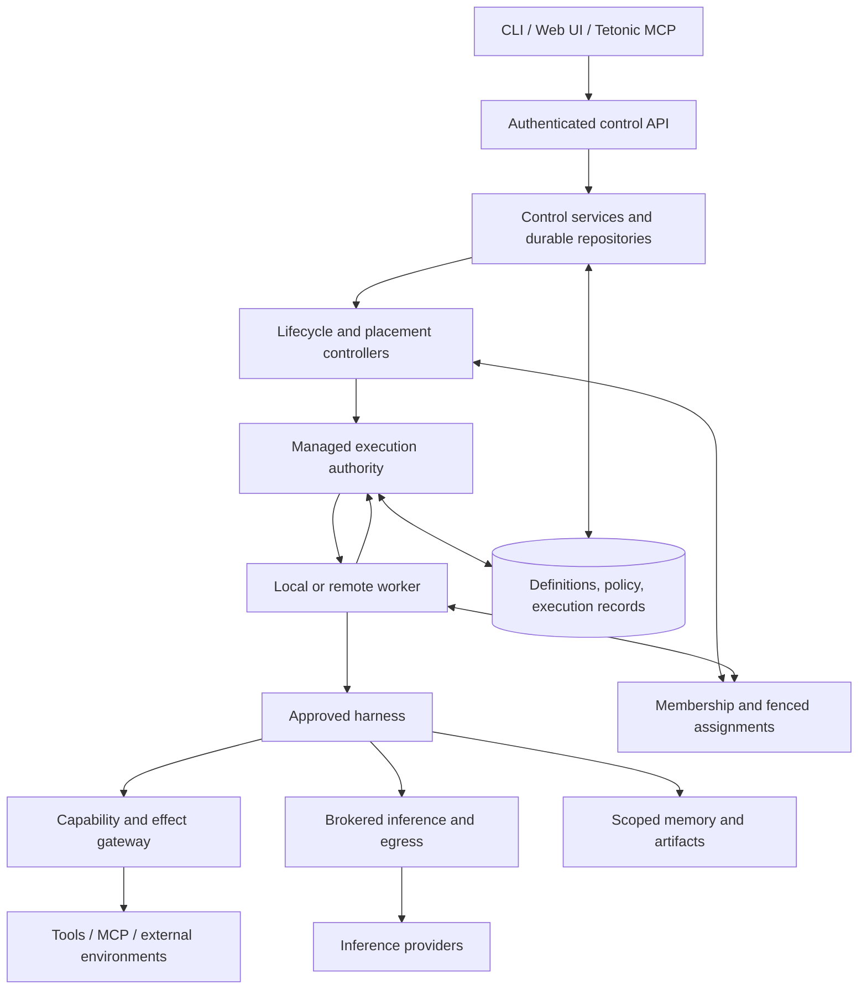

# Reconciliation design

Status: proposed implementation decisions, grounded in the accompanying source audit. No claim that the target is already implemented.

## Target and authority

Boxes are logical services, not a mandate to create one crate or daemon per box. Avoid package moves until a boundary is demonstrated with two consumers.

| Concern | Single authority | Existing seed | Change |
|---|---|---|---|
| Org/team/agent desired state | Durable control repositories | Fleet request shapes, identity store | Persist; authenticate; eliminate map authority |
| Definition versions | Immutable definition repository | Coding definition compiler and digest contracts | General definition schema, distinct agent IDs |
| Execution transitions | Run supervisor | tetonic-run | Retain validated transitions; generalize executor |
| Activation and placement decisions | Controllers | Admission/placement concepts | Reconcile durable requests; idempotent dispatch |
| Current ownership | Assignment service | Run leases, fabric lifecycle, role prototype tests | One ownership generation contract, durable issuance |
| Actual progress | Accepted worker observations | Run events, attestation/results | Worker reports are validated, not self-authorizing |
| Tool authorization | Capability service at effect boundary | Policy/action broker | Tenant, principal, attempt, parameters, expiry, fencing |
| Compute admission/accounting | Broker ledger | tetonic-broker | Scope reservations and settlement by organization |
| Memory/artifact grants | Scoped resource services | Stores/context/artifacts | Explicit personal/team grants and provenance |
| Observability | Projections + bounded stream of execution events | Telemetry/run events/trace stores | One correlation vocabulary and authorized replay |

## Canonical objects

- Organization: tenant identity and administrative boundary.
- Principal: human/service identity authenticated independently from agent identity.
- Team/squad: grouping and explicit resource grants; membership alone is not credential inheritance.
- AgentIdentity: stable actor belonging to one organization and owner; map existing IDs deliberately.
- AgentDefinitionRevision: immutable digest, harness reference/version, purpose/instructions, activation rules, tool/resource references, model constraints, recovery capabilities. Secrets are references, never embedded values.
- Activation: durable request/event/schedule occurrence with idempotency key, input reference and policy context.
- Execution: map to existing Run/Task semantics; do not invent a parallel RunStore. Decide parent/child and multi-task semantics in the first ticket.
- Attempt: one execution attempt with pinned definition and input, assigned worker, state and outcome.
- Assignment: attempt, worker identity, generation, validity and lease evidence.
- Session: optional conversation/history handle. No automatic equivalence to persistent agent identity.

Pin definition and relevant authorization revisions at admission. Configuration updates affect future activations by default; explicit steering/cancellation is a separate command. Security revocation must have defined current-execution behavior rather than waiting for a new definition. Record both admission authority and effect-time authorization decisions.

## Create-to-execute sequence

1. API verifies principal and tenant; authorize requested owner/team/definition/capability grants.
2. Commit identity, revision, desired state and reconciliation work in a transaction (or an explicitly recoverable outbox pattern).
3. Return Accepted/Ready or Pending, never Running based solely on record creation.
4. Controller consumes an activation idempotently, resolves pinned definition and scoped resources, and obtains admission.
5. Managed service commits run/task/attempt and assignment using the selected single-authority transaction protocol.
6. Worker authenticates the assignment, prepares its environment and harness, and claims execution. Only accepted worker evidence advances observed state.
7. Harness receives scoped service handles. Inference enters broker; tool/world effects enter authorization and outcome recording; memory reads/writes apply grants.
8. Worker emits progress and candidate outcomes. Manager validates ownership, binding and result integrity before committing terminal state.
9. Reconciler handles waits, cancellations, failures and future activations. No second supervisor silently overwrites the committed result.

## Harness reconciliation

First wrap the existing concrete Agent/Conversation implementation in the executor boundary; retain existing assertions. Then move the world loop behind that boundary. Lifecycle hooks cover start, input/event delivery, progress, cancellation, outcome and declared recovery support. Streaming callbacks are not a substitute for durable state.

Harness capabilities must distinguish restart-from-input, checkpoint-and-resume, reconcile-before-retry, and unsupported recovery. Do not serialize arbitrary process memory or replay side effects on the assumption that a transcript is a checkpoint. Standing agents remain persistent identities; finite activations and bounded long-lived executions can coexist. Record wakeups and waiting states so restart does not strand idle agents.

Keep local specialist creation as a policy-authorized child execution pattern, with parent lineage and attenuated grants. Coding role selection, critic/revision loops, verify/commit choices and prompts live inside the coding harness/pack. They are not mandatory platform controllers.

Environment adapters supply local observations and valid actions. World game logic remains external. Mark input classes explicitly: replaceable snapshots may coalesce; commands, messages, action results and other durable events require cursors/acknowledgments and defined redelivery. Preserve agent-scoped memory without injecting omniscient world state.

## Security and tenancy migration

Introduce a trusted RequestContext at the API boundary and derive ExecutionContext at admission. Carry organization, principal/authorization provenance, agent, definition digest, execution, attempt, assignment generation and correlation IDs. A caller-supplied org ID is not trusted context.

Add organization scope to all relevant tables, indexes, cache keys, replay queries, subscription filters, artifacts, credentials and approval records. Migration creates an explicit legacy organization and records its mapping; do not silently reinterpret old agent IDs as global tenant identities. Test negative cross-tenant reads and mutations, including guessed artifact IDs and event cursors.

Approval grants bind exact canonical action parameters and execution context, have expiry/revocation semantics and a durable resolution path. Resume must revalidate ownership and current policy. Separate platform-admin ability to configure grants from employee ability to activate an agent.

Egress mediation, process confinement and credential isolation are different controls. For untrusted external harnesses, document actual OS/container/network enforcement and refuse unsupported security profiles. Self-reported policy compliance is not an enforcement boundary.

## Storage and Keeper

Start with one durable control authority. Persist assignment generations alongside attempt state where practical, eliminating a cross-store atomicity problem in the first release. If coordination later moves to another store, specify authority, compare-and-set protocol, reconciliation and crash cases before implementation.

Keep worker membership distinct from execution ownership. A heartbeat is evidence of liveness, not proof of exclusive permission to act. Define lease expiry behavior under partitions, stale result rejection and action fencing. Already-dispatched external effects cannot be revoked retroactively; use idempotency, receipts and reconciliation, or record unknown outcome.

Keeper does not own all definitions, conversations or agent memory. No new consensus algorithm is planned. A single-control-plane deployment has an explicit availability limit; it is not advertised as HA. Do not mount one SQLite database across remote workers.

## Configuration and binary convergence

`tetonic-server` becomes the supported composition root. Server configuration holds listeners/authentication, storage, worker roles, provider connections, limits, telemetry, secret references and allowed execution profiles. Agent definitions live in durable resources; bootstrap definitions may be imported from config explicitly.

Standalone means the same control services with a local worker, not a different execution loop. Legacy CLI/stdio operations become transport adapters to those services. An embedded CLI mode may remain if it uses identical admission/enforcement and is explicitly local. Retire independent bootstrap paths after parity tests.

Retain inference worker transport as a distinct capability. Whole-agent workers need workspace/artifact preparation, harness lifecycle, progress, cancellation and declared recovery. Existing TLS/enrollment/ingress code may help but must not be mistaken for these missing semantics.

## Validation and migration rules

- Every sprint lands an end-to-end behavior plus removal of the superseded authority when safe.
- Preserve/replay existing durable histories; version schemas and provide backups before migration.
- New API contracts distinguish desired, observed, pending, failed, unknown and stale states.
- Exercise create/update/cancel races, duplicate activation, restart, blocked approval, lost acknowledgment, stale generation, worker loss, tenant denial and budget exhaustion.
- Keep local coding and Village smoke scenarios working through the common path.
- Test no unauthorized effect occurs, not just that a denial event was logged.
- Update architectural gates to enforce semantic boundaries; remove tests that merely require old symbol names only after replacement invariants exist.
- Separate inference routing from whole-agent placement in metrics, configuration and tests.

## Decisions to resolve before dependent implementation

1. Map execution terminology onto Run/Task/Attempt and decide agent-level concurrent activation policy.
2. Choose the initial authentication integration and local bootstrap trust procedure.
3. Define supported harness recovery profiles and effect idempotency requirements.
4. Choose V5 compatibility obligations for CLI/RPC, persisted histories and fabric versions.
5. Define memory ownership, retention/deletion and explicit team sharing.
6. Set lease/revocation latency and failure expectations for the actual deployment environment.

These are bounded design tickets, not reasons to postpone inventory or implement another speculative subsystem.
