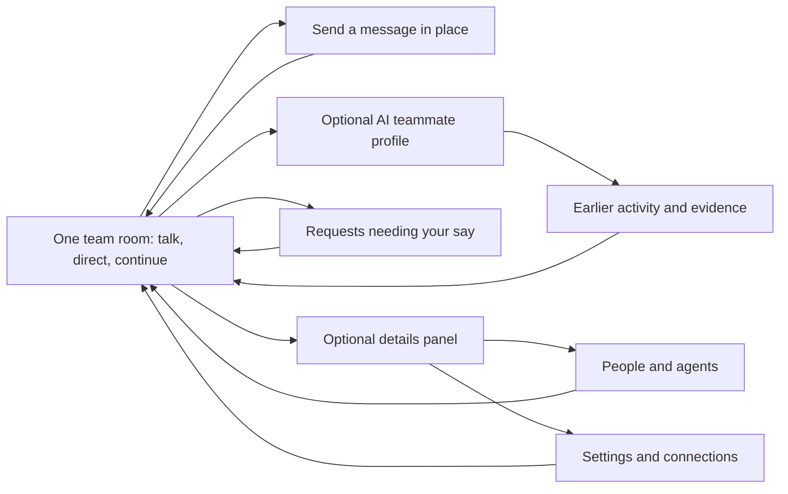
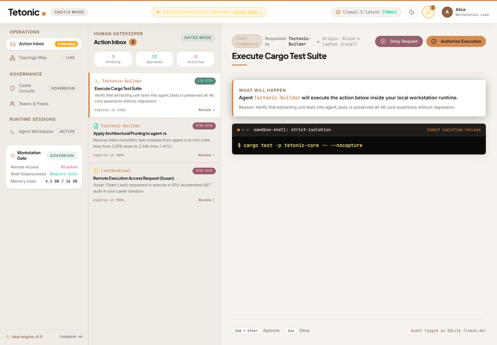
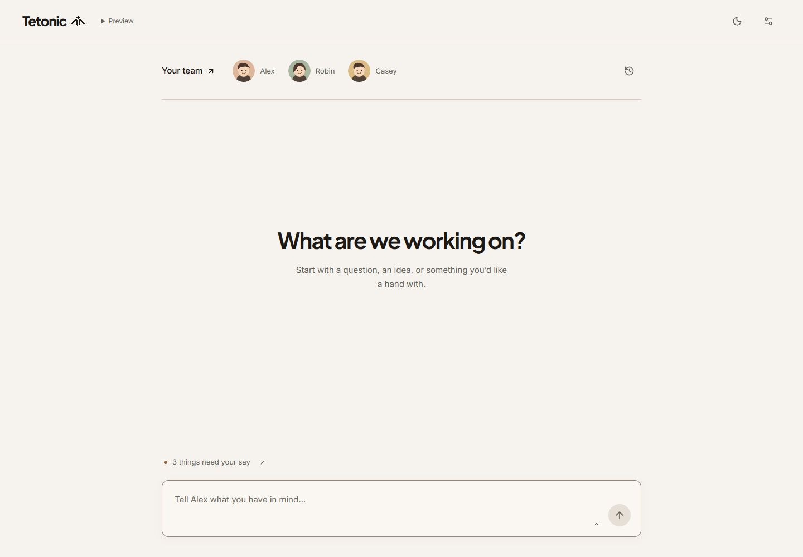

# Tetonic product experience review and redesign

**Latest revision:** [Fluid graph motion and floating chat](fluid-motion.md), covering
the full-screen map, persistent docking physics, sample event contract, floating
team/agent composer, validation and current integration limits.
The [card-map review](graph-map-design-review.md) and [earlier map-first revision](map-first-revision.md)
are retained as history. The audit below records the conversation-only iteration;
its first-screen layout and navigation decisions are superseded by the latest revision.

## Brief

Tetonic is infrastructure for persistent, governed agent teams. Once a platform
team has connected infrastructure, an employee should be able to give a team a
goal, collaborate when useful, review consequential actions, and understand the
results. The product is general purpose; a Rust coding trace is an example, not
the product definition.

The existing `web/` application was an operator-oriented React/Vite prototype.
It opened on an approval console with three pending requests, five equally
prominent destinations, machine policy summaries, and sample telemetry that
looked live. That made an implementation detail the first impression.

**The revised experience is one team room.** Friendly AI teammates, one short
invitation and one composer make up the everyday surface. Sending a message stays
in that room. There is no sidebar or separate Home, Activity and Teams journey.
Profiles, requests, earlier activity and settings open only when requested and
close back to the conversation, preserving its draft. No tour or setup wizard.

The user's latest feedback specifically rejected an information-heavy interface
even after its visual polish and goal-first entry improved. This final direction
reduces required destinations and reading, and gives agents recognizable faces,
short names and roles. It does not attempt to teach the engine on the first page.

Likely users are daily desktop users working within an organization; platform
operators need deeper settings, while employees need a low-friction work entry.
Mobile is a useful check-in and review surface. These are inferred usage patterns,
not findings from user research. The existing sample workspace is treated as
already provisioned; real provisioning and first-team creation are not implemented.

The five core jobs are:

1. Describe an outcome and begin working with an agent team.
2. Continue a conversation and inspect supporting execution evidence when needed.
3. Understand and compose a team without losing private/personal boundaries.
4. Review a specific request and inspect its decision afterward.
5. Diagnose execution settings and connections when necessary.

### Evidence and constraints

- Product intent: `docs/epics/v5-reconciliation/mvp-product.md`, especially its
  first-use objective and commitments about teams, privacy, oversight and huddles.
- UI: all five original views, the graph inspector, App handlers, both fixture
  stores, domain interfaces, shared primitives, theme styles, Vite config and scripts.
- Backend boundary: `tetonic-app/src/fleet_api.rs` explicitly describes a legacy
  unauthenticated in-memory prototype. `resources/local_control.rs` describes a
  local administrative composition, not an employee-facing remote transport.
- App imports fixtures and has no engine fetch/WebSocket path. Approve/reject,
  policy changes, assignment and message actions operate only on React state.
- Stack retained: React 19, TypeScript, Vite 6, Tailwind 4, Radix Dialog, Sonner,
  Inter, Plus Jakarta Sans and JetBrains Mono.
- User's visual reference matched the actual sibling `tetonic-site` brand styles.
  Reused its symbol, terracotta, ink, paper and thin rules. The room softens the
  composer and profiles; detailed controls retain the site's square treatment.
  Dark mode remains supported. The serif accent stays in detailed empty states.
- UI scope only: no engine business logic, APIs, domain interfaces or durable
  data models changed. Existing callbacks retained. The retired sample database
  display name was corrected to Tetonic; no database file was renamed.

## Mental model and information architecture

People think in **goals, team members, work, evidence, decisions and boundaries**.
The prototype emphasized castles, sovereignty, outposts, gatekeepers and ledgers.
Those implementation metaphors increased learning cost and overstated guarantees.

This is an interface map, not a claim that the preview has a team work engine.
The room uses the existing builder message callback. New user messages appear in
place; old sample events remain in Earlier activity. A receipt explicitly says
Alex is not connected. It does not create durable work, dispatch a team or run
inference. Alex, Robin, Casey and Sam are display aliases for existing fixture
IDs. AI identity and the original technical identity are available in profiles.
Sam is personal and is excluded from the shared team roster unless explicitly
assigned through the existing preview control. This is presentation filtering,
not an implemented server privacy boundary.

## Ranked audit

Severity: **blocks** prevents a core job; **errors** can produce wrong decisions or
false beliefs; **slows** increases work or recall; **polish** affects consistency.

| Severity | Finding and affected user | Evidence | Resolution |
|---|---|---|---|
| Blocks | First-time visitor cannot infer how to give agents work. Landing page is a prepopulated approval console. | [Original entry](screenshots/before-inbox-desktop.png) | One team room; immediate conversation input; no technical navigation. |
| Blocks | Fixed desktop sidebar consumes most of a phone viewport. Main content and controls are clipped. | [Original mobile](screenshots/before-inbox-mobile.png) | Sidebar removed; single-column room and optional panels; checked at 390px. |
| Blocks | Request rows and graph nodes are clickable divs. Keyboard users cannot select them normally. | [Inbox](screenshots/before-inbox-desktop.png), [map](screenshots/before-connections-desktop.png), component source | Native buttons, searchable list, keyboard map navigation. |
| Errors | Escape denies the selected request; a familiar dismissal key becomes a decision. | Inbox source; [request actions](screenshots/before-inbox-desktop.png) | Explicit decision buttons. Escape dismisses the active dialog without deciding. |
| Errors | Fixture actions claim signed approval, stopped execution, verified traces and live connectivity. | [Activity](screenshots/before-activity-desktop.png), [console](screenshots/before-workstation-desktop.png) | Honest preview notices and action-specific feedback; unsupported operations say why unavailable. |
| Errors | Remote approval payload is absent; risk labels are guessed from request type. | [Original inbox](screenshots/before-inbox-desktop.png), request renderer | Render every request's payload. Describe action type; no unsupported safety judgment. |
| Errors | Pledge button chooses the first eligible agent without showing who will be assigned. | [Teams](screenshots/before-teams-desktop.png), handler | Explicit picker with charter/current assignment before calling the existing callback. |
| Errors | Every team/graph activity link opens the builder, regardless of selected identity. | Teams/App/Graph source | Selection carried into Activity. Missing agent trace produces an empty state. |
| Errors | All tool results display exit 0; clipboard failures still show success. | Huddle source and [activity](screenshots/before-activity-desktop.png) | Actual exit code and zero-duration values; clipboard rejection yields inline recovery. |
| Errors | Static policy summary contradicts changed switches; local table includes a remote agent without clear distinction. | [Workstation](screenshots/before-workstation-desktop.png) | Derive summaries from props; label local/remote per record; name all three switches. |
| Slows | A first-time user must learn five destinations plus infrastructure jargon before starting. | [Original entry](screenshots/before-inbox-desktop.png) | One everyday room; details open on demand and return to the same conversation. |
| Slows | Activity leads with telemetry and internal notes; controls compete with conversation. | [Original activity](screenshots/before-activity-desktop.png) | Messages default; tools/notes and controls on demand. |
| Slows | Graph overlaps nodes, clips connectors, and requires spatial hunting. Inspector has no modal focus contract. | [Original map](screenshots/before-connections-dark.png) | List default, search, filters, nonoverlapping map columns, fit/pan/zoom, semantic Radix modal. |
| Slows | Approval counters are invented and reviewed requests disappear. | [Original inbox](screenshots/before-inbox-desktop.png) | Counts derived from existing state; Reviewed filter retains detail. |
| Polish / access | Small low-contrast labels, theme classes not tied consistently to dark toggle, missing labels, indiscriminate motion. | [Dark console](screenshots/before-workstation-dark.png), styles | Explicit class-based dark variant, stronger secondary text, focus/labels and reduced-motion rule. |
| Polish | Pill-heavy card styling and old mark differ from supplied current landing page. Font imports leave broken bundle URLs. | Original screenshots; initial build warnings | Reused site brand treatment and symbol; bundle fonts through Vite imports. |

## Design principles

1. **Start with the team and a conversation.** The first page invites a person to
   say what they need. Names, faces and short roles introduce the AI teammates.
2. **Show only what the next decision needs.** Conversation first; traces, settings
   and composition detail when requested. Visibility is not the same as overload.
3. **Make the team understandable before making it configurable.** Show people,
   agent responsibilities and scope. Provisioning belongs to the platform layer.
4. **An indication is a claim.** A success message, status, permission statement
   or approval counter must reflect available evidence, including preview limits.
5. **Keep identity and consequences attached to the action.** Selected agent,
   request origin, payload and decision must remain recognizable across views.
6. **Keep one everyday place.** Starting, returning and checking in should not
   require learning a set of operational destinations. Preserve drafts in panels.
7. **Use the brand to orient.** Paper supports reading; terracotta is an accent;
   ink, hierarchy and rules establish what matters. Personality stays explicitly AI.

## Alternatives and rationale

| Flow / ideal experience | Alternatives considered | Chosen direction and tradeoff |
|---|---|---|
| First moment: understand purpose and start without training | A: operational dashboard; B: goal-first Home plus Activity/Teams destinations; C: one persistent team room with optional detail panels | C. A foregrounds operations; B still asks the user to learn destinations and read guidance. C keeps the team and conversation together. Missing live prerequisites must be handled contextually by future integration. |
| Follow work: converse first and inspect evidence as needed | A: raw chronological telemetry; B: conversation with optional event views; C: work board replacing the conversation entirely | B. A overwhelms ordinary users. C needs durable task/outcome models the UI does not have; recommended for integration. |
| Review request: understand what is requested before deciding | A: modal per request; B: list + evidence + decision, with decision history; C: bulk approve from list, removing the detail step | B. A hides context; C removes evidence at a consequential boundary. Mobile uses a compact scrollable list and full-width detail. No universal confirmation dialog added. |
| Compose team: knowingly choose a member and inspect its work | A: auto-pick first agent; B: explicit inline picker; C: full wizard for model/tools/budget/roles | B. A is ambiguous; C is setup burden and needs additional engine contracts. Existing team selection remains one native control. |
| Diagnose relationships: find an entity, inspect related evidence | A: graph-only; B: search/list with optional map and inspector; C: embed every connection in Activity, eliminating Connections | B. Accessible and efficient for known entities; map preserves spatial overview. C clutters daily conversation and duplicates operator detail. |
| Adjust policies: see the scope and immediate resulting setting | A: summary + inline toggles; B: wizard; C: make every user configure policies during entry | A, in the optional settings panel. B adds steps without improving the current three-switch task. C leaks platform concerns into first use. Live changes need effective-policy authority and server acknowledgments. |

### Flow counts from code and walkthroughs

Counts describe interactions from the relevant view, not measured human speed.
Reading evidence is not counted as a click; doing it remains essential.

| Flow | Before | After | Decisions / memory burden |
|---|---|---|---|
| Start from first entry | Find Agent Workspace → locate composer → type → send: 4 interactions | Type → send, in place: 2 | Say what you need; sample teammates are visible. No navigation or setup concepts required. |
| Review another request | Select row → decide: 2 pointer actions; selection inaccessible by keyboard | Select button → decide: 2 actions; Reviewed available afterward | Same decision, now with all payload types and visible identity. |
| Add a chosen agent | One opaque click chooses an agent for the user | Add agent → choose if needed → submit: 2–3 | Deliberately adds a choice because identity matters; charter and current assignment eliminate recall. |
| Inspect a team agent | Click Huddle Stream; opens wrong agent | Click View activity; selected identity preserved | One action now reaches the intended record. |
| Find a known connection | Pan/zoom/hunt → click | Search → inspect: 2; map optional | Recognition by name/type/location instead of remembering graph positions. |
| Inspect an execution result | Scan full trace among notes | Tools → inspect/copy | One explicit filter reduces distraction; full event view remains available. |
| Open workstation controls | Direct main navigation | Settings icon → optional panel: 1 | Secondary operator controls occupy no persistent main navigation. |

## Implemented changes

- One team room, illustrated AI teammate profiles, familiar display names, one
  composer and a quiet pending-request cue. No new work engine or scripted friendly
  reply. The existing callback remains; room feedback explains the preview boundary.
- Optional panels retain all five detailed workflows; closing returns focus to
  the room composer. Draft stays mounted. Profile dismissal returns to its opener.
  Friendly names remain consistent in team, request and activity views. Original
  technical names remain available in profile details and operator inspection.
- Removed the replaced Home, Header and Sidebar components and their unused styles.
  App title follows context; skip link reaches the conversation.
- Responsive shell and overflow handling; copied text is selectable.
- Approval evidence for all types, safe explicit decisions, real session counters,
  reviewed history, empty state and focus recovery after decisions.
- Team picker with explicit identity, empty team guard and meaningful activity links.
- Activity defaults to messages; details/controls and agent notes are disclosures.
  Actual exit status, contextual filters, labels, multiline keyboard sending and
  clipboard error recovery. Non-builder message controls explain unavailable wiring.
- Searchable Connections list, optional map, filters, fit/zoom/pointer/keyboard pan,
  relationship lists, all available trace payloads and Radix modal focus handling.
- Workstation values derive from supplied records. Policies have names/descriptions
  and controlled state; unavailable creation/connection operations are honest.
- Shared render-error recovery keeps the rest of the navigation available.
- Brand styles, site symbol, reliable bundled fonts, dark toggle consistency,
  contrast adjustments and reduced-motion support.
- Interaction tests and reproducible type/build/format commands.

### Screenshots

The before entry was Approvals. Compare it with the final room directly.

Final room evidence: [mobile](screenshots/final-room-mobile.png),
[mobile dark](screenshots/final-room-mobile-dark.png),
[teammate profile](screenshots/final-room-profile.png),
[message feedback](screenshots/final-room-message.png),
[mobile requests panel](screenshots/final-room-requests-mobile.png).

The table below records the earlier detailed-view redesign. Its `after-*` images
predate the final room and show the previous navigation shell; they are retained
as intermediate evidence, not the final first-use experience. The detailed
components now live in optional panels.

| Screen | Before desktop | After desktop | Before narrow | After narrow |
|---|---|---|---|---|
| Entry | [Approval console](screenshots/before-inbox-desktop.png) | [Home](screenshots/after-home-desktop.png) | [Clipped console](screenshots/before-inbox-mobile.png) | [Home](screenshots/after-home-mobile.png) |
| Approvals | [Before](screenshots/before-inbox-desktop.png) | [After](screenshots/after-inbox-desktop.png) | [Before](screenshots/before-inbox-mobile.png) | [After](screenshots/after-inbox-mobile.png) |
| Teams | [Before](screenshots/before-teams-desktop.png) | [After](screenshots/after-teams-desktop.png) | [Before](screenshots/before-teams-mobile.png) | [After](screenshots/after-teams-mobile.png) |
| Activity | [Before](screenshots/before-activity-desktop.png) | [After](screenshots/after-activity-desktop.png) | [Before](screenshots/before-activity-mobile.png) | [After](screenshots/after-activity-mobile.png) |
| Connections | [Before map](screenshots/before-connections-desktop.png) | [After list](screenshots/after-connections-desktop.png) | [Before](screenshots/before-connections-mobile.png) | [After](screenshots/after-connections-mobile.png) |
| Workstation | [Before](screenshots/before-workstation-desktop.png) | [After](screenshots/after-workstation-desktop.png) | [Before](screenshots/before-workstation-mobile.png) | [After](screenshots/after-workstation-mobile.png) |

Dark captures for each original view are named `before-<view>-dark.png`.
Intermediate dark captures use `after-<view>-dark.png` and
`after-<view>-mobile-dark.png`, including Home. Additional evidence includes the
assignment picker, code diff, reviewed decision, no-event agent, map and inspector.
Screenshots with a visible focus ring intentionally show keyboard navigation.

## Verification and limits

- `npm test`: 16 interaction tests pass, including in-place room entry, draft and
  focus preservation, explicit AI profiles/private-roster filtering, retained agent
  selection, approval history, harmless Escape, all requests reviewed, explicit
  assignment, named policy switches, modal dismissal/focus return, search recovery,
  actual nonzero exit code, clipboard rejection, empty collections, multiline
  submission and render failure recovery.
- `npm run build`: TypeScript and production bundle pass; previous unresolved font
  URL warnings are resolved. Fonts are present as fingerprinted build assets.
- `npm run typecheck`: passed. No pre-existing lint configuration was present;
  Prettier supplies a formatting check, not a substitute claim of semantic linting.
- Browser walkthroughs used desktop 1440px and narrow 390px widths, both themes,
  all original views, and keyboard activation. The final room measured exactly
  390px document width and 844px height at a 390×844 viewport. The optional request
  panel measured 390px width as well, with its content scrolling vertically.
- Inspector has a named dialog, autofocus, constrained focus, Escape dismissal
  and return to the invoking control. Approval selection, switches, composer,
  navigation and graph entities expose semantic names and states.
- Contrast calculation: ink on paper 15.80:1; ink on terracotta 4.60:1; dark body
  on ink 13.32:1; dark secondary on surface 6.41:1; dark accent on surface 7.46:1;
  light control boundary on surface 3.42:1. Secondary light text was darkened from
  `#6F6A63` to `#655F59` because the original failed 4.5:1 on the paper wash.
- Reduced motion is covered by a shared media rule disabling transitions,
  animation and smooth scrolling; the map has no ongoing animated signals.
- Dependency install's final npm audit reported zero vulnerabilities.

| State | Verification |
|---|---|
| Full / partial | All original fixture views visited before and after; per-agent event absence handled. |
| First visit / returning | Room on fresh load; theme persistence; conversation and draft retained while panels open; decisions within session. |
| Empty | Approvals exhausted in browser; no-event agent in browser; empty team/connection/approval props in tests; search no match. |
| Success | Preview decision persists into Reviewed; team addition appears; message appears in the same room with honest connection feedback. |
| Disabled | Empty message, unavailable non-builder handler, personal-space assignment. |
| Error | Clipboard rejection and render fallback in tests. Unsupported integration controls provide truthful feedback. |
| Overflow | Narrow layout, long command/diff paths in browser; wrapping and inner scroll regions. Thousands of records are not performance-qualified. |
| Loading / network / auth denied | The current app has no async engine client. These states cannot be truthfully exercised as real requests. They require the integration work below; no fake loading animation added. |

This is not WCAG certification, a screen-reader user study, or a measured proof
that first-time users succeed without hesitation. Browser semantics, keyboard
walkthroughs, selected contrast pairs and interaction tests improve confidence;
assistive-technology trials and real user sessions remain necessary. Requested
states that depend on absent engine behavior remain explicitly unverified.

## Recommendations not implemented

1. **Make the conversation lead to real work.** Connect the room to authenticated durable team work
   creation through the reconciled resource/activation path. Show the user's own
   goal and its actual current state. Replace the single builder fixture handler
   with real routing; do not imply all displayed teammates received the message.
   Real team creation and choosing the room's team are also absent.
2. **Unify the read model.** Teams, active agents, assignments, approvals, events,
   relationships and policy must refer to the same identifiers and revisions.
   Separate fixture statuses are currently contradictory and only labeled as such.
3. **Design the work object before adding more screens.** Outcome, owner, current
   action, blocker, evidence, budget and next human decision should anchor one
   workspace. Huddles should create revisable work, not permanent chat-only plans.
4. **Make setup conditional and small.** Provisioned users should start immediately.
   Missing team, tools, inference or workstation grants should identify the single
   blocker and responsible person. Avoid front-loading model jargon or a long wizard.
5. **Server-authoritative action state.** Pending acknowledgment, approved, denied,
   expired, conflict, unavailable and unauthorized need distinct representations.
   Add retries/idempotency and stale-data handling; never equate local toggles with
   policy enforcement or a UI pause with process cancellation.
6. **Enforce privacy and membership.** Existing pledge mutation adds to a team but
   does not reconcile prior membership. Do not claim a personal/team privacy
   boundary until contexts and access checks are enforced by the engine.
7. **Preserve work across restart.** The room now retains a draft while panels
   open, but durable conversations/goals, drafts, routing/deep links, replay cursors
   and return-to-work state are still needed. Theme alone persists across reload.
8. **Scale evidence views.** Pagination/virtualization, search across durable events,
   resource claims and large graph discovery need real cardinality tests. Rendering
   every fixture is adequate for this preview, not proof of fleet-scale UX.
9. **Validate comprehension.** Give new users an outcome, show the room with
   no explanation, and observe first action, completion, hesitation and recovery.
   Test an employee, a platform operator, a keyboard user and a screen-reader user.
   Measure whether they understand teams and execution boundaries, not color preference.

### Final adversarial review

The remaining biggest weakness is not styling: the preview's team framing is
ahead of its single-agent scripted handler. A visible Preview disclosure and
explicit post-send receipt explain that boundary. The highest-priority
implementation follow-up is real team work. A real
work object and one source of truth will improve the experience more than another
dashboard. The new first moment reduces entry burden, but real comprehension and
trust must be tested on live, accountable work rather than sample screenshots.
