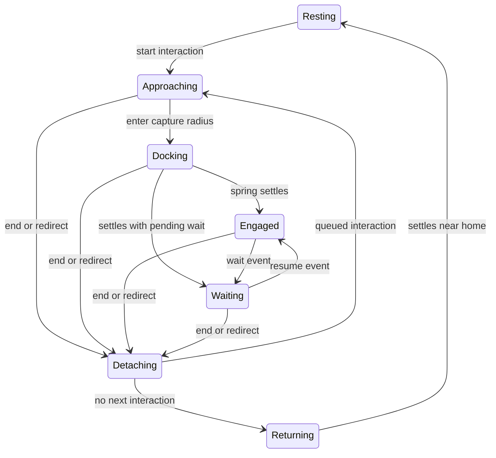

# Fluid graph motion and floating chat

2026-09-28. Current UI revision; supersedes the card-map interaction treatment in
`graph-map-design-review.md`. Earlier reviews remain as history.

## What changed

The old replay recomputed positions from a sequence of tweens. An agent arrived,
then stayed at the last endpoint even after an action should have ended. Tool icons
had an independent CSS animation; there was no persistent velocity, release state,
shared-orbit allocation or ambient movement.

The existing full-screen map now renders a persistent motion model. It reuses the
same agent IDs, portraits, graph entities, traces, modals and application handlers.
There is no second graph demo application or new backend orchestration subsystem.

The bottom chat composer floats above the map. A compact recipient selector chooses
the team or one agent; the transcript opens upward on demand. Team and individual
drafts/history stay separate. Sending a message does not reset motion or camera.
Messages only append a human-authored local event. No agent response is simulated.

## Motion contract

- **Ambient:** independent low-frequency drift about stable homes. Seven world units
  for agents, 3.5 for destinations. This creates no operational state, tool or result.
- **Approach:** spring attraction with a short tangential force bends travel. Position
  and velocity persist when the destination changes; speed is bounded.
- **Capture:** a stronger, underdamped spring supplies the small overshoot and settling
  wobble. Portraits and labels stay upright. The destination receives a small reaction.
- **Engagement:** stable allocated slots, subtle angular drift, and a restrained radial
  connection. The initiator moves around the recipient in a peer interaction.
- **Release:** a 320ms outward/tangential release fades the old relationship, then
  carries velocity into the next approach or the return home. Terminal outcome marks
  come only from completed/failed/cancelled events.
- **Tools:** the same fixed-step model springs a tool satellite into place during
  capture and withdraws it during release. No separate endlessly repeating CSS loop.
- **Shared destinations:** newcomers take free slots; departures do not reshuffle
  survivors. Soft body separation reduces overlap during travel.

`MOTION` in `web/src/lib/graphMotion.ts` centralizes the principal tuning parameters.
The integration timestep is 1/120s. The model caps long stalls, and the UI freezes
the playback clock while hidden to prevent a background catch-up jump. Camera
animation is separate; zoom maintains the pointer/pinch anchor.

Hovering or focusing an entity holds the local scene, making targets inspectable.
Opening details pauses playback and closing returns to the same place. Playback
does not resume by surprise. Under reduced motion, the same events set explicit
attachment, wait and terminal states without animated travel or ambient drift.

## Source truth and integration boundary

`InteractionEvent` has start, end, wait and resume variants, with stable event and
interaction IDs. Duplicates and late results for superseded interactions cannot end
new work. A wait received during the previous attachment's release is retained for
the queued interaction.

The application currently supplies **no live engine events**. The Sample trace
adapter uses existing fixture targets/statuses and compressed display timing. Only
success/failed fixture statuses produce terminal events. Running fixture steps
remain attached when playback ends; stopping playback does not mean work completed.
Static `GraphEdge.isActive` values never create operational animation.

The other three sequences are explicitly labeled synthetic motion examples. Their
completion, waiting, failure, cancellation and redirection events are scenario data,
not claims about actual work. Current approval fixtures are separate snapshots;
approving one does not advance a sample trace or execute its tool.

A future integration must map authenticated, ordered engine interaction events to
this contract, including identity, outcomes, reconnect snapshots and cancellation.
This is a presentation model, not an authorization, scheduling or execution layer.
It currently displays one primary interaction per agent. Concurrent tool lanes,
cyclic peer groups and large-fleet clustering require an explicit integration and
layout design before production use. No large-fleet performance claim is made.

## Validation

23 Vitest tests pass, including:

- Dock/capture, explicit detachment and return to rest; satellite lifecycle.
- Position/velocity continuity through cancellation and immediate redirection.
- Stable slots and separation for three agents sharing a destination.
- Peer interaction, wait/resume and a wait arriving during release.
- Matching trajectories at 30, 60 and 120Hz; bounded non-operational idle drift.
- Reduced-motion semantics, duplicate/late events and removed destinations.
- Fixture outcome provenance and no ghost attachments at the end of synthetic runs.
- Map scope, agent drafts, floating team/agent chat and scene persistence on messages.
- Exact request decisions, team creation/membership, camera/focus restoration.
- Existing tool-result, clipboard-failure, multiline input and view-recovery behavior.

TypeScript checking, production build and repository web formatting checks pass.
Browser checks exercised the full service-to-service/peer sequence, shared docking,
release back to rest, cancellation/failure states, reduced-motion control, inspector
return, floating chat and dark mode. Narrow layout checked at 390×844. Real touch
hardware and assistive-technology sessions were not available; browser and jsdom
checks are not a substitute for those sessions.

Evidence:

- [Shared docking with floating composer](screenshots/fluid-map-orbit.png)
- [Expanded floating conversation](screenshots/fluid-map-chat.png)
- [Dark theme](screenshots/fluid-map-dark.png)
- [Narrow viewport](screenshots/fluid-map-mobile.png)

Everything remains local. No deployment, engine execution or backend migration was
performed for this UI revision.
