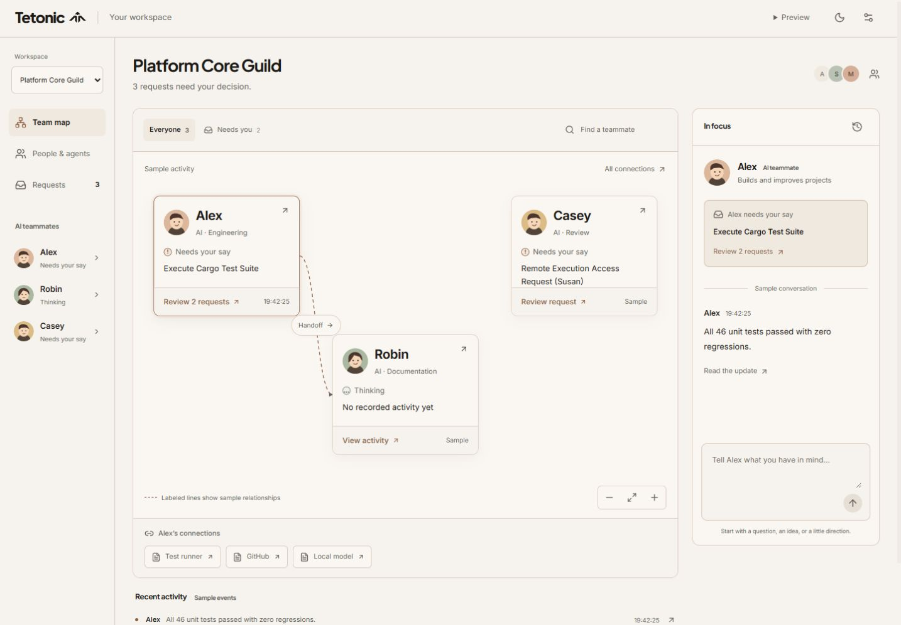

# Team workspace map: design and implementation review

September 28, 2026. This supersedes the first map-first revision. Changes are in
the existing `web/` preview and this review; unrelated engine work is untouched.

## Diagnosis

The starting map established recognizable people and a warm brand, but needed a
useful everyday job. Inspection of the running interface and code found:

| Observed issue | Consequence | Change |
| --- | --- | --- |
| Names and generic status dominated; work stayed in another panel. | A glance could not explain what needed attention. | Show a pending request, otherwise the latest recorded non-thought event, on each agent. |
| Unlabeled lines mixed peers, tools, inference and services. | Available connections could look like current collaboration. | Label peer relationships and inspect their description; show resources for the selected agent. |
| Positions depended on named fixture IDs. | Composition only worked for the supplied cast. | Stable roster slots, filtering and six-agent pages; a vertical layout at narrow canvas widths. |
| No workspace switch. | Personal and shared contexts were hard to distinguish. | Switch existing teams; scope the map, requests, recent activity and connected resources. |
| Graph and agent fixtures had conflicting statuses. | Inspection could contradict the main view. | Project canonical agent/approval state into the graph; reuse status labels in activity and team views. |
| Preview handlers implied execution. | Feedback overstated what a decision had done. | Explicit local decision/message records without claiming inference, tool execution or resumed work. |

The audit covered App, TeamRoom, both graph views, the inspector, approvals,
activity, teams, types, fixtures and styles. Existing IDs and inspection paths
were retained. App imports fixture data, with no authenticated engine subscription,
durable work model or authoritative conversation destination.

The expectation that employees prefer recognizing teammates before inspecting
infrastructure is a hypothesis informed by the user's feedback, not an
independently validated research finding.

## Three directions

| Approach | Strength | Tradeoff |
| --- | --- | --- |
| People constellation | Recognition and approachable exploration. | Portraits alone explain little about work; many relationships become a tangle. |
| Work landscape | Goals, ownership, dependencies and outcomes support returning to autonomous work. | Requires durable work IDs, assignments and transitions absent from this preview. Inventing them would misrepresent the engine. |
| Team workspace — chosen | People carry concise sample context; decisions and evidence stay nearby; team selection contains the graph. | Less expressive about complex work dependencies until richer records exist. |

The primary question is “What is my team doing, and does anyone need me?” The
map remains the main surface; conversation and evidence support it.

## Visual grammar and principal interactions

- **Agent cards:** portrait, name, concise role marked AI, state, one request or
  recorded update, and one next action. Aliases retain existing IDs. The card
  shows “No recorded activity yet” when there is no supporting event.
- **State:** text and symbols supplement color. An outline means selection,
  not execution. Requests take priority over generic status. Deciding a request
  does not automatically claim that an agent resumed work.
- **Relationships:** dashed directional lines describe sample peer connections.
  Selecting a label reveals its supplied description and explicitly distinguishes
  it from a live action or completed handoff. No animated traffic is invented.
- **Resources:** the selected agent's tools, services and connected people appear
  below the canvas. Buttons open the existing inspector with the original IDs.
- **Space:** cards retain roster slots as selection, requests and events change.
  Lines convey direction; containment conveys team scope. Position does not claim
  priority, ownership or execution location. Small-roster filters retain slots;
  larger filtered pages can re-pack.
- **Investigation:** selecting a person updates the adjacent In focus panel. On
  phones it opens the conversation tab and focuses the person's heading. Closing
  inspection returns to the original control and camera position.
- **Intervention:** a card's request opens that exact ID in the existing review
  panel. Escape does not decide. Reviewed records remain inspectable and counts
  update consistently.
- **Return:** three recent recorded events link to evidence when nobody is
  chatting. This is not “since your last visit”; there is no durable read cursor.

Search covers the entire selected roster, including later pages. Needs you counts
agents with pending requests; Requests counts requests. Off-view peer connections
are disclosed. Selection, the existing Alex draft and camera survive inspection.
Activity does not auto-pan or steal focus. Explicit page changes fit the page;
workspace changes currently reset camera and filters.

## Applying the additional design reference

The supplied clarity-focused article is treated as design guidance, not verified
evidence for broad claims about all users or 2026 trends. Concrete changes:

- Removed the decorative background grouping shape and repeated visible map
  heading/count. The small canvas texture remains a pan affordance.
- Shortened the introduction to the number of decisions needed. Concise card
  roles explain the cast without requiring every profile to be opened.
- Kept navigation stable and filtering explicit. No automatic personalization,
  engagement motion, surprise rearrangement or tutorial.
- Added polite filter-result announcements and larger narrow-layout actions.
  Existing visible focus, reduced-motion rules and theme tokens are retained.
- Used paper, ink and terracotta without making effects carry meaning.

The reference does not justify adding voice controls, confidence scores or
progress indicators without working input and execution contracts.

## Verification and critical second pass

**26 interaction tests pass**, TypeScript checking passes, Prettier checking passes
and the production Vite build succeeds. Seven new tests cover attention/no-match
recovery; workspace rosters/requests and draft retention; keyboard relationship
inspection and focus/camera return; exact request routing and truthful decisions;
inspector status consistency; 50-agent synthetic pagination/search; and empty teams.

The running browser was checked at 1440 × 1000 and 390 × 844, in light and dark
themes: selection, relationship-to-evidence navigation and focus return, phone
selection/request navigation, no horizontal page overflow, card readability and
normal vertical scrolling. This is not a screen-reader certification, physical
touch-device test or independent usability study.

The second pass fixed undersized cards caused by fitting, conflicting inspector
statuses, stale execution claims and a narrow layout that could inherit desktop
zoom. The additional reference led to removing repetitive chrome. A stale Vite
module after formatting was recovered by restarting the development preview;
the production bundle and tests passed independently.

Verified scales: one personal agent, three shared agents, two workspace choices,
and a synthetic roster of 50 with six shown per page. This is not a fleet-scale
graph benchmark. Dense relationships can cross or overlap labels. Off-page edges
are omitted with an explanatory note. Aggregation and real workload testing are
needed before claiming support for large connected populations.

First-use assessment: names and roles explain who is present; requests and Needs
you identify an action; selecting a line explains the relationship. The sample
remains a weakness: Robin is thinking but has no recorded non-thought activity.
The UI admits the gap. Real participants should next be asked to find work,
inspect a handoff and review a request without coaching.

## Required engine/client contracts

These are integration requirements, not implemented backend capabilities.

| Contract | Needed behavior |
| --- | --- |
| Workspace/identity | Authenticated organization/team membership, stable agent IDs and server-enforced personal/shared visibility. Client filtering is not authorization. |
| Work/ownership | Durable work ID, goal, title, owners/collaborators, state, dependencies, outcome and evidence references. A chat message or connecting line is not proof of completed work. |
| Activity | Ordered event IDs/cursors, timestamps, work/run/agent correlation, snapshot revision and reconnect semantics; distinguish waiting, failure, staleness and disconnection. |
| Relationships | Separate available connections, recorded communications, active actions and completed handoffs; supply direction, participants, provenance and evidence references. |
| Decisions | Request ID, action/scope, revision/expiry, authorization, idempotent submission and acknowledged result. Approval is not execution success. |
| Conversations | Explicit recipient/workspace, durable messages/threads, access boundaries and delivery/processing state. Only the builder has a local preview handler. |
| Controls | Authorized and acknowledged pause/cancel/resume/emergency-stop state, including descendant tools/processes. Cosmetic toggles establish no guarantees. |
| Return/scale | Per-user read cursor, saved views, paginated queries, server filtering and scoped aggregates with freshness indicators. |

Integrate the v5 engine's actual resource/control contracts; do not create another
disconnected execution model or expose the legacy in-memory Fleet prototype as a
production shortcut. Assignment mutations and global management panels remain
prototype behavior. No privacy or containment guarantee follows from the picker.

## Before and after

Before:

After:

Additional evidence: [relationship](screenshots/map-review-relationship.png),
[attention filter](screenshots/map-review-needs-you.png),
[dark theme](screenshots/map-review-dark.png),
[phone map](screenshots/map-review-mobile.png),
[phone selection](screenshots/map-review-mobile-focus.png).
