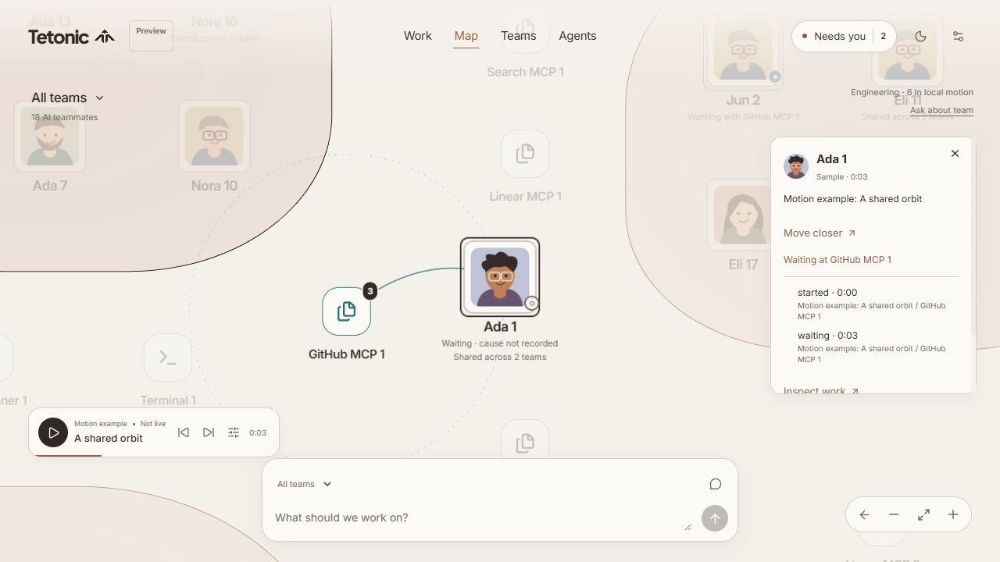

# Living map implementation

Implemented in the React app under `web/`, September 28, 2026. The preview is served from this checkout at `http://127.0.0.1:5174/`. This is an application change, not a separate prototype.

## Interaction and motion decisions

- Retained the existing world layout and organization-wide activity clock. Camera movement never seeks the trace. Switching between Work and Map leaves the map mounted; its local animation loop stops when hidden.
- Improved the continuous camera with pointer-centered wheel/trackpad zoom over portraits, touch pinch and drag, keyboard pan/zoom, previous-view history, and preservation of world position and absolute scale when the viewport or world bounds change. Clicking a team frames its existing neighborhood. Moving closer to a selected agent accounts for its representation at the destination zoom, including an existing dock.
- Overview emphasizes team landmarks, counts, and exceptions. Headings move above neighborhoods before portraits appear. Purpose labels emerge closer still. Detail fades continuously; overview/team/local control states use hysteresis to avoid rapid switching at boundaries.
- Reused `GraphMotion` and `clusterClearance`: approach, capture, attachment, release, return, and coordinated displacement of a host with its attachments. Idle drift is disabled in this map. Active attachments retain the original small orbital variation and damped arrival. Displaced clusters return home more promptly after release.
- Physical motion is bounded to six members of the current local team, with the selected agent included first. Local calls within roughly one neighborhood (1,200 world units) can dock; distant calls use work connections while identity remains at home. This prevents rapid cross-organization events from sending portraits repeatedly across the whole map.
- Local collision checks include required actors/hosts and up to 24 nearby neighbors. Long labels wrap within bounded footprints. Selection keeps related routes prominent; important failure and input markers remain visible even outside the selected workflow.
- Square portraits retain uploaded images. Working uses teal, ordinary waiting uses a neutral hollow marker, failed work uses brick red, and explicit human input uses amber. Text and shapes support the color. Team boundaries stay neutral when one member has a problem. Ordinary waiting no longer increases the global “Needs you” count.
- Team inquiry captures a labeled snapshot and stays scoped to that team until explicitly changed. Hovering does not retarget it or pause playback. Refresh is explicit. Its close control remains available on narrow screens, and Escape restores focus to the opener.

## Verification

Browser checks used the original small workspace, the 18-agent studio, and the 80-agent network with its all-hands rush. Verified team focus, repeated zoom, dragging during activity, selected-agent close framing, previous view/overview, inquiry, dark colors, reduced-motion routes, and layouts at 1,280px, 390px, and 320px. No browser console errors were observed during these checks.

Automated coverage includes camera pointer anchoring, geometry preservation, keyboard controls, pinch-to-drag continuation, paused physics persistence, simultaneous attachments, waiting/cancellation, host disappearance and reappearance, return home, bounded actor selection, distant calls, custom portrait preservation, inquiry scope and uninterrupted playback, and close framing of an already docked agent. Existing crowded-trace, collision, long-label, unassigned/shared membership, and stable-layout tests remain in the suite.

Production build, TypeScript checks, and Vitest pass. The build still reports its main JavaScript chunk at approximately 511 kB before gzip (157 kB gzipped); code splitting remains separate work.

## Limits and tradeoffs

- The app remains a fixture-driven preview. Team inquiry answers a few factual categories from recorded state; it is not connected to a conversational model or live runtime.
- Six agents receive physical motion in the close view. Select another agent to include them. The remainder retain their identities and inspectable work; the overview shows up to six aggregate routes, with hovered-team routes and failures prioritized.
- Collision clearance is local and bounded, not a guarantee of a globally overlap-free layout at every intermediate zoom or pathological density. It does not compute obstacle-avoiding paths for every connection. Long names wrap/clamp with full names available on inspection.
- A newly entered local cohort is initialized from current activity; it does not replay historical events. Switching to a different cohort while paused can leave a newly revealed attachment at its approach position until playback resumes or a manual event step resolves it.
- Browser responsiveness was checked with 80 agents; no hardware-independent frame-rate target is claimed. The clock and local physics still update React-rendered SVG/DOM. Larger production populations should be profiled on target hardware before increasing detail budgets.
- Pinch continuity is covered by pointer-gesture tests, not a physical touchscreen trial. Reduced motion resolves current attachments without animated travel and disables flowing routes.

