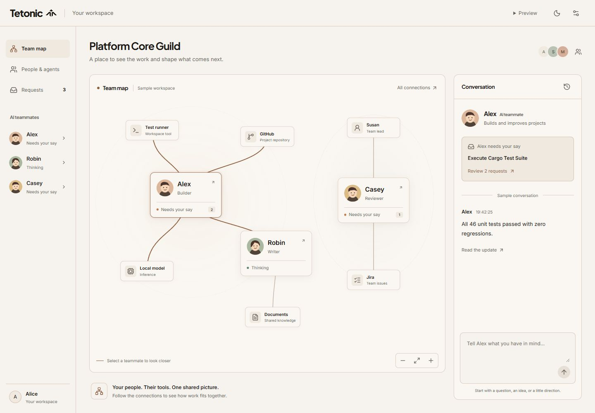

# Map-first workspace revision

The user's reference illustrates product clarity: recognizable places, objects
and actions, with enough context to feel complete. The prior conversation-only
screen removed too much context and buried the map. This revision makes the map
the main product surface while retaining Tetonic's warm paper, ink and terracotta.
It does not reproduce the reference's branding, mascots or channel layout.

## Experience

- Three familiar choices: Team map, People & agents, Requests.
- Desktop: the team's graphical workspace and the selected teammate's conversation
  sit beside each other. Names, portraits and short roles make agents recognizable.
- Select an agent to highlight their connections and see their messages and requests.
  Request links preserve the specific request ID, including Casey's remote request.
- Select a connected tool/service to open the existing evidence inspector. All
  connections remains visible on the map for searching the full technical view.
- Phones show readable agent cards and agent-to-agent connections. Tools remain in
  All connections. Selecting an agent opens the conversation tab and moves focus
  to the teammate heading. Switching tabs retains draft and selection.
- Pan, zoom and fit are available by pointer and keyboard. There is no animation
  implying live traffic. Reduced motion continues to use the shared policy.

## Integration and truth

`TeamActivityMap` receives the same agent and approval state as the existing views.
Pending counts derive from current approvals and update after decisions. No new
agent records, runtime, work scheduler or status store were created. Technical
details use the existing `LinearTrackDrawer`; detailed connection discovery uses
the existing `GraphMapView`.

Graph edges and connected services come from the existing sample topology, filtered
to actual members of the selected sample team. Private agents are omitted. Agent
status comes from agent records, not the separately authored graph status snapshot.
Colored lines indicate the selected agent's relationships, not running activity.
This is still fixture data and presentation filtering, not server access control.

Only Alex has the existing preview message handler. The other sample agents explain
that messaging is unavailable. Alex's draft is preserved but hidden when viewing
another teammate. Sending does not imply live inference or team dispatch.

## Verification

- Production build (including TypeScript) and formatting check pass.
- 19 interaction tests pass, including map selection, request identity, counts after
  decisions, draft retention, connection inspection, modal focus return and the
  prior approval/team/policy/trace regression coverage.
- Desktop and phone browser checks cover selection, inspection, both themes,
  responsive layout and returning to the map. Phone document width is within the
  390px viewport. Real touch hardware and a screen-reader user study remain untested.
- The fixed initial arrangement is intended for the small fixture team. Additional
  nodes receive fallback positions; large fleet layouts are not performance-qualified.
- Engine connectivity, durable work, real team creation and server policy enforcement
  remain integration work. The UI makes no claim that agents are currently executing.

## Screenshots

[Dark desktop](screenshots/map-workspace-dark.png) ·
[Phone agent map](screenshots/map-workspace-mobile.png) ·
[Phone conversation](screenshots/map-workspace-mobile-conversation.png) ·
[Connection inspector](screenshots/map-workspace-inspector.png)
