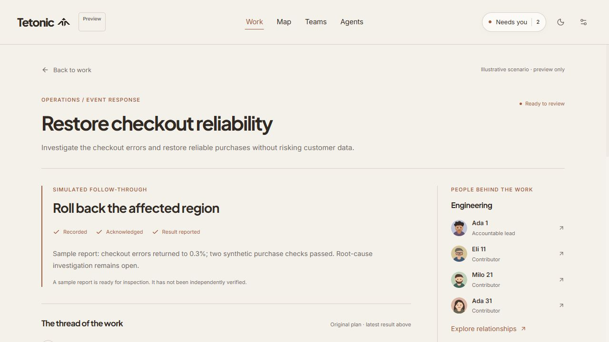
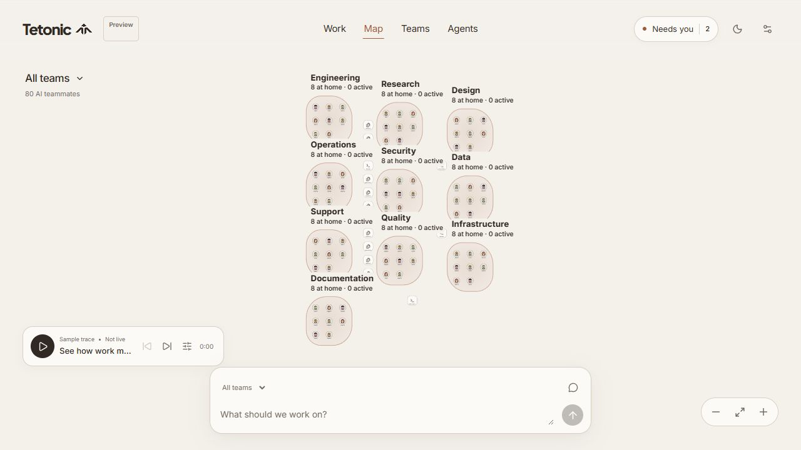
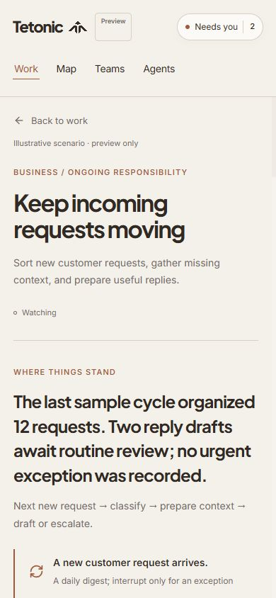

# Tetonic work experience: interaction and product audit

September 28, 2026 · current implementation at `00ec3e5` · design recommendations, not an implemented redesign.

**Subsequent design correction:** [Interaction model reset](interaction-model-reset.md) revises this audit's work-item-first premise. The observations below remain evidence about the implementation. The next design should begin with low-friction conversation and exploration, make delegation a legible transfer of responsibility, and preserve orientation across concurrent contexts. It should not make every thought enter a formal work lifecycle.

**The central problem is that Tetonic presents work more effectively than it supports doing work together.** Its strongest interactions describe a situation, collect a decision, or show an organization. The connective actions—exploring an uncertain idea, discussing an emerging result, revising an accepted approach, finishing, and returning later—remain fragmented or absent.

The earlier outcome-led recommendation was directionally useful, but the implementation overcorrected toward supervision. We added a structured work report and a decision brief. We did not establish a continuous collaboration experience. Making the form optional reduced entry friction; it did not supply the missing interaction model.

My recommendation is to keep **one persistent place for each piece of work**, with an accessible current result, a concise account of what is happening, and a conversation tied to that work. Its presentation should adapt to the immediate activity: exploring, making, deciding, reviewing, or operating a recurring responsibility. A person should be able to move among those activities without reconstructing context or learning several different ways to give direction.

**What this audit establishes.** I inspected the current React implementation, work model and reducer, example data, attention view, map/chat integration, existing workroom tests, prior design audits, and the engine's team-work structures. I walked the live local preview at `http://127.0.0.1:5174/?workspace=network` using an isolated tab: 80 agents, 10 teams, 24 resources, five initial work items. Desktop was 1280 × 720; narrow-screen inspection was 390 × 844. Temporary audit entries were confined to that tab. No application code was changed.

This is a heuristic review and a cognitive walkthrough by one evaluator, not a user study. Observed behavior and source-confirmed omissions are separated below from likely user consequences and proposed remedies. The UI openly declares that it has no connected engine and stores changes only in the tab. An absent live response is an intentional prototype limitation; it is not evidence that the runtime fails. However, the prototype still needs a coherent simulated journey to test its design.

The evaluative lenses include status visibility, consistency, recognition, recovery, and control from [Nielsen's usability heuristics](https://www.nngroup.com/articles/ten-usability-heuristics/), alongside the human–AI interaction concerns developed in [Amershi et al., CHI 2019](https://www.microsoft.com/en-us/research/publication/guidelines-for-human-ai-interaction/). These sources guide the questions; the Tetonic findings and proposed design are judgments grounded in this inspection, not research-validated outcomes.

## The intended experience

The recurring human need across a business owner, product manager, operator, teacher, or personal planner is: **help me make progress on something, while keeping me appropriately involved.** They will arrive with different levels of certainty and available attention.

| Human situation | What Tetonic should make easy | Current friction |
|---|---|---|
| “I have a rough idea.” | Explore, compare directions, save useful thinking, choose a next step. | An idea immediately becomes an assignment with generic criteria and arbitrary staffing. |
| “I know what needs doing.” | Delegate promptly with visible scope and sensible defaults. | Handoff is possible, but the accepted plan, subsequent conversation, and resulting output are not connected. |
| “Something went wrong.” | Establish impact, what recovery is underway, and the decision needed now. | Work decisions and agent-operation exceptions use separate representations and detail destinations. |
| “Keep taking care of this.” | Establish a continuing responsibility and inspect its individual runs and exceptions. | The UI shows a trigger sentence and static checkpoints, without a run inbox or operational history. |
| “I've been away.” | See material changes, recover my last context, and decide what deserves attention. | No changed-since-review view, durable work navigation, or freshness model. Some unfinished input is lost even within the tab. |
| “Is this good enough?” | Inspect the actual result, request specific revisions, accept it, and preserve its provenance. | A result report reaches “Ready to review” without a completion or revision action. |

An excellent interface must support ordinary work as well as exceptions. If its most developed interaction is approval, it makes the person a queue processor. If its most prominent representation is agent activity, it makes the person a monitor. Tetonic needs to support collaboration, delegation, and judgment as a connected practice.

## Findings, in priority order

**1. Critical — Work has no complete interaction lifecycle.**

Observed: the checkout example can progress through “Record direction,” “Load sample acknowledgment,” and “Load sample result.” It then becomes “Ready to review.” There is no action to accept the result, request a revision, resolve the work, or reopen it. The old checkpoints remain visible with their original states. Their “original plan” label is honest, but the user must reconcile the old plan with the new prose report. The item remains in attention.

Source: `WorkStatus` has no completion or cancellation state; `WorkAction` has no accept/revise/complete transition. There is one optional decision and one optional receipt per work item. A second decision cycle is not represented. This is a frontend design limitation, not a claim about the engine.

Likely consequence: the user cannot develop a dependable sense of what completing work means. The attention list accumulates unresolved-looking items. The interface promises review but offers only reading.

Design response: prototype a full cycle with an actual inspectable deliverable: propose → do → review → revise or accept → retain the result. Keep verification evidence separate from the person's acceptance. A person can accept useful work with known limitations; a successful operation alone does not prove that the desired outcome was achieved. Allow several decisions and revisions over a work item's life.

**2. Critical — There is no single place to collaborate on the work.**

Observed: “Add context,” “Room to think,” decision conditions, “I need more context first,” map chat, and agent messaging are separate input paths. “Room to think” explicitly says its ideas do not change instructions. Saving an investigation request puts its text into that same notes list, even though it is a request for someone to do something. “Move an idea into the brief” has no corresponding promote/apply interaction. The user has to copy and reinterpret it.

Source: thinking and investigations append strings to `notes`; added direction appends strings to `clarifications`; map messages go to separate `StreamEvent` state. Work has no conversation identity. Conversation on the map is scoped to team or agent, without a work reference.

Likely consequence: users must classify their thoughts according to storage behavior before expressing them. A question might be a private note, an investigation, a change request, or a team message. The UI does not provide a simple, consistent answer to “Where do I say this so it reaches the right place?”

Design response: provide one work-scoped conversation alongside direct actions on its plan and outputs. Preserve the useful distinction between discussing and authorizing: exploratory suggestions remain proposals; a requested plan change produces an explicit, inspectable amendment. Ordinary questions should not require a mode picker. Offer a private scratch note as an optional, clearly separate affordance rather than making everyone maintain parallel thought and direction streams.

**3. Critical — Scope and identity do not follow the person across views.**

Observed: the new workshop task force contained Ada 1, Jun 2, and Milo 3. “Explore relationships” opened the entire 80-agent organization and an “All teams” composer. The Work tab did retain the selected work when returning, which is good. But the intermediate view had no indication of the work being investigated or its three contributors.

Source: `onMap(item.teamId || 'all')` sends a task force without a team ID to the global scope. The map receives team scope, activity, and agents, not the selected work ID. Approval requests, chat events, and work items are also separate frontend models without a shared work link.

Likely consequence: a contextual exploration becomes a new navigation task; the user has to find the people and mentally restore the original purpose. A global composer immediately after a scoped action creates a plausible wrong-recipient trap when eventually connected.

Design response: make the work identity survive every view. Relationships opened from work should show its contributors, dependencies, and relevant resources, with an explicit “Show whole organization” expansion. Keep the conversation addressed to the same work. An agent profile can explain that agent's contribution to the selected work before offering their other commitments. General team chat can continue to exist with clearly different scope.

**4. High — Starting work is easy to submit but weak at helping someone think.**

Observed: a one-sentence idea immediately created a titled assignment. It supplied the same generic first step and boundaries, selected three agents, and offered a handoff. This avoids the former mandatory form. It does not help distinguish a tentative idea, a request for advice, a ready task, or an ongoing responsibility. Changing the latter requires opening “Adjust the starting agreement” and finding the work-kind field.

Source: `start()` uses the first three agents in the list; `newWork()` always starts as an assignment and truncates the input into a title. The selection has no relationship to capability, context, or availability. The prototype documents this honestly, but the staffing presentation still looks like a considered choice.

Likely consequence: beginners meet an organizational commitment before the product has helped them understand the problem. Experienced users cannot tell why those agents were selected. General-purpose support exists as a taxonomy and examples more than as a natural entry experience.

Design response: let the first input create a place to work together. For an unclear request, ask one useful question or offer a small, editable first step. For a clear request, propose the appropriate owner and begin within existing authority. Reveal staffing rationale and unknown availability where they matter; do not silently manufacture competence. Allow paste, file context, a selected artifact, or an incoming event to initiate the same work experience. Detailed configuration should emerge when relevant.

**5. High — Changing direction does not have a visible contract.**

Observed: on the active lesson-planning example, I used “Refine brief,” added “prioritize the first two lessons; postpone the assessment,” and chose “Keep this direction.” The page returned to its old summary and original criteria. The new instruction was stored under an “Additional direction” disclosure. There was no visible proposed plan change, pending acknowledgment, or indication of whether the old commitment had been superseded.

Source: edits spread a partial patch into the work item. “Keep this direction” exits editing; it does not create a versioned change request or a receipt. The initial decision flow already distinguishes recording from acknowledgment, but the later amendment flow does not.

Likely consequence: people cannot tell whether they saved a note or redirected a team. Showing a persistent “In motion” label does not resolve that ambiguity.

Design response: present the interpreted change in context: “Prepare two lessons first. Assessment deferred. Remaining lessons still planned.” Show what stays active, what changes, and any downstream cost or uncertainty. Submit the amendment to the correct owner and record pending/accepted/rejected/partially applied states. Let a person correct a misunderstanding directly. Preserve the previous agreement instead of silently overwriting it.

**6. High — Attention is counted without a coherent model of human work.**

Observed: the incoming-requests responsibility says two reply drafts await routine review, but neither draft is accessible and the item does not appear under “For you” or “Needs you.” The global count in the Network scenario contains the checkout and release work; the reported reply-review obligations are missing. This is a fixture/model inconsistency, not proof that real alerts are dropped.

Source: `needsJudgment()` examines the work's single status value. A responsibility marked `watching` cannot independently contain review requests. The global count adds work decisions, approvals, and operation exceptions from different sources. Exceptions can include recovery already underway or a wait whose owner is unknown; the “Needs you” wording overstates the personal obligation for those cases.

Likely consequence: users cannot trust that the count represents everything they need to do. Nor can they infer urgency from it. More agents will amplify the mismatch between event counts and actual decisions.

Design response: represent decisions and reviews as linked objects independent of the work's execution state. A responsibility can keep operating while two outputs need review. Aggregate related symptoms under the affected problem while preserving their evidence. Each attention item should explain who needs to act, what is waiting, when a response matters, and what happens if they wait. Separate actionable requests from recoveries being monitored and unknown conditions. Keep ordinary work visible so an exception queue does not become the whole product.

**7. High — The work model is too flat for the complexity the product promises.**

Source-confirmed: `WorkItem` has a title, one team, contributor IDs, text summaries, linear milestones, and inline evidence strings. It lacks parent/child work links, dependencies, multiple contribution commitments, output versions, timestamps, source references, a decision history, or recurring-run identity. The three work kinds largely reuse the same document presentation.

This matters independently of a missing backend. The frontend cannot explain a parallel plan, a shared bottleneck, an output revision, or a responsibility that spawns several simultaneous cases using its current contract. Adding more graph agents does not exercise work-portfolio complexity: `workroomExamples()` still generates five disconnected examples at every organization size.

Design response: model the relationships necessary to answer practical questions—what this contributes to, what it depends on, who owns this contribution, and which output/decision it produced. Reveal branches only when relevant. Keep a compact outline or selected dependency path; a full graph should be an optional investigative view. Reuse the engine's existing goal, work, delegation, activation, and run concepts where appropriate rather than establishing a second execution authority.

**8. High — Recurring work lacks the interactions that make recurrence understandable.**

Observed: responsibilities show a trigger, cadence, static process text, and a preview pause/resume control. There is no distinction between the standing instruction and an individual execution, no queue of cases or outputs, and no history through which to inspect a failed or duplicate event. Pause is visible only for responsibility items in watching/paused states. Other kinds have no comparable work-level stop affordance in this view.

Likely consequence: “Watching” may be read as healthy operation despite being only a broad label. The person cannot tell whether a problem is with the rule, one run, or an external dependency.

Design response: a responsibility should summarize its trigger, current coverage/freshness, recent outcomes, outstanding cases, and next expected check. Open an individual case into the same familiar work experience. Distinguish “Pause new runs” from stopping an active run; report unresolved effects. An ordinary success should join a digest. An exception should carry the context necessary to handle it. Do not require a visual workflow builder to establish a simple recurring responsibility.

**9. High — Returning to work is fragile.**

Observed: I typed an unsaved thought in the lesson example, used “Back to work,” and reopened it. The text was gone. Work selections do not change the URL. The implementation preserves decision drafts and Work/Map view state better than other inputs, so continuity varies by interaction.

Source: `WorkDetail` is keyed by work ID; several composer drafts live only inside that component. Work lacks updated/reviewed timestamps or a durable route. Tab-only storage is an explicitly documented preview limitation.

Design response: preserve unfinished input uniformly; make work addressable; support normal Back/Forward behavior. A returning person should see a small account of material changes since their last review, with source freshness and a route back to the last artifact or decision. Avoid making them reread a chronological log. New updates should not reorder targets while they are reading.

**10. Medium — The visual hierarchy suits an editorial report more than repeated operation.**

Observed: at 1280 × 720 the overview shows one complete work row and part of a second after the title, creation prompt, explanatory text, filters, and section header. On the release detail, the primary “Record direction” control begins about 1,117 px below the viewport top at initial scroll. On the 390 × 844 responsibility detail, “Pause sample loop” begins about 2,550 px below the top, after the main content and contributor list. These are measurements of these fixtures, not a universal claim about every state.

Much of the page repeats intent, criteria, boundaries, status explanations, and generic guidance. “Room for the rest” and “A little input goes a long way” carry warmth but give weaker orientation than “Ongoing work” and “Decisions.” “What happens if I wait?” is disclosed below the decision controls even when delay has substantial consequences.

Design response: retain the paper, ink, terracotta, portraits, and readable type. Give current work, outputs, and the relevant next action the strongest positions. Collapse the full operating agreement after acceptance; show only constraints pertinent to the current decision. Put delay consequences beside the decision and make relevant controls reachable. On mobile, order by the current task instead of appending the entire sidebar after the entire document. Do not solve this by shrinking text or cramming more equally weighted cards into the screen.

## What deserves to survive

The visual identity is distinctive and restrained. The decision brief's known/unknown distinction and consequence descriptions are useful. Recorded direction, acknowledgment, and reported result are separated rather than falsely treated as one event. The map retains value for shared resources and cross-team relationships. Team members keep a single identity. The recent removal of required form filling was correct. Context filters, preserved decision drafts, focus restoration, and honest preview disclosures are meaningful improvements.

The redesign should build on those capabilities while changing how they connect. Aesthetic polish can support that work, but it cannot substitute for the missing lifecycle.

## Recommended interaction model

**The persistent object is the work itself.** Its name, purpose, current commitment, relevant people, conversation, outputs, and decisions remain connected. Teams can change. Exploration can turn into delivery. An incident can be resolved while follow-up investigation continues as linked work. A responsibility can spawn many runs without duplicating the standing agreement.

Keep implementation concepts beneath this user-facing model:

| Concept | What the person sees when relevant |
|---|---|
| Context | An optional grouping such as a product, class, business area, or personal project. No compulsory hierarchy for a first task. |
| Work | The thing being explored, achieved, resolved, or maintained. A stable place to return to. |
| Plan and contributions | A short editable account of the approach, owner, branches, and dependencies. Expand only where coordination requires it. |
| Outputs | The actual document, draft, patch, analysis, plan, or operational evidence, with versions and sources. |
| Decisions and changes | Questions awaiting judgment, requested amendments, exact approved scope, acknowledgments, and outcomes. |
| Responsibility and runs | A standing instruction plus its concrete cases/executions and their results. |

These are relationships and contextual views, not six new navigation tabs or six setup forms. Keep a global way to find and resume work. Open people, evidence, and relationships in the context of what the person is investigating.

The information model should separate three dimensions: **execution state**, **human attention**, and **evidence freshness**. Work can be running and awaiting a non-blocking decision. A recurring responsibility can be enabled while one case is blocked. A finished run can have an output awaiting review. Stale telemetry should not look like either confirmed health or confirmed failure.

**The work surface should change emphasis, not identity.** During exploration the conversation and a small proposal are central. During production the current output and meaningful progress are central. During a decision the relevant evidence and choices become central. During review the output and feedback actions become central. The name, scope, unfinished input, and return path stay stable.

Illustrative desktop arrangement—not a proposed permanent three-panel dashboard:

```text
All work / Atlas release                       Updated 2 min ago
Core ready. Export needs a scope decision.     Lead: Maya

[Decision: defer export or extend preparation?]   [Related work]
Customer impact · consequences of waiting        Export readiness
Relevant evidence · editable proposed direction  Release notes

[Current release candidate / selected output]
Inspect the work · give feedback · compare versions

Ask, add context, or change direction about Atlas release…
```

The related-work area is optional. With one small task it should disappear. Output selection can open an appropriate viewer without creating another disconnected place to give feedback. A person can answer directly on a decision card, edit a proposed plan, or comment on an output; the conversation records those actions without forcing every interaction through chat.

**The overview should help people resume and allocate attention.** Give it a small set of work summaries with a concrete change, next commitment, owner, and any decision. Preserve user-pinned order. Offer search and context grouping when the volume warrants them. Make newly important items discoverable without moving a button under the pointer. Group correlated requests by problem, not merely by the tool that emitted them. Explain priority through consequence and timing instead of an opaque score.

“No decisions waiting” must remain distinct from “All work is healthy.” A visible unknown should have an owner or a way to investigate it. Users should be able to inspect quiet work, change priorities, and choose what is worth supervising.

## Four concrete journeys to prototype

**Exploration becomes a deliverable.** A founder writes, “Help me work out whether a customer workshop is worth doing.” The same work surface offers to compare two formats and produce a small proposal. It asks about audience only if that changes the approach. Proposed staffing is optional and explained. The founder discusses alternatives; accepted conclusions update a visible plan. Later they inspect an actual workshop outline, comment “shorten this section,” compare the revision, and accept it. Acceptance produces a retained result. Nothing requires copying between a private thought field and an instruction form.

**A release branches and changes direction.** “Get Atlas ready” develops three visible contributions: verification, export readiness, and release notes. Only the stalled branch needs expansion. A scope decision includes the affected output, the concrete customer consequence, and the option to ask for another approach. Deferring export updates the accepted plan and release notes; it does not silently resolve the original defect. The final review presents the candidate and checks. Publish remains a separate action if the agreed authority reserves it.

**An incident arrives already in progress.** An alert opens work with the known impact, observation freshness, recovery attempts, and responsible team. The user can triage without completing a planning ceremony. They ask a question, authorize a bounded recovery, or let investigation continue. The interface shows acknowledgment and actual recovery evidence. Closing the incident can create linked follow-up work instead of leaving an endless “Ready to review” item. Unknown cause remains visible even when service has recovered.

**A responsibility generates cases.** “Keep support requests organized” produces a standing proposal with trigger, allowed actions, exceptions, and digest timing. The user can correct it conversationally or edit its rule directly. Once active, its page shows current runs, the last useful digest, and two real drafts awaiting review. Those same drafts appear in global attention. A reviewer can handle them in the responsibility context, adjust the rule deliberately for future runs, or pause new intake without implying that existing external effects have been undone.

For personal planning, the small version might be one work surface and one revisable weekly plan. For a teacher, the central output might be lesson material or a batch of annotated drafts. Common interaction rules should support those differences without forcing every domain into release-management language.

## Alternatives and tradeoffs

| Direction | Why it is attractive | Main limitation | Recommendation |
|---|---|---|---|
| Improve the current work list and detail report | Fast, preserves most UI, helps scanning. | Still leaves collaboration and completion fragmented. | Useful supporting work after the core journey is redesigned. |
| Make everything a conversation | Natural entry and flexible expression. | Long histories become another memory burden; scope, outputs, and commitments become hard to locate. | Use conversation with durable visible work state and direct artifact interaction. |
| Make the graph the primary work interface | Strong identity; useful for dependencies and resources. | Requires people to navigate relationships even for simple writing, review, and triage. | Keep as a contextual view with stable scope. |
| Persistent work surface with contextual plan, output, and decisions | Supports thinking, doing, reviewing, and returning in one place. | Needs coherent state and careful progressive disclosure; can become overloaded if every panel is always visible. | Preferred hypothesis to prototype and test. |

The recurring risk is replacing one heavyweight abstraction with another. Avoid a giant “work hub,” a permanent wall of panels, mandatory ownership configuration, or an AI that silently rewrites plans. The next iteration should prove a few complete interactions before accumulating features.

## Proposed implementation sequence

1. **Prove the work lifecycle with one coherent scenario.** Build exploration, a proposed first step, a linked contribution, a decision, an actual output, revision, and acceptance in the same work. Use an explicit simulation adapter if execution is still disconnected. All views must refer to the same entities and events.
2. **Make direction and navigation coherent.** Add work-scoped conversation, durable draft ownership, stable routes, contextual map exploration, and visible plan amendments. Remove duplicate input paths only once their legitimate functions are supported in the new surface.
3. **Complete attention and return behavior.** Link decisions/reviews to real outputs; include background cases without changing their parent into an alert state; preserve review position; show meaningful changes and their freshness. Deduplicate known related issues without suppressing independent ones.
4. **Exercise recurring work and multiple contexts.** Add a standing responsibility with several cases, partial failures, source silence, competing team commitments, and a changed rule. Scale the number of work items as well as agents.
5. **Connect the validated product contract.** Map to existing authenticated work, delegation, approvals, controls, run, and evidence services. Verify command versioning, acknowledgment, stop boundaries, and recovery. Do not treat a UI click or local state update as execution authority.

The frontend boundary needs stable work/contribution/output/decision identifiers, timestamps, plan versions, event provenance, freshness, and durable drafts. The engine already contains team goals, work items linked to attempts/runs, huddle proposals, activation cursors, and parent/child delegations. That is a foundation to examine and map, not proof that every proposed UI interaction already has a complete backend contract.

## How to judge whether the next design is excellent

Use the current experience as a baseline and compare one alternative with equivalent coherent scenarios. Recruit representative people across technical delivery, operations, and everyday knowledge work, including keyboard and narrow-screen use. This audit has not measured user performance.

| Test | Success criterion for the next prototype |
|---|---|
| Start with an ambiguous idea | A participant reaches a useful proposal without filling out a full brief or configuring a team. They can explain what will happen next. |
| Ask a question versus change direction | They can predict whether their input starts discussion or changes an accepted commitment. Correcting an interpretation is easy. |
| Explore people or relationships | They retain the work's scope and return to the same output, draft, and reading position. No accidental global recipient. |
| Review, revise, and finish | They find the actual output, request a specific change, compare the revision, accept it, and locate the retained result later. |
| Handle an incident among routine updates | They identify impact and the pending human decision without reading raw activity logs. Recovery and unresolved cause remain distinct. |
| Operate a recurring responsibility | They distinguish the rule from a run, locate all pending reviews, and predict what each pause/stop action affects. |
| Return after an interruption | They identify what materially changed and recover the last unresolved question without rereading the entire history. |
| Direct several contexts | They compare competing commitments without losing ownership, source freshness, or the boundaries between contexts. |

Test 1, 10, and 50 work items independently of 4, 20, and 80 agents. Include several pending decisions on one work item, shared people, long titles, parallel branches, missing evidence, a stale status, a rejected amendment, a failed retry, and an ongoing responsibility with an exception while other runs proceed. Include 390 × 844 and 1280 × 720, keyboard navigation, text enlargement, screen-reader status interpretation, and reduced motion.

Measure correct scope, causal understanding, missed obligations, draft loss, backtracking, ability to locate outputs, and confidence versus actual correctness. Time matters, but fast incorrect decisions are failures. Proposed early gates: no lost drafts in supported navigation; every simulated review obligation has an inspectable object and appears in attention; every displayed result can be accepted or returned for revision; every participant can distinguish saved, accepted, and applied direction. Set numerical time targets only after measuring a baseline. Stop expanding the design if participants still cannot explain what will happen when they act.

## Evidence and reproducibility

| Evidence | Where to inspect |
|---|---|
| Default staffing, scope filters, separate thinking and direction fields, decision/result display | [Workroom.tsx](../../../../../../web/src/components/work/Workroom.tsx), especially lines 80, 298, 349, 464, 543, 598, 676, 729, and 861. |
| Missing finish/revise lifecycle, one decision/receipt, flat evidence and milestones | [workroom types](../../../../../../web/src/types/workroom.ts); [reducer](../../../../../../web/src/lib/workroom.ts), lines 17, 28, 51, 69, 74, and 97. |
| Separate work, chat, approval, and playback state; scope-only map transition | [App.tsx](../../../../../../web/src/App.tsx), lines 70, 97, 109, 236, 277, and 477; [FloatingChat.tsx](../../../../../../web/src/components/graph/FloatingChat.tsx). |
| Routine reviews mentioned but not modeled; five scenarios regardless of agent count | [workroomExamples.ts](../../../../../../web/src/store/workroomExamples.ts), lines 4 and 177; [AttentionView.tsx](../../../../../../web/src/components/views/AttentionView.tsx). |
| Existing validation verifies isolated flows but stops at reporting and local handoff | [workroom.test.tsx](../../../../../../web/tests/workroom.test.tsx). Reviewed, not rerun for this documentation-only audit. |
| Existing engine concepts worth mapping to the product | [team_work.rs](../../../../../../engine/strata/tetonic-memory/src/team_work.rs), lines 1–73. Only the relevant structures were inspected; this is not a runtime correctness audit. |
| Prior scope and acknowledged prototype limitations | [general-purpose-work-prototype.md](./general-purpose-work-prototype.md); [organization-direction-audit.md](./organization-direction-audit.md). |

Walkthroughs performed: rough idea → added context and thought → local handoff; contextual relationships from the resulting task force; checkout decision → investigation request → selected direction → sample acknowledgment → sample result; active lesson work → refine direction → return; unsaved thought → Back → reopen; recurring inbox work → global attention; desktop and narrow-screen control placement.

Reproduce the result dead end from the checkout example using the three sample-flow actions. Reproduce scope expansion by starting new work with the default task force and choosing “Explore relationships.” Reproduce draft loss by typing in “Add a thought,” returning to the work overview without saving, and reopening that work. Reproduce the review mismatch by comparing the incoming-requests summary with the global attention contents in the Network fixture.







Screenshots document this audit session, including explicitly labeled sample results. They are not proposed mockups or evidence of live execution. The UI tested is fixture-backed; no real teams were instructed, and the user's existing preview tab was preserved.
