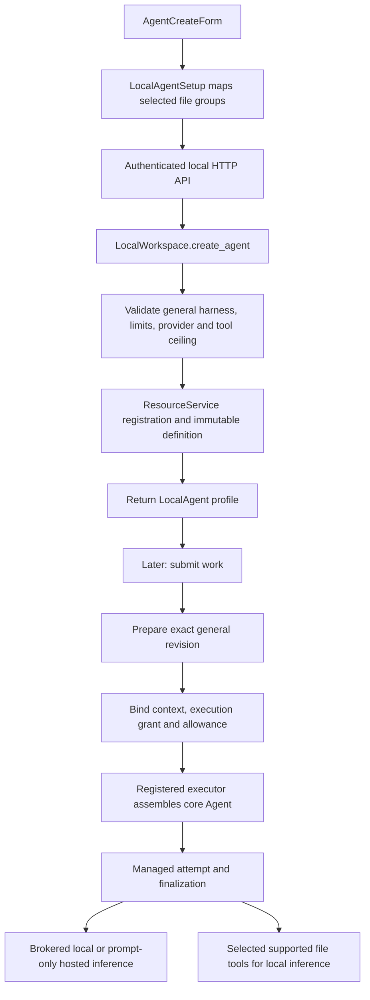
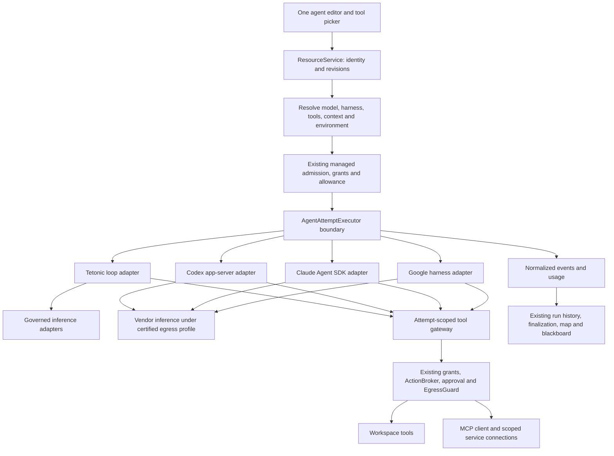
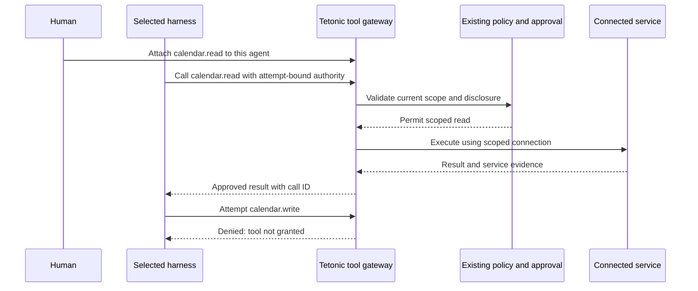

# Agent creation, frontier models, harnesses, and tools

Date: October 6, 2026. Source baseline: `d5ea1fa667e01adc49dee6fd6d77c3a586549a47` on `main`.

Status: code audit and proposed integration plan, not implemented capability. This refines the existing October MVP work; it does not close a sprint gate or create a second runtime initiative.

The required product outcome is simple: create an agent, choose how it works, attach the tools it needs, and assign it work alone or in a team. Choosing a frontier model or a supported vendor harness must not remove those tools. Tetonic must still own the work, permissions, context boundaries, usage, cancellation, and evidence.

## Assessment

The present creation flow cannot deliver that outcome. It registers real, durable agents and runs them through existing managed execution, but the connected product exposes only Tetonic's general harness. Hosted models are deliberately restricted to prompts. Team execution further restricts workers to local inference with no file or external tools. The MCP section is informational; it does not connect a service.

These are integration gaps, not problems a stronger model alone will solve. There is substantial infrastructure to retain: immutable agent revisions, execution grants, scoped context, managed attempts, the action and process brokers, hosted egress checks, usage reservations, and audit history. The work should extend these systems.

| User expectation | Current connected product | Necessary change |
|---|---|---|
| Choose an up-to-date frontier model | Hosted model suggestions are hard-coded; custom IDs are accepted without account/model capability verification | Account-aware discovery plus protocol and capability qualification |
| Use our own ChatGPT allowance | Provider setup accepts API keys only | Explicit OAuth connection and subscription billing profile |
| Choose Codex or Claude's harness | Only `general` is accepted and prepared | Managed executor adapters for supported vendor harnesses |
| Attach tools to a hosted agent | UI hides choices; creation and activation reject them | Governed tool access and approved disclosure of tool results |
| Connect calendar, Jira, or another MCP service | No connected MCP client or tool attachment path found | Real connection lifecycle, discovery, scopes, and invocation |
| Dispatch a tool-using frontier agent into a team | Readiness rejects it; child launch is local/input-only | Inherited provider, tool, environment, and disclosure contracts |
| Change an existing agent's tools | Revision storage exists, but the connected creation API has no agent edit/default-revision workflow | Versioned editing and revalidation without mutating active runs |
| See exactly what happened | Existing managed histories and usage are useful; hosted output is buffered | Correlated streaming events and tool receipts for every adapter |

## Evidence and limits of this audit

The analysis follows the connected UI, local HTTP transport, resource registration, definition storage, preparation, root/child activation, provider translation, managed execution, and enforcement boundaries. It also examines the separate legacy fleet and CLI provider paths. Source references below point to implementation, not architecture claims in READMEs.

Official OpenAI, Anthropic, and Google documentation was checked for current integration surfaces. This establishes documented support, not that a particular account has access or that a Tetonic adapter works. No provider sign-in, paid model request, subscription-backed request, external harness session, or real MCP account connection was run. There was no live browser walkthrough. Focused existing tests were rerun; results appear at the end.

## 1. What creation actually does today



1. **Catalog and form.** `LocalAgentSetup` reads the engine catalog. Local models are queried from Ollama and filtered for advertised tool support. The catalog returns host tools, run ceilings, two hosted provider records, and only the `general` harness. The form contains hard-coded OpenAI/Anthropic model suggestions and a custom model ID field. It hides connected tools whenever the selected provider is hosted. Changing provider clears selections. [UI][ui] [Catalog/creation][agents]
2. **Payload.** The connected wrapper maps Read files to `read_file/list_dir/grep/glob`, and Write files to `write_file/edit_file`. It sends name, purpose, model, provider, consent, harness, limits, tools, and an idempotency request ID. It supplies `resources=[]`; it does not submit the preview configuration's resource IDs, permission rules, context choices, or team membership. The connected advanced panel appropriately hides those preview-only controls. [Wrapper][setup] [Advanced panel][advanced]
3. **Validation and persistence.** Creation validates strings and limits, rejects any harness except `general`, accepts only `ollama/openai/anthropic`, checks local model installation or the presence of a saved hosted credential, and rejects every nonempty hosted tool selection. It writes instructions, requested tool names, and preferences into the existing organization-owned definition. Registration assigns a durable identity and definition digest; identical retries reuse it. This is configuration, not permission to execute. [Creation][agents] [Registration][registration] [Storage][storage]
4. **Preparation and admission.** Later submission reads that identity/revision, assembles input, prepares `AgentInvocation`, authorizes work allowance, and binds an execution grant. `prepare_general_revision` verifies the definition digest and exact general configuration. Requested capabilities are checked against host authority at activation. [Submission][submission] [Preparation][preparation] [Activation][activation] [Grants][grants]
5. **Execution.** `registered_executor.rs` constructs a `tetonic_core::Agent`, a restricted `Tools` host, brokered inference, scoped audit, and runtime policy hooks. Managed execution checks durable bindings, claims the attempt, monitors cancellation/revocation, and finalizes results. [Assembly][registered] [Managed execution][managed]
6. **Teams.** Plans pin worker definitions and preserve child lineage, but current readiness rejects hosted agents and tools other than `finish`. Root and child settings explicitly set `hosted=None`; child settings remove workspace access. The registered executor independently enforces that restriction. [Plan dispatch][plans]

An agent definition, a live harness session, a provider account, and a managed attempt are different objects. Keeping that distinction is essential when extending this flow.

## 2. Findings that affect the requested experience

### A. Tools are blocked in three layers, not merely absent from the picker

`AgentCreateForm` filters tools with `!hosted`; `create_agent` rejects hosted tool requests; registered activation refuses hosted workspace roots, allowed tools, artifacts, and non-completion capability bindings. Removing the UI condition would produce errors, not working agents. Removing the backend guards without replacing their missing disclosure contract would weaken isolation. [UI][ui] [Creation][agents] [Hosted activation][hosted-activation]

`hosted_tools_consent` is accepted in the request DTO and emitted by the UI wrapper, but it is not read into the stored configuration or used as an authorization decision. It must either be replaced with a real scoped disclosure policy or retired from the public contract. It is not an implemented consent feature. [Creation][agents] [Wrapper][setup]

### B. A hosted prompt-only agent can still fail on a file-enabled host

For normal work, submission clones the host's workspace root and allowed tools. Selecting a hosted binding does not clear those settings. The registered hosted guard then rejects them even if this particular agent requested no tools. The existing hosted integration test opens a workspace without a folder, so it does not cover this combination. This is a statically traced failure condition; add a regression before changing behavior. [Submission][submission] [Bootstrap][bootstrap] [Hosted activation][hosted-activation] [Hosted test][hosted-tests]

### C. Team workers cannot currently benefit from better hosted models or their tools

Readiness, local model validation, coordinator configuration, child configuration, and child admission all need reconciliation. The planner's roster currently includes configured tool names and token ceilings but not a complete runnable provider/harness/access profile. It can propose an assignment that a later readiness check rejects. The guide and coordinator also need explicit model bindings; upgrading workers alone leaves orchestration on the host's local model. [Planning roster][planner] [Plan dispatch][plans] [Child guard][child-guard]

### D. Harness is a fixed label in the connected execution path

The preview has `general` and `coding` labels. The live catalog and backend accept only `general`; preparation is hard-wired to it. `AgentAttemptExecutor` already provides a useful neutral boundary, but managed submission/assembly still take the concrete core `Agent` and inspect its tools, step limit, binding, and role. Adding another enum value cannot install Codex or Claude Agent SDK. Adapt this existing boundary and move common admission checks outside the concrete agent. [Preparation][preparation] [Executor contract][executor-contract] [Managed execution][managed] [Runtime executor][executor]

### E. New model names are not sufficient compatibility

The local UI and CLI maintain separate model/provider catalogs. The CLI registry includes different hard-coded models and DeepSeek; the connected UI only exposes OpenAI and Anthropic. Hosted creation checks that a credential exists, not that it works or grants access to the model. `HostedModelConfig` assumes tool support in its constructors. OpenAI's reasoning-name heuristic recognizes only `o1` and `o3`; some request behavior is overridden elsewhere. Consolidate qualification rather than adding more prefix checks. [UI][ui] [Providers][providers] [CLI registry][registry] [Hosted configuration][hosted] [OpenAI wire][openai]

### F. The message and transport contracts lose modern provider state

`Message` is text plus function calls/results; `ToolCall` has no provider-issued call ID. Adapters reconstruct IDs by history position. Hosted transport returns one JSON value, and its token callback receives complete validated text at the end. There are no first-class provider continuation items, multimodal content blocks, signed/opaque reasoning state, or incremental tool-call lifecycle events. Anthropic parsing ignores unrecognized content blocks; its request adapter does not implement structured output despite accepting a shared request type containing it. [Message contract][messages] [Hosted transport][hosted] [OpenAI wire][openai] [Anthropic wire][anthropic]

This is a real compatibility boundary. OpenAI documents preserving reasoning and function items across tool round trips; Anthropic documents preserving signed thinking and redacted blocks unchanged; Gemini documents thought-signature handling for function calls. Store required protocol state privately and preserve it exactly. Do not put opaque state into shared team memory or expose it as readable reasoning. [OpenAI reasoning](https://developers.openai.com/api/docs/guides/reasoning), [Anthropic thinking](https://platform.claude.com/docs/en/build-with-claude/thinking), [Gemini function calling](https://ai.google.dev/gemini-api/docs/function-calling).

### G. Tool-history repair can claim an effect without evidence

Both hosted request adapters can insert `Completed.` for pending calls when a new conversational message is encountered, without restricting every such insertion to the internal completion tool. They also match results positionally. This should not become the foundation for external effects: preserve call IDs and actual outcomes, and distinguish missing, canceled, failed, and completed results. A synthetic acknowledgement is appropriate only for an explicitly defined internal completion transition, not an unverified calendar write or file mutation. [OpenAI wire][openai] [Anthropic wire][anthropic]

### H. MCP, shell, and skills are not connected product capabilities

`EngineTools` explicitly states connections are unavailable. Source searches found no MCP client/server protocol implementation or vendor harness dependency in the Rust/TypeScript product paths. The registered tool allowlist contains selected file tools, recall, completion, and coordination; it rejects model-requested shell because this path has no OS sandbox for it. Skills are mentioned in planning requirements, not implemented as an installed, versioned executable skill lifecycle here. Do not mistake preview resources or a tool label for usable access. [Tools screen][tools-ui] [Tool allowlist][tool-allowlist] [Configuration draft][configuration]

### I. A vendor harness bypasses existing inference accounting unless explicitly integrated

`WorkUsageProvider` records each request passing through our `InferenceProvider`. A vendor harness makes its own model requests, so simply launching its process bypasses that wrapper. Likewise, built-in vendor shell, file, search, and subagent tools do not automatically pass through our action broker or egress guard. This is an integration requirement, not evidence that those vendor harnesses are inherently unsafe. [Usage wrapper][usage] [Action broker][action-broker] [Hosted broker][hosted-broker]

### J. Lifecycle and ownership need a product-level completion

The store already publishes immutable revisions without changing the default revision. The local API has creation, but no complete edit/select-default/archive flow for agents. `agent_profile` also falls back to host-local preferences if stored preferences fail to deserialize; future incompatible provider/harness definitions should instead return an explicit unsupported/invalid status. Provider credentials are keyed by provider in the local database, suitable for this single owner but insufficient as organization-wide, multi-account connection identity. [Revisions][revisions] [Profiles][profiles] [Provider credentials][providers] [Local transport][transport]

### K. The older fleet path remains separate

`FleetManager` remains a deprecated in-memory prototype. Its `create_agent` stores role/world-adapter metadata and registers a supervisor entry without an executable agent. Its operator callers must eventually migrate, but extending it for frontier agents would repeat the original disconnected-system problem. The integration owner is ResourceService plus managed execution. [Legacy fleet][legacy]

## 3. Proposed agent construction

Use one stable agent identity and one versioned definition. Add explicit bindings rather than placing more execution behavior into `GeneralAgentPreferences`.

| Part | What it must represent |
|---|---|
| Identity | Stable ID, owner, organization, display name; membership separate from access to private sessions |
| Instructions | Purpose, behavioral instructions, selected skill revisions, permitted context sources |
| Harness binding | Adapter ID and tested version/profile; configuration schema; supported model/auth combinations |
| Model binding | Provider connection reference, protocol, requested model ID, supported reasoning/response options; no credentials |
| Tool bindings | Stable connection/tool IDs, schema revision, requested resource scope, approval rule, disclosure rule |
| Execution placement | Authorized workspace/environment profile; later node requirements; no employee-supplied arbitrary host command |
| Limits | Run and parent/team allowances, deadline, concurrency, request/step ceilings, billing route and enforcement strength |
| Session policy | Context scope, persistence/retention, resume rules, skill/config provenance; no automatic personal-to-team history sharing |

At launch, compile the definition and current policy into a **resolved execution binding**. Persist its digest and admission evidence on the existing managed attempt. Include the resolved model, adapter version, tool schemas, environment, connection identity, and policy revision. Credential rotation changes the secret behind a reference; changing account, billing route, permissions, or model is an explicit validated change.

The capability intersection is:

```text
requested by the agent and current work
  ∩ organization/team/owner policy
  ∩ initiating principal and connection authority
  ∩ parent delegation grant and payer limits
  ∩ installed, healthy execution environment
  ∩ model + protocol + harness support
```

This yields effective permissions; configuration itself never grants authority. Creation can save a draft with an actionable readiness report. Starting work requires compatible, authorized bindings. Recheck at dispatch and before effects so a cached catalog cannot authorize a revoked connection.

Support versioned edits with optimistic concurrency. New work selects the new revision; running work remains pinned. Revocation takes effect immediately through live authority checks. An additive tool change during a run requires a deliberate rebind at a safe boundary, or a new attempt if the harness cannot update safely. A provider change must never silently discard tool choices: retain requested choices and show the exact incompatibility before applying the change.

## 4. Architecture to extend



This diagram is the proposed destination. The vendor adapters and common gateway are not present today.

Tetonic coordinates assignments across the team. Within an assignment, exactly one selected harness owns the model/tool loop and its compaction. Do not put a vendor agent loop inside repeated core `Agent::turn` calls. A vendor's local todo list is not a second authoritative Tetonic work queue.

Extend `AgentAttemptExecutor` and its host composition to expose preparation/capability evidence, session identity, event delivery, interrupt/cancel, and recovery. Move the concrete-agent conformance checks into adapter-independent managed checks, then make the existing local executor implement the same contract. Return candidate outcomes into existing finalization; a vendor's “done” event alone is not proof that all required work or effects completed.

Initially disable vendor-created subagents unless their identity, tool scope, budget, events, and cancellation are observable and inherited. Later either register them as managed children or explicitly account for them as subordinate sessions within the same assignment. There must be one charging owner and one stop lineage, with no unmetered nested swarm.

### Egress and native tools require an explicit proof

A tool gateway protects calls routed through it. It does not inspect a vendor harness's direct inference traffic, built-in filesystem reads, or arbitrary subprocesses. Preserve the current egress guarantee only where an adapter can route the actual outbound payload through Tetonic's guarded transport or a controlled proxy, or implement an equivalently enforced and tested boundary. Endpoint allowlisting alone is not payload scanning.

For the first vendor profile, expose only the gateway tools and disable unmanaged effects/config inheritance. If the harness cannot suppress a built-in capability, confine it in an environment whose policy and effects Tetonic can enforce and observe; otherwise that combination is unavailable under a strict profile. Verify this against a pinned harness version. Hooks and a permissive launch flag are not substitutes for process/network isolation.

An external harness adapter must own its process tree, MCP subprocesses, temporary/session files, and scoped credentials. Cancellation closes effect admission first, interrupts the harness, terminates owned processes when necessary, and waits for quiescence before releasing capacity. An already accepted remote write cannot be retroactively canceled; retain an unresolved-effect record and reconcile it instead of retrying blindly. The existing `WorkScope` distinction between cancellation and quiescence should be retained. [Work lifetime][work-scope]

## 5. How attached tools must work across harnesses

There are two MCP directions: Tetonic consumes third-party MCP servers, and Tetonic exposes its governed tool surface to an external harness. They can share the gateway but are different responsibilities.

1. The operator/user connects a service once through a durable connection record. Record owner/tenant, endpoint or approved launch profile, auth reference, health, scopes, and tool manifest. Use service OAuth where supported; keep secret values in the existing vault. Do not make the model install arbitrary server packages.
2. The agent selects individual tools or a reviewed tool pack. Separate installation from attachment, and attachment from per-call permission. A new tool discovered on a server is not automatically granted to all subscribers.
3. Resolve only selected, available schemas into the run. Namespaces prevent collisions. Preserve manifest versions, input/output schemas, resource scopes, and provenance. Tool annotations are hints, not trusted authorization decisions.
4. Advertise through native function calls for the Tetonic loop; expose an attempt-scoped MCP/custom-tool interface to vendor harnesses. The adapter translates protocol names and IDs, not permissions.
5. Every invocation validates arguments, current authority, resource scope, remaining allowance and approval requirements, then uses the existing broker/enforcement path. Extend action parameters for connection, tool, target resource and effect semantics; do not treat every external business action as a generic permitted network request.
6. Record an intent, request/call IDs, effect status, result provenance, and bounded output. Use service idempotency keys when supported; otherwise classify unknown outcomes and reconcile. Cancellation/retry must not duplicate an external mutation.
7. Before returning a result to a hosted model, apply its information-context access and disclosure policy. Access to read a private local document is distinct from permission to send its content to a vendor. Scan the actual serialized outbound payload, including tool descriptions, arguments, results and attachments.
8. Return failures as structured, useful states: disconnected, authorization expired, scope missing, approval needed, tool unavailable, invalid arguments, deadline, or unknown effect. An agent should request missing access rather than invent a completed action.



Calendar is a conformance example, not a hard-coded workflow. The same contract must work for repository files, ticket systems, research sources, and business applications. Tool selection does not guarantee that a model chooses the tool; evaluation must distinguish advertised, requested, authorized, executed, and completed.

## 6. Frontier integration coverage

Model access and harness access are two supported routes. A model can be used directly with Tetonic's loop without importing a vendor harness. A vendor harness supports only its documented model/auth combinations; we must not imply that every model works with every harness.

| Route | Integration and attached tools | Qualification |
|---|---|---|
| OpenAI models with Tetonic loop | Add streamed Responses to the existing guarded inference path; preserve provider items and dispatch selected function tools through Tetonic | API-key and ChatGPT-plan routes need distinct capability/billing profiles |
| Codex harness | Local app-server adapter, MCP gateway or documented dynamic-tool callbacks, correlated sessions/events/approvals | Dynamic tools are experimental; certify a pinned version and built-in-tool restrictions |
| OpenAI Agents SDK | Optional SDK runner adapter using its application tools/handoffs | A different loop library from Codex; unnecessary for the first Codex proof |
| Anthropic models with Tetonic loop | Upgrade Messages support, content-block round trips, thinking options, streaming, usage, and exact tool IDs | Keep unsupported features explicit; reject rather than silently ignore them |
| Claude Agent SDK | Managed sidecar using SDK MCP/custom tools and lifecycle hooks; route attached tools into the same gateway | API credentials/approved provider auth; do not assume Claude subscriptions can fund third-party apps |
| Gemini models with Tetonic loop | Native provider adapter and content/signature handling; same selected tools | Not implemented by the present OpenAI-compatible adapter |
| Gemini CLI / Google ADK | Gemini CLI ACP or an ADK runner adapter with MCP tool filtering | Choose and certify one first; they are different runtimes, not interchangeable labels |
| Lab-hosted agent runtimes | Separate remote execution profiles; bridge custom tools to the gateway and reconcile vendor sessions | Later work: remote lifecycle, data placement, billing, and cancellation differ from local sidecars |
| Other labs / compatible endpoints | Explicit protocol profiles and conformance suite | “OpenAI-compatible” alone does not certify tools, reasoning, streaming, or accounting |

OpenAI documents app-server MCP and experimental dynamic tools, and distinguishes Responses, Agents SDK, and its hosted Agents API. Its ChatGPT plan flow also documents using an OAuth-authorized Responses provider from app-server. These support the proposed routes; they do not establish Tetonic enforcement parity. [App-server](https://learn.chatgpt.com/docs/app-server), [runtime choices](https://developers.openai.com/api/docs/guides/agents), [app-server with plan usage](https://developers.openai.com/siwc/token-sharing-open-source/codex-app-server).

Anthropic's SDK runs the Claude harness in a process the application operates and accepts custom tools through SDK MCP servers. Critically, `allowedTools` is an auto-approval list, not an exclusive tool inventory, and calls can bypass `canUseTool`. Use explicit surface restrictions and a `PreToolUse` gate where applicable; the Tetonic handler must still enforce its own authorization. Anthropic currently requires prior approval for third-party use of claude.ai login/allowance. [SDK overview](https://code.claude.com/docs/en/agent-sdk/overview), [custom tools](https://code.claude.com/docs/en/agent-sdk/custom-tools), [permission evaluation](https://code.claude.com/docs/en/agent-sdk/permissions).

Google documents MCP inclusion/exclusion in Gemini CLI, session/cancellation/file-proxy integration through ACP, and filtered MCP toolsets in ADK. These offer integration surfaces, not automatic parity with our policies. [Gemini MCP](https://geminicli.com/docs/tools/mcp-server/), [ACP](https://geminicli.com/docs/cli/acp-mode/), [ADK MCP](https://adk.dev/tools-custom/mcp-tools/).

Hosted harnesses should not be conflated with local SDKs. For example, Anthropic Managed Agents supports application-executed custom tools, while its permission policies govern server-executed toolsets. A remote adapter must account for both. [Managed tools](https://platform.claude.com/docs/en/managed-agents/tools), [managed permission policies](https://platform.claude.com/docs/en/managed-agents/permission-policies).

### Keeping model support current

The engine should publish one model/harness capability catalog to UI, CLI and planner. Join account-visible models with maintained, versioned adapter profiles and operator restrictions. Model listing is not a complete capabilities API or proof of successful inference. Show discovered, configured, verified, unavailable, and stale states separately; do not spend tokens silently just to populate a selector.

A capability profile needs protocol/auth variants, supported tools and schema dialects, streaming, context/output limits, reasoning options, structured output, modalities, continuation/compaction rules, usage fields, rate-limit behavior, and hosted features. Discovery results and qualification evidence need timestamps and adapter versions. Resolve aliases at run start when possible, record the returned model identity, and never switch a running agent to a new “latest” model invisibly. Preserve a constrained custom-ID option for operator testing.

Modernize the shared message contract with typed text/media/tool/result items and private provider-owned continuation data. Preserve completed call IDs across streaming, restart, parallel calls and out-of-order completion. Execute only validated complete tool requests, not partial argument deltas. Distinguish refusal, length exhaustion, invalid schema, stream interruption, auth failure, throttling and successful completion. Keep context/output tokens separate from a total effort allowance.

### ChatGPT plan usage and budgets

For the local experiment, implement the supported OAuth connection and account-specific model discovery; do not reuse credentials from the user's Codex installation. Record billing route, account and grant scope separately from API-key connections. Refresh/revoke through the supported lifecycle and never silently fall back to a paid route. [Model access](https://developers.openai.com/siwc/token-sharing-open-source/models-and-inference).

The current plan-usage preview requires streaming with `store:false` and does not support `max_output_tokens`. It also restricts hosted tool types while allowing client-side tools. This needs a distinct request profile and honest limits: an effort threshold, app allowance cap and bounded request count are not a guaranteed per-call token ceiling. The existing `WorkUsageProvider` assumes it can set `req.max_tokens`; this assumption cannot be inherited blindly. [Preview limitations](https://developers.openai.com/siwc/token-sharing-open-source/preview-limitations).

The same preview does not support HTTP `previous_response_id`; preserve and resend the required conversation items. Codex configurations that emit Responses `tool_search` are incompatible with this route, even when the underlying tools run locally. With the documented `env_key` integration, refreshed OAuth credentials require restarting app-server with the new token and resuming the saved thread. That restart is a recovery boundary the adapter must handle, not a reason to lose the assignment or repeat completed effects. [Preview limitations](https://developers.openai.com/siwc/token-sharing-open-source/preview-limitations).

Across all routes, extend accounting to distinguish reported input/output, cached input, reasoning where separately reported, monetary estimates/confirmed cost, and unknown usage without double counting. External harness events may arrive late or cumulatively. Deduplicate them by stable call/session identity and retain reservations for unconfirmed activity. Where a harness cannot expose per-request admission, declare the weaker enforcement profile and require an independently enforceable cap for hard-budget work. Do not advertise a hard spend guarantee from periodic usage events.

## 7. Product experience

Keep the existing agent editor and map. Avoid a new vendor-specific screen tree.

1. **Name and purpose.** “What should this teammate help with?” Allow simple work without building a team first.
2. **How they work.** Choose a tested runtime profile such as Tetonic, Codex, or Claude Agent, then compatible models/accounts. Use the installed organization defaults. Explain advanced distinctions only on demand.
3. **What they can use.** One picker for files, connected services, selected tools and skills. Show scope and read/write access in plain language. Offer Connect or Request access in place, preserving the draft. Keep incompatible selections visible with a reason.
4. **Ready to work.** A compact summary of execution location, inference destination, chosen tools, allowance, and any unresolved access. Saving an agent does not imply it can execute; Start requires readiness.

After creation, the agent inspector uses the same editor for changes and shows effective access separately from requested access. The map, work details, usage view and blackboard consume existing work IDs plus normalized adapter events. Tool activity includes connection, operation, target, status and inspectable result. Human escalation should show the proposed action, why it is needed, affected scope and consequences, not a wall of transport logs.

Keep private conversations, harness sessions and skills scoped. Joining a team exposes the agent's authorized participation context, not its owner's personal session cache. A resumed session must be checked against current policy; if a vendor cannot remove previously disclosed private state, start a fresh scoped session with an explicit handoff.

## 8. Reuse, adapt, add, retire

| Existing component | Treatment |
|---|---|
| ResourceService, organization agents, identity and immutable revisions | Reuse; add typed configuration and deliberate default revision selection |
| Execution grants, parent lineage, managed admission/finalization, work budgets | Reuse; extend bindings to provider, harness, environment and tool connections |
| AgentAttemptExecutor | Extend the existing boundary; move concrete-agent assumptions out of managed admission |
| Core Agent and LocalAgentAttemptExecutor | Keep as the Tetonic harness implementation |
| ToolHost, Tools, ActionBroker, capability consumption, ProcessBroker | Reuse underneath a common gateway; extend async service calls and action semantics |
| EgressGuard, HostedInferencePolicy and secret scanning | Retain actual enforcement; build governed streaming/proxy surfaces where required |
| WorkUsageProvider and durable usage | Reuse accounting; add external-harness metering and explicit enforcement profiles |
| Existing scoped history, work map, blackboard and Usage UI | Extend with normalized events; no parallel vendor dashboard |
| Provider key vault | Reuse storage primitives; add scoped connection IDs, OAuth and account lifecycle |
| UI/CLI static catalogs and model-name routing heuristics | Replace with shared explicit capability profiles and discovery |
| Unused hosted-tools consent field | Replace with scoped disclosure policy or remove during a versioned API migration |
| Preview-only permissions/resources | Connect through real engine contracts before offering them as execution features |
| Legacy FleetManager | Migrate remaining callers separately, then remove; do not expand it |

New work is concentrated in modern provider protocol support, vendor harness adapters, a genuine MCP connection/gateway layer, and durable configuration/readiness/session metadata. Most ownership and execution infrastructure should be integration and adaptation. A percentage estimate would be misleading before the vendor enforcement spikes.

## 9. Ordered implementation slices

These are proposed slices under the existing sprint/epic, not completed tickets or a claim that all vendors fit before October 25. Start with one complete route, then qualify others against the same contract. Scope should be reconsidered after the first vendor enforcement proof.

| Slice | Size | Work and existing integration points | Acceptance gate |
|---|---|---|---|
| 1. Truthful creation and capability contract | Medium | Extend existing definitions/catalog; shared readiness used by form and planner; regression for hosted agents on file-enabled hosts; eliminate no-op fields and silent profile fallback | Unsupported combinations fail before launch with actionable reasons; existing definitions and retries remain valid |
| 2. Modern direct OpenAI route | Large | Responses streaming, OAuth/API profiles, continuation state, usage; adapt guarded transport and existing hosted broker | Bounded prompt and tool-round-trip tests complete; auth/limit/stream failures remain truthful; no unintended billing fallback |
| 3. Governed tools across direct models | Large | Scope/disclosure contract, tool manifest, existing file tools and action broker; upgrade Anthropic wire behavior as needed | Selected read/write tools work only in authorized scope; secrets/private context stay blocked; tool selection survives model choice |
| 4. Vendor harness proof and executor integration | Large, uncertainty first | Pin Codex app-server; extend AgentAttemptExecutor and managed assembly; gateway/custom tool bridge; prove native-tool and inference-egress restrictions | A real managed Codex assignment uses a selected Tetonic tool, reports events/usage, and obeys denial/cancellation; otherwise keep profile unavailable |
| 5. MCP connection lifecycle | Large | Typed connections, secure credentials, discovery, manifest pinning, tool attachment, protocol transport and invocation evidence | A real test MCP with read and approval-gated mutation works through both Tetonic and Codex; disconnected/expired/changed tools do not silently run |
| 6. Team integration | Large | Use resolved bindings for guide, coordinator and children; extend existing delegated environment/disclosure grants and shared payer accounting | Two agents with different supported runtimes collaborate on one real task with tools, scoped context, shared limits and parent stop |
| 7. Agent editing, skills and operator clarity | Medium–large | Versioned edits/default selection; scoped skill create/import/load; in-place access requests; inspector/map/usage events | New tools work on later runs without recreating identity; revoked tools stop working immediately; skills never grant capabilities |
| 8. Provider/harness parity and release hardening | Large | Claude SDK adapter, Gemini route chosen after qualification, shared conformance suite, install/runbooks/config | Every advertised runtime passes the same tool, access, usage, recovery and cancellation matrix; unsupported vendor features remain explicit |

Before undertaking slice 4 in full, perform a small protocol/enforcement spike: can the pinned harness use only our selected tools, expose every relevant effect, support the required egress boundary, and stop all owned activity? Failure changes the supported profile; it does not justify removing Tetonic's guards.

The smallest useful proof is: a frontier-backed agent reads an explicitly selected fixture through Tetonic, performs one permitted reversible change, and is denied an unselected action, all visible in the current UI. Then repeat through the vendor harness. Then dispatch those agents through the existing team path. This proves progressively more than a text-only “hello” or a successful sign-in.

## 10. Required conformance and release evidence

Run inexpensive protocol and lifecycle fixtures by default. Real-provider tests are small, explicit and separately metered. Do not make paid inference part of ordinary unit tests.

| Area | Required evidence |
|---|---|
| Creation | Idempotent retry; invalid configuration rejected; discovered vs verified model states; offline discovery; same provider/different account; no credential leakage |
| Existing definitions | Old general agents still load; incompatible future schema is explicit; revision edits preserve identity and running pins |
| Model protocol | Tool call → actual result → subsequent call/final output; provider IDs; parallel calls; opaque state; compaction; partial stream; refusal; limits; unsupported parameters |
| Harness | Tested version and config provenance; no ambient personal MCPs/skills/secrets; unsupported model/harness pairing rejected; no duplicate inner loop |
| Tools | Selected tool advertised and invoked; unselected/forged/revoked tool denied at execution; path escape and wrong resource denied; bounded results |
| External effects | Permission request; approved and rejected actions; timeout after remote acceptance; duplicate delivery; safe reconciliation and cancellation |
| MCP lifecycle | stdio/HTTP as supported; discovery timeout; server/auth loss; schema change; OAuth refresh/revoke; hostile output treated as data; subprocess cleanup |
| Privacy | Personal vs team session separation; permitted local read with denied hosted disclosure; actual outbound serialization checked; no transcript contamination |
| Team dispatch | Tool/environment inheritance; no root bypass; payer/stop lineage; unavailable access escalates; completed siblings preserved during retry |
| Budget | Shared parent allowance; unknown and late usage; cumulative/delta reconciliation; reasoning/cache accounting; exhausted subscription; no automatic paid switch |
| Stop and recovery | Cancel during inference/tool/process/human wait; no new effects after revoke; quiescence; restart/session resume; stale lease rejected; unknown remote action not repeated |
| Product | Complete the same general task from creation to inspected result in the current team UI; no hidden demo resources or manual backend repair |

Use a neutral MCP fixture offering records, a reversible update, and an intentionally unavailable capability; also run a scoped filesystem fixture. A calendar-shaped fixture is useful given the earlier failure, but no workflow logic should be calendar-specific. Validate outcomes and receipts, not only that an assistant said it used a tool.

## 11. Verification performed for this audit

- `web`: `npm test -- --run tests/agent-creation.test.tsx tests/tool-permissions.test.tsx` — **9 passed**. These confirm current form mapping, explicit empty/read grants, hosted consent and removal of hosted tool choices. They do not prove frontier tools work.
- `engine`: `cargo test --offline -p tetonic-app --lib local_workspace::providers::tests::hosted_agents_use_managed_runs_without_ollama_and_keep_keys_out_of_history` — **1 passed** using fake hosted transport and a fake vault. It covers managed prompt-only execution, credential handling, retry, cancellation and removal. It is not a live provider test and does not cover the file-enabled-host finding.
- Source analysis and official documentation review described above. No application behavior was changed by this audit; implementation remains proposed.

## Source index

Links are relative to the repository and reference the audited baseline. Line anchors are starting points; findings name the relevant functions as well.

[ui]: ../../../../../web/src/components/views/AgentCreateForm.tsx#L70
[setup]: ../../../../../web/src/components/work/LocalAgentSetup.tsx#L45
[advanced]: ../../../../../web/src/components/views/AgentAdvancedSettings.tsx#L35
[configuration]: ../../../../../web/src/lib/agentConfiguration.ts#L5
[tools-ui]: ../../../../../web/src/components/team-work/EngineTools.tsx#L49
[agents]: ../../../../../engine/litho/tetonic-app/src/local_workspace/agents.rs#L38
[profiles]: ../../../../../engine/litho/tetonic-app/src/local_workspace/agents.rs#L286
[providers]: ../../../../../engine/litho/tetonic-app/src/local_workspace/providers.rs#L33
[submission]: ../../../../../engine/litho/tetonic-app/src/local_workspace.rs#L246
[bootstrap]: ../../../../../engine/litho/tetonic-app/src/local_workspace/bootstrap.rs#L43
[registration]: ../../../../../engine/litho/tetonic-app/src/resources/agents.rs#L28
[storage]: ../../../../../engine/strata/tetonic-memory/src/organization_agents.rs#L1
[revisions]: ../../../../../engine/strata/tetonic-memory/src/organization_agent_revisions.rs#L1
[preparation]: ../../../../../engine/litho/tetonic-app/src/resources/general_harness.rs#L175
[activation]: ../../../../../engine/litho/tetonic-app/src/resources/activation.rs#L79
[grants]: ../../../../../engine/litho/tetonic-app/src/resources/execution_grants.rs#L13
[registered]: ../../../../../engine/litho/tetonic-app/src/resources/registered_executor.rs#L425
[hosted-activation]: ../../../../../engine/litho/tetonic-app/src/resources/registered_executor.rs#L341
[child-guard]: ../../../../../engine/litho/tetonic-app/src/resources/registered_executor.rs#L229
[tool-allowlist]: ../../../../../engine/litho/tetonic-app/src/resources/registered_executor.rs#L627
[managed]: ../../../../../engine/mantle/tetonic-run/src/managed/execution.rs#L57
[executor-contract]: ../../../../../engine/core/tetonic-domain/src/identity.rs#L37
[executor]: ../../../../../engine/core/tetonic-runtime/src/executor.rs#L11
[plans]: ../../../../../engine/litho/tetonic-app/src/local_workspace/plan_execution.rs#L170
[planner]: ../../../../../engine/litho/tetonic-app/src/local_workspace/plans.rs#L220
[messages]: ../../../../../engine/atmos/tetonic-inference/src/lib.rs#L73
[hosted]: ../../../../../engine/atmos/tetonic-inference/src/hosted.rs#L96
[openai]: ../../../../../engine/atmos/tetonic-inference/src/hosted/openai.rs#L11
[anthropic]: ../../../../../engine/atmos/tetonic-inference/src/hosted/anthropic.rs#L10
[registry]: ../../../../../engine/atmos/tetonic-inference/src/hosted/registry.rs#L36
[usage]: ../../../../../engine/litho/tetonic-app/src/resources/work_usage.rs#L27
[action-broker]: ../../../../../engine/core/tetonic-runtime/src/action_broker.rs#L1
[hosted-broker]: ../../../../../engine/mantle/tetonic-broker/src/broker/hosted.rs#L1
[work-scope]: ../../../../../engine/core/tetonic-domain/src/work_scope.rs#L26
[legacy]: ../../../../../engine/litho/tetonic-app/src/fleet_api.rs#L1
[transport]: ../../../../../engine/litho/tetonic-cli/src/local_ui.rs#L175
[hosted-tests]: ../../../../../engine/litho/tetonic-app/src/local_workspace/providers/tests.rs#L78
