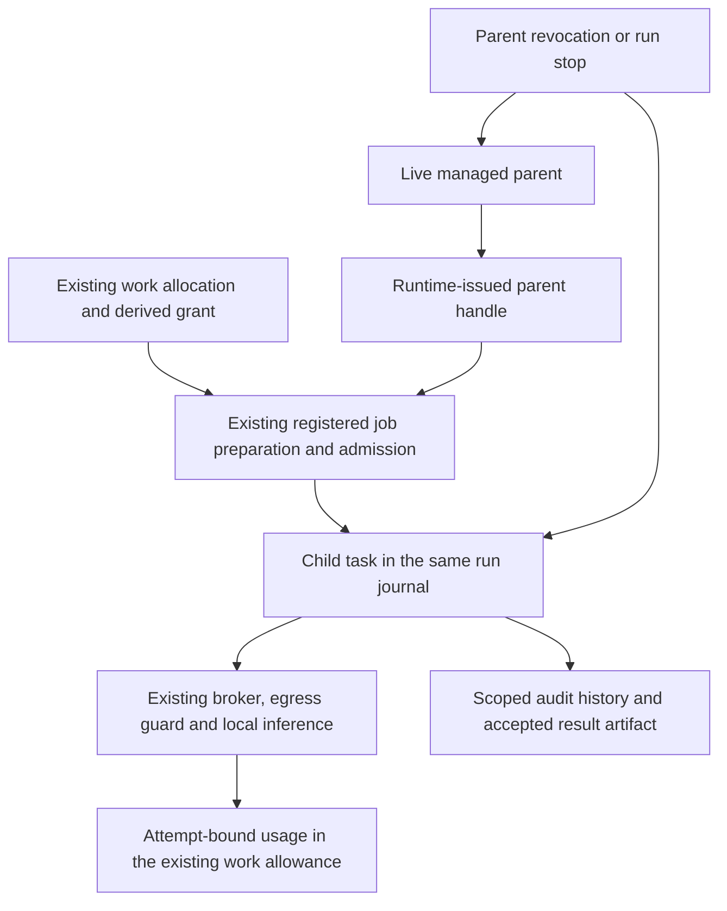

# COORD-A: governed child execution and shared usage

October 5, 2026. The application host can now execute a funded child through
the existing managed runtime. **COORD-A/B/C and Sprint 1 remain open.** The
workspace does not yet dispatch an accepted plan. This is an execution and
accounting slice, not evidence of autonomous collaboration or model usefulness.

## Integration

`Application::activate_delegated_team_work` takes a runtime-issued
`DelegationParent`, not a serialized parent ID. It reuses registered harness
preparation, stored grants, tool assembly, managed execution, the inference
broker and finalization. Child permissions must match the actual team/work
allocation, including when two teams use the same retry key. The normal root
entry continues to deny delegated work.

The child is an additional task in the parent's run, with a durable delivery
binding and a distinct attempt and audit history. A deterministic task ID plus
the existing admission owner serializes duplicate deliveries. A retry returns
the recorded receipt; it does not start another worker or resume an interrupted
admission. Current authority is checked even on receipt lookup. Child deadlines
cannot extend the parent's deadline.

The runtime composes its own child authority guard. A permissive custom host
authority cannot skip stored lineage checks, substitute another runtime's live
parent handle, or survive loss of the parent's original credential. Current
grants, parent ownership, allocations and stops are rechecked before effects and
during execution. A restarted runtime cannot use an old handle to resume work.

Parents close delegation before finalizing, serialized with admission. If a
parent finishes while a direct child is unfinished or not quiescent, the run
is canceled rather than reported successful. Run cancellation drains managed
workers and records quiescence. A child never finalizes the parent run. Because
these tasks share a run, cancellation of a child work item through the existing
run-level stop adapter also cancels that run's parent and siblings. Finer stop
isolation remains future work; this slice does not promise independent branches.

## Shared limits

The host's reported-token ceiling now bounds an attempt's own reservation. A
parent with a 100-token work allowance and a 30-token own ceiling can reserve
30 and subsequently allocate 50 to a child, leaving 20 available. Increasing a
later call's requested ceiling cannot enlarge the recorded attempt allowance.
An absent own ceiling preserves the prior behavior of reserving the available
share. Child allocations remain immutable; released child capacity stays within
that child's allocation and does not automatically return to its parent.

Calls use the existing usage ledger, stamped with actual run/task/attempt IDs.
A known overrun in any branch blocks further inference and new reservations or
delegations across that work tree. In-flight reports are still accepted. Missing
usage retains the reservation; it is not treated as zero or refunded. The Usage
projection identifies overruns of an attempt's smaller own share as well as the
overall work allowance.

Schema 58 adds an indexed **projection** of child execution slots, derived from
the existing task journal and updated in the same transaction as run commands.
Agent, organization, principal and team admission count roots plus children.
The existing wire name `max_active_runs` now covers these execution slots.
Terminal state alone cannot release a child's slot; all of that task's attempts
must be terminal and quiescent. Partial admission and recovery retain holds.
Migration backfills only snapshots with child bindings, preserving legacy rows.

## Verification

- Memory suite: 168 passed, including concurrent child admissions competing for
  one remaining team slot, atomic journal/hold publication, capped parent shares,
  cross-branch overrun denial, quiescence and interrupted-admission migration.
- Application suite: 195 passed. Five delegation scenarios exercise the real
  application/manager/broker stack against deterministic HTTP inference fixtures.
  They cover one executed child despite concurrent delivery, shared usage,
  matching request keys across team namespaces, path-access denial, inherited
  deadlines, parent credential revocation and premature parent completion.
- Managed runtime integration suite: 34 passed, including foreign-runtime proof
  denial and a custom allow-all authority without a stored derived grant.
- CLI compilation passed. The workspace's plan API still explicitly reports
  `execution_available: false`; no UI dispatch shortcut was introduced.

The parallel HTTP scenarios use two separate local inference endpoints. The
local Ollama adapter deliberately serializes each runtime for residency safety;
its limits were not loosened. A separate single-endpoint scenario proves that a
queued child stops on parent revocation. These are deterministic integration
checks, not evidence that a real model has collaborated usefully.

## Next slice and limits

1. Add bounded dispatch/join to the orchestrating agent's existing tool host. The
   parent should wait at a tool boundary, leaving the inference runtime available
   for the child. Do not keep a parent model request open while waiting for it.
2. Connect an authorized plan revision to those assignments and persist scoped
   contribution exchange and a combined result. Make the work projection select
   the bound child task, audit history and artifact instead of assuming the root.
3. Prove the supplied-document two-agent journey through the ordinary workspace,
   including a human flag and changed direction, before enabling plan execution.
4. Build bounded recurrence on this same path after the finite journey works.

Initial child execution supports explicit input, `finish`, shared team context
and local inference. Filesystem tools, hosted disclosure and implicit recall are
rejected until their actual resource boundaries can be inherited durably; tool
names alone are not sufficient. Wider task-count/fairness limits, live process
restart testing, automated reconciliation of unresolved usage and distributed
ownership remain open. Reported-token guards are not hard billing caps: current
prompt overruns and internal provider retries retain the previously documented
limitations. No dollar-spend guarantee is added.

Changes remain local in the existing mixed worktree. The running product engine
was not replaced, and no changes were pushed.
