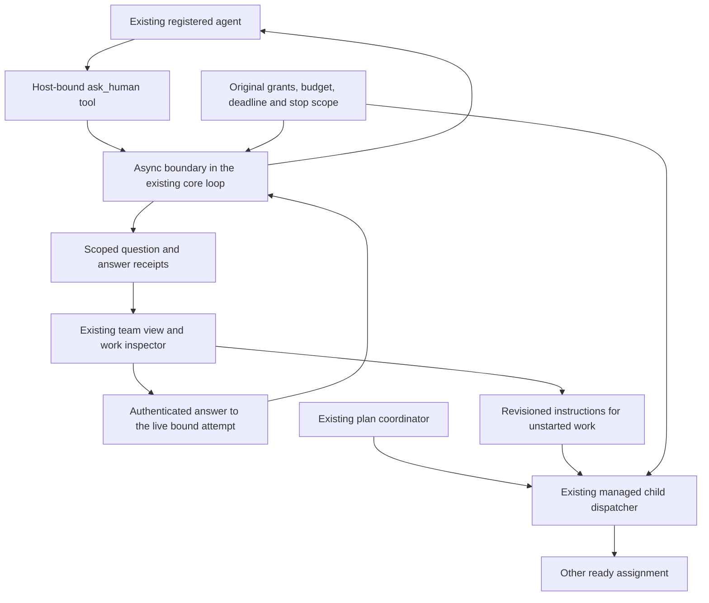

# Human questions and upcoming direction

October 5, 2026. Partial COORD-B, OCT-202 and OCT-203 implementation.
This is a bounded live handoff, not durable parking. The complete sprint gates
remain open.

## Product path

An agent can ask one concise question, explain why it matters, and offer optional
choices. The existing team view marks its work as **Needs your input**. The owner
can choose an option or type a different answer. A saved answer continues the
same attempt under its existing permissions and allowance. Answer history stays
inspectable. A waiting agent is shown stationary rather than falsely working.

The coordinator can dispatch another ready assignment while a worker waits.
If no other assignment is ready, dispatch waits without polling the model.
The local model still serves one inference request at a time.

**Adjust upcoming work** previews the affected assignment and its transitive
dependents. Only unstarted work is eligible. Completed contributions remain
saved; the graph, selected agents, tools and budget are unchanged. The original
agreed plan remains immutable. The dispatcher supplies the latest owner
instructions, and its contribution receipt tells the coordinator which amendment
was used. The running plan shows current work and questions first; proposal
controls move out of the way and the original plan stays in history.

## Integration

Schema 60 adds question and amendment receipts to the existing store, with
organization/team/work/attempt bindings. It does not add a separate scheduler,
agent runtime or budget ledger. The core async hook now identifies its actual
tool call. The host enables the tool only on registered plan execution with an
explicit work binding; it is included in the prepared job and derived grant.
Answers cannot expand authority.

Coordinator answers are passed to subsequently dispatched workers as scoped
plan clarifications. Private exploration/history is excluded. Worker answers
stay with that worker; its completed contribution supplies declared downstream
context. Coordinator input contains the dispatch outline rather than copying
every worker instruction. Workers still receive their full admitted input.

Question creation, answers and amendments recheck scope and work state. Answers
also need a live binding on this host and an unexpired attempt. Amendment and
dispatch share the admission gate, and the database transaction checks the
target and every dependent again. Exact command retries return the existing
receipt, including after completion. Changed/stale commands fail. The browser
retains drafts and uncertain command IDs and requires explicit reconciliation
when an edit was based on an older direction revision.

One unresolved question and two total questions per work item are allowed;
twelve direction amendments per plan are allowed. These limits prevent an
unbounded interruption loop. Waiting consumes elapsed time and retains its
managed admission slot. Stop, expiry, revocation and restart cannot be bypassed
by answering a saved question.

## Runtime mismatches found during the live trials

Registered activation retries already return the original receipt and cannot
dispatch another attempt. Their inherited generic retry policy nevertheless
left a timed-out child in `Ready`, which the UI presented as `Starting` while
the coordinator waited. Registered managed activations now explicitly use one
attempt. Legacy admissions retain their existing retry policy. Historical
finite-plan work is also projected from its terminal bound attempt rather than
appearing to start indefinitely. The dedicated timeout test verifies a real
expired wait, failed task, retained independent contribution and rejected late
answer.

A worker's natural final answer was also being rejected solely because it did
not call `finish` after the owner's clarification. Prompt-only workers now use
the existing answer-completion path; they can still call `ask_human` and remain
bound to the same attempt. Dispatchers and effectful jobs still require explicit
completion, and an explicit `explain_turn: false` is honored. This accepts the
worker's contribution, not a claim that its reasoning is factually verified.
The coordinator cannot bypass the outstanding-contribution guard with prose.

## Automated evidence

| Check | Result |
|---|---|
| Application unit/integration tests | 205 passed; two opt-in live/seed tests ignored |
| Memory tests, including migration recovery | 168 passed |
| Core / orchestrator | 47 / 64 passed |
| Managed service integration tests | 34 passed |
| Legacy spawn budget tests | 4 passed |
| Local HTTP boundary unit tests | 6 passed |
| Web tests | 115 passed across 22 files |
| CLI and web production builds | Passed |

The new protocol fixtures run through actual registered agents, managed
admission, brokered inference, grants, scope, usage and finalization. They prove:

- One worker waits while another finishes; no model calls occur during the
  remaining wait. An answer resumes the same attempt, with one combined result.
  Both explicit completion and natural final-answer workers are exercised.
- A changed unstarted assignment receives the new instructions. Completed
  contributions are not rerun. Original receipt and shared allowance persist.
- Saved plan-wide answers reach workers without copying private history.
- Duplicate answers/amendments are idempotent; changed duplicates, stale
  revisions, edits to started work, wrong actors/scopes and expired answers fail.
- Stop reaches the wait. Restart retains the question without reviving it.
  The timeout path ends rather than leaving a false retry/start state.
- Lost UI responses retain the same command through remount. Rejected answers
  retain text. An acknowledged answer remains visible if refresh fails. Stale
  direction edits require explicit reconciliation; unsent edits survive an ended
  plan.

Protocol fixture output is deterministic test data, not evidence of model
usefulness. Live model outcomes are recorded separately below.

## Live model and browser evidence

Tests use the installed `qwen3.5:latest` on loopback Ollama, a fresh database for
each run, and the production team UI on an isolated preview at port 5176. The
brief and agreed plan are explicitly seeded demonstration input. Model questions
and contributions are actual runtime output. No main workspace was replaced.

Run A (`.lokai/human-handoff-live-2026-10-05`) saved a direction change and accepted
an answer to a coordinator question through the UI. It then exceeded its
4096-token coordination allowance before dispatching workers. The premature
finish was rejected; the run was not marked successful. Reported coordinator
usage was 4552 tokens. This exposed unnecessary prompt duplication and the
missing propagation of plan-wide owner clarifications.

Run B (`.lokai/human-handoff-live-2026-10-05-b`) accepted an amendment to the
independent review. A real worker asked about the audience, the reviewer started
while that worker waited, and the owner answered through the UI. The reviewer
produced the requested two risk/mitigation bullets. The waiting worker reached
its existing deadline, and the coordinator reached its token allowance. No
combined result was completed. The original failure records are retained.
Unconfirmed interrupted-provider usage retains its hold; it is not treated as
zero or refunded. This run exposed the false `Starting` state described above.

Run C (`.lokai/human-handoff-live-2026-10-05-c`) saved the upcoming review amendment
and worker answer. The reviewer completed; the comparison worker produced
natural prose but failed with `model answered with no tool calls`. The coordinator
then exhausted its allowance; the plan is recorded as failed, with one of two
contributions complete. This exposed the completion mismatch corrected above.

Run D (`.lokai/human-handoff-live-2026-10-05-d`) used the corrected harness with
the same 4096-token coordination allowance and unchanged deadlines. The browser
saved the reviewer amendment, answered the comparison worker's actual audience
question with **Beginners**, and displayed the saved answer. Both workers
completed: the comparison addressed beginners and the reviewer supplied the
requested risk/mitigation bullets. The dispatcher delivered both contributions
to the coordinator; repeated dispatch did not rerun either worker. Premature
coordinator completion was rejected while one contribution was still pending.

The coordinator's final request failed with the persisted reason
`provider: requested model residency unavailable`. The exact underlying cause of
the unavailable Ollama residency was not established. It had 4034 reported tokens
before that request; the interrupted request has unknown usage and retains its
hold. This is **two accepted contributions and a failed overall plan**, not a
successful combined result. The UI shows `Couldn’t finish · 2 of 2 contributions
ready`, retains the owner answer, and does not restart work automatically.

The final trial directory contains `result.json`, `snapshot.json`, the original
database, and `failure-evidence.json` with the persisted failure event. Browser
captures are `.lokai/human-handoff-ui-check/live-question-final.png` and
`.lokai/human-handoff-ui-check/final-state.png`. The isolated preview uses engine
port 3003 and UI port 5176; the user's existing engine/UI were not replaced.

## Remaining release work

- Durable parking/resumption with released usable capacity and explicit deadline
  semantics; resumption must recheck grants, stops, budget and current direction.
- Coordination-budget sizing and predictable model latency under realistic
  teams, so an ordinary handoff has enough room to finish without hidden limit
  increases. Model output quality remains separate from correct bookkeeping.
- Local inference residency reliability and clearer provider-failure reporting:
  investigate the recorded final-request failure without weakening GPU placement
  checks or discarding unconfirmed usage. Repeat an ordinary live team journey
  only after the cause is addressed; the end-to-end release gate stays open.
- Replanning an in-flight or completed assignment, changed dependency graphs,
  a broader capability/tool envelope and shared-human authorization.
- Fresh-user comprehension, broader failure trials, queue fairness, conflict
  controls and the complete COORD/OCT acceptance criteria.
