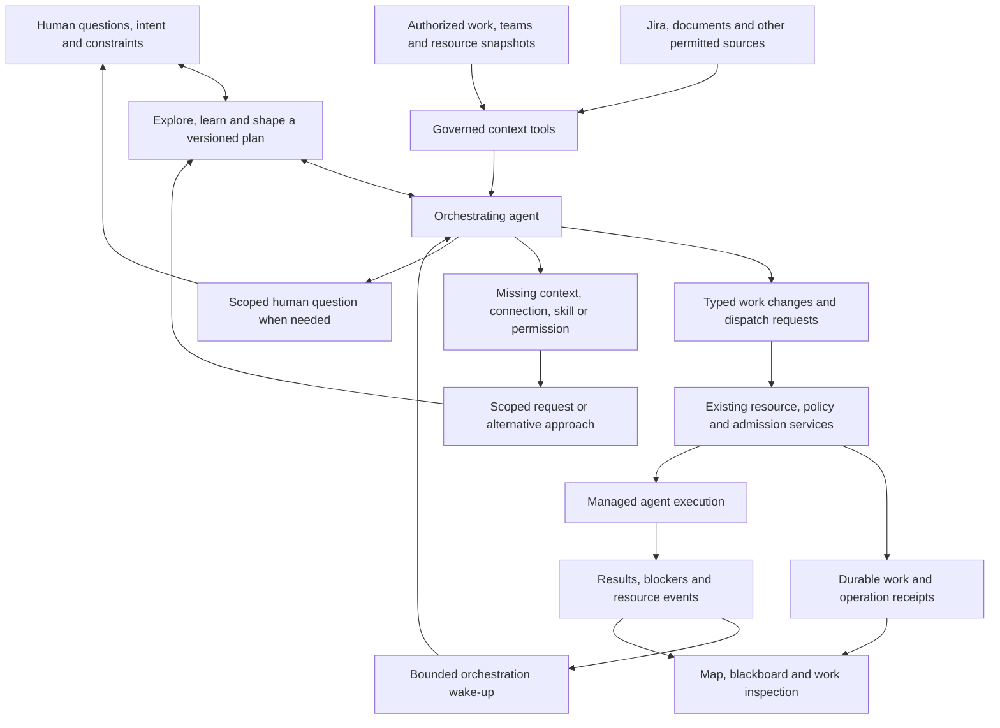

# Model-driven work orchestration

October 4, 2026. Product direction and implementation contract, not an implemented
capability. Refines OCT-103 and COORD-A/B/C under the existing sprint ownership;
it does not close their gates or add another sprint.

## Product intent

An operator can arrive with an unclear problem, explore and learn with Tetonic,
and make informed choices before committing to an outcome or plan. The same
orchestrating agent gathers evidence, explains alternatives, maintains the shared
understanding and turns accepted direction into work. It selects suitable agents,
skills and available resources, requests missing capabilities, and adapts as
results arrive. The operator can inspect or shape that work without becoming its
message relay or scheduler. A clear request can proceed without forced intake.
Jira is one possible source; a document, conversation or standing responsibility
must work through the same engine contracts.

The [shaping, capability and skills contract](shaping-capabilities-and-skills.md)
defines this earlier product journey, the evolving plan, access/setup requests
and the required create/import skill baseline. These are planned integration,
not behaviors established by the UI example or old intake component.

The orchestrator is a managed agent role with a configured model, instructions,
scoped memory and governed tools. It needs no special trained model or separate
execution stack. The model decides what work makes sense and requests changes.
Engine services own durable state, authorization, admission, resource reservations,
placement, retries and cancellation. A model statement never constitutes a grant,
reservation, running job or completed external effect.

## Current source baseline

Inspected working-tree source, including existing uncommitted implementation;
these are integration points, not claims of an end-to-end working orchestrator.

| Current code | What it provides and where it stops |
|---|---|
| `engine/litho/tetonic-app/src/resources/team_work.rs` and `engine/strata/tetonic-memory/src/team_work.rs` | Authorized goals, work creation, listing, parking/resuming, huddle acceptance, source-event cursors and delegation records. Work preserves immutable original input and a version. It lacks the complete revision/dependency/source-sync command contract below. Huddle proposals currently carry work titles rather than a full structured plan. |
| `engine/litho/tetonic-app/src/resources/team_work_activation.rs` | Activates work through registered submission, checks stops and placement, and applies a delegated child's reported-token ceiling. This is not proof of atomic cumulative allocation across a team. |
| `engine/litho/tetonic-app/src/resources/general_harness.rs` and `registered_executor.rs` | Registered identity/revision preparation and existing runtime/broker assembly. The supported tool list is restricted, spawn is absent, and hosted inference currently accepts explicit prompts only, without workspace tools or recalled history. New work/context/MCP tools require governed integration here. |
| `engine/mantle/tetonic-run/src/managed/admission.rs` | Rejects scoped parent/child delegation with `governed delegation is not configured`. COORD-A must supply inherited authority, allocation, stop and recovery before this path is enabled. |
| `engine/litho/tetonic-app/src/resources/execution_limits.rs` and `workstation_placement.rs` | Organization/team execution limits and workstation placement/claim operations to reuse. They are not a complete live inventory of available CPU, GPU, memory or spend. |
| `engine/mantle/tetonic-orchestrator/src/router_llm.rs` | Optional model classification into a small set of specialist roles. It does not create or maintain a durable project plan. Reuse applicable runtime hooks; do not stretch role classification into a second work authority. |

## The work loop

1. **Observe:** receive a human request, source change, worker result or explicit
   wake-up. Read only permitted context and a bounded resource snapshot, with
   source identity, revision, freshness and incomplete/unknown fields.
2. **Shape:** support a persistent learning and exploration conversation. Explain
   evidence, uncertainty, alternatives and consequences; retain human choices in
   a versioned brief. Discover missing context, skills and access before proposing
   feasible assignments. A huddle can crystallize the chosen approach. Simple
   requests need no forced planning session; exploration need not end in tickets.
3. **Commit:** use typed commands to create or revise work, append evidence,
   change dependencies or priority, and retire obsolete work. Each accepted
   command produces a durable receipt. Existing policy can authorize routine
   actions; human review is required only at its configured boundaries.
4. **Dispatch:** choose an eligible agent and request an allocation. Admission
   atomically validates current grants, stop state, budget and concurrency before
   the existing execution path starts work. A stale snapshot may cause a refusal;
   the model refreshes or waits instead of bypassing it.
5. **Respond:** use evidence from results, blockers and operator changes to adjust
   affected work. Unrelated work continues. Completion is evaluated against the
   requested outcome and evidence, not merely a successful model turn.

After dispatch the orchestrator can yield. Its mandate and work remain durable;
it does not need to consume tokens continuously or retain every project in a
single prompt. Changes wake a scoped orchestration run. Multiple teams can have
independent orchestrators, with version checks and fenced ownership for changes
to the same work. The existing managed ownership mechanisms should be extended
where necessary, rather than introducing one global model bottleneck.

## Tools and authority contracts

Proposed capabilities, not current API names:

| Capability | Required behavior |
|---|---|
| Inspect work/context | Reuse the [shared context plan](work-context-and-blackboard.md). Bounded reads and source citations; read-only status questions cannot dispatch work. |
| Inspect resources | Return eligible agent identities/revisions, authorized capabilities, team availability, current commitments, remaining/reserved budget, concurrency and permitted execution environments. Distinguish inference capacity from execution capacity. Unknown telemetry is not free capacity; estimates are not reservations. |
| Create/revise/append work | Extend existing ResourceService commands. Preserve original intent, actor, reason and evidence. Version mutable descriptions/criteria and explicit dependency/ownership relationships. Append notes and artifacts with their actual scope. Reject cycles and unauthorized references. |
| Retire work | Archive or cancel obsolete accepted work with history retained. Retiring a running item invokes the existing stop path and records pending/unresolved effects; deleting a display row must not leave a worker running. External deletion is a separate permission and action. |
| Request assignment | Select an existing permitted agent/revision and request a bounded allocation, or request additional capacity. Creating an agent does not grant tools, credentials or budget. Node placement remains an engine responsibility. |
| Ask for help or judgment | Reuse COORD-B's scoped contribution exchange and human flags. Include an owner, related work, question, reason, evidence, expiry and receipt. Ordinary updates do not interrupt a worker. |
| Resolve missing capabilities | Request the specific context, connection, skill or operation needed for affected work. Route setup/permission to a capable owner, offer alternatives, and resume only after validation and admission. A request never grants itself. |
| Discover and use skills | Inspect enabled skill descriptions and compatibility, select relevant content, and pin the used revision through the governed invocation path. Skill guidance does not confer tools or permission. |

All writes carry a stable operation identity and relevant expected versions.
Authority and payer lineage are derived and checked by the engine, not accepted
as claims from the model. Delegation cannot reset budget or stop scope. Charge
orchestration and connector activity to the same governed responsibility too.
Conflicting human edits are surfaced and reconciled rather than overwritten.

## External work sources

Start with one read-only source integration after the local governed team path is
proven. Configure it in Tools & MCPs using the existing tool/broker boundary.
Reading an issue does not imply permission to modify the issue, its project or
the engine's policy. Source text and comments are untrusted context.

Keep the external issue identity, connection identity, observed revision and
retrieval time separate from the internal work identity. Link multiple execution
tasks to an issue where useful; do not automatically clone every issue into a
second project-management system. Source-event retries must not duplicate work.
Treat Jira ownership and Tetonic execution assignment as distinct fields.

Begin with explicit fetch/refresh. Automatic polling/webhook triggers belong to
the existing activation-cursor/recurrence work. Bidirectional edits require an
explicit field-ownership and conflict policy, remote acknowledgements and retry
reconciliation. Never claim an external update succeeded from a local receipt.
Credentials remain host-managed and scoped, not inserted into model context.

## Bounded autonomy and visible behavior

- Give each orchestration scope a mandate, allowed sources/actions, resource
  envelope and escalation conditions. Agent-initiated work is traceable to that
  mandate; the model cannot silently broaden it.
- Bound plan size, active children, coordination messages, model turns and
  repeated replans. Coalesce duplicate events. Avoid plan churn from token streams
  or status chatter; use meaningful state transitions and declared safe boundaries.
- Resume from durable work, operation receipts and event cursors after failure.
  Reconcile uncertain effects before retrying; do not promise exactly-once remote
  effects. Model unavailability leaves acknowledged work inspectable and bounded
  workers governed by the engine.
- The map shows accepted work and actual execution. Blackboard shows authored
  plans, shared contributions and tool results. A short activity entry explains
  changed assignments and why, with expandable source/operation evidence. Do not
  require private chain-of-thought or label summaries as a raw internal trace.
- Status questions use read-only capabilities even when the same visible director
  handles direction. The model cannot upgrade a question into write authority.

## Implementation order within the existing epic

1. **OCT-103:** finish versioned work, dependency and operation-receipt contracts;
   add bounded resource/context projections through existing services. Preserve
   original user input, shaping discussion and accepted plan revisions; expose
   missing budget/capacity information honestly. In parallel, OCT-102 supplies
   the skill create/import/load baseline and OCT-105 the missing-capability
   request contract described in the linked refinement. These are required scope.
2. **COORD-A / OCT-201:** complete governed delegation and shared reservations,
   inherited grants, stop propagation and recovery. Keep the current rejection
   until its replacement is verified; unrelated root jobs are not a substitute.
3. **COORD-B / OCT-202:** give a registered orchestrating agent the typed tools.
   Prove model-selected decomposition and agent assignment on a supplied-document
   task, including feedback-driven revision and one bounded contribution exchange.
4. **COORD-C / OCT-104/205:** drive map, work detail, blackboard and source-backed
   status from those same receipts and records. Remove illustrative substitutions
   only when the real path supplies the evidence.
5. **Source integration:** add one governed read-only Jira or equivalent connector
   on that path, with linked identities and deduplication. Schedule after measuring
   the core integration; do not silently make broad Jira sync an October 25 gate.
   Wider recurrence stays OCT-204; external writes follow explicit authority and
   conflict handling. Additional connectors reuse this contract.

First real proof: a person explores an unclear problem and supplied source
material, learns the tradeoffs and chooses a direction. The model creates
input-specific work from the accepted plan, uses an enabled skill, selects two
eligible registered agents within one budget, accepts useful contributions,
revises affected work when a constraint changes, and produces inspectable
evidence. Exercise a missing-capability request with a supported resolution.
No fixed plan or canned exchange satisfies it. Then repeat with an external source.

Deterministic checks must cover duplicate events/requests, stale work edits,
cycles, allocation races, unauthorized tools/private context, proxy delegation,
source changes, model failure, no-progress loops, stop during dispatch and restart
with uncertain effects. Model usefulness and operator comprehension are separate
evaluation evidence. This document adds no runtime implementation or test claim.
