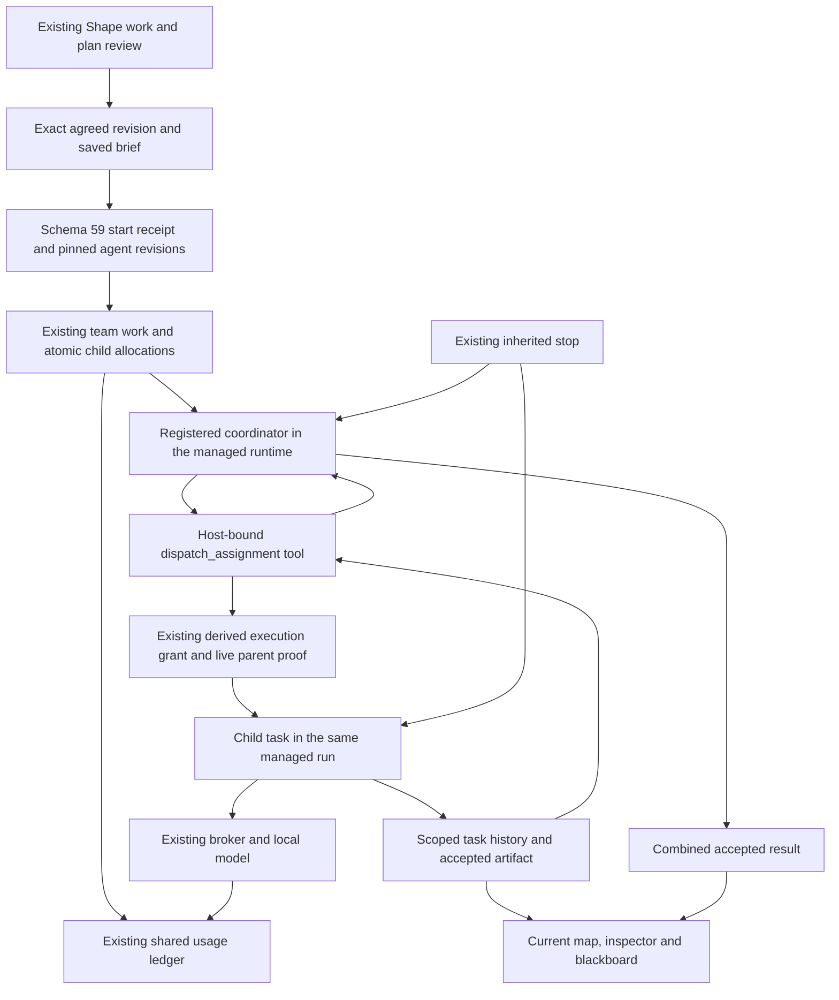

# Agreed plans execute through the existing runtime

October 5, 2026. Partial COORD-A/B/C and OCT-103/104/201/202/205 evidence.
Sprint 1 and the full coordination gates remain open. This slice connects an
agreed plan to finite, governed team work in the current team interface.

## User path

In **Shape work**, save a brief, propose or edit assignments, and agree to the
direction. **Start agreed plan** separately authorizes execution, showing the
shared reported-token allowance, coordination share and whole-plan deadline.
The coordinator dispatches the exact approved assignments. Each contribution
has a real registered agent, child work item, task, attempt and result. Later
assignments receive their declared dependencies' recorded contributions.

The map groups these records into one project and draws their dependency edges,
including the final coordinator result's dependence on the contributors.
Inspection and the blackboard use each task's own history and accepted output.
An executed child's displayed input comes from that task's scoped audit, so the
operator can inspect the actual instructions and dependency text it received.
The plan shows individual contribution links and the combined result, plus Stop
while active. The Usage view accounts for parent and children in the existing
ledger. No new product screen or alternate runtime was introduced.

## Integration and authority

- Schema 59 stores immutable execution provenance and indexed work links, not
  another scheduler, journal or budget authority. The first claim verifies the
  latest agreed plan and saved brief in one immediate transaction. A duplicate
  command returns its receipt. A different start cannot execute the same huddle
  again. Interrupted admission is not automatically replayed.
- Plans pin exact agent definitions. The model chooses which ready approved
  assignment to dispatch; it cannot substitute instructions, invent another
  assignment, grant access or add capacity. Unknown keys, unmet dependencies,
  premature completion and duplicate execution are guarded at the tool boundary.
- Dispatch reuses the core async spawn boundary and registered executor. The
  parent waits outside an inference request, allowing the serialized local model
  runtime to execute its child. The host validates the stamped parent attempt
  against its runtime-issued delegation proof.
- A new **team-owned context for this plan** contains the saved shared brief and
  explicit contributions. The workspace's participation context is private and
  is deliberately not repurposed. Personal exploration/history is not attached.
  Dependency output is delimited as evidence, not privileged instructions.
- Each child consumes its preallocated share of the original work allowance.
  The coordinator consumes the remainder. Unknown usage retains its hold; a
  failure does not restore an allowance or generate an unrelated retry run.
- Local workers retain their own time limit. The plan's total deadline includes
  those serial waiting windows and a coordinator window, capped at 24 hours and
  recorded before admission. Two workers on the current 120-second local
  profile have a displayed 360-second plan maximum. Derived deadlines still
  cannot outlive the parent. There is no unlimited wait or new recurring loop.
- A regression exposed a race between parent finalization and child authority
  revocation. Finalization now signals unfinished descendants before closing
  delegation, while serialized against admission, preserving cancellation truth.

## Verification

Source: existing heavily modified/untracked local worktree on October 5. No claim
that the repository HEAD alone contains this implementation. No push or mixed
worktree commit was made.

- Application libraries: 198 passed, one opt-in live-model test ignored in the
  ordinary suite. New deterministic HTTP integration checks exercise actual
  registered activation, grants, broker and runtime: ordered two-agent work,
  premature finish, dependency denial, duplicate dispatch/start, pinned context,
  independent results, restart receipt lookup, shared reported usage, stale
  briefs, insufficient coordination allowance and parent stop during child work.
- Memory libraries: 168 passed. The old-schema interrupted-admission fixture
  was updated to remove both newer schemas when reconstructing version 57.
- Orchestrator libraries: 64 passed. Managed runtime integration: 34 passed.
  Legacy spawn-budget integration: four passed. Core library: 47 passed.
- Web suite: 107 passed in 21 files, including start identity retained across a
  lost response/overlay closure, recovery from definitive rejection, dependency
  grouping, blackboard provenance and withholding a partial combined answer.
  Production web and CLI builds passed. A usage-editor race found by the suite
  was fixed: an initial read cannot overwrite the allowance being typed.

### Actual local model run

The opt-in `local_model_plan_journey` test used installed Ollama
`qwen3.5:latest` on this Windows machine. An agreed fixture brief and two
assignments asked one registered agent to compare a 60-minute workshop with
three 20-minute sessions and another to critique its assumptions. The model
generated the contributions and final synthesis; they were not fixture replies.
The test seeded the approved plan, so this is not proof of the full natural
language plan-generation or first-user journey.

The successful run took 187.96 seconds including setup/polling. Three coordinator
calls and one call per contributor reported 5,786 tokens: 3,790 coordinator,
888 comparison, 1,108 review. The agreed allowance was 11,096; all five calls
reported usage and 5,310 unused tokens were released from their respective
allocations. All three work records completed in one run.

Evidence is local under `.lokai/plan-live-2026-10-05-c/`: `result.json`,
`snapshot.json`, `workspace.db`, `shape-id.txt`, and `root-id.txt`.
Root work: `f25ace60-3fb8-4c68-831a-e26089be280d`.
Browser checks confirmed the project dependency map, separate contribution links,
exact received context behind an inspection disclosure, recorded blackboard output
and the 5,786-token Usage total. An authenticated HTTP retry after engine restart
returned the original completed execution and both contributions. No second
execution was admitted. Screenshot: `.lokai/plan-ui-check/team-map.png`.

The same current UI is served in an isolated preview on port 5175, connected to
this proof database through a separate engine on port 3002. The previously
running product engine/database were not replaced. The connection file contains
an owner credential and must not be published.

Two preceding live attempts are retained as failure evidence. The first exposed
an ambiguous dispatch argument; the schema now uses an enumerated
`assignment_key`. The second completed one worker but exhausted the original
120-second parent deadline while coordinating the next. Neither was reported as
successful. The explicit whole-plan deadline fixed that local serial-time issue.

The successful model output is **not verified research**. It made unsupported
learning/retention assertions and omitted the requested inline work citations;
the UI supplies separate durable contribution links. This establishes actual
handoff and synthesis, not factual correctness or measured team advantage.

## Deliberate limits and next work

One finite execution per huddle, one local owner and one host. Children currently
support explicit input and `finish` with local inference. Hosted disclosure,
filesystem/MCP effects, private recall and nested plan dispatch remain denied in
this team path. Existing independent/solo work behavior remains separate.
Canceling a child uses the shared run's stop and can stop its siblings too.
There is no claim of isolated branch cancellation or resumability after restart.

The full COORD exits still need a supplied-document useful-result comparison,
concise human escalation, acknowledged changes to direction, and an observed
permitted external/tool interaction. Next implement a work-scoped human flag
and bounded revision/resume contract on this same path, retaining completed
contributions and rechecking authority. Then widen capability access and prove
the second domain. Independent queues, fairness, bounded recurrence, skills,
process-crash reconciliation and distributed ownership remain open.
