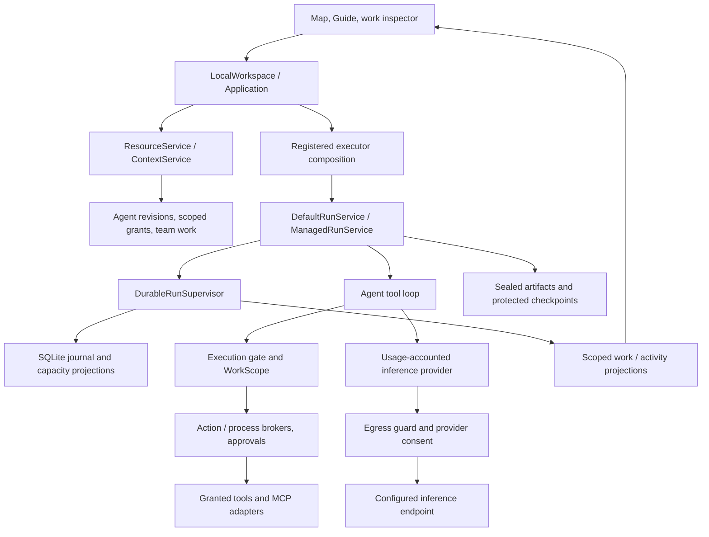
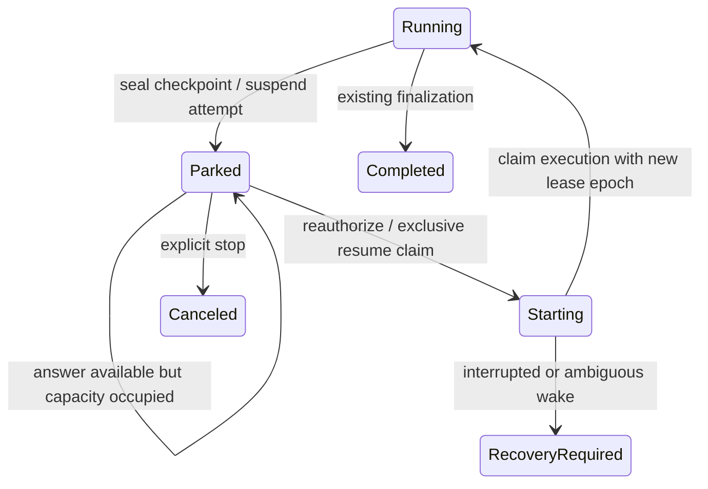

# Runtime boundaries and durable waiting

Date: 2026-10-07. Baseline: `eb820c7c`.

## Decision and scope

The engine has a coherent execution and authority spine. The main architecture risk is accumulated orchestration responsibility in the application adapter, combined with a lifecycle that assumes a coordinator stays alive for its children. Adding a second scheduler, another agent registry or browser-driven recovery would make this worse.

This change implements the **first engine slice of OCT-203**: a scoped, single-root general-harness execution can checkpoint at a human handoff, release execution capacity, and be explicitly reattached through the existing managed runtime after executor loss. It does **not** enable durable waiting in the team UI. Team subtree restoration, automatic wake scheduling and the production tool-host adapter remain required before that cutover. OCT-203 remains open.

The delegation follow-on below extends this foundation from baseline `475decc7`. It remains an engine prerequisite, not a claim that team restart or the three-assignment product acceptance is complete.

The review traced the current registered-agent execution path and its recent product additions. It is not a claim that every file or distributed failure mode has been audited.

## Current ownership

This shows ownership and important calls, not every method or deployment process. Capability admission, current authorization and budget checks are enforced at their respective boundaries; being in the diagram is not itself an execution grant.

| Area | Current evidence | Architectural assessment / action |
| --- | --- | --- |
| Agent definition vs execution | `ResourceService`, `resources/activation.rs`, pinned `AgentJobSpec` and run task bindings | Keep stable agent revisions separate from work and attempts. Resume must retain those pins; editing an agent must not silently rewrite an old job. |
| Lifecycle authority | `tetonic-run/managed`, `transition.rs`, `tetonic-memory/run_store.rs` | Keep the supervisor as the sole run/task/attempt writer. Capacity changes belong in its journal/projection transaction. This change extends that owner. |
| Tool and inference enforcement | `resources/registered_executor.rs`, `EngineRuntime::assemble_agent`, `WorkUsageProvider`, hosted `EgressHostedTransport` | Reuse the same brokers, consent, capability checks and accounting during restoration. A saved conversation is not permission to recreate arbitrary tools or providers. |
| Plan orchestration | `local_workspace/plan_execution.rs`, `plan_execution/parallel.rs` | This adapter currently prepares plans, resolves agents, allocates grants, runs the dispatch loop and collects results. Move its scheduling/continuation policy behind one engine-facing work-controller interface; keep HTTP/UI translation here. Do not copy the scheduling loop into a new owner. |
| Human waiting | `resources/plan_dispatch.rs`, `local_workspace/plan_human.rs`, `tetonic-memory/plan_human.rs` | Current production `ask_human` persists the question but waits inside a live future and requires a live attempt/deadline to answer. A durable question alone cannot reconstruct execution. |
| Delegation | `managed/delegation.rs`, `tetonic-memory/delegated_grants.rs`, `delegated_lifetime.rs` | Legacy grants retain exact parent lease binding. New plan grants explicitly bind permission to the parent work incarnation. Live handles and journaled child dispatch still require the current executor lease. This separates permission lifetime from executor ownership without migrating existing permissions. |
| Time and authorization | `local_workspace/plan_execution.rs` grant issuance; registered executor deadline wrappers | Grant expiry and execution duration currently share a horizon. Human waiting needs an explicit authorization horizon distinct from active execution time. Pausing a clock must never silently renew a grant. |
| Legacy surfaces | Deprecated `FleetManager` remains publicly exported; `tetonic-orchestrator` still contains session routing, specialist spawning and prototype fleet types | No new product feature should build on the prototype fleet. Inventory callers/contracts before deletion. Existing coding/session orchestration needs a deliberate migration, not accidental reuse as a second product scheduler. |

The highest-priority structural problem is **work lifetime vs executor lifetime**. File size is a useful signal, but splitting files without changing ownership would not solve it. The new suspension code is kept beside the managed lifecycle; it is not another execution service.

The large `tetonic-core` agent loop is a second maintenance hotspot: it still coordinates inference, tool routing, context, auditing and limits. Keep policy-free turn/continuation mechanics here and move product orchestration out of it. This slice extracts checkpoint handoff mechanics into `agent/waiting.rs`; it does not justify a wholesale harness rewrite.

The supported runtime remains a local authority backed by SQLite, local artifacts and in-process execution handles. Per-run journal locks, capacity transactions and lease epochs are useful foundations, but do not establish distributed availability or node-failure recovery. A future multi-node controller needs durable placement/ownership, bounded event-driven scheduling and an explicit storage consistency contract. Those should replace local-only assumptions incrementally rather than add another competing execution path. The two-manager resume race test covers one database, not a network partition.

## Implemented state transition

`Parked` is task state; the corresponding attempt is `Suspended`. It is not a successful task and cannot satisfy a dependency. A stopped run cannot be resumed through this path.

The core saves the exact invocation, conversation, pending call identity, model settings, tool schemas, turn counters, reported token count and heuristic monitor. Provider-specific call IDs and opaque continuation blocks use a dedicated checkpoint serializer. Ordinary message serialization and debug output still exclude private protocol data. This preserves the established separation between provider continuation and employee-visible history.

The managed runtime seals the checkpoint through the existing artifact store, binds it to run/task/attempt, verifies its SHA-256 digest, and records only a reference in the journal. Checkpoints are bounded at 2 MiB and classified `Secret`; this is not a new encryption guarantee. They are not published as team artifacts or shared memory. Existing artifact retention requires positive terminal-run evidence before collection.

Suspension requires both an atomic `WorkScope` quiescence check and a tool-host attestation that no staged mutation, open session or other transient tool state would be lost. That attestation defaults to false. A trusted human hook must be idempotent by pending call ID because restoration may retrieve the same saved question again. Compiled coding contexts and turn-specific stable catalogs are not supported by this first contract.

Remaining elapsed execution allowance is derived from the persisted deadline, in seconds. It is not supplied by the model or reset by a restore request. Reported tokens and model-turn counters also carry forward. This does not refund prior spending, replace usage reservations, renew credentials or extend grant expiry. While the process remains up, a suspended executor retains a lightweight waiting future; it holds no execution slot and performs no model polling.

On wake, the runtime rechecks current authority and checkpoint integrity, competes for capacity in the same SQLite transaction used for ordinary admission, increments the lease epoch and claims execution. Heartbeat identities include the new epoch. Duplicate wake commands are not executable receipts. A losing/restoration-failed host detaches without canceling a winning executor or reporting a terminal run event. Ordinary unsafe/interrupted execution still requires recovery; there is no replay-from-original-input fallback.

`restore_suspended_root` is a trusted composition API, not an employee endpoint or automatic startup driver. It accepts only the matching scoped root, activation receipt, pinned invocation/configuration and current authority. Team subtrees are rejected. At this initial slice, production `registered_executor` did not opt into this contract; the later human-question follow-on below adds an explicit root-only host policy.

Schema 64 is a journal-format compatibility marker. It prevents older writers from opening a database whose commands and state variants they cannot understand. Existing upgrade backup and crash-rollback behavior is retained. The owner's running database has not been upgraded by this change.

## Integration slices and remaining work

1. **Durable work authority — contract implemented in the follow-on.** Existing lineage now supports an explicit work lifetime; new plan assignments select it. Exact task version/attempt identity and pinned stop generations prevent a stopped or replaced work incarnation from regaining permission. New dispatch and model/tool boundaries check executor leases independently. Full team restart still depends on the following reconstruction/controller work; grants alone do not restore executors.
2. **One work controller.** Extract the dispatch/reconciliation policy from `LocalWorkspace` into a product-neutral owner in the existing engine composition. Use durable assignment readiness and managed capacity instead of a browser loop or an in-memory `occupied` set as the scheduling truth. Reuse current parallel dispatch and contribution contracts. Inventory `tetonic-orchestrator` callers before choosing placement; adding a new crate is not a prerequisite.
3. **Production reconstruction — shared builder and accounting transfer implemented.** The follow-on below reuses registered preparation/assembly, scoped audit, selected MCP/tool contracts and existing usage reservations. Staged mutations and shell/LSP profiles remain non-checkpointable. The later human-question follow-on below connects persisted answers and bounded response time for explicitly configured roots. Default team composition, authorization-horizon configuration and controller/subtree cutover remain open.
4. **Team cutover.** Restore a supported quiescent subtree under one durable ownership claim. Release a parked agent's usable slot without marking its assignment complete. Let independent queued assignments proceed. Return the question and status through the existing inspector/map; do not add a separate recovery screen or frontend scheduler.

Required product acceptance: one human-blocked assignment, one active assignment and one queued assignment; restart while waiting; answer once; completed effects happen once; current permission/budget limits still apply; stop wins over a late answer; truthful map state throughout. The current root tests are prerequisites, not a substitute for this scenario.

## Delegation follow-on: work permission and executor ownership

New plan assignments use `DelegationLifetime::ParentWork` in the existing immutable grant lineage. Omitted lifetime still means `ParentLease`; serialization omits that default, preserving old retry payloads. The lifetime cannot be edited or upgraded in place. Schema 65 is a compatibility marker for the new authority semantics and dispatch fence, using the existing backup/migration transaction. The live user's database has not been opened or upgraded by this work.

Work-scoped permission remains bound to the same organization, shared team context, initiating principal, parent work/run/task/attempt and task version. The existing agent revision, tool/artifact attenuation, approved environment digest, payer, stop scope, allocation and absolute grant expiry remain authoritative. Every ancestor is checked. An intentional, well-formed suspension can outlast the old execution deadline/lease; permission does not expire merely because the coordinator is parked. A fresh lease on that same attempt can continue the permission. A changed attempt, changed task version, revoked grant/credential, stop, terminal work or recovery state cannot.

The lineage pins a digest of applicable generations from the existing `control_stop_scopes` table: organization, team, work/goal ancestors and both participating agents. Active stops deny permission; clearing a stop does not erase its generation or revive an older grant. Stops on unrelated agents do not invalidate this work. There is no second stop counter or cancellation service.

This is permission to continue previously authorized work, not permission to dispatch from a parked process. New grants require a running claimed parent. `DelegationParent` captures the original authority and executor incarnation; its dispatch handle becomes invalid at suspension or lease replacement. New managed child admissions journal the current parent lease, and the existing `AddTask` transition validates that proof atomically with the run state. This rejects stale dispatch even if a worker fetches the latest journal sequence. Old journal entries without this field remain replayable.

Model/tool execution also rechecks current durable executor ownership at each gate. A still-valid work grant cannot substitute for a current worker lease. Existing finalization claims continue fencing result publication. This does not claim atomic rollback of an external side effect already in flight, or distributed exactly-once execution. WorkScope quiescence and the existing action/process brokers remain required.

No new scheduler, grant table, agent registry or budget ledger was introduced. The new logic lives with the existing store validators, managed runtime and run transition. Parent credential checks still apply during continuation; reconstituting that approved authority after process loss remains a trusted composition responsibility.

There are no UI changes in this slice. Production human handoffs still use the live waiting path, and `restore_suspended_root` still rejects subtrees. The next implementation was shared registered-harness preparation/reconstruction; the follow-on below records that work. Independently configured authorization lifetime and controller/subtree integration remain open. Do not enable durable team waiting by simply setting `with_durable_waits()`.

Follow-on verification covers both grant lifetimes through the production app's child execution, parent credential revocation, parent completion, queued cancellation and usage paths. Storage tests cover reopen, expiry, idempotency, schema-64 upgrade, malformed suspension, stop/revocation and multiple delegation levels. Managed tests exercise actual checkpoint/resume, stale parent handles, stale journal dispatch and rejection of a tool effect after executor lease replacement. The storage replacement fixture is deliberate fault injection, not a distributed failover trial. A Windows stack-size regression found during full-suite validation was fixed by sharing the captured parent state rather than copying it into async launch frames.

## Foundation validation (`475decc7`)

The managed SQLite/artifact tests cover released capacity, waiting beyond the old deadline, capacity contention at wake, executor loss plus reopened storage, exactly one pre-wait effect, preserved token limits, changed-invocation/config rejection, competing restorers, cancellation, revocation, missing/corrupt checkpoints, malformed suspension, refusal of mixed effect/handoff batches and journal replay. Executor loss is simulated by dropping the local executor; this is not an OS-process crash or a distributed failover trial.

Additional checks cover protected provider-state round trips and exclusion from ordinary serialization, default-deny tool-host readiness, and WorkScope parking/cancellation. Broader domain, core, inference, memory and managed-run suites are used to check the existing paths. No paid provider calls, new frontend code or live-server restart are involved.

Final checks passed:

- `cargo test -p tetonic-app -p tetonic-run -p tetonic-core -p tetonic-domain -p tetonic-memory -p tetonic-inference`: **1,160 passed, zero failures, five ignored**. This includes eight new managed suspension scenarios and the existing application/provider/tool/delegation regressions.
- Strict Clippy with tests for those crates and `tetonic-cli`, with `-D warnings`.
- Architecture and static quality gates, workspace Rust formatting, and staged diff whitespace checks.

Local logs are under `.lokai/manual-testing/durable-wait-*`. Frontend tests and browser checks were not repeated because the UI is unchanged and this feature is deliberately not activated in the running product.

## Delegation follow-on validation

- The full application, managed-run, memory, core, domain and inference suites passed: **1,167 passed, zero failed, five ignored**. These include seven additional tests and both lifetime variants exercised inside the existing production delegation scenarios.
- Strict Clippy with tests for those crates plus `tetonic-cli`, with `-D warnings`, passed.
- Architecture/static quality gates, workspace Rust formatting and diff whitespace checks passed. Task admission and its lease fence are kept together in `transition/task_admission.rs`; the central transition module stays below its size guardrail.
- Logs: `.lokai/manual-testing/durable-delegation-final-tests.log` and `durable-delegation-clippy.log`. No paid inference, frontend changes or live-server/database migration was involved.

## Registered harness reconstruction follow-on

Registered execution now separates three responsibilities inside the existing application owner:

- `registered_executor/preparation.rs` resolves current credentials, the immutable agent revision and grant, validates the approved host environment and disclosures, and verifies the existing activation fingerprint.
- `registered_executor/assembly.rs` constructs the same brokered provider, selected tools/MCP host, scoped recall, audit sink, process/action brokers, finalization driver and work-usage wrapper for launch and reconstruction.
- `registered_executor.rs` hands the resulting execution to the existing managed run service and retains the existing completion/usage-settlement path. It does not own another run registry or scheduler.

Reconstruction is an explicit internal composition operation. A normal submission retry still returns the original receipt without starting or waking a worker. Reconstruction must match that receipt exactly and use its existing audit history; a missing or foreign audit history fails closed rather than creating a replacement. No fresh elapsed allowance is installed. The managed runtime still validates the protected checkpoint, current authority and exact invocation/configuration, and owns the exclusive resume claim. Hosted disclosure and egress setup are reused from the original assembler; the new restart proof is local-provider coverage, not a live frontier-provider certification.

MCP tool IDs already bind the endpoint and complete manifest. The existing per-call manifest check remains in place; there is no second MCP registry. The read-only adapter attests readiness only when its inner host is reconstructable and every selected MCP version is still available. Its sessions are per invocation, and managed WorkScope quiescence remains necessary. Ordinary tools refuse checkpoints with a staged transaction, an enabled shell/LSP profile, or in-memory orchestration. Registered dispatch/director state is also excluded. This is a bounded readiness contract, not support for restoring staged edits, arbitrary subprocesses or remote sessions.

A previously hidden accounting dependency is now handled by the existing storage transaction: `ResumeAttempt` transfers the reservation's executor fence from the suspended lease to the newly issued lease. It retains the original attempt, reservation, allowance, reported calls and unresolved charges. The run event, projection, capacity acquisition and accounting transfer commit or roll back together. Projection-only recovery or arbitrary lease replacement cannot transfer the reservation. A changed fence, released reservation or mismatched work/run/task is rejected. No refund or new allowance is created by resume, and unknown spending remains blocking. This uses existing tables and needs no schema change.

Shell approval hosts now obtain the current deadline from the persisted live work attempt when proposing an action; they no longer retain a launch-time deadline. Proposal/consumption still recheck that live boundary. This prepares the shared assembler for clock changes; shell-enabled hosts remain ineligible for checkpointing in this slice.

The new composition proof runs a registered, funded root through the real application assembler, managed runtime, SQLite, artifact storage, outbound broker and a deterministic loopback inference server. It reads a file, parks on a human handoff, loses its local executor, rebuilds the application, and continues the same attempt and audit history. The final request retains the previous tool result and human answer without replaying the initial read/model turns. Its ledger progresses from 60 to 90 reported tokens under the original 95-token ceiling. This initial proof used a controlled answer hook; the later follow-on replaces it with the production persisted question/answer path. Executor loss is simulated by dropping a LocalSet, not an OS crash.

Other tests reject changed model/tool/workspace/budget/time/request/receipt bindings, revoked credentials and missing audit history; verify staged-state/MCP readiness; and prove accounting rollback, old-fence rejection, released-reservation rejection, preserved unknown spend and no budget top-up. Existing launch, hosted-provider, delegation and local-tool regressions exercise the shared path. A Windows stack overflow exposed by the existing multi-agent continuation tests was fixed by boxing the registered composition future at its call boundary.

**Default team durable waiting remains disabled.** There is no employee restore endpoint or startup driver. The follow-on below connects the production question hook for explicitly configured independent roots. Existing team dispatch/reconciliation still needs one controller and supported subtree restoration. OCT-203's three-assignment product acceptance remains open.

### Reconstruction validation

- Across the application, run, memory, tools, core, domain and inference suites: **1,224 passed, zero remaining failures, six existing ignored tests**. The broad command reached a timestamp-collision failure in the existing `m6_durable_integrity` fixture; its database names now use UUIDs. The complete run/tools suites passed after that correction. The final strengthened reconstruction assertions were also rerun separately.
- Strict Clippy with tests passed for those crates plus `tetonic-cli`, with `-D warnings`. Architecture/static quality gates, workspace formatting and diff whitespace checks passed.
- The ignored cases are three opt-in local-provider/product proofs, two inference benchmarks and one superseded tools test. No paid inference or live-server upgrade was used.
- Logs: `.lokai/manual-testing/harness-reconstruction-full-tests.log`, `harness-reconstruction-remaining-tests.log`, `harness-reconstruction-final-targeted.log` and `harness-reconstruction-clippy.log`.

## Persisted human-question follow-on

The shared registered builder now accepts an explicit, trusted **independent-root** human-wait policy. It pins both the response limit and the applicable stop-generation digest into the existing activation fingerprint. The usual LocalWorkspace team/coordinator composition still selects the live handoff; it cannot opt in accidentally through a retry. Dispatch/director state, child tasks and shell/LSP profiles remain outside the supported checkpoint contract.

The production `HumanHandoff` verifies the pending call against the sealed checkpoint through the managed runtime, then saves its question in the existing `work_human_questions` record. Its optional `saved_wait` payload binds the checkpoint, call ID, task version, run and original grant. The existing question ID derived from attempt/call is retained. A crash between checkpoint commit and question insertion can reconstruct that same question; retries do not renew its response deadline.

Response time is anchored at suspension and bounded by the original grant expiry (host policy: 1 second through 7 days). It is distinct from the remaining active execution allowance. An on-time saved answer can be delivered after the response deadline, provided current authority still permits the work; an unanswered expired question cannot. No grant renewal, budget reset, new reservation or lease extension occurs when a person answers. Existing per-assignment question limits remain in force.

Answer writes recheck the same parked, quiescent root, funded work binding, grant, context access and control generations in the existing writer transaction. A stop remains disqualifying after it is cleared. Polling delivery performs current validation too, rather than trusting a historical answer. The same pinned stop digest is composed into the existing execution-authority chain, so a stop after answer delivery or during capacity contention still blocks resume and later model/tool boundaries. An identical answer retry can read its old receipt after completion/revocation, but that receipt cannot authorize execution. A denied or unavailable durable handoff leaves the checkpoint parked for reconciliation and does not reacquire capacity or call the model again.

The existing task reader exposes a verified pending question as `waiting_human`, including after the local executor is lost. The existing answer handler accepts guidance for that saved wait without requiring an in-memory worker. Unsupported or expired parked state is shown as recovery required; an answer alone does not claim a worker is running. No frontend layout, map, styling, navigation or new recovery screen was added. This is backend support for the existing product surface, not default team activation of durable waiting.

Schema 66 is a compatibility marker for saved-question authority semantics. Old payloads deserialize with no saved binding and retain live-only answer rules. Upgrade backup/rollback behavior remains in place. Only temporary test databases were upgraded; the user's running server/database were not restarted or migrated.

The end-to-end composition test now uses the actual production human hook: read a file, persist a question, lose the executor, save an answer offline, reconstruct, then finish the same attempt/audit with its original spending. It still performs exactly three model calls with the prior file result and saved guidance carried forward. Additional tests cover a crash before question insertion, immutable response deadlines, duplicate/conflicting answers, authorization expiry/revocation, changed checkpoint/task version, cross-scope answers, active/cleared stops, schema-65 legacy payloads and a failed handoff that remains parked without new inference or budget release. These are deterministic loopback-model tests and executor-loss simulation, not live-provider usefulness or OS-crash certification.

**Next:** move the existing team dispatch/reconciliation behind one durable controller, pin an appropriate authorization horizon at team approval, and restore supported quiescent subtrees. Then enable team parking and demonstrate one human-blocked assignment, one active assignment and one queued assignment through restart and a single answer. Root reconstruction is a prerequisite, not completion of that product scenario.

### Human-question validation

- Application library regression suite: **243 passed, three existing opt-in tests ignored**. Memory/core/run suites, including integration and migration rollback/crash tests: **351 passed**. The final eight reconstruction/human-wait tests passed after adding crash-gap, schema-65 and post-answer stop cases (some repeat the broad-suite coverage).
- Strict Clippy passed for application, memory, core, run and CLI with tests and `-D warnings`. Architecture/static quality gates, formatting and whitespace checks passed.
- Evidence: `.lokai/manual-testing/human-wait-app-tests.log`, `human-wait-runtime-tests.log`, `human-wait-final-tests.log` and `human-wait-clippy.log`.
