# Local UI connection, v1

This connection is a single-owner local profile, not the shared-organization transport. `/`, `/?engine=local`, and the retained `/dev/team-work/` alias mount the same production team workspace. Older product views and interactive sample controllers have been removed.

## Start

From `web`, run `npm run dev -- --host 127.0.0.1 --strictPort`. From `engine`, run:

```powershell
cargo run -p tetonic-cli -- ui --database ../.lokai/ui/workspace.db --model <installed-ollama-model>
```

For local models, Ollama must already be running with the selected model installed. Hosted-agent setup and execution remain available when Ollama is offline. The adapter does not download models. If Vite uses another port, pass its exact origin with `--ui-origin http://127.0.0.1:5174`. The Vite `/api` proxy targets engine port 3000; changing `--port` also requires changing that proxy target.

Open the connection URL printed by the command. Its fragment contains an owner credential: do not share it. The UI immediately removes the fragment, keeps the token in this tab's session storage, and sends it only in the Authorization header. `--connection-file <path>` saves the URL to an owner-controlled file instead of printing it. Restarting the service rotates this token; use the new link. Internal local credentials expire after 24 hours; restart and reconnect at that point.

The database is dedicated to this local profile. Startup bootstraps its owner, Personal team, and Local assistant through existing resource services; it cannot adopt an unrelated database. Filesystem access remains local administrative authority. Do not run two execution owners against the same database.

## Boundary

The server binds only to IPv4 loopback. Every endpoint checks the random session token, exact Host header, and any supplied Origin against the configured UI origin. There is no wildcard CORS, unauthenticated bootstrap endpoint, client-selected principal, tool ceiling, or workspace path. The owner may select an installed local model or explicitly opt into a hosted provider, and lower run limits within host ceilings. Task/registration/credential/brief JSON transport is bounded to 64 KiB with a five-second read deadline, plus operation-specific field limits. Connections are bounded. The adapter uses the application's managed run path and the same durable store, never the deprecated fleet dispatcher.

Input is stored independently of the compact work title, up to 12,000 UTF-8 bytes per turn. Optional `parent_id` continues a conversation with the same agent. The server loads authorized ancestors and includes their user messages and completed answers in the next run; failed/stopped attempts carry a status placeholder. Clients cannot supply assistant history. Each turn retains its own managed run, stop action, and idempotent request ID. Stale branches and replies to active runs are rejected. History is bounded to 64 ancestors and 12,000 UTF-8 bytes including the new prompt and any saved brief; exceeding either returns an explicit error rather than silently dropping context. A new thought starts without earlier conversation context. By default, agents have only `finish`; the local owner can grant a jailed workspace with `--workspace-root` and separately configure selected local MCP read tools as described below. Exploration always removes file/tool access regardless of that grant. Host defaults are 120 seconds, four steps without a workspace (eight with one), and 4096 provider-reported tokens per turn. The local model profile uses Secret placement and a loopback Ollama endpoint. Shared organization transport, external CLI harnesses, live MCP installation and unrestricted recursive delegation are not supplied by this adapter. Finite agreed-plan child execution is described below.

## Exploration and working briefs — October 5, 2026

### Work allowances and measured usage

The workspace snapshot now includes `usage`, `budget_setting` and
`budget_max_tokens`. Usage comes from schema v57 records in the existing store,
correlated to work, managed run, task, attempt and provider invocation. Historical
work without records stays untracked; the server does not reconstruct bills from
transcripts. Input/output counts are the provider's reports. A missing report is
unknown, not zero. Reads do not settle reservations or acquire run ownership.

`POST /api/local/budget-settings` accepts only `request_id` (UUID),
`expected_revision` and `token_limit` (integer or null). The local owner can narrow
the allowance for **new requests** within the host ceiling. Null restores the
agent's default. Each new request, including follow-ups, explorations and plan
generation, gets the smaller of that default and its agent's limit. Existing
funded work keeps its original limit. This is not a shared team balance or a
monthly budget. Changes use optimistic revision checks; retrying the most recent
identical command returns its receipt without applying it again. The endpoint
uses the same token/origin/host guards as other local mutations. Clients cannot
submit usage, refunds, scope or execution authority.

Before inference, the application wraps its existing brokered provider and
atomically binds a reservation to the managed execution attempt. It checks the
live claim, lease, scope and work activation identity. It records the pending
call before invoking the provider, refuses concurrent/unreported calls in that
funded attempt, and narrows generated-output `max_tokens` to the remaining
allowance. Complete reports reduce that remainder. Missing counts or overruns
fail the funded run before its returned tool calls execute. Cancellation or a
crash retains the pending record and its hold. Only complete reports and durable
terminal quiescence under the original lease fence release unused tokens.

This is a **reported-token guardrail**, not a hard aggregate token or billing
cap: prompt tokens can exceed the balance in the current call, and retries
inside a provider adapter are not separately metered here. Dollars, prices,
shared organization/team periods, GPU time and cross-node reconciliation are
not implemented. A crash between complete reporting and settlement conservatively
retains the hold; automated reconciliation/manual release remains future work.
The existing child-allocation ledger is reused. The application host now has a
governed child entry, while plan dispatch in this local adapter remains disabled.
At its first call, an attempt reserves the smaller of its host token ceiling and
its available work share, leaving unreserved funds available for delegation.
Known overruns close further spending across the work tree; unresolved calls
retain their own hold. Dynamic reallocation is not implemented. Schema 58 adds
child concurrency projections to the existing run journal, not another budget
ledger. See [child execution evidence](../../epics/v5-reconciliation/sprints/october-1-coherent-workspace/child-execution-evidence-2026-10-05.md)
for the execution profile and remaining product integration.

In the team workspace, **Usage** opens the measured total, held allowances and
individual requests. Expand a request for input/output counts, remaining
allowance and any uncertainty. The allowance editor is collapsed by default;
conversation detail also exposes usage without opening another product view.

### Structured work plans

`GET /api/local/plans/{exploration_id}` reads up to 50 huddle revisions, the current
brief revision, the latest proposal's actual planning run, and explicit readiness
gaps, recorded `execution` if present, and `execution_max_seconds`. `execution_available`
is true only for an agreed current plan satisfying the local execution profile.
Reads never generate, capture,
agree to or dispatch work. `POST` on the same route accepts these strict commands:

- `generate`: `request_id`, `expected_revision`, `brief_revision`. Records a
  revisioned generation request, then runs the registered Guide through existing
  grant preparation, managed admission, broker and audit. The prompt contains the
  pinned saved brief and at most 12 available working-agent descriptions, not
  private shaping history. The complete prompt is bounded to 12,000 bytes; no
  silent truncation. A lost response retries the stored prompt and identity.
  The host supplies a JSON response schema through the existing agent runtime
  and inference adapter. This output-only invocation advertises no tools and
  refuses unexpected tool calls before execution. Semantic validation still
  runs during capture; the provider's structured output is not trusted as an
  authorization or correctness guarantee.
  The Ollama adapter defaults tool-free structured requests to `think: false`
  unless the host explicitly selected a thinking mode. Ordinary chat keeps its
  prior default. The provider schema constrains shape; the engine separately
  enforces text/array limits, dependency validity and proposed allocations.
- `capture`: `revision`. Reads that generation's completed assistant output,
  parses a strict plan schema, checks existing agents and persists a draft. It
  never accepts arbitrary client-supplied output as model evidence. Invalid or
  failed model output remains inspectable and cannot create assignments.
- `revise`: `request_id`, `expected_revision`, `brief_revision`, `content`. Appends
  an edited draft with optimistic revision checks. Content has a title, summary,
  proposed token total, open questions and 1–12 assignments. Each assignment has
  a unique key, instructions, agent key, deliverable, dependencies, requested tools
  and proposed token allocation. Reject missing references, duplicate keys,
  cycles, oversized text and allocations exceeding the proposed total.
- `agree`: `request_id`, `revision`. Records agreement to the latest draft only
  while its brief is still current. Agreement is direction, **not execution
  authorization**, tool permission, spend reservation or a start command.

Schema v54 extends `huddle_proposals` in the existing store; it introduces no
parallel planning database or scheduler. Generating a proposal is itself an
ordinary bounded Guide run. Worker assignments stay proposed. The workspace
snapshot separates `planning_tasks` (with `planning_for`) from ordinary `tasks`,
so map activity stays attached to the shaping outcome. Original model replies
remain available in the inspector and blackboard.

Revision reads and local receipt recovery currently cover the latest 50 plan
revisions. Older receipts fail closed rather than creating a second operation;
paginated history and receipt lookup beyond that window remain follow-up work.

### Finite team execution

`POST /api/local/plans/{exploration_id}/start` accepts only
`{ "request_id": "UUID", "revision": 2 }` as JSON. The body is limited to 4 KiB
and five seconds. The authenticated local owner must start the latest agreed
revision against its current saved brief. Agent revisions, total allowance,
assignments and whole-plan deadline are pinned in a schema 59 receipt. The same
request returns the receipt; another request cannot start this huddle again.
A recorded but interrupted start is not automatically retried after restart.

The coordinator runs through registered activation and the managed runtime. Its
host-bound `dispatch_assignment` tool accepts approved assignment keys only;
children use existing allocations, derived grants and managed child admission.
The parent waits outside inference. Completed dependencies are explicit scoped
inputs; all contributions must succeed before the coordinator can finish.
The existing task and cancel endpoints inspect/control this work. Canceling a
child uses run-level cancellation, including its parent and siblings.

The same tool also accepts `assignment_keys`, an ordered array of 1–12 distinct
agreed keys, instead of `assignment_key`. The model-facing schema advertises only
the array form (one key for a single assignment); the old singular form remains
accepted for compatibility. The host validates the entire selection
before dispatch, then feeds each selected key through the existing dispatcher.
The caller must list dependencies before their dependents; an unmet dependency
blocks the group rather than launching prerequisite work implicitly. Every
assignment retains its own pinned identity, latest eligible owner direction,
derived grant, allocation and managed parent. This collects several contributions
without an extra model call between each one; it does not add a scheduler.

A group stops on a blocked assignment or human wait and returns all results
collected so far, the stop message and current outstanding keys. Other ready work
can still be selected in a later call. Completed-key retries read their receipts.
Parent cancellation drops the group wait and prevents subsequent dispatches.
The coordinator's completion guard remains authoritative for the whole plan,
including assignments outside the selected group. Single-key receipt shape is
unchanged. No endpoint or tool can change the approved graph or token allocations.

This local profile permits local inference, explicit shared input and `finish`
for contributors. File/hosted/MCP access and nested dispatch are unavailable on
this path. The shared plan context is distinct from private participation history.
Task projections include `plan` provenance, dependency work IDs, the pinned agent,
the exact admitted input from its audit, and its own accepted result. The reserved
coordinator has `plan_coordinator: true` and cannot receive ordinary solo requests.
See the [current execution evidence and limitations](../../epics/v5-reconciliation/sprints/october-1-coherent-workspace/plan-execution-evidence-2026-10-05.md).

The result inspector's collapsed **What the team was given** disclosure reads the
brief and revision from the execution receipt, not the currently edited brief.
Older responses without that content explicitly report it unavailable. This is
the shared brief, not a reconstruction of every worker's complete prompt; exact
admitted inputs remain available through the task projections above.

Usage lists each participant's reported tokens against its own allowance. For a
coordinator, this is the root allocation minus delegated allowances. Unused child
allowances do not automatically become coordinator capacity. An exceeded
coordinator allowance is explained even when the sum of reported team usage is
below the plan total. These are provider-reported counts, not a precomputed hard
cap on provider consumption or a financial bill. Failed coordination retains
contributions without presenting them as an accepted combined result.

The old `activate_team_work` fallback now refuses a stored delegation before
submitting an independent root run. Governed child execution remains closed until
shared allocation, inherited grants, parent stop and recovery are enforced.

### Discussion and brief endpoints

`GET /api/local/workspace` advertises `shaping_agent_key` only on the new server.
`POST /api/local/tasks` accepts optional `purpose: "work" | "explore"`, defaulting
to `work` for older clients. The local host requires its configured no-tools Guide
for `explore`. Replies and retries cannot change purpose. This purpose field alone
is not a general authorization mechanism for other hosts.

`GET /api/local/briefs/<work-UUID>` returns the latest 50 revisions, newest first.
`POST` accepts exactly `request_id` (UUID), `expected_revision` (zero for the first
save) and `body` (1–12,000 UTF-8 bytes). It returns the stored revision, work ID,
body, request ID and creator. Same-request retries return their original receipt;
changed retries or a stale expected revision fail. Clients preserve the draft and
explicitly review a newer saved revision before applying it. Unknown authority
fields are rejected. Normal loopback authentication applies to both endpoints.

Schema v53 defaults existing work to `work` and adds append-only brief revisions
in the existing database. ResourceService authorizes team reads/manages and the
store checks participation. Saving is permitted only for exploration work and
never runs inference, approves a plan, grants access or dispatches an assignment.
The UI saves against the conversation root. Subsequent exploration turns load its
latest brief through the server and label it as a draft, not execution authority.
The same 12,000-byte conversation ceiling includes the brief; saving a large brief
does not guarantee enough room to send a follow-up. There is no silent truncation.

The live Add agent form discovers installed models through the engine's guarded Ollama provider and lists only those reporting tool-calling support. Registration and new execution recheck this inventory. No model is downloaded. General-purpose agent definitions, instructions, selected model, and lower run limits are immutable and durable. Optional `configuration.preferences` holds typed `GeneralAgentPreferences`; these are data, not execution grants. This local owner host applies them only after checking its ceilings. Other general-harness hosts may ignore preferences. The legacy Local assistant retains its CLI-selected defaults.

## Hosted lab models and keys

Add agent offers Ollama, OpenAI, and Anthropic. Hosted models run through Tetonic's general harness on this machine. This does **not** launch Codex or Claude Code. The UI distinguishes this limitation; external CLI harnesses require a separate sandbox/approval/cancellation adapter.

Hosted creation requires `provider` (`openai` or `anthropic`), a tool-capable text `model` ID, and `hosted_consent: true`. These preferences become part of the immutable agent definition. Older requests default to `ollama`, with no hosted consent. The editor now discovers account-visible model IDs through the authenticated provider-models endpoint, with refresh, error and manual-ID states. Listing a model does not certify its text/tool capabilities. The legacy assistant remains local.

Keys are entered in a password field and submitted only to the authenticated loopback adapter. The field clears on submission. Keys never become part of agent drafts, browser storage, SQLite, model prompts, API responses, or logs. The native OS vault stores key material; SQLite stores opaque references. Vault failure has no plaintext fallback. One key is shared by a provider's agents in this local database. Replacement creates a new entry, publishes its reference, then removes the old entry. Remove deletes the saved key; it does not revoke the key at the provider or recall an already-sent HTTP request. Credentials are resolved afresh at each call, without changing process environment variables.

The host constructs a sealed `RegisteredHostedInference` after owner consent and key checks. This binding is not accepted as caller-supplied execution authority. Its route and disclosure mode are included in the activation fingerprint. The prompt-only route strips ambient host file access and refuses tools other than finish and artifact bindings. It includes only explicit instructions, the submitted request, and prior turns in the same conversation, not unrelated team history, recall or workspace context. General governed contexts retain their existing Secret floor; explicit owner-approved hosted routes use a SensitiveSource ceiling. Actual secret findings still block hosted transmission, both in broker scanning and an exact wire-payload scan. There is no fallback to another provider.

OpenAI agents may additionally select host-supported `read_file`, `list_dir`, `grep` and `glob` tools. `hosted_tools_consent: true`, together with `expected_workspace_root` equal to the catalog's canonical `workspace_root`, approves disclosure of their results from the exact host folder shown at creation. Missing or stale folder values reject hosted-tool registration. The supplied value only checks what was displayed; it never changes the host's root. The engine persists its own canonical folder in the definition and rechecks it before activation; a different host folder invalidates consent. The actual tool host is narrowed to selected tools. Paths remain jailed and protected store files stay protected. Writes, shell, recall, artifacts and MCPs are not enabled for this hosted profile. Anthropic remains prompt-only. Runtime profiles in the catalog describe compatibility, not execution authority. Switching providers preserves selected tools and reports incompatibility instead of silently removing them.

Tool cards support partial host toolkits and preserve the exact selected names across catalog refresh. Setup refresh preserves the draft but requires renewed file disclosure approval when the displayed folder changes. Creation opens the saved agent's details and first-assignment action. Agent status uses catalog evidence to show known setup problems or unknown/stale information; matching configuration is not a live-provider readiness claim. A missing key can be repaired in the same agent detail. New assignments never silently substitute another agent for a missing selected recipient, while uncertain sends retain their original idempotent request and recipient.

`BrokerInferenceProvider::for_hosted` shares the existing broker and scanner. `chat_hosted_admitted` reserves local orchestration capacity around the guarded outbound call and releases it on completion or future drop/cancellation. It does not enroll a hosted API as a fabric worker or disguise it as PooledProvider's local model slot. Managed run ownership, cancellation, deadlines, provider-reported token limits, durable history and artifacts remain unchanged. Cancellation stops local waiting; a remote provider may still complete/bill a request already received.

OpenAI uses Responses with `stream: true`, `store: false`, `max_output_tokens` and no temperature override. Bounded SSE text deltas feed existing token callbacks; tool execution waits for a validated complete response. Call IDs and opaque continuation remain correlated across tool results. Continuation is private in-memory state, excluded from ordinary serialization; durable frontier session resumption is not implemented. Anthropic still uses buffered Messages. The existing local UI task reader exposes durable results; adding this streaming transport does not itself add a new browser token subscription. Reference: [OpenAI Responses streaming](https://developers.openai.com/api/docs/guides/streaming-responses).

### Local MCP connections

The operator can attach an existing local Streamable HTTP MCP server to this local
UI host. Start and configure the approved server separately. Save a configuration
file such as:

```json
{
  "connections": [
    {
      "id": "knowledge",
      "name": "Knowledge library",
      "endpoint": "http://127.0.0.1:8765/mcp",
      "read_tools": ["search", "lookup"]
    }
  ]
}
```

```powershell
cargo run -p tetonic-cli -- ui --database ../.lokai/ui/workspace.db --model <installed-ollama-model> --mcp-config <path-to-config.json>
```

Names in `read_tools` must be exact native tool names vetted by the operator.
Endpoints accept only numeric `127.0.0.1` or `[::1]` HTTP, without userinfo,
query credentials or fragments. Redirects and process/system proxies are disabled
for MCP traffic. The configuration is read at startup, limited to 64 KiB/eight
connections/32 approved tools per connection. IDs must be unique, 1–20 ASCII
letters/digits/underscores. Tetonic does not install or launch an MCP server.

In **Tools & MCPs**, choose **Discover** for the named service. This contacts only
the configured endpoint; normal catalog polling does not probe MCP servers.
Create an Ollama/general agent and select individual tools under **Connected
services**. Then assign work directly to that agent. No folder is needed for
MCP-only work. Discovery exposes inventory; creation persists only chosen
capability IDs. Existing agents never acquire new tools from discovery.

```mermaid
flowchart LR
    Config[Operator's MCP config] --> Inventory[Explicit discovery]
    Inventory --> Select[User selects tools for an agent]
    Select --> Definition[Existing immutable agent definition]
    Definition --> Managed[Existing managed execution and grants]
    Managed --> Broker[ActionBroker and one-use capability]
    Broker --> Egress[EgressGuard: configured loopback endpoint]
    Egress --> Server[MCP server]
    Server --> Result[Tool result, model continuation and work history]
```



Discovered tools must advertise `annotations.readOnlyHint: true`. That flag is
not authority or proof that a server is safe; the explicit operator allowlist
and vetted server are required. Tool IDs bind endpoint, connection ID and the
complete manifest, including input schema. Every invocation re-lists tools in a
fresh session and refuses changed/missing manifests before `tools/call`. Refresh
discovery and create a new agent with the reviewed tool version to change its
selection; editing existing agent definitions is not implemented. Restarting the
engine clears discovery inventory; rediscover unchanged tools to restore their
availability. Discovery failures clear the connection's available tools.

The transport negotiates MCP `2025-11-25` (also accepts `2025-06-18` and
`2025-03-26`), sends `notifications/initialized`, session/version headers, and
handles JSON or bounded SSE responses. Discovery is bounded to 15 seconds,
four pages and 128 total advertised tools. HTTP requests are bounded to eight
seconds/128 KiB; recheck and invocation to 20 seconds after initialization.
Individual manifests/arguments are capped at 16 KiB and results at 32 KiB. Arguments
must be JSON objects; full domain schema validation is the server's responsibility.
Only text and structured results are supported. Server error bodies are not
copied into user/model errors. Sessions are separate per discovery/call and
closed best effort. No automatic call retry, reconnect or session resumption.

Managed stop prevents further inference and requests `notifications/cancelled`
for an in-flight tool; this is **not confirmation** that the server stopped its
own work. Server-initiated requests, background tasks, sampling, elicitation,
resources/prompts, remote/authenticated connections and mutations are unsupported.
Hosted OpenAI/Anthropic MCP disclosure and vendor-harness MCP are not enabled.
Agreed-plan child execution retains its existing prompt-only/human-escalation
profile; MCP selection does not implicitly widen delegated grants. Skills remain
separate future work.

Protocol references: [Streamable HTTP](https://modelcontextprotocol.io/specification/2025-11-25/basic/transports),
[lifecycle](https://modelcontextprotocol.io/specification/2025-11-25/basic/lifecycle),
[tools and annotations](https://modelcontextprotocol.io/specification/2025-11-25/server/tools).
Fixture and integration evidence: [FAR-006](../../epics/v5-reconciliation/sprints/frontier-agent-creation/FAR-006-mcp-and-skills.md).

## API

All responses are JSON with `Cache-Control: no-store`. Errors have `{ "error": "..." }`; secrets and raw storage errors are not returned.

| Method | Path | Behavior |
|---|---|---|
| GET | `/api/local/workspace` | Durable local team, agent roster, input limit, and task projections. Legacy default-agent fields remain available. |
| GET | `/api/local/agent-catalog` | Compatible installed model IDs, provider key status, connected harnesses, canonical `workspace_root`, `runtime_profiles`, cached `mcp_connections` and host ceilings. MCP states are `unchecked`, `discovered` or `unavailable`, with explanatory messages and currently discovered tool manifests. A local model discovery failure appears in `local_error` with an empty local model list; hosted setup remains usable. No sample local models are substituted. |
| POST | `/api/local/mcp-discover/{id}` | Explicit discovery of an operator-configured connection ID; no endpoint or credentials accepted. Returns the connection's state and individual approved read tools. Connection/protocol failures return `unavailable` and clear tool availability; unknown IDs fail. Discovery is not an agent grant. |
| GET | `/api/local/provider-models/{provider}` | OpenAI/Anthropic account catalog via the saved OS-vault key and guarded provider endpoint. Returns `provider`, model IDs and `capabilities_verified: false`. No inference or model download. Pagination, response size and time are bounded; errors do not reveal provider response bodies or credentials. |
| POST | `/api/local/agents` | `{ "request_id": "UUID", "name": "...", "purpose": "...", "model": "installed-id", "harness": "general", "max_steps": 4, "max_seconds": 120, "max_tokens": 4096 }`. Returns the durable agent. Optional `tools` selects supported tool names. Hosted selection additionally accepts `provider` and `hosted_consent`; hosted tools require `hosted_tools_consent` and `expected_workspace_root` matching the displayed canonical host folder. Unknown fields (including keys, arbitrary permissions, principals, and root overrides) are rejected. |
| POST | `/api/local/provider-key` | `{ "provider": "openai", "api_key": "..." }`; saves/replaces an OS-vault key. Returns provider ID/name and `key_saved`, never the key. No paid verification request. |
| POST | `/api/local/provider-key/remove` | `{ "provider": "openai" }`; removes the saved credential for this provider. |
| POST | `/api/local/tasks` | `{ "request_id": "UUID", "input": "...", "agent_key": "..." }`; saves work and admits a bounded managed run for that agent. Omitted agent key selects the legacy Local assistant. Unknown fields are rejected. |
| GET | `/api/local/tasks/<UUID>` | Current task state and authorized result. |
| POST | `/api/local/tasks/<UUID>/cancel` | Requests cancellation of this profile's owned run; response reflects actual engine state. |

Clients retain the same request ID after a lost response. Changed task input or agent selection under the same ID is rejected. Changed agent definitions under the same registration ID are rejected. Identical registration and admitted-task retries work even when Ollama is subsequently offline. A stored grant's expiry is never extended by retrying. Existing work with an attached run returns that run without redispatching. Pre-admission errors can leave a saved `not_started` request; retry uses its ID. Interrupted runs are not automatically resumed.

Tasks expose `agent_key`, `agent_name`, and a curated `error` on failure (never raw provider bodies). Custom-agent work binds the registration key into the stored request ID (`<UUID>@<agent-key>`); legacy IDs still resolve to Local assistant. The unique work ID and stored request/input checks prevent rebinding on retries. Agent enumeration uses existing organization read authorization, including membership revalidation in the store. Schema v51 adds `local_provider_keys`, containing only provider identifiers and opaque OS credential references in the existing database. The existing migration backup policy applies.

Task states: `not_started`, `starting`, `running`, `waiting_human`, `canceling`, `canceled`, `failed`, `completed`, `recovery_required`. Running is derived from a claimed/running task, not from clicking Send. The UI polls sequentially every 1.5 seconds, retains the last received state with a disconnected warning, and merges by task ID and run sequence. Browser closure does not stop the service's work. Stopping the service interrupts execution; recovery behavior remains owned by the engine.

Final answers are read from the accepted artifact through the context-authorized artifact adapter, bounded to 64 KiB and digest-checked. A `finish` response need not contain assistant text in its transcript. Run inspection uses `DurableRunReader`, which cannot dispatch commands or perform startup recovery. Recovery remains exclusive to execution-supervisor startup.

## Current limits

The team-work map is the sole product view. The connected creation form exposes executable settings. There is no agent editing/deletion, portrait upload persistence, structured tool-motion or organization event feed yet, and no multi-device synchronization. Conversations group durable turns into a single work entry with an inline reply composer. Engine admission remains authoritative. Workspace polling currently reads local task history rather than a paginated event feed. Structured plans can be proposed, revised, agreed to and started as finite governed local team work. Bounded human questions and edits to unstarted assignments are supported below. Durable park/resume, broader team capabilities, executable skills and durable missing-capability resolution remain open.

## Verification — 2026-09-29

Hosted provider extension:

- All 181 application unit tests passed. The new full managed-run test exercises both provider wire formats, owner consent, missing keys, rotation/removal, model selection, secret blocking, result persistence, idempotent retries, restart, and cancellation. The strengthened cancellation test waits for an in-flight hosted call and verifies its persisted reservation is released.
- All 116 web tests passed with two workers. Two existing interaction tests hit their five-second timeout when the full suite ran alongside Rust compilation; both passed on the bounded rerun. Provider setup tests cover Ollama offline, key-save failure/retry, clearing the password field, consent, and excluding keys from agent payloads/browser storage.
- Native Windows credential-store create/read/delete test passed with a disposable entry. CLI/frontend builds, architecture/quality gates, and desktop/390px browser checks passed. Existing frontend chunk-size warning remains.
- Hosted responses were protocol fixtures through the real managed runtime; no real lab API key or paid provider request was used. Live provider account/model access therefore remains unverified.


Agent creation extension:

- 180 application unit tests passed, including selected-agent execution, immutable/idempotent registration, limit validation, agent-bound task retries, restart persistence, and cancellation. The three local integration tests passed again after compatible-model filtering was added. Authorized memory enumeration and all three local HTTP adapter unit tests passed.
- All 115 web tests, TypeScript/production build, changed-file Rust formatting, and architecture/static-quality gates passed. A regression covers canceled discovery during React StrictMode remounts. The existing bundle-size warning remains.
- In the browser, created Planner using `qwen3.5:latest` with a three-step limit, ran a request through the real engine, reloaded, and reopened its saved answer with the keyboard. Compatible inventory excluded embedding-only/non-tool models. Checked the 390px form and work layout without horizontal overflow. A Planner example and its completed task remain in the local workspace.

Earlier connection verification:

- Engine build and architecture gate passed. Application unit tests: 179 passed. CLI: 114 passed, two ignored. Run unit tests: ten passed; the new read-only inspection regression passed. Grant authorization/revocation tests passed.
- The web suite passed all 105 tests before the final reconnect addition. The six focused local-engine tests, TypeScript checks, formatting checks, and production build passed after subsequent edits. The build retains the existing large-chunk warning.
- Real browser request through `qwen3.5:latest` completed with a durable answer. Browser reload and engine-process restart both retained the result. Disconnect retained the last received data with a warning. Checked the narrow layout and keyboard opening of a saved task.
- Live HTTP checks passed: authenticated read, missing token, wrong Origin, wrong Host, unknown command fields, and oversized request rejection. Same-tab credential rotation has a regression test.
- Broader checks are not clean: the unchanged `cap01_runtime_crate_clean_of_repository_heuristics` test rejects the existing runtime dependency on `tetonic-secrets`; three untouched memory upgrade tests fail on `context_id` schema mismatches. Strict Clippy stops on five existing warnings in `tetonic-domain`. Those failures are outside this integration and have not been suppressed.


## Bounded human handoff and upcoming direction — October 5, 2026

Schema v60 adds scoped `work_human_questions` and `huddle_execution_directions`
to the existing database. These are question/answer and amendment receipts;
they do not grant execution, create another scheduler or replace run state.

| Endpoint | Request | Result |
|---|---|---|
| `POST /api/local/tasks/{work}/answer` | `request_id` UUID, `question_id`, `answer` | The matching saved answer receipt. |
| `POST /api/local/plans/{source}/direction` | `request_id` UUID, `expected_revision`, `assignment_key`, `instructions` | Direction revision, affected work IDs and retained work IDs. |

Both mutations retain existing bearer, Host and Origin checks; JSON is limited
to 16 KiB, read within five seconds, with unknown fields rejected. Answers and
instructions are nonempty and limited to 6000 UTF-8 bytes. Exact retries return
the same receipt, including after completion. A changed payload under the same
request ID conflicts. No endpoint accepts a budget, agent, grant, task graph or
host control change.

A trusted host-bound `ask_human` tool uses the core's existing async control-tool
boundary. The question is tied to the actual managed attempt and plan work.
One unresolved question and at most two questions per work item are allowed.
Question, reason and optional choices have bounded sizes. The tool waits
without model calls or holding the model mutex; it still holds its managed
admission slot and consumes elapsed time. `waiting_human` is a projection of a
running bound attempt with an unanswered, unexpired question. Other eligible
assignments can proceed; local model requests themselves remain serialized.

Answers require a live local runtime binding, current scope, an open work
allocation and a deadline that has not expired. They guide the existing attempt;
they cannot authorize tools or change limits. Coordinator answers are supplied
to subsequently dispatched workers as scoped plan clarifications. Private
exploration conversations are never inherited. An answer to a worker goes to
that worker; its contribution supplies declared downstream context.

Prompt-only handoff workers may complete with a natural final answer through
the existing answer-completion path, unless their definition explicitly requires
tool completion. Dispatchers and effectful jobs retain explicit completion;
coordinator prose cannot bypass the outstanding-contribution guard. Accepting
a contribution does not assert that its content was independently verified.

Dispatch receipts also include newly completed sibling contributions from the
same managed run (`also_completed`) and the remaining assignment keys
(`outstanding_assignments`). Each new contribution is delivered once through
this reconciliation; explicit repeat dispatch remains idempotent. Only results
supplied in receipts clear the coordinator's existing completion guard. Saved
direction revisions travel with their corresponding contributions.

Direction changes are serialized with dispatch and transactionally recheck all
affected work. The target and every transitive dependent must be unstarted.
The engine retains the original agreed receipt, agent pins, graph and budget,
and supplies the latest owner instructions when dispatching the target. Its
returned contribution includes the amendment revision for the coordinator.
At most twelve amendments are accepted; stale revisions and started work are
rejected. The UI previews affected assignments and retained completed output.
It keeps drafts and command identity through lost responses, and requires
explicit reconciliation when another amendment makes an edit stale.

Registered managed activations now have one execution attempt: delivery retry
reads their existing receipt. A timeout cannot leave a task Ready with no retry
owner. Legacy admissions retain their existing retry policy. Historical finite
plan attempts that ended are projected from their recorded terminal state,
including timeout, rather than appearing to start forever.

**Limit:** there is no durable suspended-attempt lifecycle. Expiry, cancellation,
revocation or restart ends the live wait. Persisted questions and contributions
remain inspectable, but an answer cannot revive execution. No automatic retry
or allowance reset is performed. This profile is not a long-lived approval queue.
