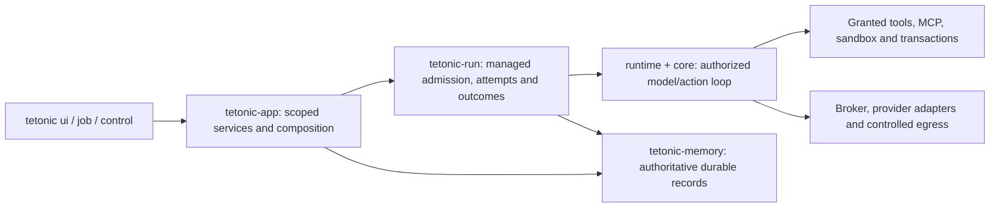

# Tetonic Engine

The Rust workspace behind Tetonic's connected team workspace. It has 28 packages,
one current `tetonic` CLI, application services, managed execution, provider and
tool integration, and durable local state. Start with the
[current architecture](../docs/architecture/README.md) and
[ownership map](../docs/architecture/ownership.md) before adding a subsystem.

## Entry points and execution

[`tetonic-cli`](litho/tetonic-cli/src/main.rs) exposes `ui`, `job`, `control` and
`estate`. `ui` hosts the authenticated local API; `job` runs registered work;
`control` operates control resources; `estate` handles worker enrollment and
capacity. Retired daemon, TUI, fleet API and editor RPC entry points are not the
product interface. See the [retirement record](../docs/epics/v5-reconciliation/retirement.md).



Application work coordination and registered agent composition reuse the managed
run path. The inference broker places model requests; it does not decide project
assignments. A configured harness and saved agent preferences still require
current grants and host limits. Telemetry and UI projections are not execution
authorities. Read [execution boundaries](../docs/architecture/execution-boundaries.md)
for the lower-level owners and enforcement points.

## Package groups

The Earth-themed directories are navigation groups, not a strict descending
stack. Cargo manifests describe dependencies; retained libraries do not imply a
supported standalone product.

| Directory | Responsibility |
|---|---|
| [litho](litho/README.md) | Product entry points, application services and concrete tools |
| [mantle](mantle/README.md) | Managed execution, compute scheduling and inference worker machinery |
| [core](core/README.md) | Contracts, agent loop, runtime policy and effect foundations |
| [strata](strata/README.md) | Durable records, scoped context, artifacts and retained indexing |
| [atmos](atmos/README.md) | Provider and guarded network/fabric transport |
| [tooling](tooling/README.md) | Architecture/quality checks and benchmarking support |

The [complete package inventory](../docs/architecture/ownership.md#package-inventory)
records all 28 packages. Update it when ownership changes.

## Run and verify

Follow the [local product setup](../README.md#try-the-local-preview).
[Host configuration](../docs/architecture/host-configuration.md) documents storage,
logging and diagnostics. The local product uses one execution owner per SQLite
database; inference worker support is not replicated agent execution or Keeper.

From this directory:

```sh
cargo test -p tetonic-app --lib
cargo run -p tetonic-arch-gate -- verify package
```

For focused iteration use `verify fast --crate tetonic-app`. For a broader check,
`verify full` adds workspace tests. See [contributing](../CONTRIBUTING.md) for
behavior-test selection and [quality policy](../docs/engineering/QUALITY-GATE.md)
for what a passing gate does and does not establish.
